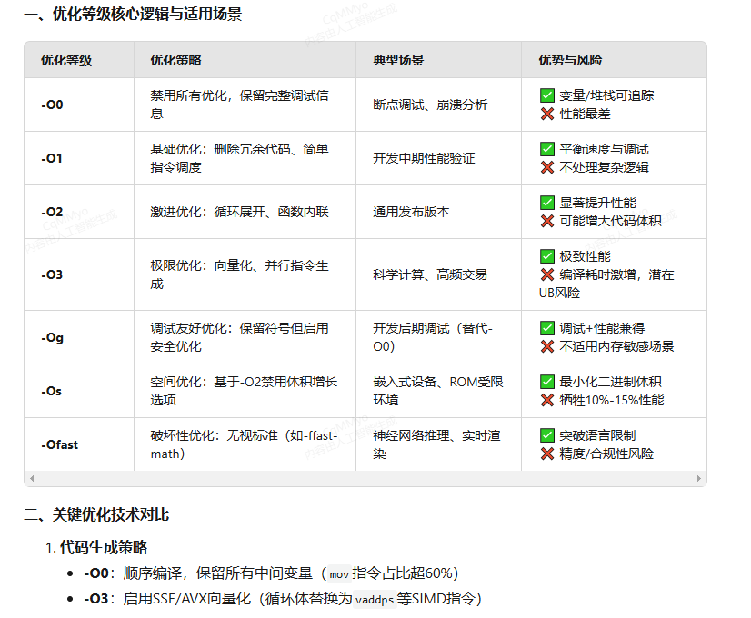
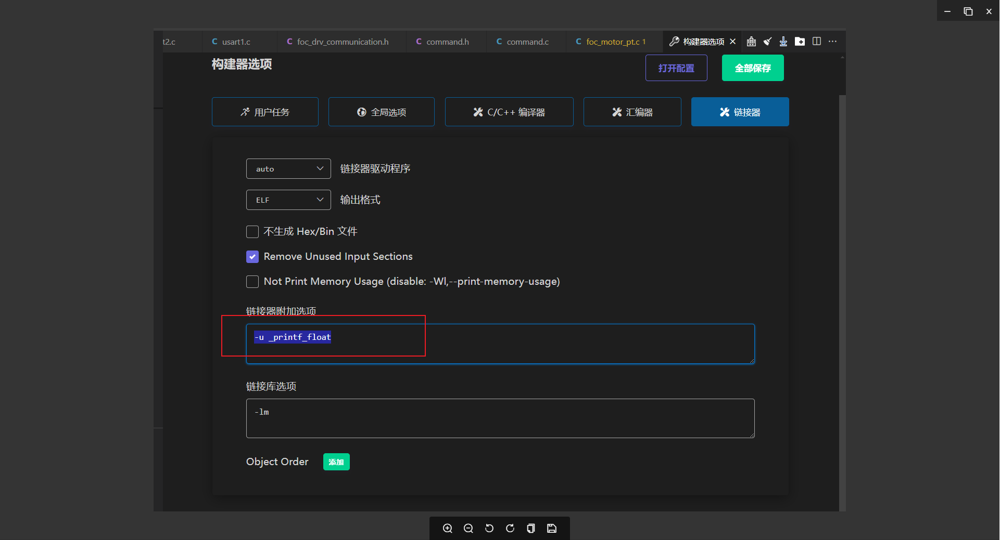
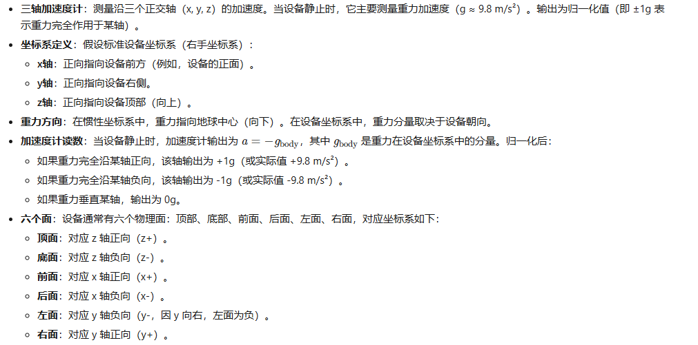
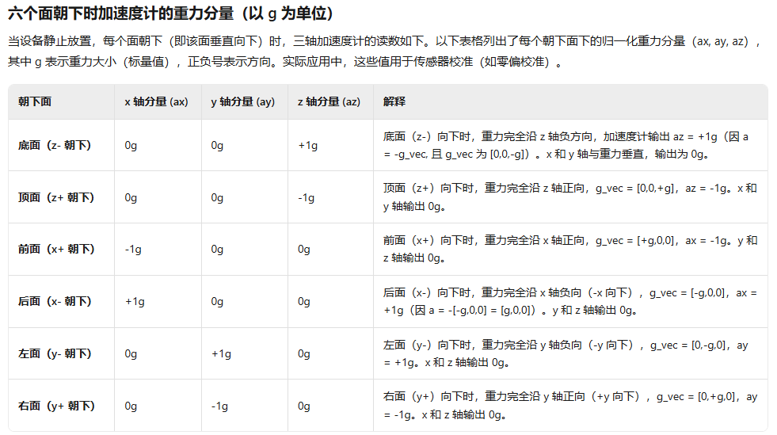

# ARM 开发笔记

## 1. STM32 编译结果分析

编译输出示例：`Program Size: Code=149096 RO-data=12448 RW-data=20828 ZI-data=29548`

### 1.1 段与存储分布

| 段名 | 内容 | 存储位置 | 占比 |
| ---- | ---- | -------- | ---- |
| `.text` | 可执行代码 | Flash | 40%-70% |
| `.rodata` | 只读常量/字符串 | Flash | 5%-20% |
| `.data` | 已初始化非 const 变量 | Flash（初始值）+ RAM | 5%-15% |
| `.bss` | 未初始化或零初始化变量 | 仅 RAM | 10%-30% |

### 1.2 Flash 占用（烧录大小）

```text
Flash = Code + RO-data
      = 149,096 + 12,448 = 161,544 字节（约 157.75 KB）
```

- **Code**：程序机器指令
- **RO-data**：只读数据（常量、字符串）
- RW-data 的初始值已包含在 RO-data 中，不重复计算

### 1.3 RAM 占用（运行时内存）

```text
RAM = RW-data + ZI-data
    = 20,828 + 29,548 = 50,376 字节（约 49.19 KB）
```

- **RW-data**：已初始化的全局/静态变量（启动时从 Flash 复制到 RAM）
- **ZI-data**：未初始化或初始化为零的变量（不占 Flash，仅预留 RAM 空间）

### 1.4 容量验证示例（STM32F103RCT6）

| 资源 | 程序占用 | 芯片容量 | 余量 |
| ---- | -------- | -------- | ---- |
| Flash | 157.75 KB | 256 KB | 剩余 98.25 KB |
| RAM | 49.19 KB | 48 KB | **超限 2.19 KB** |

> RAM 超限时需优化数据结构，或更换高 RAM 型号（如 STM32F103RET6，64 KB RAM）。

### 1.5 优化建议

- **Flash 优化**：启用 `-Os` 优化等级，移除未使用的库函数
- **RAM 优化**：减少全局变量，使用动态内存分配（注意碎片管理）
- **验证方法**：烧录文件（.bin/.hex）大小应与 Code + RO-data 一致，通过 .map 文件分析各模块占用

## 2. 编译优化选项



### 2.1 nano.specs — 极致空间优化

使用 newlib-nano 替代标准 newlib 库：

| 库 | 体积 |
| -- | ---- |
| 标准 newlib | ~200 KB |
| newlib-nano | ~50 KB（缩减 75%） |

优化策略：

- 移除非常用函数（如宽字符支持）
- 简化浮点格式化代码
- 使用 `-Os` 优化等级编译库代码

### 2.2 nosys.specs — 裸机系统适配

无操作系统假设，不链接 `exit()`/`fork()` 等 POSIX 函数，忽略文件系统操作。

系统调用桩函数需用户实现：

```c
// 默认空实现，需重定向到串口
int _write(int fd, char *ptr, int len) {
    return 0;
}
```

## 3. printf 重定向

ARM 标准库默认将 printf 输出到调试端口，需重写 `fputc` 函数实现串口输出：

```c
int fputc(int ch, FILE *f) {
    Uart4_SendByte(ch);
    return ch;
}
```

## 4. 打印浮点



newlib-nano 默认不链接浮点格式化代码，需要在链接选项中手动启用浮点 printf 支持。

## 5. G-Sensor





## 6. OSD 叠加

OSD 字符串合并接口：`OSD_Page_String_Merge`

## 7. 资源链接

- **版本发布**：<https://192.168.1.201/svn/v61/Common/Firmware/Publish/ARM/>
- **代码路径**：<http://192.168.1.87:5000/d/s/11XSnAQRrRZynOqyvb1hciLBFtNiXRI4/>
