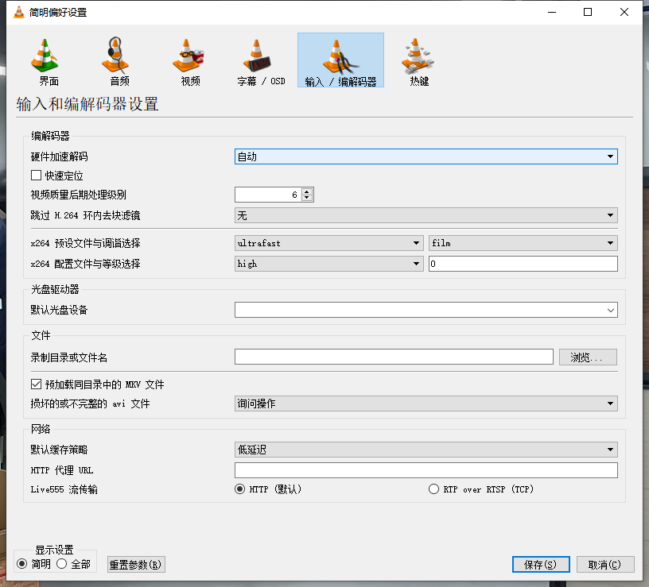

# VLC使用

## 切换偏好
如果你希望每次播放 RTSP 流都默认使用 TCP，可以在偏好设置中修改。
打开 VLC，点击菜单栏的 工具 > 偏好设置 (或按 Ctrl + P)。
在左下角“显示设置”中选择 全部（高级设置）。
在左侧列表中找到 输入 / 编解码器 > 演示 Demuxers > RTP/RTSP。
在右侧找到 Live555 流传输 选项。
将其从默认的 RTP/RTSP 或 UDP 修改为 RTP over RTSP (TCP)。

## 延迟高
菜单栏点击 媒体 (Media) → 打开网络串流 (Open Network Stream)
输入您的流地址
点击右下角 显示更多选项 (Show more options) ✅
在 缓存 (Caching) 框中输入 300（单位毫秒）
点击 播放