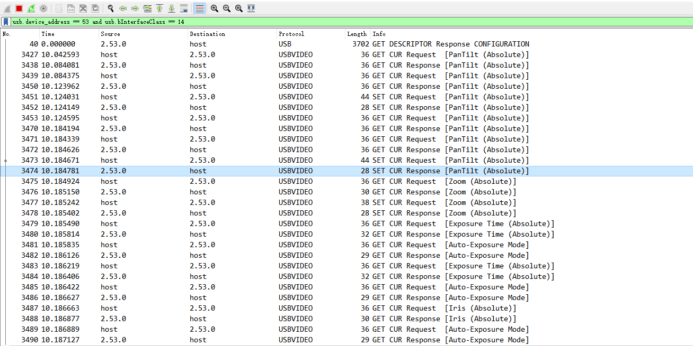

# wireshark抓包

## 抓USB包

usb.device_address == 53 and usb.bInterfaceClass == 14

usb.device_address = 设备ID
 usb.bInterfaceClass == 14 这个过滤器会匹配所有接口类为 USB Video Class (UVC) 的 USB 包，从而只显示 UVC 设备的通信（包括控制传输、数据传输等）。

