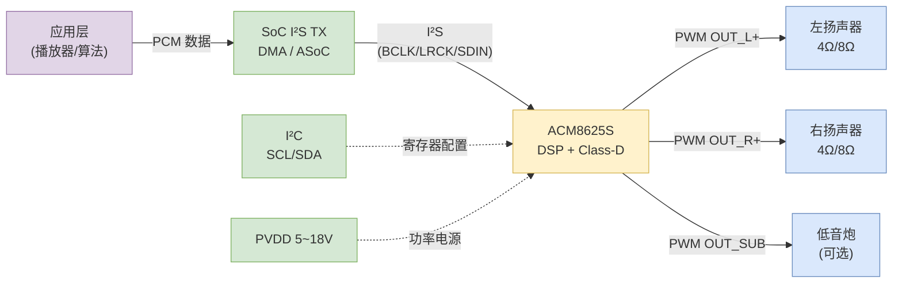
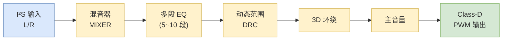
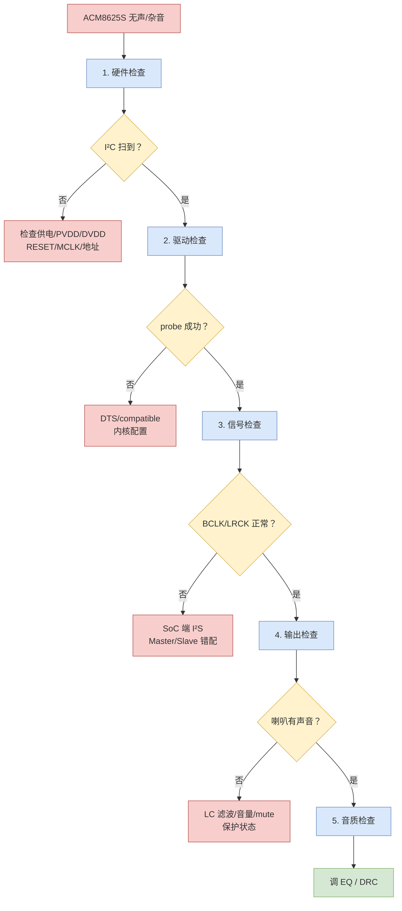

# ACM8625S 开发心得：从硬件到音质调优的全流程实战

ACM8625S 是一款集成 **DSP + Class-D 功放** 的智能音频 SoC，2.0 / 2.1 通道，常用于智能音箱、Soundbar、电视、显示器、商用广播等场景。它把 **I²S 数字输入 → 内部 DSP（EQ/DRC/混音/3D）→ Class-D 功放输出** 全部集成在一颗芯片里，外围只需要 LC 滤波器和喇叭。本文从芯片架构、硬件设计、I²S/TDM 时序、寄存器配置、ALSA 对接、常见故障、到音质调优做一次系统化梳理。

> ⚠️ **重要提醒：** 本文涉及的具体寄存器地址、默认值、EQ 系数等均以**官方最新 datasheet 为准**。不同 firmware 版本可能寄存器布局略有差异，调试前请确认 firmware 与手册版本一致。

---

## 一、芯片速览

### 1.1 主要特性

| 项目 | 规格 |
| :--- | :--- |
| 通道数 | 2.0（立体声）/ 2.1（左右 + 低音） |
| 输出功率 | 2 × 20W（4Ω，THD+N=1%，典型值） |
| 功放类型 | Class-D，集成 FET |
| 数字输入 | I²S / Left-Justified / Right-Justified / TDM |
| 采样率 | 8 kHz ~ 96 kHz |
| 位宽 | 16 / 18 / 20 / 24 / 32 bit |
| 控制接口 | I²C（标准 / 快速 / 高速） |
| 集成 DSP | EQ（多段）、DRC、混音、3D 环绕、喇叭补偿 |
| 保护 | OCP（过流）、OTP（过温）、UVP（欠压）、直流保护、短路保护 |
| 供电 | PVDD 5V ~ 18V（依输出功率而定）；DVDD 1.8V / 3.3V |
| 封装 | eTSSOP-28 / QFN 多种 |
| 工作温度 | -40°C ~ +85°C |

### 1.2 在系统中的位置

ACM8625S 是"数字 → 模拟"边界设备，**接在 SoC 的 I²S TX 之后**，直接把数字音频流变成驱动喇叭的 PWM 功率信号。



### 1.3 与传统"独立 Codec + 独立功放"方案对比

| 方案 | 优势 | 劣势 | 适用场景 |
| :--- | :--- | :--- | :--- |
| **SoC I²S → 独立 DAC → 独立 Class-D** | DAC 音质上限高，方案灵活 | BOM 多、PCB 大、EMI 复杂 | HiFi 音响、专业音频 |
| **SoC I²S → ACM8625S（本文）** | **集成度高**、BOM 少、PCB 小 | 音质受 SoC 输入限制 | 智能音箱、TV、Soundbar |
| **SoC 内置 Class-D** | 成本最低 | 功率小、散热差、效果差 | 低端小喇叭 |

> 💡 **实战心法：** 选 ACM8625S 的人，**80% 是为了"省一颗功放 + 省 PCB 面积 + 自带 DSP 调音"**。如果对音质有极致追求，建议走独立 DAC + 独立 Class-D 路线。

---

## 二、硬件设计要点

### 2.1 典型应用电路

```text
                 +-------------------+
                 |                   |
   BCLK  <-------| BCLK              |
   LRCK  <-------| LRCK      ACM8625S+--- PWM_LP ---> LC 滤波 ---> 左喇叭
   SDIN  <-------| SDIN              +--- PWM_LN ---'
   SDA   <-------| SDA               |
   SCL   <-------| SCL               +--- PWM_RP ---> LC 滤波 ---> 右喇叭
                 |                   +--- PWM_RN ---'
   PVDD  ----+---| PVDD              |
   (5~18V)   |   |                   +--- PWM_SUB -> LC 滤波 ---> 低音炮
             |   |                   |
             |   | 内部 boost        |
             +---| BST               |
                 |                   |
   DVDD  --------| DVDD (1.8V)       |
   GND   --------| GND               |
                 +-------------------+
```

### 2.2 关键外围元件

| 位置 | 元件 | 取值参考 | 作用 |
| :--- | :--- | :--- | :--- |
| **PVDD 输入** | 大容量电容 + 陶瓷电容 | 220 µF 电解 + 10 µF 陶瓷 | 滤除低频纹波，应对瞬态大电流 |
| **BST 升压** | 升压电感 + 二极管 + 电容 | 4.7 µH / 2A，肖特基二极管 | 内部 boost converter（依方案） |
| **PWM 输出 LC 滤波器** | 电感 + 电容 | 10 µH + 0.47 µF（截止 ~7 kHz） | 把 PWM 还原成模拟音频 |
| **输出耦合** | 隔直电容（BTL 时可省） | 220 µF ~ 1000 µF | 隔直流，保护喇叭 |
| **I²C 上拉** | 电阻 | 4.7 kΩ | 通信可靠 |
| **MCLK 输入** | 来自 SoC | 12.288 / 24.576 MHz | 时钟参考 |

> ⚠️ **LC 滤波器选型是音质的关键**：

- 截止频率 = 1 / (2π × √(LC))
- 10 µH + 0.47 µF → fc ≈ 7.3 kHz，刚好覆盖音频带宽
- 电感用屏蔽型（如屏蔽功率电感），避免磁辐射干扰其它信号
- 电容优先选 C0G/NP0（线性好），避免 Class-D 输出端引入失真

### 2.3 硬件检查清单

- [ ] PVDD 电压范围 5V ~ 18V，依输出功率决定（4Ω 喇叭建议 ≥ 12V）
- [ ] PVDD 大电容靠近 PVDD 引脚，走线尽量短
- [ ] DVDD 用独立 LDO（≥ 100 mA），纹波 < 50 mVpp
- [ ] LC 滤波器元件选用低 DCR、低损耗型
- [ ] I²C 上拉 4.7 kΩ（视总线长度调整）
- [ ] MCLK 走线短，避开高频信号
- [ ] PWM 输出走线对称，等长
- [ ] 模组下方铺地铜，散热
- [ ] SDIO/SDIN 走线避开 PVDD 与 PWM 输出

### 2.4 散热设计

Class-D 效率 90%+，但大功率下仍有可观发热。**20W × 2 在 PVDD=12V 下满载功耗约 5W**：

| 措施 | 说明 |
| :--- | :--- |
| **PCB 铺铜** | 芯片正下方铺大面积地铜，多打过孔到背面 |
| **散热过孔** | 芯片焊盘下打过孔阵列（9~25 个），导热到背面 |
| **外加散热片** | 长时间大音量播放时建议加铝散热片 |
| **降额使用** | 设计时按额定功率 70% 选型 |

---

## 三、I²S / TDM 接口

### 3.1 接口信号定义

| 信号 | 方向 | 说明 |
| :--- | :--- | :--- |
| **MCLK** | 输入 | 主时钟，常用 12.288 / 24.576 MHz |
| **BCLK** | 输入/输出 | 位时钟；ACM8625S 通常作为 Slave，由 SoC 提供 |
| **LRCK / WS** | 输入/输出 | 字选择时钟，频率 = 采样率 fs |
| **SDIN** | 输入 | I²S 数据输入（从 SoC 接收音频数据） |
| **SDA / SCL** | 双向 | I²C 总线，配置寄存器 |
| **PDN / RESET** | 输入 | 掉电/复位（低有效） |
| **FAULT** | 输出 | 故障指示（OCP/OTP 时拉低） |
| **PWM_LP/N, PWM_RP/N, PWM_SUB** | 输出 | Class-D 功率输出 |

> **重要：** ACM8625S **通常作为 I²S Slave**，由 SoC 提供 BCLK 和 LRCK。这样 SoC 端能统一管理音频子系统时钟。

### 3.2 I²S 模式

**标准 I²S 立体声（左对齐 MSB）：**

```text
LRCK   __|‾‾‾‾‾‾‾‾‾‾‾|__|‾‾‾‾‾‾‾‾‾‾‾|__
        L 声道 24/32 bit   R 声道 24/32 bit
BCLK   __|_|_|_|_|_|_|_|_|_|_|_|...
        ^ SDIN 在 BCLK 下降沿采样
```

**频率关系（I²S 立体声 24bit @ 32bit slot）：**

| 采样率 fs | LRCK | BCLK = fs × 64 | MCLK = 256×fs |
| :--- | :--- | :--- | :--- |
| 8 kHz | 8 kHz | 512 kHz | 2.048 MHz |
| 16 kHz | 16 kHz | 1.024 MHz | 4.096 MHz |
| 48 kHz | 48 kHz | 3.072 MHz | 12.288 MHz |
| 96 kHz | 96 kHz | 6.144 MHz | 24.576 MHz |

### 3.3 TDM 模式

ACM8625S 支持 TDM 输入，可与多通道 ADC（如 ES7210）共用 BCLK：

```text
LRCK  __|‾‾‾‾‾‾‾‾‾‾‾‾‾‾‾‾‾‾‾‾|__
        |<- slot 0 -><- slot 1 ->|
        |<-   1 帧 = 2 slot     ->|
```

- TDM 立体声：LRCK = fs，1 帧 = 2 × slot_bits
- TDM4：LRCK = fs/2，1 帧 = 4 × slot_bits（依实际配置）

### 3.4 MCLK / BCLK / LRCK 关系

```text
LRCK  = fs
BCLK  = LRCK × N × W    (N = 通道数, W = slot 位宽)
MCLK  = BCLK × M        (M = MCLK 倍率, 常用 256 / 384 / 512)
```

**配置示例（48 kHz / 24 bit / 立体声）：**

- LRCK = 48 kHz
- BCLK = 48 kHz × 2 × 32 = 3.072 MHz
- MCLK = 12.288 MHz（256 × fs）

---

## 四、设备树配置（DTS）

### 4.1 I²C 节点

```dts
&i2c1 {
    status = "okay";
    clock-frequency = <400000>;

    acm8625s: acm8625s@10 {           /* 7bit 地址 0x10，按实际改 */
        compatible = "acm,acm8625s";
        reg = <0x10>;
        #sound-dai-cells = <0>;
        clocks = <&cru I2S1_MCLK>;
        clock-names = "mclk";
        pinctrl-names = "default";
        pinctrl-0 = <&i2s1_mclk_pin>;
        /* 可选 reset 控制 */
        /* reset-gpios = <&gpio0 RK_PB3 GPIO_ACTIVE_LOW>; */
    };
};
```

### 4.2 I²S / Sound 节点

```dts
&i2s1 {
    status = "okay";
    #sound-dai-cells = <0>;

    pinctrl-names = "default";
    pinctrl-0 = <&i2s1_pins>;
};

sound_acm8625s: sound-acm8625s {
    compatible = "simple-audio-card";
    simple-audio-card,name = "ACM8625S";
    simple-audio-card,format = "i2s";
    simple-audio-card,bitclock-master = <&cpu_dai>;
    simple-audio-card,frame-master = <&cpu_dai>;
    simple-audio-card,mclk-fs = <256>;

    cpu_dai: simple-audio-card,cpu {
        sound-dai = <&i2s1>;
    };

    simple-audio-card,codec {
        sound-dai = <&acm8625s>;
    };
};
```

> **注意：** 这里是 **Playback-only** 链路（SoC → 功放 → 喇叭），没有 Capture，所以 `pcmC0D0p` 只有播放节点。

### 4.3 平台差异提示

| 平台 | 注意事项 |
| :--- | :--- |
| **RK3588 / RK3576** | I²S MCLK 由 `cru` 提供；注意与 HDMI 的 I²S 复用 |
| **Hi3559** | 走 SIO 控制器，配置 SIO TX 模式 |
| **CV72 (Ambarella)** | 用 AOSS（Audio Subsystem），需在 firmware 配置 GID |
| **SSC268G** | 仅 1 个 I²S，注意与麦克风复用 |

---

## 五、Linux 驱动开发

### 5.1 内核配置

```text
CONFIG_SND_SOC=y
CONFIG_SND_SIMPLE_CARD=y
CONFIG_I2C=y
CONFIG_SND=y

# 如果使用厂商驱动
CONFIG_SND_SOC_ACM8625S=m
```

> 主流内核尚未合并 ACM8625S 驱动，多数情况下需要从厂商处获取 `acm8625s.c`。

### 5.2 驱动核心结构

```c
/* sound/soc/codecs/acm8625s.c 简化骨架 */

static const struct reg_default acm8625s_reg_defaults[] = {
    { 0x00, 0x00 },  /* RESET */
    { 0x01, 0x00 },  /* SYSTEM_CTRL */
    { 0x10, 0x40 },  /* I2S_FMT */
    /* ... */
};

static const struct snd_kcontrol_new acm8625s_controls[] = {
    SOC_DOUBLE_R_TLV("Speaker Volume", REG_L_VOL, REG_R_VOL,
                     0, 0xFF, 1, volume_tlv),
    SOC_SINGLE("Speaker Mute", REG_MUTE, 0, 1, 0),
    /* DSP 路由 / EQ / DRC 控件 ... */
};

static const struct snd_soc_dai_ops acm8625s_dai_ops = {
    .hw_params = acm8625s_hw_params,
    .set_fmt   = acm8625s_set_fmt,
    /* ... */
};

static struct snd_soc_dai_driver acm8625s_dai = {
    .name = "acm8625s-hifi",
    .playback = {
        .stream_name = "Playback",
        .channels_min = 1,
        .channels_max = 2,
        .rates = SNDRV_PCM_RATE_8000_96000,
        .formats = SNDRV_PCM_FMTBIT_S16_LE |
                   SNDRV_PCM_FMTBIT_S24_LE |
                   SNDRV_PCM_FMTBIT_S32_LE,
    },
    .ops = &acm8625s_dai_ops,
};
```

### 5.3 hw_params 配置

```c
static int acm8625s_hw_params(struct snd_pcm_substream *substream,
                              struct snd_pcm_hw_params *params,
                              struct snd_soc_dai *dai)
{
    struct snd_soc_component *component = dai->component;
    unsigned int rate = params_rate(params);
    unsigned int fmt  = params_width(params);
    int ret;

    /* 配置 MCLK 域 / PLL */
    ret = acm8625s_set_sysclk(component, ACM8625S_PLL,
                              rate * 256, SND_SOC_CLOCK_IN);
    if (ret) return ret;

    /* 配置采样率 */
    snd_soc_component_write(component, REG_SAMPLE_RATE, rate_to_reg(rate));

    /* 配置 I²S 位宽 */
    snd_soc_component_write(component, REG_I2S_FMT, fmt_to_reg(fmt));

    return 0;
}
```

### 5.4 驱动加载验证

```bash
# 1. 加载模块
modprobe snd-soc-acm8625s
lsmod | grep acm8625s

# 2. 看内核日志
dmesg | grep -i "acm8625s"
# 期望输出：
#   acm8625s 1-0010: ACM8625S chip found
#   ASoC: registered pcm #0

# 3. 确认声卡
ls /dev/snd/
# 应有 controlC0 / pcmC0D0p
```

### 5.5 用户态控件

```bash
# 列出控件
amixer -c 0 controls
# 典型控件：
#   'Speaker Volume'
#   'Speaker Mute'
#   'Bass Volume' / 'Treble Volume'  （高低音）
#   'EQ Mode'                        （EQ 预设切换）
#   'DRC Switch'                     （动态范围压缩）
#   '3D Surround Switch'

# 调音量
amixer -c 0 sset 'Speaker Volume' 80%

# 静音
amixer -c 0 sset 'Speaker Mute' on

# 切换 EQ
amixer -c 0 sset 'EQ Mode' 'Pop'
```

### 5.6 播放测试

```bash
# 1. 播放 wav
aplay -D hw:0,0 -c 2 -r 48000 -f S32_LE test.wav

# 2. 播放正弦波（验证通道）
speaker-test -D hw:0,0 -c 2 -r 48000 -t sine -f 1000 -l 1

# 3. 实时音量
watch -n 1 'amixer -c 0 sget Speaker\ Volume'
```

---

## 六、I²C 调试与寄存器操作

### 6.1 探测设备

```bash
# 查看 I²C 总线
i2cdetect -l

# 扫描挂载的 ACM8625S（假设 i2c-1）
i2cdetect -y -r 1
```

**正常输出示例：**

```text
     0  1  2  3  4  5  6  7  8  9  a  b  c  d  e  f
00:          -- -- -- -- -- -- -- -- -- -- -- -- --
10: 10 -- -- -- -- -- -- -- -- -- -- -- -- -- -- --
60: -- -- -- -- -- -- -- -- -- -- -- -- -- -- -- UU
70: -- -- -- -- -- -- -- --
```

> **设计陷阱：** ACM8625S 的 I²C 地址出厂默认为 **0x10**（7bit），**部分模组会改成 0x11 / 0x12**，调试时**先扫实际地址**。

### 6.2 读写寄存器

```bash
# 读芯片 ID（地址以 datasheet 为准）
i2cget -f -y 1 0x10 0xFE
i2cget -f -y 1 0x10 0xFF

# 写音量
i2cset -f -y 1 0x10 0x20 0x80
i2cset -f -y 1 0x10 0x21 0x80

# 一次 dump
i2cdump -f -y 1 0x10
```

### 6.3 典型初始化脚本

```bash
#!/bin/bash
ADDR=0x10
BUS=1

# 1. 软复位
i2cset -f -y $BUS $ADDR 0x00 0xAA
sleep 0.05

# 2. 解除 mute，启用功放
i2cset -f -y $BUS $ADDR 0x01 0x00
i2cset -f -y $BUS $ADDR 0x20 0x80   # L 音量
i2cset -f -y $BUS $ADDR 0x21 0x80   # R 音量
i2cset -f -y $BUS $ADDR 0x22 0x00   # unmute

# 3. 配置 I²S 格式
i2cset -f -y $BUS $ADDR 0x10 0x40   # 24 bit, I²S 模式

# 4. 配置采样率
i2cset -f -y $BUS $ADDR 0x11 0x00   # 48 kHz
```

> 以上寄存器值仅示例，**实际必须以 datasheet 为准**。

### 6.4 关键寄存器清单（参考布局）

| 地址 | 名称 | 功能 |
| :--- | :--- | :--- |
| 0x00 | RESET | 软复位 |
| 0x01 | SYSTEM_CTRL | 系统控制（mute、power down） |
| 0x02~0x05 | CLOCK_CTRL | 时钟 / PLL 配置 |
| 0x10 | I2S_FMT | I²S 格式（位宽 / 模式） |
| 0x11 | SAMPLE_RATE | 采样率配置 |
| 0x12 | TDM_CTRL | TDM 模式配置 |
| 0x20 / 0x21 | L_VOL / R_VOL | 左右声道音量 |
| 0x22 | MUTE | 静音控制 |
| 0x30~0x3F | EQ_BAND_x | 多段 EQ 系数 |
| 0x40~0x4F | DRC_CTRL | 动态范围压缩 |
| 0x50~0x5F | MIXER_CTRL | 通道混音路由 |
| 0x60~0x6F | PROTECT_STATUS | 保护状态（OCP/OTP/UVP） |
| 0xFE / 0xFF | CHIP_ID | 芯片 ID 寄存器 |

---

## 七、DSP 调音（核心价值所在）

ACM8625S 的核心价值在于**内置 DSP**，可以把音频处理算法在功放前端跑完，**省掉外部 DSP 芯片**。常见处理包括：

### 7.1 DSP 信号流



### 7.2 EQ 调音

ACM8625S 内部 EQ 通常支持 **5~10 段**（band），每段可独立设置中心频率、增益、Q 值：

| Band | 中心频率 | 默认增益 | 作用 |
| :--- | :--- | :--- | :--- |
| Band 0 | 60 Hz | 0 dB | 低音 |
| Band 1 | 150 Hz | 0 dB | 中低 |
| Band 2 | 400 Hz | 0 dB | 中音 |
| Band 3 | 1 kHz | 0 dB | 中高 |
| Band 4 | 2.5 kHz | 0 dB | 高音 |
| Band 5 | 6 kHz | 0 dB | 临场感 |
| Band 6 | 10 kHz | 0 dB | 空气感 |

**EQ 调音经验：**

1. **不要盲目拉大增益** — 增益过大容易削波，引起失真。
2. **"挖"比"抬"更安全** — 衰减某个频段比抬升更不容易破音。
3. **Q 值选择** — Q 越大，作用越窄；Q 越小，作用越宽。
4. **听感验证** — 调一段 EQ 后用 `speaker-test` 扫频，听一下效果。
5. **预设保存** — 调好的 EQ 参数保存到 I²C 一次性写入脚本，便于量产。

### 7.3 DRC（动态范围压缩）

DRC 用来**自动控制音量范围**，避免大音量爆音、小音量听不清。

**关键参数：**

- **Threshold（阈值）**：开始压缩的音量门槛（dB）
- **Ratio（压缩比）**：超过阈值后压缩的强度（如 4:1 表示输入增加 4dB，输出只增加 1dB）
- **Attack（启动时间）**：开始压缩的响应速度（ms）
- **Release（释放时间）**：停止压缩的恢复速度（ms）

**典型配置：**

| 场景 | Threshold | Ratio | Attack | Release |
| :--- | :--- | :--- | :--- | :--- |
| 智能音箱 | -20 dB | 3:1 | 10 ms | 100 ms |
| TV 伴音 | -15 dB | 2:1 | 5 ms | 200 ms |
| 商用广播 | -10 dB | 4:1 | 1 ms | 50 ms |

### 7.4 3D 环绕 / 喇叭补偿

- **3D Surround**：通过左右声道的相位与延时差，虚拟出环绕声。
- **喇叭补偿**：针对小喇叭低频不足的特性，提升低频响应（**小心削波**）。
- **限幅器（Limiter）**：DRC 之后的"硬保险"，防止最终输出超过喇叭承受功率。

### 7.5 调音工具

- **厂商 GUI 工具**：通过 USB-I²C 桥接器（如 FT232H）连接 PC，运行厂家调音软件，**所见即所得**地配置 EQ / DRC。
- **导出寄存器脚本**：GUI 调好后导出 `.h` / `.c` 文件，直接在 driver 中加载。
- **量产烧录**：用 `i2cset` 脚本批量写入产测流程。

---

## 八、电源设计

### 8.1 PVDD 选择

PVDD 电压直接决定输出功率：

| PVDD | 4Ω 输出（THD+N=1%） | 8Ω 输出（THD+N=1%） |
| :--- | :--- | :--- |
| 8 V | 2 × 8W | 2 × 4W |
| 12 V | 2 × 18W | 2 × 9W |
| 15 V | 2 × 25W | 2 × 12W |
| 18 V | 2 × 30W | 2 × 15W |

> **经验公式：** Pout ≈ (PVDD × 0.7)² / (8 × R_load)

- PVDD=12V, 4Ω → (8.4)² / 32 ≈ 2.2W（理论值，实际受 FET 压降影响）
- 实际值以 datasheet 图表为准

### 8.2 电源去耦

```text
PVDD ────┬── [220µF 电解] ── GND     ← 应对瞬态大电流
         ├── [10µF 陶瓷]  ── GND     ← 滤中频
         ├── [100nF 陶瓷] ── GND     ← 滤高频
         └── 进入芯片

DVDD ────┬── [10µF 陶瓷]  ── GND
         ├── [100nF 陶瓷] ── GND
         └── 进入芯片
```

> ⚠️ **PVDD 走线粗而短**，瞬态电流可达 3~5A，线宽建议 ≥ 80 mil。

### 8.3 开机时序

```text
PVDD 上电 → DVDD 上电 → MCLK 稳定 → 拉高 RESET/PDN → 等待 50ms → 初始化 I²C → 解除 mute
```

**踩坑提醒：**

- PVDD 与 DVDD 可以同时上电，但 **MCLK 必须先于 I²S 数据出现**，否则 ACM8625S 内部 PLL 失锁。
- 上电瞬间喇叭可能"噗"一声，**需要在 mute 状态下完成初始化后再 unmute**。

---

## 九、保护机制

### 9.1 保护类型

| 保护 | 触发条件 | 动作 | 寄存器 |
| :--- | :--- | :--- | :--- |
| **OCP**（过流） | 输出电流超过限值 | 关断输出，进入 fault 状态 | 0x60 |
| **OTP**（过温） | 结温 > 150°C | 降低音量或关断 | 0x61 |
| **UVP**（欠压） | PVDD < 阈值 | 关断输出 | 0x62 |
| **直流保护** | 输出端出现直流分量 | 关断输出（防烧喇叭） | 0x63 |
| **短路保护** | 输出对地/电源短路 | 关断输出 | 0x64 |

### 9.2 故障排查

```bash
# 读取保护状态寄存器
i2cget -f -y 1 0x10 0x60
i2cget -f -y 1 0x10 0x61
i2cget -f -y 1 0x10 0x62
i2cget -f -y 1 0x10 0x63

# FAULT 引脚状态
cat /sys/class/gpio/gpioXX/value   # 0 = 故障
```

**OCP 频繁触发：**

- 喇叭阻抗过低（< 3Ω）
- 音量过大 → 降低音量
- 电源跌落 → 检查 PVDD 走线

**OTP 频繁触发：**

- 散热不足 → 加散热片
- 环境温度过高
- 长时间大音量

---

## 十、常见故障排查

### 10.1 故障总览



### 10.2 故障 1：I²C 扫不到设备

| 排查步骤 | 内容 | 方法 |
| :--- | :--- | :--- |
| 1 | 确认 I²C 地址 | 7bit `0x10`？实际可能 `0x11/0x12` |
| 2 | PVDD 供电 | 万用表量 PVDD 是否 5~18V |
| 3 | DVDD 供电 | 量 DVDD 是否 1.8V / 3.3V |
| 4 | RESET 引脚 | 拉高了吗？时序对吗？ |
| 5 | MCLK | 示波器看 12.288 MHz |
| 6 | I²C 上拉 | 4.7 kΩ 必须有 |
| 7 | SDA / SCL 静态 | 静止时应为高电平 |
| 8 | 换件 | 换模组验证 |

### 10.3 故障 2：驱动 probe 失败

```text
acm8625s: probe of 1-0010 failed with error -ENXIO
```

排查：

1. **设备树 compatible** — 是否 `acm,acm8625s`，与驱动匹配
2. **reg 属性** — 7bit 地址
3. **MCLK clocks** — `clocks` 指向 SoC 上的 I2S MCLK
4. **pinctrl** — I²C 引脚和 MCLK 引脚功能正确
5. **缺少 reset 控制** — 显式拉高 RESET

### 10.4 故障 3：无声卡节点

```bash
# 1. 看日志
dmesg | grep -i "simple-audio"
# 看到 "card registration failed" → DAI link 配置错

# 2. 确认 DAI link 数
cat /proc/asound/cards
```

常见原因：

- `simple-audio-card,cpu` 和 `simple-audio-card,codec` 拼写错
- codec DAI `acm8625s-hifi` 不存在（驱动没注册）
- I²S 控制器被其它功能占用

### 10.5 故障 4：能播但无声

1. **检查 mute** — `amixer sget 'Speaker Mute'` 应该是 `off`
2. **检查音量** — Speaker Volume ≥ 50%
3. **检查保护** — 读 0x60~0x64 寄存器
4. **检查 PDN** — RESET 引脚是否拉高
5. **检查 I²S 数据** — 用示波器看 SDIN 是否有数据
6. **检查 MCLK** — PLL 失锁会导致无声
7. **检查 FAULT 引脚** — 是否被拉低（故障状态）

### 10.6 故障 5：声音有杂音 / 底噪

| 现象 | 可能原因 | 排查 |
| :--- | :--- | :--- |
| 白噪声 | PGA 增益过大 | 调低 Speaker Volume |
| 50Hz 嗡嗡声 | PVDD 纹波 | 加 LC 滤波 |
| 电流声 | 数字干扰 | DVDD 单独 LDO |
| 断续杂音 | I²S 时序不稳 | 检查 BCLK jitter |
| 削波失真 | 音量超限 | 降低音量或开 DRC |
| 高频刺耳 | EQ 过高 | 衰减 6~10 kHz 段 |

### 10.7 故障 6：开机"噗"声

- **原因**：上电瞬间输出端直流偏置
- **解决**：
  1. 初始化时先 mute
  2. 等 PLL 锁定再 unmute
  3. 慢启动（soft-start）功能打开
  4. 输出端加大隔直电容

---

## 十一、性能优化与音质调优

### 11.1 减小底噪

```bash
# 1. 关闭未用的输入通道
# 2. 降低 PGA 增益
# 3. 打开高通滤波器（HPF）滤除 50Hz 工频
# 4. 检查电源纹波
```

### 11.2 提升动态范围

- 用 24 bit / 32 bit 数据
- 关闭限幅器（Limiter）以提升动态
- 电源去耦做好

### 11.3 喇叭保护

```c
/* 设置最大输出功率 */
snd_soc_write(component, REG_MAX_VOL, 0xC0);    /* 限制音量上限 */
/* 启用 DRC 限幅 */
snd_soc_write(component, REG_DRC_CTRL, 0x01);
/* 配置 Limiter 阈值 */
snd_soc_write(component, REG_LIMITER_THR, 0x90);
```

### 11.4 通道平衡

左右喇叭灵敏度不同会导致声道偏音。**量产必须做"通道平衡校准"**：

```bash
# 用 1 kHz -6 dB 测试音，调节左右音量使声压级一致
amixer -c 0 sset 'Speaker Volume' 70
# L = 70, R = 65  ← 写入每个模组的校准值
```

### 11.5 量产烧录

```bash
#!/bin/bash
# 量产烧录脚本：每台设备写入 EQ 预设 + 通道平衡值
ADDR=0x10
BUS=1

# 软复位
i2cset -f -y $BUS $ADDR 0x00 0xAA
sleep 0.05

# EQ 预设（5 段）
i2cset -f -y $BUS $ADDR 0x30 0x10
i2cset -f -y $BUS $ADDR 0x31 0x08
i2cset -f -y $BUS $ADDR 0x32 0x00
i2cset -f -y $BUS $ADDR 0x33 0x05
i2cset -f -y $BUS $ADDR 0x34 0x08

# 通道平衡（按校准值）
i2cset -f -y $BUS $ADDR 0x20 0x80   # L
i2cset -f -y $BUS $ADDR 0x21 0x7A   # R（按校准值）

# 启用 DRC
i2cset -f -y $BUS $ADDR 0x40 0x01

# 启用 Limiter
i2cset -f -y $BUS $ADDR 0x50 0x01
```

---

## 十二、调试速查表

### 12.1 命令速查

| 操作 | 命令 |
| :--- | :--- |
| 扫描 ACM8625S | `i2cdetect -y -r 1` |
| 读寄存器 | `i2cget -f -y 1 0x10 0xFE` |
| 写寄存器 | `i2cset -f -y 1 0x10 0x20 0x80` |
| 播放测试 | `aplay -D hw:0,0 test.wav` |
| 扫频测试 | `speaker-test -D hw:0,0 -c 2 -r 48000 -t sine` |
| 看声卡 | `arecord -l` / `aplay -l` |
| 调音量 | `amixer -c 0 sset 'Speaker Volume' 80%` |
| 看日志 | `dmesg \| grep -i acm8625s` |

### 12.2 十大避坑要点

| 编号 | 要点 | 说明 |
| :--- | :--- | :--- |
| 1 | **I²C 地址 7bit** | 大多数工具写 7bit `0x10`，别误用 8bit `0x20` |
| 2 | **MCLK 优先于 I²C** | 没有 MCLK 时读写寄存器可能异常 |
| 3 | **PVDD 与 DVDD 分开** | 模拟和数字电源独立 LDO |
| 4 | **LC 滤波器选型** | 截止频率 ~7 kHz，电感用屏蔽型 |
| 5 | **I²S 主从模式** | ACM8625S 通常是 Slave，确认 SoC 端 Master |
| 6 | **位宽一致性** | 24 bit 按 32 bit slot 摆放 |
| 7 | **上电时序** | 先 mute → 等 PLL 锁定 → unmute |
| 8 | **喇叭阻抗** | 4Ω 喇叭功率大，PVDD 必须够 |
| 9 | **散热** | 大功率下必须加散热片 |
| 10 | **波形为王** | BCLK/LRCK/SDIN/PWM 一定要用示波器看 |

### 12.3 关键日志关键字

```text
[正常]
"ACM8625S chip found"
"ASoC: registered pcm"

[异常]
"probe failed with error"
"chip id mismatch"
"i2c i2c-1: NAK"
"no sound cards found"
"OCP triggered"
"OTP triggered"
"FAUIT pin low"   ← 注意：有的驱动拼写错误
```

---

## 十三、总结

ACM8625S 作为集成 **DSP + Class-D** 的智能音频 SoC，把功放从"分立方案"压缩到"一颗芯片"，**极大地简化了嵌入式音频产品的硬件设计**。但调试中仍然有不少"看不见的坑"：

- **核心要点** — MCLK 准、I²C 通、I²S 协议对齐、电源干净、LC 滤波合理。
- **调试顺序** — 硬件 → 驱动 → 声卡 → 输出 → 音质。
- **DSP 调音** — 这是 ACM8625S 的核心价值，**80% 的产品差异化靠调音**。
- **保护机制** — 必须验证 OCP / OTP / UVP 在实际负载下不会误触发。
- **量产一致性** — 通道平衡 + EQ 预设 + 限幅器配置，必须烧录到每台设备。

> **关键心法：** **先怀疑自己，再怀疑芯片；先看信号，再看代码；先测硬件，再调软件。**

## 参考资料

- ACM8625S 官方 Datasheet
- Linux Kernel: `sound/soc/codecs/acm8625s.c`（如有）
- ALSA SoC / ASoC 框架文档
- AOS / Realtek / Everest 等同类音频 SoC 调试笔记
