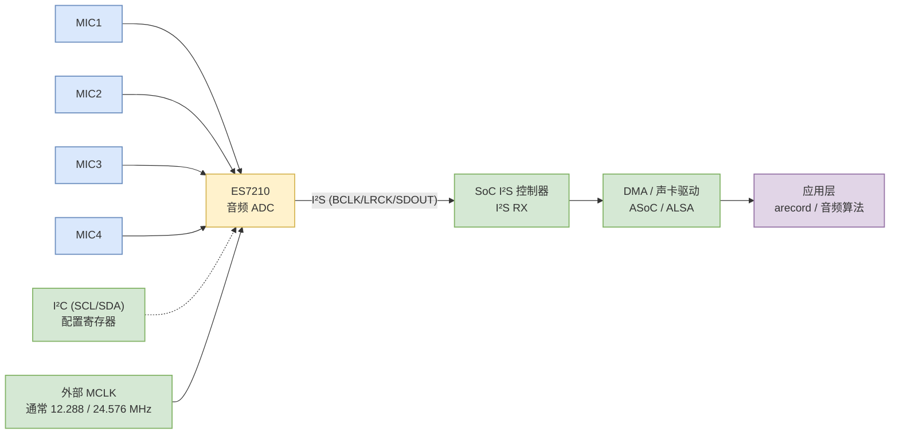
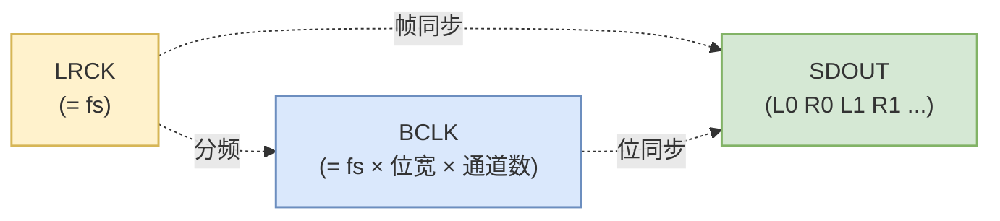
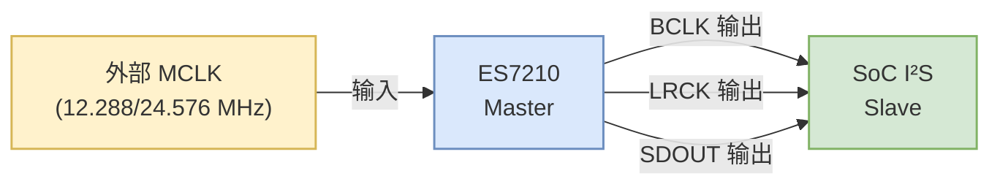
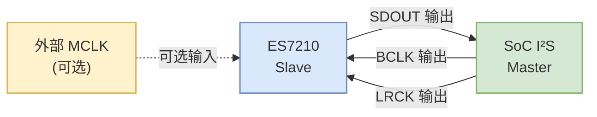
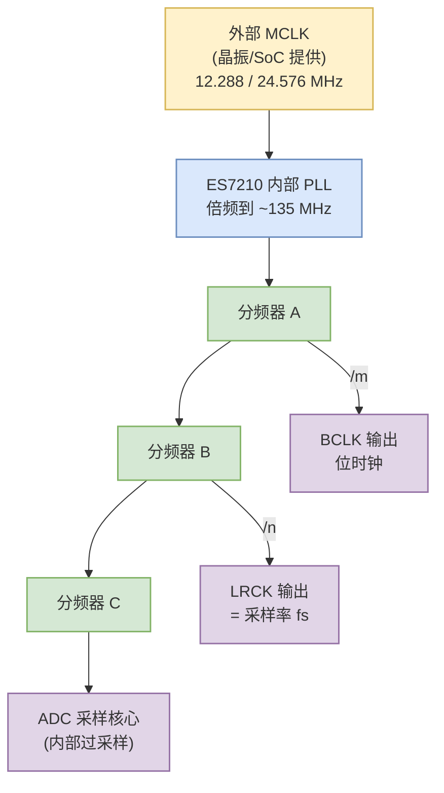
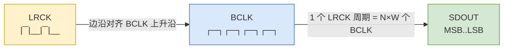
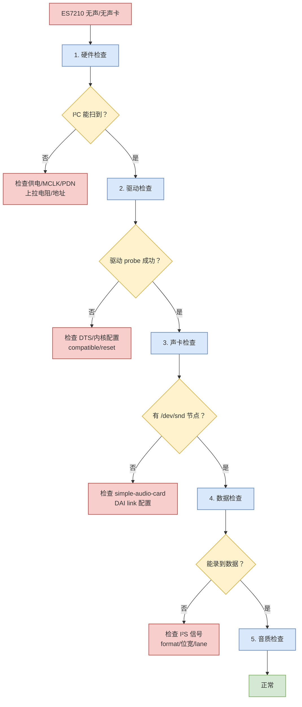
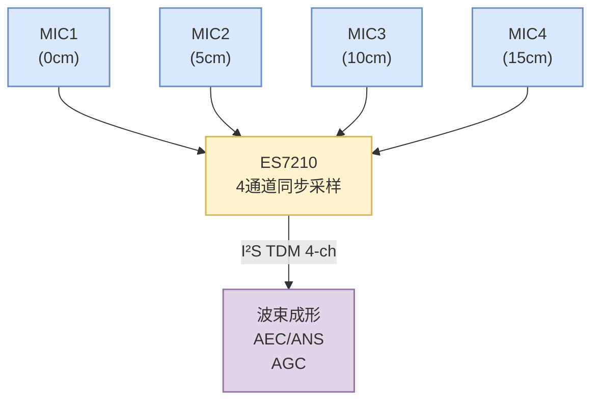

# ES7210 开发指南：从硬件到驱动的麦克风阵列音频 ADC 全流程

ES7210 是 Everest Semiconductor（ Everest 半导体）推出的高性能 4 通道音频 ADC（模数转换器），专为多麦克风阵列、车载音频、会议系统、智能音箱等场景设计。本文从芯片特性出发，系统化梳理 ES7210 在嵌入式 Linux 平台上的硬件设计、设备树配置、驱动加载、寄存器调试与常见问题排查。

## 一、ES7210 芯片速览

### 1.1 主要特性

| 项目 | 规格 |
| :--- | :--- |
| 通道数 | 4 通道模拟输入（2 个立体声 ADC） |
| 采样率 | 8 kHz ~ 96 kHz |
| 数据位宽 | 16 / 18 / 20 / 24 / 32 bit |
| 数字接口 | I²S / Left-Justified / Right-Justified / TDM |
| 控制接口 | I²C（标准 / 快速模式，最高速率 400 kHz） |
| 输入类型 | 模拟麦克风 / 数字 PDM 麦克风（可切换） |
| 输入增益 | PGA 0~30 dB，步进可配 |
| 供电 | AVDD 3.3V，DVDD 1.8V（部分型号支持单 3.3V） |
| 封装 | QFN-32（5mm × 5mm） |
| 工作温度 | -40°C ~ +85°C |

### 1.2 在系统中的位置

ES7210 在整个音频链路中处于"模拟 → 数字"边界，负责把多路模拟麦克风信号转换成 I²S 数字流送给 SoC。



### 1.3 数据手册关键寄存器清单

ES7210 通过 I²C 访问内部寄存器，常用寄存器如下（不同版本寄存器名略有差异，**以厂家最新 datasheet 为准**）：

| 寄存器地址 | 名称 | 功能 |
| :--- | :--- | :--- |
| 0x00 | RESET | 软复位（写入 0xFF 复位） |
| 0x01 | CLK_MANAGER | 主时钟分频、PLL 配置 |
| 0x02 | CLK_SRC | 时钟源选择（MCLK / BCLK） |
| 0x03 | I2S_FMT | I²S 数据格式（位宽 / 模式） |
| 0x04 | SAMPLE_RATE | 采样率配置 |
| 0x10~0x17 | PGA / 输入通道 | 通道 1~4 输入增益、静音 |
| 0x40 | HPF | 高通滤波器开关 |
| 0xFE / 0xFF | CHIP_ID | 芯片 ID 寄存器（用于 probe） |

> ⚠️ **重要提醒：** ES7210 内部寄存器在不同 firmware / 厂家版本下寄存器定义可能略有差异，开发前务必确认驱动版本与手册版本匹配。

---

## 二、硬件设计要点

### 2.1 典型应用电路

```text
                +-----------+
   MIC1 --+-----| IN1P/IN1N |
   MIC2 --+-----| IN2P/IN2N |       ES7210
   MIC3 --+-----| IN3P/IN3N |       +-------+ BCLK ---> SoC
   MIC4 --+-----| IN4P/IN4N |       |       +-------+ LRCK ---> SoC
                |           |       |       +-------+ SDOUT --> SoC
                |  SDA  <---|-------| I²C   |
   MCLK  -------| MCLK     |       |       |
                |  SCL  <---|-------|       |
                |           |       |       |
   AVDD=3.3V ---| AVDD     |       +-------+
   DVDD=1.8V ---| DVDD     |
   GND    ------| GND      |
                +-----------+
```

### 2.2 硬件检查清单

- [ ] AVDD = 3.3V ± 5%，纹波 < 50 mVpp
- [ ] DVDD = 1.8V（部分型号可与 AVDD 共用 3.3V，需查手册）
- [ ] 4 路模拟麦克风偏置电压正常（通常 2.5V）
- [ ] MCLK 时钟稳定，无毛刺
- [ ] I²C 上拉电阻 4.7 kΩ（部分平台 2.2 kΩ）
- [ ] I²S 走线尽量短，BCLK/LRCK/SDOUT 等长
- [ ] 麦克风走线避开电源和数字信号

### 2.3 关键信号说明

| 信号 | 方向 | 说明 |
| :--- | :--- | :--- |
| **MCLK** | 输入 | 主时钟，常用 12.288 MHz 或 24.576 MHz（96 kHz 采样率的整数倍） |
| **BCLK** | 输出/输入 | 位时钟，Master 模式下 ES7210 内部从 MCLK 分频输出，Slave 模式下由 SoC 提供 |
| **LRCK** | 输出/输入 | 左右声道时钟（= 采样率 fs），Master 模式 ES7210 输出，Slave 模式由 SoC 输入 |
| **SDOUT** | 输出 | I²S 数据输出，连 SoC 的 I²S RX |
| **SDA / SCL** | 双向 | I²C 总线，访问寄存器 |
| **PDN** | 输入 | 掉电控制（低有效），可用 GPIO 控制 |

> **设计陷阱：** ES7210 默认 I²C 地址为 **0x40 (7bit)** 或 **0x80 (8bit)**，部分模组出厂时已经改地址，**调试时一定要先扫描实际地址**。

### 2.4 LRCK（字选择时钟）深度解析

LRCK（Left-Right Clock），又叫 **WS（Word Select）** 或 **FS（Frame Sync）**，是 I²S 总线中最容易被忽略、却又最容易出问题的信号。ES7210 把它当作多通道数据的"分帧依据"。

#### 2.4.1 LRCK 的本质

LRCK 的频率 = 采样率 fs，**占空比严格 50%**：

- LRCK = 0（低电平）期间 → 左声道 / 通道 0 数据
- LRCK = 1（高电平）期间 → 右声道 / 通道 1 数据
- LRCK 边沿（↑ 或 ↓）就是"帧边界"，数据在该边沿开始新的一帧



**频率关系（立体声 I²S 模式）：**

| 采样率 fs | LRCK 频率 | BCLK 频率（64×fs / 32-bit slot） | BCLK 频率（32×fs / 16-bit slot） |
| :--- | :--- | :--- | :--- |
| 8 kHz | 8 kHz | 1.024 MHz | 0.512 MHz |
| 16 kHz | 16 kHz | 2.048 MHz | 1.024 MHz |
| 48 kHz | 48 kHz | 6.144 MHz | 3.072 MHz |
| 96 kHz | 96 kHz | 12.288 MHz | 6.144 MHz |

> **公式：** BCLK = LRCK × (每帧 bit 数) = fs × (slot_bits × channels)

#### 2.4.2 LRCK 极性（Polarity）

ES7210 的 LRCK 极性可以通过寄存器配置，默认通常是 **LRCK = 0 表示左声道**（I²S 标准），但部分 SoC 平台驱动默认配置是 **LRCK = 1 表示左声道**（Left-Justified 变种）。**两端极性必须一致，否则左右声道数据互换**。

| 模式 | LRCK 低 → 高 | LRCK 高 → 低 |
| :--- | :--- | :--- |
| **I²S 标准** | 左声道（CH0） | 右声道（CH1） |
| **Left-Justified** | 右声道（CH1） | 左声道（CH0） |
| **Right-Justified** | 右声道（CH1） | 左声道（CH0） |

#### 2.4.3 LRCK 在 TDM 模式下的角色

4 通道录音时，ES7210 通常工作在 **TDM（Time Division Multiplexing）** 模式，LRCK 不再是"左右声道"切换，而是 **"一帧开始"的同步脉冲**：

```text
LRCK  __|¯¯¯¯¯¯¯¯¯¯¯¯¯¯¯¯¯¯¯¯¯¯¯¯¯¯¯¯¯¯¯¯¯¯¯|____
       |<- 时隙0 -><- 时隙1 -><- 时隙2 -><- 时隙3 ->|
       |<- 1 帧 = 4 × slot_bits × BCLK 周期的倒数 ->|
```

| TDM 模式 | LRCK 周期 | 1 帧 bit 数 | BCLK = LRCK × |
| :--- | :--- | :--- | :--- |
| TDM4, 16 bit | 1/4 fs | 64 bit | 64 × fs |
| TDM4, 24 bit | 1/4 fs | 96 bit | 96 × fs |
| TDM4, 32 bit | 1/4 fs | 128 bit | 128 × fs |

> ⚠️ **关键点：** TDM 模式下 LRCK 频率 = fs / 通道数，**不是 fs**。配置驱动时必须明确告知 SoC 控制器。

#### 2.4.4 LRCK 时序要求

ES7210 内部 LRCK 信号在 Master 模式下的关键时序参数（参考值，以 datasheet 为准）：

| 参数 | 符号 | 典型值 | 说明 |
| :--- | :--- | :--- | :--- |
| LRCK 频率 | f_LRCK | 8 ~ 96 kHz | 采样率 |
| LRCK 占空比 | DC | 50% ± 5% | 严格 50% |
| LRCK 抖动 | Jitter | < 50 ps (RMS) | 过大导致采样失真 |
| LRCK 上升时间 | t_r | < 20 ns | 走线过长会变慢 |
| LRCK 与 BCLK 相位 | φ | 同相或反相 | 需查驱动配置 |

#### 2.4.5 LRCK 异常排查

**用示波器量 LRCK 时重点看：**

1. **频率是否正确** — 48 kHz 录音时 LRCK 应是 48 kHz ± 0.5%。
2. **占空比是否 50%** — 不对称会导致左右声道时长不一致。
3. **LRCK 与 BCLK 是否同步** — LRCK 边沿应对齐 BCLK 上升沿。
4. **波形是否干净** — 毛刺、振铃、过冲都会导致采样错误。
5. **幅值是否正常** — LRCK 幅值应与 IOVDD 一致。

**常见 LRCK 故障与处理：**

| 故障现象 | 可能原因 | 排查方法 |
| :--- | :--- | :--- |
| 左右声道反 | LRCK 极性不匹配 | 检查 SoC 端 DAI format 配置 |
| 4 通道只有 2 通道有数据 | TDM slot 错位 | 确认 LRCK 周期 = fs / N |
| 录音有咔咔声 | LRCK 抖动大 | 检查 MCLK 质量、电源纹波 |
| 采样率偏差 1% | LRCK 频率不准 | 测量 LRCK 校准 PLL 配置 |
| 录到全 0 | LRCK 未起振 | 检查 PDN 时序、MCLK 是否正常 |

```bash
# 用示波器/逻辑分析仪量 LRCK 频率（示例：48 kHz）
# 也可以用 i2s 调试工具查看
cat /proc/asound/card0/stream0
# 应显示：
#   rate: 48000
#   channels: 4
#   format: S24_LE
```

### 2.5 Master 模式 vs Slave 模式

ES7210 既能当 Master，也能当 Slave。**Master/Slave 的核心差别就是"BCLK 和 LRCK 由谁产生"**，这一点没对齐，整个 I²S 链路就不可能通信成功。

#### 2.5.1 概念对比

| 维度 | Master 模式 | Slave 模式 |
| :--- | :--- | :--- |
| **BCLK 来源** | ES7210 内部从 MCLK 分频输出 | 由 SoC I²S 控制器输出给 ES7210 |
| **LRCK 来源** | ES7210 内部从 MCLK 分频输出 | 由 SoC I²S 控制器输出给 ES7210 |
| **SDOUT 方向** | ES7210 → SoC | ES7210 → SoC（不变） |
| **MCLK 必要性** | **必须**有外部 MCLK | 可选（无 MCLK 时由 BCLK 内部产生时钟） |
| **采样率精度** | 取决于 MCLK 精度 | 由 SoC 决定，更灵活 |
| **典型应用** | 外挂 Codec 较少主控的场景 | 多数 SoC 平台（RK/Hi35xx/CV72 默认） |
| **ES7210 默认** | ✅ **默认是 Master 模式** | 需寄存器配置切换 |

#### 2.5.2 时钟流向对比

**Master 模式**（ES7210 主导时钟）：



**Slave 模式**（SoC 主导时钟）：



#### 2.5.3 寄存器配置

ES7210 通过寄存器（不同 firmware 寄存器地址略有差异）切换 Master/Slave：

| 寄存器 | Master 模式值 | Slave 模式值 | 说明 |
| :--- | :--- | :--- | :--- |
| `0x01` (CLK_MANAGER) | `0x2F` | `0x0F` | 控制 PLL 和分频 |
| `0x02` (CLK_SRC) | `0x80` | `0x00` | 时钟源选择 |
| `0x04` (SAMPLE_RATE) | `0x00` | `0x10` | 采样率配置（与时钟源联动） |

> **重要：** 上表为参考值，**实际寄存器定义以 ES7210 厂家最新版 datasheet 为准**。调试时建议用 `i2cdump` 读取当前寄存器值对照。

**切换 Slave 模式脚本示例：**

```bash
#!/bin/bash
ADDR=0x40
BUS=1

i2cset -f -y $BUS $ADDR 0x00 0xFF   # 软复位
sleep 0.05

# 切到 Slave 模式：使用 BCLK 作为内部时钟源
i2cset -f -y $BUS $ADDR 0x01 0x0F
i2cset -f -y $BUS $ADDR 0x02 0x00   # 选 BCLK 源
i2cset -f -y $BUS $ADDR 0x04 0x10   # 采样率配置（按实际改）
```

#### 2.5.4 设备树配置

DTS 中要同步声明 ES7210 和 SoC I²S 控制器的 Master/Slave 角色，**两端必须相反**：

```dts
/* ES7210 端：bitclock-master / frame-master 指向 codec_dai
   表示 ES7210 作为 Master 时钟提供者 */
sound_es7210_master: sound-es7210 {
    compatible = "simple-audio-card";
    simple-audio-card,format = "i2s";
    simple-audio-card,bitclock-master = <&codec_dai>;   /* ES7210 提供 BCLK */
    simple-audio-card,frame-master = <&codec_dai>;      /* ES7210 提供 LRCK */

    simple-audio-card,cpu {
        sound-dai = <&i2s1>;
    };

    codec_dai: simple-audio-card,codec {
        sound-dai = <&es7210>;
    };
};

/* 如果 ES7210 切到 Slave 模式，则 cpu 端（SoC）作为 Master */
sound_es7210_slave: sound-es7210 {
    compatible = "simple-audio-card";
    simple-audio-card,format = "i2s";
    simple-audio-card,bitclock-master = <&cpu_dai>;    /* SoC 提供 BCLK */
    simple-audio-card,frame-master = <&cpu_dai>;       /* SoC 提供 LRCK */

    cpu_dai: simple-audio-card,cpu {
        sound-dai = <&i2s1>;
    };

    simple-audio-card,codec {
        sound-dai = <&es7210>;
    };
};
```

#### 2.5.5 怎么选 Master / Slave？

| 应用场景 | 推荐模式 | 理由 |
| :--- | :--- | :--- |
| **SoC 已有 I²S 控制器** | **Slave** | SoC 主导时钟更稳定，采样率切换更灵活 |
| **SoC 没有 I²S 控制器 / 控制器被占用** | **Master** | ES7210 自给自足，不依赖 SoC 时钟 |
| **多片 ES7210 级联** | 其中 1 片 Master | 时钟树清晰，避免多源时钟冲突 |
| **需要严格同步多个 ADC** | 全部 Slave，共用 SoC 时钟 | 避免 ADC 之间采样相位漂移 |
| **低功耗场景** | Slave（关闭 MCLK） | 无 MCLK 时 ES7210 内部省电 |

> 💡 **实战建议：** 在 RK3588、Hi3559、CV72、SSC268G 等主流 SoC 平台上，**强烈建议把 ES7210 配成 Slave 模式**，由 SoC 统一提供 BCLK/LRCK，便于音频子系统统一管理采样率和时钟域。

#### 2.5.6 Master / Slave 错配的典型症状

| 故障现象 | 可能原因 | 排查方法 |
| :--- | :--- | :--- |
| **无声卡 / probe 失败** | SoC 端 I²S 控制器无时钟输出，ES7210 Slave 模式下读不到 BCLK | 用示波器量 BCLK 引脚 |
| **有设备节点但录不到数据** | SoC 等 ES7210 出 BCLK，ES7210 等 SoC 出 BCLK → 死锁 | 查 DTS 的 `bitclock-master` 指向 |
| **采样率切换卡死** | Master 模式下 PLL 配置与 MCLK 不匹配 | 重新计算 MCLK × fs 关系 |
| **有数据但采样率偏差 1%** | 两端时钟源不同步（SoC 用 PLL，ES7210 用晶振） | 让两端都用同一 MCLK |
| **TDM 模式不开** | SoC 期望 4 slot TDM，ES7210 Slave 模式只输出 2 通道 | 检查 ES7210 的 TDM 寄存器 |

**快速判断当前是哪种模式：**

```bash
# 用示波器量 BCLK 引脚：
# - 有 6.144 MHz 方波输出 → ES7210 是 Master
# - 没有波形 / 一直是低 → ES7210 是 Slave，等 SoC 提供
# - 一直高电平 → 异常，配置或硬件有问题
```

### 2.6 MCLK / BCLK / LRCK 三钟关系详解

这三个时钟是 I²S 音频总线的"铁三角"，**频率层层派生、相位严格对齐**。任何一项对不上，录音就会出现失真、偏频、死锁等问题。

#### 2.6.1 时钟树总览



**核心结论：**

- **LRCK** = 采样率 fs（最慢，是"心跳"）
- **BCLK** = LRCK × 每帧 bit 数（中等，是"位移拍"）
- **MCLK** = BCLK × 倍率（最快，是"动力源"）
- 三者都是 MCLK 派生出来的，**频率比值必须严格匹配**，否则会出现采样错位

#### 2.6.2 数学公式

记号约定：

| 符号 | 含义 |
| :--- | :--- |
| **fs** | 采样率（即 LRCK 频率） |
| **N** | 通道数（I²S 立体声 N=2，TDM4 N=4） |
| **W** | slot 位宽（I²S 24bit 数据常按 32bit slot 摆放） |
| **M** | MCLK 倍率 = MCLK / BCLK |
| **R** | MCLK 与 LRCK 关系 = MCLK / fs |

**基本公式：**

```text
LRCK  = fs

BCLK  = LRCK × N × W
      = fs × N × W

MCLK  = BCLK × M
      = LRCK × R
      = fs × R
```

其中 `R = MCLK / fs` 常见取值为 **64 / 128 / 256 / 384 / 512**。

#### 2.6.3 频率对应表

#### 场景 A：立体声 I²S（2 通道，24 bit 数据按 32 bit slot 摆放）

| 采样率 fs | LRCK | BCLK = fs × 2 × 32 | MCLK = 256×fs | MCLK = 384×fs | MCLK = 512×fs |
| :--- | :--- | :--- | :--- | :--- | :--- |
| 8 kHz | 8 kHz | 512 kHz | 2.048 MHz | 3.072 MHz | 4.096 MHz |
| 16 kHz | 16 kHz | 1.024 MHz | 4.096 MHz | 6.144 MHz | 8.192 MHz |
| 32 kHz | 32 kHz | 2.048 MHz | 8.192 MHz | 12.288 MHz | 16.384 MHz |
| 44.1 kHz | 44.1 kHz | 2.822 MHz | 11.289 MHz | 16.934 MHz | 22.579 MHz |
| 48 kHz | 48 kHz | 3.072 MHz | **12.288 MHz** | 18.432 MHz | 24.576 MHz |
| 96 kHz | 96 kHz | 6.144 MHz | **24.576 MHz** | 36.864 MHz | 49.152 MHz |
| 192 kHz | 192 kHz | 12.288 MHz | 49.152 MHz | 73.728 MHz | 98.304 MHz |

#### 场景 B：TDM4（4 通道，24 bit 数据按 32 bit slot 摆放）

| 采样率 fs | LRCK = fs/4 | BCLK = LRCK × 4 × 32 | MCLK = 256×fs |
| :--- | :--- | :--- | :--- |
| 16 kHz | 4 kHz | 512 kHz | 4.096 MHz |
| 48 kHz | 12 kHz | 1.536 MHz | 12.288 MHz |
| 96 kHz | 24 kHz | 3.072 MHz | 24.576 MHz |

> ⚠️ **TDM 模式下 LRCK 频率 ≠ fs**，是 fs/通道数。配置 SoC 驱动时**必须按 LRCK 实际频率设置**，否则 LRCK 错位。

#### 2.6.4 时钟倍率 R 的选择

| 倍率 R | 典型场景 | 优点 | 缺点 |
| :--- | :--- | :--- | :--- |
| **64** | 语音（8/16 kHz） | MCLK 频率低，EMI 小 | ADC 精度受限 |
| **128** | 通用音频 | 平衡 | — |
| **256** | **HiFi 音频（48/96 kHz）** | ADC 动态范围最大 | MCLK 频率高，需好晶振 |
| **384** | 高采样率 | 灵活 | PLL 配置复杂 |
| **512** | 192 kHz / DSD | 极端场景 | 对晶振和电源要求高 |

**ES7210 推荐值：**

- 48 kHz / 24 bit → **256×fs = 12.288 MHz**（最常见）
- 96 kHz / 24 bit → **256×fs = 24.576 MHz**

#### 2.6.5 ES7210 内部 PLL 工作机制

ES7210 内部有一个 PLL，把外部 MCLK 倍频到内部高频时钟（约 135 MHz 量级），再通过 3 个分频器分出 BCLK 和 LRCK：

```text
PLL 输出 ≈ MCLK × (PLL_N / PLL_M)

BCLK = PLL_OUT / (BCLK_DIV)
LRCK = BCLK / (LRCK_DIV × slot_bits × N)
```

**PLL 配置示例（以 12.288 MHz MCLK → 48 kHz LRCK 为例）：**

假设 PLL 输出 = 98.304 MHz（= 12.288 × 8）：

- BCLK = 98.304 MHz / 32 = 3.072 MHz（= 64 × 48 kHz）
- LRCK = 3.072 MHz / 64 = 48 kHz ✓

```bash
# 通过寄存器配置（示例值，**以 datasheet 为准**）
# 0x01: PLL 参数
i2cset -f -y 1 0x40 0x01 0x2F
# 0x05: BCLK 分频
i2cset -f -y 1 0x40 0x05 0x20
# 0x06: LRCK 分频
i2cset -f -y 1 0x40 0x06 0x40
```

#### 2.6.6 时钟域关键时序参数



| 时序参数 | 符号 | 典型要求 | 说明 |
| :--- | :--- | :--- | :--- |
| LRCK 边沿到 BCLK 上升沿 | t_setup | > 10 ns | LRCK 边沿要先于 BCLK 稳定 |
| BCLK 高电平宽度 | t_high | > 5 ns | 受限于驱动器能力 |
| BCLK 低电平宽度 | t_low | > 5 ns | 受限于驱动器能力 |
| SDOUT 相对 BCLK 延迟 | t_dout | < 20 ns | 走线过长会导致采样失败 |
| LRCK 抖动 | t_jitter | < 50 ps RMS | 直接影响 ADC 信噪比 |
| BCLK 抖动 | t_jitter | < 100 ps RMS | 影响 BCLK 边沿识别 |

#### 2.6.7 三钟对齐问题的典型症状

| 故障现象 | 根因 | 排查方法 |
| :--- | :--- | :--- |
| **采样率偏差 1%~5%** | MCLK 与 fs 关系算错（R 取值不对） | 用频率计实测 LRCK 校准 |
| **录音有规律性咔嗒声** | BCLK/LRCK 边沿抖动大 | 示波器看 jitter |
| **4 通道数据错位** | TDM 模式 LRCK 周期算错 | 确认 LRCK = fs/N |
| **底噪升高 6~10 dB** | MCLK 抖动传到 ADC | 换低抖动晶振 |
| **左右声道反相** | LRCK 极性配置错 | 检查 format 寄存器 |
| **完全无数据** | BCLK/LRCK 死锁 | 检查 Master/Slave 配置 |

#### 2.6.8 实战计算示例

**需求：** 4 通道、48 kHz、24 bit 数据、TDM 模式、MCLK = 12.288 MHz

**计算过程：**

```text
① 通道数 N = 4
② slot 位宽 W = 32（24bit 数据左对齐放在 32bit slot）
③ LRCK = fs / N = 48000 / 4 = 12 kHz
④ BCLK = LRCK × N × W = 12000 × 4 × 32 = 1.536 MHz
⑤ MCLK 倍率 R = MCLK / BCLK = 12.288 MHz / 1.536 MHz = 8
⑥ 因为 R = 8 不在常规档位（64/128/256），需要通过 PLL 倍频：
   假设 PLL 输出 = 49.152 MHz（= 12.288 × 4）
   BCLK 分频 = 49.152 / 1.536 = 32
   LRCK 分频 = 1.536 MHz / 12 kHz = 128
```

**配置到 DTS：**

```dts
simple-audio-card,mclk-fs = <256>;   /* MCLK = 256 × 48k = 12.288 MHz */
simple-audio-card,format = "i2s";
/* TDM 模式需要 codec 端额外配置寄存器 */
```

> 💡 **实战心法：** 调试 I²S 音频时，**先把"fs / N / W / MCLK"四个数算清楚**，再去看波形。**算错一个数，后面查三天也查不出来。**

---

## 三、设备树配置（DTS）

ES7210 在 Linux 中通常作为 ASoC codec 挂载。以下为典型 DTS 片段。

### 3.1 I²C 节点配置

```dts
&i2c1 {
    status = "okay";
    clock-frequency = <400000>;     /* 400 kHz 快速模式 */

    es7210: es7210@40 {             /* 7bit 地址 0x40 */
        compatible = "everest,es7210";
        reg = <0x40>;               /* 7bit 设备地址 */
        #sound-dai-cells = <0>;
        clocks = <&cru I2S1_MCLK>;  /* 外部 MCLK */
        clock-names = "mclk";
        pinctrl-names = "default";
        pinctrl-0 = <&i2s1_mclk_pin>;
        /* 可选 GPIO 控制 PDN */
        /* reset-gpios = <&gpio0 RK_PB3 GPIO_ACTIVE_LOW>; */
    };
};
```

### 3.2 I²S / Sound 节点配置

```dts
&i2s1 {
    status = "okay";
    #sound-dai-cells = <0>;

    pinctrl-names = "default";
    pinctrl-0 = <&i2s1_pins>;
};

sound_es7210: sound-es7210 {
    compatible = "simple-audio-card";
    simple-audio-card,name = "ES7210";
    simple-audio-card,format = "i2s";
    simple-audio-card,bitclock-master = <&codec_dai>;
    simple-audio-card,frame-master = <&codec_dai>;
    simple-audio-card,mclk-fs = <256>;   /* MCLK = 256 × LRCK */

    simple-audio-card,cpu {
        sound-dai = <&i2s1>;
    };

    codec_dai: simple-audio-card,codec {
        sound-dai = <&es7210>;
    };
};
```

### 3.3 平台差异提示

| 平台 | 注意事项 |
| :--- | :--- |
| **RK3588 / RK3576** | 需使能 `CONFIG_SND_SOC_ES7210`，检查 I2S 控制器是否同时被 HDMI/DP 占用 |
| **Hi3559** | ES7210 通常走 SIO（海思自有 I²S 控制器），需配置 SIO 的 RX 模式 |
| **CV72 (Ambarella)** | 通常使用 I2S 控制器 + AOSS，需要在 firmware 中配置 GID |
| **SSC268G** | 仅有 1 个 I²S 控制器，多路音频需注意复用 |

---

## 四、Linux 驱动开发

### 4.1 内核配置

```text
CONFIG_SND_SOC=y
CONFIG_SND_SOC_ES7210=y      # ES7210 codec 驱动
CONFIG_SND_SIMPLE_CARD=y     # simple-audio-card
CONFIG_I2C=y
CONFIG_SND=y
```

驱动源码位于 `sound/soc/codecs/es7210.c`，已合入主线内核。**大多数情况下无需自行编写驱动**。

### 4.2 驱动加载验证

```bash
# 1. 确认驱动已编译进内核 / ko
modprobe snd-soc-es7210 2>/dev/null  # 若为模块
lsmod | grep es7210

# 2. 查看内核日志
dmesg | grep -i "es7210"

# 3. 确认声卡节点
ls -l /dev/snd/
# 应能看到 controlC0、pcmC0D0c 等
```

**正常日志示例：**

```text
[    2.345] es7210 1-0040: ES7210 chip found @ 0x40 (1-0040)
[    2.346] es7210 1-0040: ASoC: registered pcm #0
```

### 4.3 关键控制接口

```bash
# 1. 列出所有声卡
arecord -l

# 2. 列出控制项
amixer -c 0 controls | grep -i es7210

# 3. 调整输入增益（0~30 dB，步进通常 1.5 dB）
amixer -c 0 sset 'ADC1 PGA' 10
amixer -c 0 sset 'ADC2 PGA' 10
amixer -c 0 sset 'ADC3 PGA' 10
amixer -c 0 sset 'ADC4 PGA' 10

# 4. 静音/解除静音
amixer -c 0 sset 'ADC1 Mute' off
```

### 4.4 抓取原始音频

```bash
# 1. 设置采样率 48 kHz、4 通道、24 bit
arecord -D hw:0,0 -c 4 -r 48000 -f S24_LE -d 5 test.wav

# 2. 播放验证
aplay -D hw:0,0 test.wav

# 3. 实时查看音量
watch -n 1 'amixer -c 0 sget ADC1\ PGA'
```

---

## 五、I²C 调试与寄存器操作

### 5.1 探测 I²C 设备

```bash
# 查看 I²C 总线
i2cdetect -l

# 扫描挂载的 ES7210（以 i2c-1 为例）
i2cdetect -y -r 1
```

**正常输出示例：**

```text
     0  1  2  3  4  5  6  7  8  9  a  b  c  d  e  f
00:          -- -- -- -- -- -- -- -- -- -- -- -- --
40: 40 -- -- -- -- -- -- -- -- -- -- -- -- -- -- --
50: -- -- -- -- -- -- -- -- -- -- -- -- -- -- -- --
60: -- -- -- -- -- -- -- -- -- -- -- -- -- -- -- UU
70: -- -- -- -- -- -- -- --
```

### 5.2 读写寄存器

```bash
# 读芯片 ID 寄存器
i2cget -f -y 1 0x40 0xFE
i2cget -f -y 1 0x40 0xFF

# 读 PGA 增益寄存器
i2cget -f -y 1 0x40 0x10

# 写 PGA 增益
i2cset -f -y 1 0x40 0x10 0x10   # 增益值参考手册

# 一次性 dump 所有寄存器
i2cdump -f -y 1 0x40 | head -40
```

### 5.3 典型初始化脚本

在 driver 之外做"裸调试"时，可以用脚本模拟 driver 的初始化动作：

```bash
#!/bin/bash
ADDR=0x40
BUS=1

i2cset -f -y $BUS $ADDR 0x00 0xFF   # 软复位
sleep 0.05

# 切到 Slave 模式，使用外部 MCLK
i2cset -f -y $BUS $ADDR 0x01 0x2F
i2cset -f -y $BUS $ADDR 0x02 0x80   # 选 MCLK 源

# 设置 I²S 格式：24bit、左对齐
i2cset -f -y $BUS $ADDR 0x03 0x20

# 采样率 48 kHz，MCLK=12.288 MHz
i2cset -f -y $BUS $ADDR 0x04 0x00

# 4 通道全部打开 PGA，增益 0 dB
i2cset -f -y $BUS $ADDR 0x10 0x00
i2cset -f -y $BUS $ADDR 0x11 0x00
i2cset -f -y $BUS $ADDR 0x12 0x00
i2cset -f -y $BUS $ADDR 0x13 0x00
```

> 以上寄存器值仅示例，**实际值必须以 datasheet 为准**。

---

## 六、常见故障排查

### 6.1 故障现象总览



### 6.2 故障 1：I²C 扫不到设备

**症状：** `i2cdetect` 全是 `--`，找不到 ES7210。

**8 步排查法：**

| 步骤 | 检查内容 | 方法 |
| :--- | :--- | :--- |
| 1 | 确认 I²C 地址 | 7bit / 8bit 区分；查模组手册 |
| 2 | 检查 AVDD / DVDD 供电 | 万用表测量 |
| 3 | 检查 PDN 引脚 | 已拉高？时序对不对？ |
| 4 | 检查 MCLK | 示波器量波形、频率、幅值 |
| 5 | 检查 I²C 上拉 | 4.7 kΩ 必须有 |
| 6 | 测量 SDA / SCL | 静止高电平正确吗？ |
| 7 | 排除干扰 | 拆下模组单独测试主板 |
| 8 | 换件测试 | 更换 ES7210 模组验证 |

**手动 GPIO 控制 PDN：**

```bash
# 假设 PDN 接在 GPIO0_B3（先按实际改）
echo 11 > /sys/class/gpio/export
echo out > /sys/class/gpio/gpio11/direction
echo 1 > /sys/class/gpio/gpio11/value
```

### 6.3 故障 2：驱动 probe 失败

**症状：** 内核日志出现以下错误：

```text
es7210: probe of 1-0040 failed with error -ENXIO
```

**排查清单：**

1. **设备树 compatible** — 必须精确匹配 `everest,es7210`。
2. **reg 属性** — 是否写了 7bit 地址（不是 8bit）。
3. **MCLK 配置** — `clocks` 和 `clock-names` 是否正确指向 SoC 上的 I2S MCLK。
4. **pinctrl 配置** — I²C 引脚和 MCLK 引脚功能是否正确。
5. **缺少 reset-gpios** — 部分平台需要显式控制 PDN。

### 6.4 故障 3：有声卡但录不到声音

**症状：** `arecord -l` 能看到声卡，但抓出来的 wav 文件是静音或全 0。

**排查步骤：**

1. **检查 I²S 时钟** — 用示波器看 BCLK 和 LRCK 是否有输出。
2. **检查 format 匹配** — SoC I²S 控制器与 ES7210 的数据格式、位宽要一致。
3. **检查主从模式** — ES7210 默认是 **Master 模式**（输出 BCLK/LRCK），需与 simple-audio-card 的 master 配置一致。
4. **检查通道数** — 4 通道时 SoC 需要打开 TDM 或 4-channel I²S 模式。
5. **检查静音位** — PGA 是否被意外静音。

```bash
# 抓取并保存为 wav
arecord -D hw:0,0 -c 4 -r 48000 -f S24_LE -d 5 test.wav
# 查看音量
sox test.wav -n stat 2>&1 | grep "RMS amplitude"
```

### 6.5 故障 4：能录音但有噪音 / 底噪大

**症状：** 录到的文件有可听见的电流声、底噪或间歇性噪声。

**排查思路：**

1. **电源质量** — AVDD 加 LC 滤波，DVDD 单独 LDO 供电。
2. **麦克风偏置** — 偏置电阻是否合理（2.2 kΩ ~ 4.7 kΩ）。
3. **地分割** — 模拟地与数字地单点连接。
4. **HPF 设置** — 打开高通滤波器（> 80 Hz）以滤除低频噪声。
5. **PGA 增益** — 增益过大导致削波或底噪放大。

```bash
# 启用高通滤波器
i2cset -f -y 1 0x40 0x40 0x01
```

### 6.6 故障 5：左右声道反相或串扰

**症状：** 通道 1 数据出现在通道 2，通道间有串扰。

**排查：**

1. **检查硬件焊接** — MIC 模拟输入走线是否交叉。
2. **TDM 时隙配置** — 多通道 TDM 模式时 LRCK 和时隙要对齐。
3. **寄存器 channel map** — 部分 ES7210 型号有 channel order 寄存器。

---

## 七、采样率与时钟规划

ES7210 依赖外部 MCLK，常用频率与采样率关系如下：

| 采样率 (LRCK) | 64×fs | 128×fs | 256×fs | 384×fs |
| :--- | :--- | :--- | :--- | :--- |
| 8 kHz | 0.512 MHz | 1.024 MHz | 2.048 MHz | 3.072 MHz |
| 16 kHz | 1.024 MHz | 2.048 MHz | 4.096 MHz | 6.144 MHz |
| 48 kHz | 3.072 MHz | 6.144 MHz | 12.288 MHz | 18.432 MHz |
| 96 kHz | 6.144 MHz | 12.288 MHz | 24.576 MHz | 36.864 MHz |

**配置建议：**

- **96 kHz / 24 bit / 4 通道** → MCLK = 24.576 MHz，`mclk-fs = <256>`
- **48 kHz / 24 bit / 4 通道** → MCLK = 12.288 MHz，`mclk-fs = <256>`

> ⚠️ **坑点：** MCLK 频率不准确会导致采样率偏差，**录音软件中显示的采样率和实际采样率可能不一致**。用示波器量 LRCK 校准。

---

## 八、多麦克风阵列应用

ES7210 4 通道适合做线性麦克风阵列，常见拓扑：



**关键注意点：**

1. **同步采样** — 4 路通道必须在同一帧、同一 LRCK 下采样，避免相位差。
2. **通道延时对齐** — 长走线带来的相位偏移需要做时延补偿。
3. **TDM 模式** — 4 通道走 TDM 比 4 路并行 I²S 更省引脚。
4. **数据对齐** — 应用层按 `[MIC0][MIC1][MIC2][MIC3]` 顺序解析。

---

## 九、调试速查表

### 9.1 命令速查

| 操作 | 命令 |
| :--- | :--- |
| 扫描 ES7210 | `i2cdetect -y -r 1` |
| 读寄存器 | `i2cget -f -y 1 0x40 0xFE` |
| 写寄存器 | `i2cset -f -y 1 0x40 0x10 0x0A` |
| 抓音 4ch | `arecord -D hw:0,0 -c 4 -r 48000 -f S24_LE -d 5 test.wav` |
| 调增益 | `amixer -c 0 sset 'ADC1 PGA' 10` |
| 看声卡 | `arecord -l` / `aplay -l` |
| 看内核日志 | `dmesg <br/> grep -i es7210` |
| 路由跟踪 | `cat /sys/kernel/debug/tracing/trace` |

### 9.2 十大避坑要点

| 编号 | 要点 | 说明 |
| :--- | :--- | :--- |
| 1 | **I²C 地址 7bit** | 大多数 I²C 工具是 7bit 写 `0x40`，8bit 写 `0x80`，别混 |
| 2 | **PDN 时序** | 上电 → 拉低 PDN → 延时 10 ms → 拉高 PDN → 延时 50 ms → I²C 操作 |
| 3 | **MCLK 优先于 I²C** | 没有 MCLK 时读写寄存器可能失败或读到的值不准确 |
| 4 | **AVDD / DVDD 分开供电** | 模拟电源和数字电源建议独立 LDO，避免数字干扰注入 |
| 5 | **I²S 主从模式** | ES7210 默认 Master，确认 SoC 配置成 Slave |
| 6 | **位宽一致性** | 24 bit 数据要按 32 bit slot 摆放（左对齐） |
| 7 | **TDM 时隙错位** | 4 通道 TDM 必须确认时隙 0/1/2/3 顺序 |
| 8 | **麦克风偏置** | MIC 偏置电阻不能省，且要靠近 ES7210 |
| 9 | **先硬件后驱动** | 90% 的问题出在硬件焊接和电源 |
| 10 | **波形为王** | BCLK/LRCK/SDOUT 一定要用示波器看，别靠猜 |

### 9.3 关键日志关键字

```text
[正常]
"ES7210 chip found"
"ASoC: registered pcm"

[异常]
"probe failed with error"
"chip id mismatch"
"i2c i2c-1: NAK"
"no sound cards found"
"aplay: pcm_write: ...: Broken pipe"
```

---

## 十、总结

ES7210 作为一颗成熟的多通道音频 ADC，**硬件简单、驱动完善**，但调试中仍有不少"看不见的坑"：

- **核心要点** — MCLK 准、I²C 通、I²S 协议对齐、供电干净。
- **调试顺序** — 硬件 → 驱动 → 声卡 → 抓音 → 音质。
- **工具组合** — 万用表 + 示波器 + `i2cdetect` + `arecord` + `dmesg`。
- **关键心法** — **先怀疑自己，再怀疑芯片；先看信号，再看代码。**

> 📚 **参考资料：**
>
> - ES7210 Datasheet (Everest Semiconductor)
> - Linux Kernel: `sound/soc/codecs/es7210.c`
> - ALSA SoC / ASoC 框架文档
