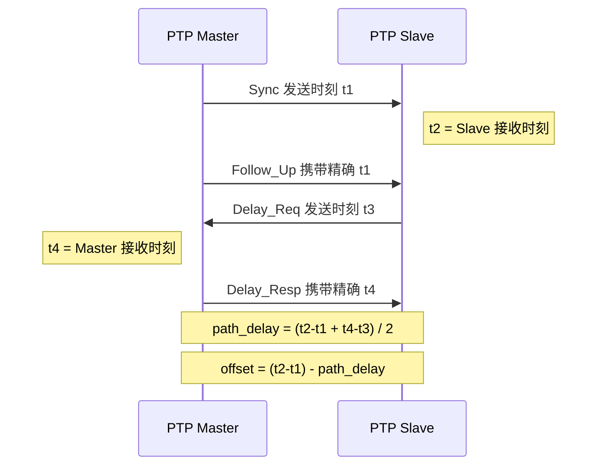
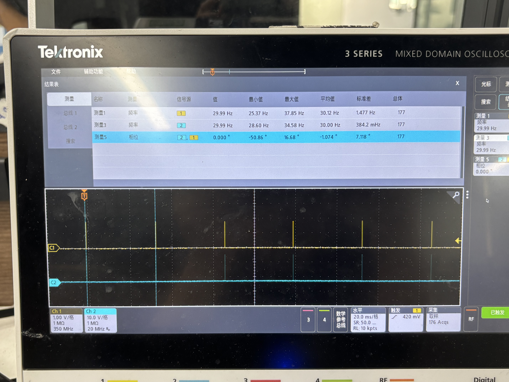
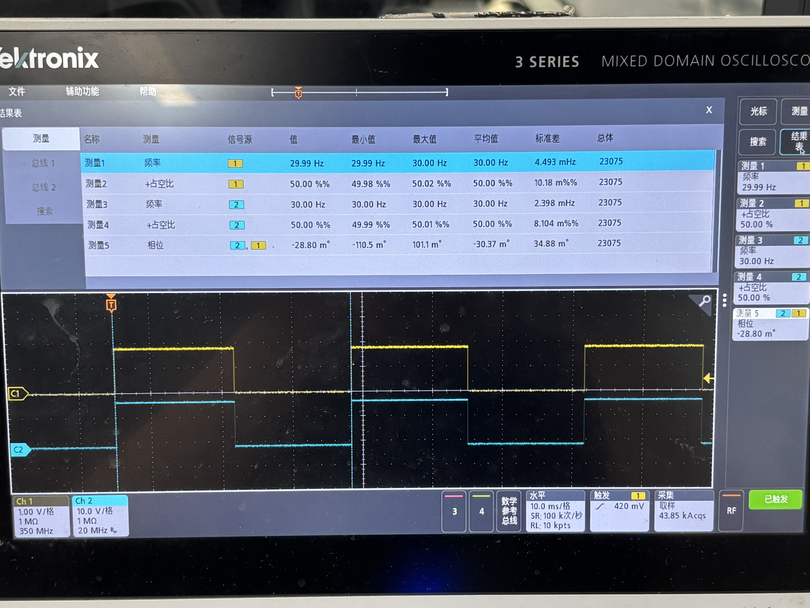
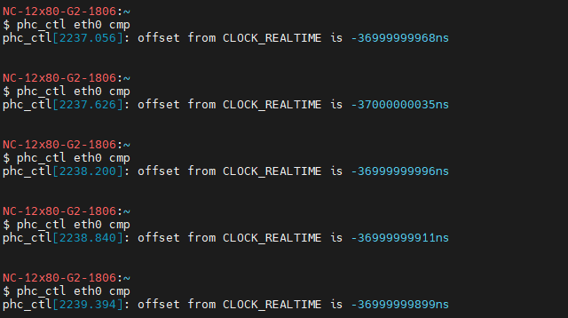
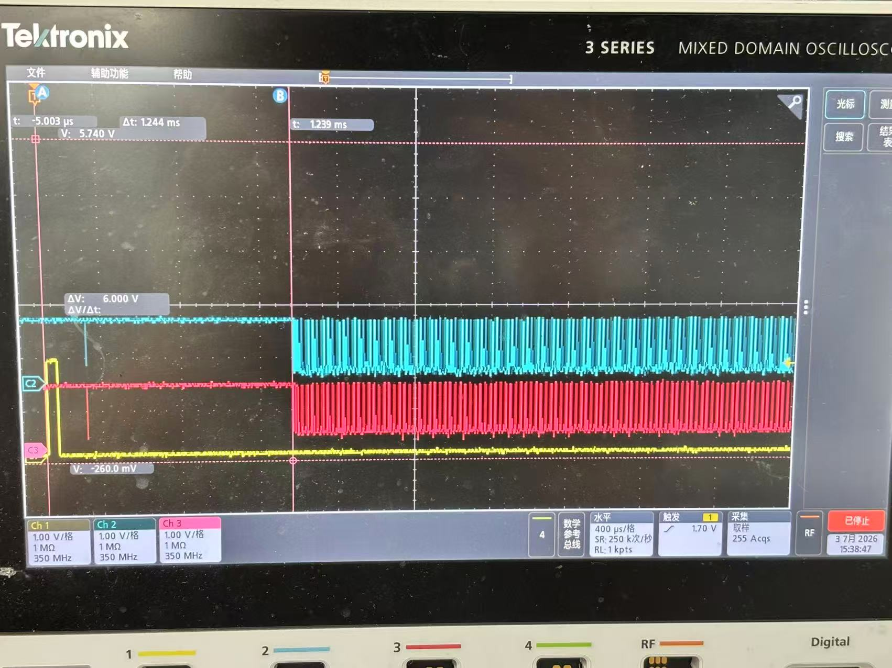

# PTP 音视频高精度同步开发经验分享

---

## 一、 背景与需求：我们要解决什么核心问题
需求来自客户 QSC 的多机位协同场景，核心诉求非常明确：**网络内所有独立设备的音视频采样，必须严格锁定在同一个绝对时间坐标系下**。

具体落地为以下两个业务场景与技术挑战：

### 1.1 视频场景：消除拍摄视频墙的“滚动条纹（Banding）”
- 业务痛点：多台摄像机拍摄带有 LED 视频墙的画面时，如果相机的曝光周期与屏幕刷新周期哪怕有微小的错位，画面就会出现持续上下的滚动暗条纹。
- 技术诉求（Genlock）：必须实现多机物理级别的帧同步。不仅要求每台机器的帧率绝对一致，还要求 Sensor 曝光出帧的瞬间做到极高精度的相位对齐。


**什么是Banding？**
1. 画面为平直横向明暗暗带，视频回放时条纹匀速向上 / 向下滚动；
2. 人眼直视屏幕无任何纹路，仅镜头录制可见；
3. 成因：LED 逐行 PWM 刷新、相机快门时钟独立、无 Genlock 同步带来相位漂移。


### 1.2 音频场景：麦克风阵列的声源定位（DOA）
- 业务痛点：会议室多台摄像机的麦克风协同拾音，用于精准定位说话人的三维位置。波达方向（DOA）算法对声音到达各麦克风的时间差极为敏感，微小的采样时钟错位都会引发严重的定位偏移。
- 技术诉求：多机音频采样时钟（MCLK）必须实现微秒级的严格相位对齐，确保所有设备采到的声音在时间轴上严丝合缝。


### 1.3 问题的本质与破局点
以上所有痛点的根源都在于：每台设备拥有独立的物理晶振，它们的频率各不相同，且会随温度和时间不断漂移。误差一旦长期累积，同步就会彻底崩溃。

我们的解题思路分两步走：

- 引入时间锚点：依托底层网卡的硬件时间戳，通过 PTP (IEEE 1588) 协议将全网设备拉齐到同一个 Grandmaster 主时钟（网卡 PHC 硬件时间）。
- 音视频跨域绑定：将 SoC 内部的 Audio PLL（音频时钟） 和 Sensor FSIN（视频触发），分别与 PTP 时间强行绑定。

---

## 二、软硬件环境与 PTP 基础


> - **相位 (phase) θ**：信号在一个周期里的相对位置（° 或 rad）。
> - **相位差 (phase difference) Δθ**：两个同频信号之间的相对位置差（° 或 rad）。
> - **频率 (frequency) f**：单位时间内的周期数（Hz）。
> - **频偏 (frequency offset) Δf**：实际频率 vs 标称频率的差（**Hz 是绝对偏差，ppb/ppm 是相对偏差的比例**）。
>
>  **精度单位**（无量纲比例）：**ppm**（百万分之一，10⁻⁶）、**ppb**（十亿分之一，10⁻⁹）。换算：**1 ppm = 1000 ppb**。
>
> **举个例子**：`ptp4l` 报 `s2 freq +2510`，含义是 PHC 频率比 master 高 2510 ppb。折算成 Hz：
>
> ```text
> Δf = 标称频率 × adj / 10⁹
>    = 12,288,000 × 2510 / 1,000,000,000
>    ≈ 30.84 Hz
> ```
>
> 也就是说 PHC 实际频率 ≈ **12,288,030.84 Hz**（高了 30.84 Hz）。客户看到 +2510 不明所以时，先把 ppb × 标称频率 × 10⁻⁹ 就变成 Hz。

 **典型 24 MHz 晶振精度**：

| 等级 | 精度 | 折算 24 MHz 偏差 |
|------|------|----------------|
| **无源 Xtal** | ±20-50 ppm | ±480-1200 Hz |
| **TCXO**（温补晶振） | ±0.5-2.5 ppm | ±12-60 Hz |
| **OCXO**（恒温晶振） | ±10-100 ppb | ±0.24-2.4 Hz |

### 2.0 内核配置：PTP 时钟支持（如果网卡支持的话）

PTP 同步需要内核支持。编译内核时确保以下选项打开（`make menuconfig`）：

```text
CONFIG_PTP_1588_CLOCK=y
CONFIG_PTP_1588_CLOCK_OPTIONAL=y
CONFIG_PTP_1588_CLOCK_KVM=y
```

**关键选项**：

| 选项 | 含义 | 是否必开 |
|------|------|---------|
| `CONFIG_PTP_1588_CLOCK=y` | 核心 PTP 时钟框架 | **必开** |
| `CONFIG_PTP_1588_CLOCK_OPTIONAL=y` | 网卡不支持 PTP 时降级运行，避免编译失败 | 必开 |
| `CONFIG_PTP_1588_CLOCK_KVM=y` | KVM 虚拟化场景——**虚拟机也要 PTP**（直通网卡常见） | 虚拟化环境必开 |

**验证方法**：

```bash
ls /sys/class/ptp/
# 期望输出：ptp0（一张网卡）；多网卡会列出 ptp0、ptp1 ...
```

如果 `/sys/class/ptp/` 是空或目录不存在——**说明内核没编进 PTP 支持**，这是 PTP 跑不通的第一个排查点。

### 2.1 环境前提：网卡必须支持硬件时间戳

软件时间戳精度只有毫秒级，硬件时间戳才能到纳秒级。先查：

```bash
ethtool -T eth0
# 关键看这几行：
#   PTP Hardware Clock: 0          ← 必须存在（ptp0），none 就没戏
#   hardware-transmit / hardware-receive  ← 必须支持 HARDWARE
```

确认设备节点：

```bash
ls /sys/class/ptp/      # 输出 ptp0
```
---

### 2.2 linuxptp 三件套各司其职

| 工具 | 作用 |
|------|------|
| `ptp4l` | PHC（网卡硬件时钟）与远端主时钟同步 |
| `phc2sys` | 系统时钟（CLOCK_REALTIME）与 PHC 同步 |
| `pmc` / `phc_ctl` | 状态查询与调试 |

#### 2.2.1 `ptp4l`：让 PHC 跟 Grandmaster 同步

最常见的启动命令：

```bash
ptp4l -i eth0 -m -H -s
```

参数解读：

| 选项 | 含义 |
|------|------|
| `-i eth0` | 指定要用的网卡接口（必须支持硬件时间戳） |
| `-m` | 日志打到 stdout，便于实时监控；不加默认全静默 |
| `-H` | **硬件时间戳模式**——纳秒级精度的关键；不加默认软件时间戳（毫秒级抖动） |
| `-s` | 从模式（slave-only），明确告诉 BMCA 不要竞争 master； |
| `-f <file>` | 指定配置文件路径，不加则走 `/etc/linuxptp/ptp4l.cfg` 默认路径 |

生产环境通常改用配置文件 `/etc/linuxptp/ptp4l.conf`，用 `-f` 显式指定：

```bash
ptp4l -f /etc/linuxptp/ptp4l.conf -i eth0 -m
```

强制做为主机的配置内容示例：

```ini
[global]
# 强制作为 master（不参与 BMCA 竞争）
masterOnly      1
# BMCA 优先级 1（越小越优先，默认 128）
priority1       10
# BMCA 优先级 2
priority2       10
# 时钟等级 6 = 锁定到主参考源（GPS 之类）
clockClass      6
# 强制硬件时间戳
time_stamping   hardware
# UDPv4 传输
network_transport UDPv4
# PTP 域号
domainNumber    0
# UDS 管理接口路径（pmc 用）
uds_address     /var/run/ptp4l
```

启动后观察 `-m` 日志判断是否锁定：

```text
ptp4l[123.456]: master offset   -12 s2 freq   +1234 path delay 5432
                                ↑ns              ↑ppb              ↑ns
                             相位偏差          频率偏差         链路单程延迟
```

**3 个数字的判读**（PTP 排查核心技能）：

| 字段 | 单位 | 健康范围 | 不健康信号 | 第一动作 |
|------|------|----------|-------------|-----------|
| `master offset` | ns | **±100 ns 内**（稳定） | 波动大 / 不收敛 | 查链路 + 重启 ptp4l |
| `s2 freq` | ppb | **±10 ppb 内**（频率稳） | 持续 ±1000 ppb（数小时不收敛） | 查温度 / 晶振老化 / 降级网络 |
| `path delay` | ns | **局域网 1-10 μs** | 突然涨到 ms 级 | 千兆降百兆 / 交换机拥塞（见 §5.2 坑二） |


**锁定的硬指标**：`s2 freq` 数值稳定（不再大范围漂）+ `offset` 在 **±100 ns 内** → 视为锁定。

#### 2.2.2 `phc2sys`：让系统时钟跟着 PHC 走

`ptp4l` 把 PHC 对齐到 master，但用户态程序用的是系统时钟 `CLOCK_REALTIME`。`phc2sys` 再把这两个时钟绑一次：

```bash
phc2sys -s eth0 -c CLOCK_REALTIME -w -m -r -O 0
```

参数解读：

| 选项 | 含义 |
|------|------|
| `-s eth0` | 源时钟 = 该网卡对应的 PHC（phc2sys 会自动从 eth0 解析出 `/dev/ptp0`，比硬写设备路径更可移植） |
| `-c CLOCK_REALTIME` | 目标时钟 = 系统实时时钟； |
| `-w` | 等 `ptp4l` 锁定到 master 后再开始同步，避免初始抖动污染 |
| `-m` | 日志打到 stdout（和 `ptp4l -m` 配合，便于联动查看） |
| `-r` | 反向同步——把系统时钟往 PHC 对齐（默认是 PHC 往系统对齐，方向反了） |
| `-O 0` | PHC 索引 0（多 PHC 场景下选第几个；新版 phc2sys 用 `-O` 取代旧的 `-n`） |

**启动顺序很关键**：

```bash
# 1. 先起 ptp4l，等出 s2 日志
ptp4l -i eth0 -m -H -s &
sleep 5
# 2. 再起 phc2sys（-w 让它等 ptp4l 稳定）
phc2sys -s eth0 -c CLOCK_REALTIME -w -m -r -O 0 &
```

颠倒顺序会让 `phc2sys` 去同步一个尚未稳定的 PHC，offset 会被初始抖动带跑，反向污染系统时间。

#### 2.2.3 `pmc` / `phc_ctl`：查询与调试

```bash
# 查 BMCA 状态：谁是 master、跳数、offset、path delay
pmc -u -b 0 'GET CURRENT_DATA_SET'

# 读 PHC 原始时间（对照系统时间用）
phc_ctl eth0 get
```

`pmc` 报的 `offsetFromMaster` 是最关键的同步指标——稳态 < ±100 ns 才算锁定。


### 2.3 PTP 怎么算出 offset 和 freq

PTP（Precision Time Protocol，IEEE 1588）是一种用于网络设备高精度时间同步的协议，其核心目标是实现**亚微秒级**的时间同步精度。它通过主从时钟机制、硬件时间戳、延迟测量与计算、时钟校正四项技术实现高精度同步——核心在于用精确的硬件时间戳和延迟测量，消除网络传输引入的时间误差。

#### 主从同步机制

- **主时钟（Master）**：作为时间基准，周期性地向网络中的从时钟发送时间同步报文。
- **从时钟（Slave）**：接收主时钟的同步报文，并根据报文中的时间戳信息调整本地时间，使其与主时钟保持一致。

#### 时间戳记录

PTP 使用**硬件时间戳**技术在物理层记录报文的发送和接收时刻，绕开操作系统与网络协议栈的延迟——这是纳秒级同步能成立的前提。软件时间戳精度只能到毫秒级，对音视频同步远远不够。

#### 延迟测量与计算

PTP 通过四类报文在主从之间交换四个时间戳，从而计算出网络传输延迟。流程如下：

1. 主时钟向从时钟发送 **Sync** 报文，并记录发送时刻 `t1`。
2. 从时钟接收到 Sync 后，立即记录接收时刻 `t2`。
3. 主时钟再发送一个携带 `t1` 值的 **Follow_Up** 报文（Sync 与 Follow_Up 必须成对出现，且 `sequenceId` 必须相同且连续——前者打物理层硬件时间戳，后者把精确时间送上来）。
4. 从时钟向主时钟发送 **Delay_Req** 报文，并记录发送时刻 `t3`。
5. 主时钟收到 Delay_Req 后，记录接收时刻 `t4`。
6. 主时钟向从时钟发送一个携带 `t4` 的 **Delay_Resp** 报文。

主从报文交换的时序：



由这四个时间戳得到：

- **往返平均路径延迟**（单程 path delay）：

```bash
path_delay = [(t2 - t1) + (t4 - t3)] / 2
```

- **从时钟相对主时钟的相位偏差 offset**：

```bash
offset = (t2 - t1) - path_delay
       = (t2 - t1) - [(t2 - t1) + (t4 - t3)] / 2
```

#### 时钟校正

从时钟拿到 `offset` 和 `path_delay` 后，用 PI 伺服动态调节本地时钟频率（`freq`/PPB），让 `offset` 趋零并保持长期稳定

`offset`（ns）是瞬时相位误差，
`freq`（PPB）是伺服据此估算的频率偏差。

## 三、音频同步方案演进



### 3.1 旧方案：软件 PPS 长链路

旧方案用一条长链路把音频时钟绑到 PTP：

```bash
ALSA 采集 → DMA 中断 → 软件模拟 PPS(/dev/pps1) → phc2sys_2 算偏移 → Audio PLL 寄存器
```

**关键是：这套方案里根本没有硬件 PPS，脉冲全靠软件合成。** 整条机制如下：

1. ALSA 开启录音后，I²S 把采集到的音频数据交给 **DMA** 搬运到内存；
2. 每攒满一个 period（`period-time=10ms` → 每秒 100 次中断），DMA 触发一次中断；
3. 在 DMA 中断回调里调用 `vhd_send_pps_event()`，**每 100 次中断（即每秒）合成一个 PPS 脉冲**，喂给 Linux PPS 子系统 `/dev/pps1`；
4. `phc2sys_2` 读 `/dev/pps1`，拿这个「软 PPS」和 PHC 比对算偏移。

录音时能看到对应 DMA 通道的中断计数疯涨：

```bash
cat /proc/interrupts | grep dma
# 37:     286422   0   GIC-0 111 Edge   ffe001f000.gdma   ← 音频 DMA 通道
```

启动三条命令，`phc2sys_2` 是改造重点：

```bash
ptp4l -i eth0 -m -H -s > /dev/null &
phc2sys -s /dev/ptp0 -r -w > /dev/null &
phc2sys_2 -c CLOCK_REALTIME -d /dev/pps1 -w -m -E pi -l 7 -P 0.1 -I 0.16 > /dev/null &
```

（`-E pi` PI 伺服，`-P 0.1` 比例常数，`-I 0.16` 积分常数）

核心改造在 `phc2sys_2` 的 `update_clock()` 里——不再调系统时钟，改成根据 PPS 与 PHC 偏差算 MCLK 频率，写 `/proc/ambarella/clock`：

```c
case SERVO_LOCKED:
case SERVO_LOCKED_STABLE:
    int64_t base_freq = 12288000LL;
    static int64_t last_freq = 12288000LL;
    int64_t ppbi = ((int64_t)ppb) / 500 * 500;          // 量化到 500ppb 步长
    int64_t new_freq = base_freq - base_freq * ppbi / 1000000000L / 4;

    // 突变保护：单次变化超 100Hz 视为异常，保持上次值
    if ((new_freq - last_freq > 100LL) || (new_freq - last_freq < -100LL)) {
        new_freq = last_freq;  s_reset_offset = 1;
    }
    if (new_freq > 12289000LL) { new_freq = 12289000LL; s_reset_offset = 1; }  // 上限
    if (new_freq < 12287000LL) { new_freq = 12287000LL; s_reset_offset = 1; }  // 下限
    if (new_freq != last_freq) {
        char cmd[256];
        snprintf(cmd, sizeof(cmd), "echo gclk_audio2 %llu > /proc/ambarella/clock", new_freq);
        system(cmd);  last_freq = new_freq;  s_reset_offset = 1;
    }
    break;
```

**这套机制有三个硬伤，最终导致它被放弃：**

**① 依赖录音。** PPS 由 DMA 中断触发，不开录音就没有中断，PPS 根本产生不了——同步成了录音的「附属品」。

**② `period-time` 必须锁死 10ms。** 它是 PPS 节拍的来源，换别的值 PPS 就不准，录音配置因此被卡死：

```bash
arecord -D hw:0,0 -f S16_LE -r 48000 -c 4 --period-time=10000 /dev/null
# cat /proc/asound/card0/pcm0c/sub0/hw_params
#   period_size: 480      ← 必须 48000×0.01
#   buffer_size: 1920
```

**③ CPU 调度抖动（致命）。** 中断响应和脉冲合成都跑在 CPU 上，负载一高就被抢占，脉冲边沿随之抖动。

`ppstest /dev/pps1` 实测精度随负载剧烈波动——低负载还能压在十几 μs，高负载直接飙到 **±40~100 μs**：


这个精度远不够，旧方案在高负载场景下基本不可用。

### 3.2 新方案：物理同源

> 💡 **整个新方案的命门**：PHC 和 Audio PLL 由同一颗 24 MHz 物理晶振驱动。晶振漂移以**绝对相同的比例**同时映射到网络域和音频域，而 PTP 算出的 `freq`（PPB）是**无量纲相对比例**——直接跨域注入即可等效纠偏，根本不用重新采音频。

这一句话背后藏着三层意思，把它拆开看更清楚：

| 层 | 物理事实 | 工程推论 |
|---|---|---|
| **1. 时钟树** | 24 MHz 晶振同时驱动 PHC 与 Audio PLL | 两个时钟域**共享同一个频率源** |
| **2. 漂移** | 温度/老化引起的晶振漂移 → PHC 与 Audio PLL **按相同比例**漂移 | 网络域与音频域的频偏**完全相关** |
| **3. 跨域纠偏** | `ptp4l` 测得 PHC 相对 master 的频偏 = 晶振频偏（PHC 派生自该晶振）| Audio PLL 由**同一颗晶振派生**→ 也有完全相同的频偏 → **把 PPB 直接写入 Audio PLL 寄存器**即可等效纠偏 |

**关键洞察**：PTP 算出的 PPB 不是「PHC 这一路专属的频率偏差」，而是「**24 MHz 晶振的频率偏差**」——因为 PHC 与 Audio PLL 都从这颗晶振派生。所以 PPB 可以**直接跨域注入**到 Audio PLL，不需要任何额外补偿或重新采音频。

新链路因此短得多，且不依赖录音、不依赖 DMA：

```bash
ptp4l 提取 freq(PPB) → EMA 平滑 → 限幅 → 写 Audio PLL 寄存器
```

### 3.3 落地：clock.c 三件套（平滑 + 补偿 + 限幅）

「同源 + 跨域注入」的信号流——这是新方案能成立的根本：


改造 `ptp4l` 的 `clock_synchronize_locked()`，只在**从模式锁定**（`clock_best_foreign(c)`）下执行：

```c
if (clock_best_foreign(c)) {
    static FILE *audio_clk_fp = NULL;
    static double smoothed_adj = 0.0;
    static int init = 0;
    double BASE_FREQ = 12288000.0;
    double SMOOTH_FACTOR = 0.1;
    long MAX_FREQ_DIFF = 1000;   // ±1000Hz 限幅

    // ① EMA 平滑
    if (!init) { smoothed_adj = adj; init = 1; }
    else smoothed_adj = SMOOTH_FACTOR*adj + (1.0-SMOOTH_FACTOR)*smoothed_adj;

    // ② 频率补偿
    long target_freq = (long)(BASE_FREQ - BASE_FREQ * smoothed_adj / 1e9);

    // ③ 限幅
    if (target_freq > BASE_FREQ + MAX_FREQ_DIFF) target_freq = BASE_FREQ + MAX_FREQ_DIFF;
    else if (target_freq < BASE_FREQ - MAX_FREQ_DIFF) target_freq = BASE_FREQ - MAX_FREQ_DIFF;

    if (!audio_clk_fp) audio_clk_fp = fopen("/proc/ambarella/clock", "w");
    if (audio_clk_fp) {
        fprintf(audio_clk_fp, "gclk_audio2 %ld\n", target_freq);
        fflush(audio_clk_fp);
    }
    pr_info("audio clock: raw freq %+7.0f -> smoothed %+7.2f -> set %ld Hz",
            adj, smoothed_adj, target_freq);
}
```

**三件套的物理意义与算例：**

**① EMA 平滑（α=0.1）—— 每秒只吸收 10% 新值，把跳变稀释掉**

```bash
smoothed = 0.1 × adj + 0.9 × smoothed_prev   # 新值 = 10%当前 + 90%上次
```

每次只用 10% 的新数据，剩下 90% 还是老结果，所以输出很「迟钝」——比如 adj 这一秒从 2500 跳到 3000（+500），平滑值只会涨 50，跳变被稀释了。

它本质是个**低通滤波**，等效截止频率 ≈ 0.016 Hz（周期约 1 分钟）。换句话说：**周期长于约 1 分钟的慢趋势**（晶振温漂/老化，这才是真正要补偿的）放行；**更快的抖动**（网络延迟波动、CPU 调度引起的 freq 跳变，这些是噪声）一律抹平，不会灌进音频时钟。

**② 频率补偿 + 推导**（adj = +2600 ppb）

```bash
target_freq = BASE_FREQ × (1 - smoothed_adj/1e9)
Δf = 12288000 × 2600 / 1e9 = 31.95 Hz
target_freq = 12288000 - 31.95 = 12,287,968 Hz
```

**③ 限幅（±1000 Hz）**：防失锁/网络突变导致时钟跳变。

### 3.4 实测日志验算

```bash
ptp4l[790.212]: master offset -128 s2 freq +2510 path delay 11830
ptp4l[790.212]: audio clock: raw freq +2510 -> smoothed +2579.46 -> set 12287968 Hz
```

| 时刻 | master offset (ns) | s2 freq (ppb) | 平滑值 |
|------|-------------------:|--------------:|-------:|
| 790  | -128 | +2510 | 2579 |
| 791  |  +94 | +2693 | 2591 |
| 792  | -125 | +2503 | 2582 |
| 793  |  +38 | +2628 | 2587 |

> 观察规律：
> offset 偏负（本地慢）→ freq 偏低；
> offset 偏正（本地快）→ freq 偏高。
> 
> 伺服一直在调频率消除 offset。稳态时 MCLK 落在 **12,287,967~12,287,970 Hz**（偏低 30~33Hz），`s2 freq` 稳定在 ~2600 ppb。

### 3.5 如何判断是否同步

目前是通过示波器可以看到如下视频（两台设备 MCLK 波形相对静止，证明音频时钟已频率锁定）：

<video controls="controls" width="500" height="300">
    <source src="../video/audio_ptp.mp4" type="video/mp4">
</video>


## 四、视频同步方案演进



### 4.1 旧方案：hrtimer 软件 FSIN

Sensor 工作在从模式，由 SoC 发 FSIN 脉冲触发出帧。相位对齐靠算到下一个周期边界的等待时间：

```c
u64 get_sync_ptp_time_wait(void)
{
    u64 now = ktime_get_real_ns();
    // 到下一个周期边界的差值，例：4K30 每帧 33.33ms
    return target_interval_ns - (now % target_interval_ns);
}
```

hrtimer 状态机（三态轮转打脉冲）：

```c
switch (current_state) {
case AJUST_PTPTIME_STATE:   // 对齐到系统时间（能被目标周期整除）
    s_diff_ptptime = get_sync_ptp_time_wait();
    next_interval = ktime_set(0, s_diff_ptptime);
    current_state = LOW_STATE;
    break;
case LOW_STATE:
    gpio_set_value(GPIO_PIN, 1);
    current_state = HIGH_STATE;
    next_interval = ktime_set(0, 1000000);   // 1ms 高电平脉冲
    break;
case HIGH_STATE:
    gpio_set_value(GPIO_PIN, 0);
    current_state = AJUST_PTPTIME_STATE;
    // 半周期减去 LOW_STATE 的 1ms，保证总周期准确；预留时间给 PTP 对齐
    next_interval = ktime_set(0, target_interval_ns/2 - 1000000);
    break;
}
hrtimer_forward_now(timer, next_interval);
```

痛点：hrtimer 终究是**软件定时器**，触发精度受限于**操作系统调度抖动 + 中断响应延迟**。实测 4K30（33.33ms 帧周期）下，CPU 高负载时 FSIN 信号的相位同步最大误差约 **0.1ms（±100μs）**：


**实际测量精度**：




这个量级的相位抖动会让多机 Sensor 的曝光起点错开，拍视频墙时仍可能看到轻微 banding/撕裂——而 genlock 级别同步要求远比这高，所以软件 FSIN 最终也被废弃。

### 4.2 新方案：MAC 硬件 PPS 直驱

**设计思路**：先通过 PTP 协议把全网设备网卡硬件时钟（PHC）同步到纳秒级；再由软件算出未来的绝对时间点 + 30Hz 周期，下发到网卡寄存器。

**执行逻辑**：到达预设时间后，MAC 芯片底层的**硬件比较器**自动接管，精准输出 FSIN 方波触发 Sensor。规避 Linux 系统调度、中断响应造成的延迟抖动。


实测效果（Sensor 从机模式下，MIPI 数据跟随 FSIN 信号稳定输出，多机帧同步）：



精度对比：

| 方案 | 触发方式 | 相位精度 | 受 CPU 负载影响 |
|------|---------|----------|----------------|
| 旧 hrtimer | 软件定时器  | ±100μs（无序波动） | 是 |
| **MAC PPS 直驱** | 硬件比较器  | **平均 -2.8μs，极限 ±10.5μs** | 否 |

**长测验证（连续 12.8 小时 / 23,000+ 次样本烤机）**：

- **频率锁定**：稳定输出 30.00 Hz 方波，通道1 标准差仅 **4.493 mHz**、通道2 仅 **2.398 mHz**（波动 < 0.005 Hz），免疫长期时钟漂移；
- **相位对齐**：两路平均相位差 **-30.37 m°**，等效时间误差仅 **-2.8μs**，整晚极限波动被死死限制在 **±10.5μs** 以内。

---

## 五、踩过的坑

### 5.1 坑一：多机 PPS 相位误差 28°——没做绝对时间对齐


> ⚠️ **症状**：多台从机 PPS 之间有约 28° 相位差。听起来不大，但换算成时间很吓人——

#### 28° 到底是多大？（量化换算）

本项目 PPS 是 30 Hz：

```text
时间偏差 = 28°/360° × (1/30) s ≈ 2.59 ms
```

通用公式（任意角度 + 任意频率都能套）：

```text
Δt = θ / (360° × f)
   = 相位角度(°) / (360° × 频率(Hz))
```

代入 28° + 30 Hz：Δt = 28 / (360 × 30) ≈ 2.59 ms ✓

示波器实测两机 PPS 的相位差（28°）见上图。

#### 根因：没做绝对时间对齐

**启动时没做相位对齐。** PHC 计数器溢出产生 PPS 的时刻由 `MAC_PPS0_Target_Time` 决定——**不对齐就是各自随机起跑**。

硬件寄存器（出自 CV72 Datasheet 13.3.1.74~76）：

| 寄存器 | 偏移 | 功能 |
|--------|------|------|
| `MAC_PPS0_Target_Time_Seconds` | `0xb80` | 目标时间（秒） |
| `MAC_PPS0_Target_Time_Nanoseconds` | `0xb84` | 目标时间（纳秒） |
| `MAC_PPS_Control` | `0xb70` | PPS 控制（下发 `0010` = START Pulse Train） |

手册原文要点：*当时间戳值与两个 Target Time 寄存器匹配时，MAC 开始 PPS 输出；此命令生成脉冲列，上升沿在 Target Time 定义的起始点触发。*

#### 解法

**绝对时间对齐**——让所有机器约定在同一绝对时刻起跑：

```c
clockid_t clkid = FD_TO_CLOCKID(fd);
struct timespec ts;
clock_gettime(clkid, &ts);              // 1. 取当前 PTP 时间

struct ptp_perout_request perout_req;
memset(&perout_req, 0, sizeof(perout_req));
perout_req.index = 0;                    // 对应 MAC_PPS0

uint64_t align_sec = 10;
uint64_t target_sec = ((ts.tv_sec / align_sec) + 1) * align_sec + 10;  // 下个10s整倍 + 10s缓冲
perout_req.start.sec  = target_sec;
perout_req.start.nsec = 0;               // ★ 纳秒必须为 0，保证边沿对齐
```

用 `devmem` 验证是否写入：

```bash
devmem 0xFFE000EB84      # 读纳秒寄存器（应 = 0）
devmem 0xFFE000EB80      # 读秒寄存器（应是 10 的整倍）
```

> 💡 **三个要点**：
>
> - `align_sec=10`：对齐 10 秒整倍，便于多机同步
> - `target_sec += 10`：再多 10 秒缓冲，确保 PTP 锁定 + 寄存器配置来得及
> - `nsec=0`：纳秒必须为 0，否则不同机的 PPS 上升沿会偏几纳秒——抵消绝对时间对齐的意义

### 5.2 坑二：千兆/百兆混用——隐形的「时间杀手」


> ⚠️ **症状**：烤机后多机相位差飙到 **2.175 ms**，PPS 链路没问题，最终发现 **PHC 时间本身就有偏差**——问题在时间源，不在 PPS 输出。

#### 定位手法

用 MultiExec 在两机**同时**执行 `phc_ctl eth0 get` 读最原始 PHC 时间，做减法（右 − 左）：

```bash
第一次：0.002199519 s  (2.2 ms)
第二次：0.000680204 s  (2.08 ms)
第三次：0.001946535 s  (1.94 ms)
```

三次结果跟示波器测的 2.175 ms 基本吻合。

#### 根因：链路速率不一致

**链路速率不一致**——有几台机器悄悄降级到 100Mb/s：

| 机器 | 链路速率 | 状态 |
|------|----------|------|
| NC-12x80… | 1000Mb/s | 正常 |
| NC-90-G2… | 100Mb/s | ⚠️ 降级 |
| 其他机器 | 100Mb/s | ⚠️ 降级 |

#### 为什么对 PTP 是毁灭性的？

PTP 整套计算**假设收发延迟对称**，链路速率不一致会从两方面打破这个假设：

1. **序列化延迟暴增**：100M 发同包耗时是 1000M 的 10 倍，纳秒级时间戳的物理误差直接放大。
2. **交换机非对称缓冲**：千兆→百兆要排队缓存，百兆→千兆畅通无阻 → **延迟不对称**。

> 💡 **结论**：**链路对称性是 PTP 的生命线**，所有设备必须统一速率（全千兆），不允许任何机器悄悄降级。

### 5.3 坑三：TAI vs UTC——PHC 为何总比系统时钟早 37 秒？



> ✅ **结论先行**：**这不是 bug，是正确行为**。PHC 用的是 TAI 时间，系统时钟（`CLOCK_REALTIME`）用的是 UTC，两者**设计上就差 37 秒**，PTP 同步依然成功。

#### UTC vs TAI：两套时间从何而来

日常生活中我们只用一种时间，但在高精度计算机网络中，时间分成了**两派**：

| 时间 | 服务对象 | 特性 | 谁在用 |
|------|---------|------|-------|
| **UTC**（协调世界时） | "人"和操作系统 | 必须和地球自转保持一致；地球自转变慢时会**插秒**（如 `23:59:60`）或**减秒** | Linux `date`、Windows 时钟 |
| **TAI**（国际原子时） | "机器"和物理定律 | 完全基于原子钟震荡，**绝对均匀、单调递增、永不跳跃** | PTP、GPS、NTP 内部 |

#### PTP 为什么选 TAI 而不是 UTC

**IEEE 1588 规定：PTP 网络中传输的时间必须是 TAI。**

原因：对于工业控制、5G 基站、自动驾驶等场景，时间突然"倒退 1 秒"或"停顿 1 秒"（闰秒）会带来严重灾难：

- **数据库**：唯一索引冲突、事务回滚混乱
- **实时控制**：PID 积分项爆炸、执行器误动作
- **音视频同步**：相位跳变 ±1 秒，丢帧/卡顿

#### TAI 与 UTC 怎么就差出了 37 秒

从 1972 年到本项目实施时（2026 年），地球自转累计慢了约 **37 秒**。UTC 为了等地球，已经主动"暂停"了 37 次（每次插 1 秒）。所以：

```text
TAI − UTC ≈ 37 秒
```

未来还会有闰秒——具体何时插入由 IERS（国际地球自转服务）提前数月宣布。


### 5.4 排查方法 + 调试手段

四步排查法：

| 步骤 | 操作 | 预期 |
|------|------|------|
| 1 | 检查网卡链路速率 | 全部 1000Mb/s |
| 2 | 检查 PHC 时间偏差 | 多机 < 1μs |
| 3 | 等 phc2sys 锁定 | s2 freq 稳定 < 100 ppb |
| 4 | 示波器测 PPS 对齐 | 多机边沿 < 200ns |

查同步状态（`pmc`），关注 offsetFromMaster 和 meanPathDelay：

```bash
pmc -u -b 0 'GET CURRENT_DATA_SET'
#   stepsRemoved     1            ← 距主时钟 1 跳
#   offsetFromMaster 6.0          ← 比主时钟快 6ns，精度很高
#   meanPathDelay    3386.0       ← 链路延迟 3.4μs
```

对比 PHC 时间与系统时间：

```bash
phc_ctl eth0 get      # 网卡时间：1776783654.214753612
date +%s%N            # 系统时间
或者直接输入
phc_ctl eth0 cmp
```

---

## 六、遗留问题与反思

1. **Audio PLL 分辨率 / 量化误差**：只能以 1Hz（≈81.38 PPB）为步长台阶式跳变——某些写入值因为量化不到，落不到期望的频率上，频率曲线会出现"断层"（看似 Bug，本质是 1Hz 步长的精度天花板）。要进一步降台阶，需要换**小数分频（Sigma-Delta 调制器）**架构的 Audio PLL。
2. **出帧延迟差异**：不同 Sensor 收到 FSIN 后曝光/出帧时间本身不同；DPHY 和 CPHY 之间也有差异。
   


---

## 七、三点核心心得

1. **精度敏感的链路，优先用硬件绕开 CPU 调度。** 音频取 PPB 直注、视频取 MAC PPS，本质都是把软件抖动从链路里摘出去——这是精度提升的真正来源。软件 PPS / hrtimer 都是「能跑但不准」。
2. **跨域纠偏的前提是「同源」。** PHC 和 Audio PLL 同一颗 24MHz 晶振，PPB 才能跨域等效注入。换平台前要先确认时钟拓扑。
3. **链路对称性是 PTP 的生命线。** 千兆/百兆混用、交换机非对称缓冲，会让时间补偿体系静悄悄失效——最难查，因为它不报错、只漂移。

排查方法论：**现象 → 回溯到最原始的物理量（PHC 时间、链路速率）→ 定位根因 → 对症修复。** 别在末端现象上打转，往下追一层往往就豁然开朗。
