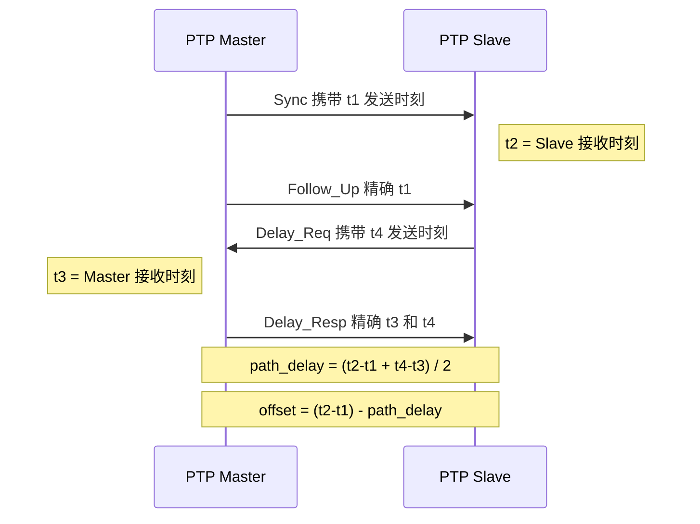
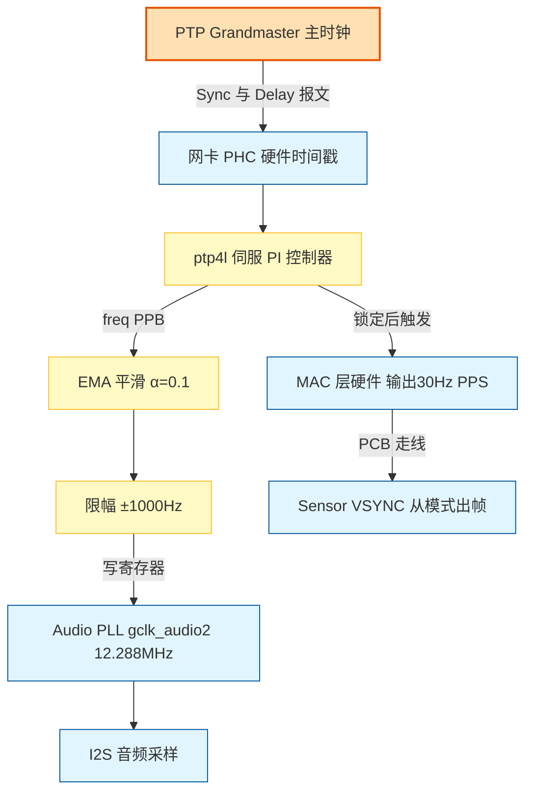
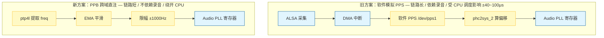
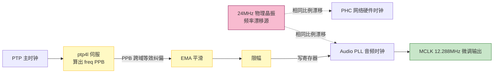

# PTP 音视频高精度同步开发经验分享

---

## 一、背景与需求：我们要解决什么核心问题

本项目的需求来自客户 QSC 的多机位协同场景，核心诉求非常明确：网络内所有独立设备的音视频采样，必须严格锁定在同一个绝对时间坐标系下。

具体落地为以下两个业务场景与技术挑战：

### 1.1 视频场景：消除拍摄视频墙的「滚动条纹（Banding）」

**业务痛点**：多台摄像机拍摄带有 LED 视频墙的画面时，如果相机的曝光周期与屏幕刷新周期哪怕有微小的错位，画面就会出现持续上下的滚动暗条纹。单纯靠牺牲曝光时间去规避，会严重影响画质。

**技术诉求（Genlock）**：必须实现多机物理级别的帧同步。不仅要求每台机器的帧率绝对一致，还要求 Sensor 曝光出帧的瞬间做到极高精度的相位对齐。

### 1.2 音频场景：麦克风阵列的声源定位（DOA）

**业务痛点**：会议室多台摄像机的麦克风协同拾音，用于精准定位说话人的三维位置。波达方向（DOA）算法对声音到达各麦克风的时间差极为敏感，微小的采样时钟错位都会引发严重的定位偏移。

**技术诉求**：多机 48 kHz 音频采样时钟（MCLK）必须实现微秒级的严格相位对齐，确保所有设备采到的声音在时间轴上严丝合缝。

### 1.3 问题的本质与破局点

以上所有痛点的根源都在于：每台设备拥有独立的物理晶振，它们的频率各不相同，且会随温度和时间不断漂移。误差一旦长期累积，同步就会彻底崩溃。

我们的解题思路分两步走：

- **引入时间锚点**：依托底层网卡的硬件时间戳，通过 PTP（IEEE 1588）协议将全网设备拉齐到同一个 Grandmaster 主时钟（网卡 PHC 硬件时间）。
- **音视频跨域绑定**：将 SoC 内部的 Audio PLL（音频时钟）和 Sensor VSYNC（视频触发），分别与 PTP 时间强行绑定。

**我们的终极目标**：对抗「Linux 系统调度抖动」，实现音视频底层硬件的长期频率锁定（零漂移）与极限的瞬时相位对齐。

> 根子上还是那句话：每台设备晶振独立、频率/相位各不相同、误差随时间累积。PTP（IEEE 1588）把所有设备统一到同一个 Grandmaster 时间源；我们的工作就是把 CV72 平台的**音频采样时钟（MCLK）**和**视频帧时钟（VSYNC）**都绑到这个源上。

### 1.4 环境前提：网卡必须支持硬件时间戳

软件时间戳精度只有毫秒级，硬件时间戳才能到纳秒级。先查：

```bash
ethtool -T eth0
# 关键看这几行：
#   PTP Hardware Clock: 0          ← 必须存在（ptp0），none 就没戏
#   hardware-transmit / hardware-receive  ← 必须支持 HARDWARE
```

确认设备节点：

```bash
ls /sys/class/ptp/      # 输出 ptp0
```

### 1.5 linuxptp 三件套各司其职

| 工具 | 作用 |
|------|------|
| `ptp4l` | PHC（网卡硬件时钟）与远端主时钟同步 |
| `phc2sys` | 系统时钟（CLOCK_REALTIME）与 PHC 同步 |
| `pmc` / `phc_ctl` | 状态查询与调试 |

### 1.6 PTP 怎么算出 offset 和 freq

Master 与 Slave 交换四类报文、四个时间戳（假设网络收发延迟对称）：



`offset`（ns）是瞬时相位误差，`freq`（PPB）是伺服据此估算的频率偏差。后面音频方案要直接用的就是 `freq`。

---

## 二、整体方案框图

整个系统就一条主线：PTP 主时钟经 `ptp4l` 伺服后，分两个域各自绑定——音频域把频率偏移注入 Audio PLL，视频域用 MAC 硬件 PPS 驱动 Sensor。



核心原则一句话：**精度敏感的链路，用硬件绕开 CPU 软件调度。** 这贯穿音频和视频两套方案的演进。

---

## 三、音频时钟同步：从「软件模拟 PPS」到「PPB 跨域直注」

先看两条链路的演进对比，再分节展开：



### 3.1 走过的弯路：软件 PPS 链路

旧方案用一条长链路把音频时钟绑到 PTP：

```bash
ALSA 采集 → DMA 中断 → 软件模拟 PPS(/dev/pps1) → phc2sys_2 算偏移 → Audio PLL 寄存器
```

**关键是：这套方案里根本没有硬件 PPS，脉冲全靠软件合成。** 整条机制如下：

1. ALSA 开启录音后，I²S 把采集到的音频数据交给 **DMA** 搬运到内存；
2. 每攒满一个 period（`period-time=10ms` → 每秒 100 次中断），DMA 触发一次中断；
3. 在 DMA 中断回调里调用 `vhd_send_pps_event()`，**每 100 次中断（即每秒）合成一个 PPS 脉冲**，喂给 Linux PPS 子系统 `/dev/pps1`；
4. `phc2sys_2` 读 `/dev/pps1`，拿这个「软 PPS」和 PHC 比对算偏移。

录音时能看到对应 DMA 通道的中断计数疯涨：

```bash
cat /proc/interrupts | grep dma
# 37:     286422   0   GIC-0 111 Edge   ffe001f000.gdma   ← 音频 DMA 通道
```

启动三条命令，`phc2sys_2` 是改造重点：

```bash
ptp4l -i eth0 -m -H -s > /dev/null &
phc2sys -s /dev/ptp0 -r -w > /dev/null &
phc2sys_2 -c CLOCK_REALTIME -d /dev/pps1 -w -m -E pi -l 7 -P 0.1 -I 0.16 > /dev/null &
```

（`-E pi` PI 伺服，`-P 0.1` 比例常数，`-I 0.16` 积分常数）

核心改造在 `phc2sys_2` 的 `update_clock()` 里——不再调系统时钟，改成根据 PPS 与 PHC 偏差算 MCLK 频率，写 `/proc/ambarella/clock`：

```c
case SERVO_LOCKED:
case SERVO_LOCKED_STABLE:
    int64_t base_freq = 12288000LL;
    static int64_t last_freq = 12288000LL;
    int64_t ppbi = ((int64_t)ppb) / 500 * 500;          // 量化到 500ppb 步长
    int64_t new_freq = base_freq - base_freq * ppbi / 1000000000L / 4;

    // 突变保护：单次变化超 100Hz 视为异常，保持上次值
    if ((new_freq - last_freq > 100LL) || (new_freq - last_freq < -100LL)) {
        new_freq = last_freq;  s_reset_offset = 1;
    }
    if (new_freq > 12289000LL) { new_freq = 12289000LL; s_reset_offset = 1; }  // 上限
    if (new_freq < 12287000LL) { new_freq = 12287000LL; s_reset_offset = 1; }  // 下限
    if (new_freq != last_freq) {
        char cmd[256];
        snprintf(cmd, sizeof(cmd), "echo gclk_audio2 %llu > /proc/ambarella/clock", new_freq);
        system(cmd);  last_freq = new_freq;  s_reset_offset = 1;
    }
    break;
```

**这套机制有三个硬伤，最终导致它被放弃：**

**① 依赖录音。** PPS 由 DMA 中断触发，不开录音就没有中断，PPS 根本产生不了——同步成了录音的「附属品」。

**② `period-time` 必须锁死 10ms。** 它是 PPS 节拍的来源，换别的值 PPS 就不准，录音配置因此被卡死：

```bash
arecord -D hw:0,0 -f S16_LE -r 48000 -c 4 --period-time=10000 /dev/null
# cat /proc/asound/card0/pcm0c/sub0/hw_params
#   period_size: 480      ← 必须 48000×0.01
#   buffer_size: 1920
```

**③ CPU 调度抖动（致命）。** 中断响应和脉冲合成都跑在 CPU 上，负载一高就被抢占，脉冲边沿随之抖动。`ppstest /dev/pps1` 实测精度随负载剧烈波动——低负载还能压在十几 μs，高负载直接飙到 **±40~100 μs**：


这个精度远不够，旧方案在高负载场景下基本不可用。

### 3.2 转折点：物理同源的洞察

新方案的理论命门：

> **PHC 和 Audio PLL 由同一颗 24MHz 物理晶振驱动。晶振漂移以绝对相同的比例，同时映射到网络域和音频域。而 PTP 算出的 `freq`(PPB) 是无量纲相对比例——直接跨域注入即可等效纠偏，根本不用重新采音频。**

新链路短得多，且不依赖录音、不依赖 DMA：

```bash
ptp4l 提取 freq(PPB) → EMA 平滑 → 限幅 → 写 Audio PLL 寄存器
```

### 3.3 落地：clock.c 三件套（平滑 + 补偿 + 限幅）

「同源 + 跨域注入」的信号流——这是新方案能成立的根本：



改造 `ptp4l` 的 `clock_synchronize_locked()`，只在**从模式锁定**（`clock_best_foreign(c)`）下执行：

```c
if (clock_best_foreign(c)) {
    static FILE *audio_clk_fp = NULL;
    static double smoothed_adj = 0.0;
    static int init = 0;
    double BASE_FREQ = 12288000.0;
    double SMOOTH_FACTOR = 0.1;
    long MAX_FREQ_DIFF = 1000;   // ±1000Hz 限幅

    // ① EMA 平滑
    if (!init) { smoothed_adj = adj; init = 1; }
    else smoothed_adj = SMOOTH_FACTOR*adj + (1.0-SMOOTH_FACTOR)*smoothed_adj;

    // ② 频率补偿
    long target_freq = (long)(BASE_FREQ - BASE_FREQ * smoothed_adj / 1e9);

    // ③ 限幅
    if (target_freq > BASE_FREQ + MAX_FREQ_DIFF) target_freq = BASE_FREQ + MAX_FREQ_DIFF;
    else if (target_freq < BASE_FREQ - MAX_FREQ_DIFF) target_freq = BASE_FREQ - MAX_FREQ_DIFF;

    if (!audio_clk_fp) audio_clk_fp = fopen("/proc/ambarella/clock", "w");
    if (audio_clk_fp) {
        fprintf(audio_clk_fp, "gclk_audio2 %ld\n", target_freq);
        fflush(audio_clk_fp);
    }
    pr_info("audio clock: raw freq %+7.0f -> smoothed %+7.2f -> set %ld Hz",
            adj, smoothed_adj, target_freq);
}
```

**三件套的物理意义与算例：**

**① EMA 平滑（α=0.1）—— 每秒只吸收 10% 新值，把跳变稀释掉**

```bash
smoothed = 0.1 × adj + 0.9 × smoothed_prev   # 新值 = 10%当前 + 90%上次
```

每次只用 10% 的新数据，剩下 90% 还是老结果，所以输出很「迟钝」——比如 adj 这一秒从 2500 跳到 3000（+500），平滑值只会涨 50，跳变被稀释了。

它本质是个**低通滤波**，等效截止频率 ≈ 0.016 Hz（周期约 1 分钟）。换句话说：**周期长于约 1 分钟的慢趋势**（晶振温漂/老化，这才是真正要补偿的）放行；**更快的抖动**（网络延迟波动、CPU 调度引起的 freq 跳变，这些是噪声）一律抹平，不会灌进音频时钟。

**② 频率补偿 + 推导**（adj = +2600 ppb）

```bash
target_freq = BASE_FREQ × (1 - smoothed_adj/1e9)
Δf = 12288000 × 2600 / 1e9 = 31.95 Hz
target_freq = 12288000 - 31.95 = 12,287,968 Hz
```

**③ 限幅（±1000 Hz）**：防失锁/网络突变导致时钟跳变。

### 3.4 实测日志验算

```bash
ptp4l[790.212]: master offset -128 s2 freq +2510 path delay 11830
ptp4l[790.212]: audio clock: raw freq +2510 -> smoothed +2579.46 -> set 12287968 Hz
```

| 时刻 | master offset (ns) | s2 freq (ppb) | 平滑值 |
|------|-------------------:|--------------:|-------:|
| 790  | -128 | +2510 | 2579 |
| 791  |  +94 | +2693 | 2591 |
| 792  | -125 | +2503 | 2582 |
| 793  |  +38 | +2628 | 2587 |

观察规律：offset 偏负（本地慢）→ freq 偏低；偏正（本地快）→ freq 偏高。伺服一直在调频率消除 offset。稳态时 MCLK 落在 **12,287,967~12,287,970 Hz**（偏低 30~33Hz），`s2 freq` 稳定在 ~2600 ppb。

### 3.5 效果验证

通过示波器可以看到如下视频（两台设备 MCLK 波形相对静止，证明音频时钟已频率锁定）：

<video controls="controls" width="500" height="300">
    <source src="../video/audio_ptp.mp4" type="video/mp4">
</video>

## 四、视频帧同步：从 hrtimer 到 MAC PPS

视频这边的演进逻辑和音频完全一样——把软件定时器换成硬件直驱：


### 4.1 旧方案：hrtimer 软件 FSIN

Sensor 工作在从模式，由 SoC 发 FSIN 脉冲触发出帧。相位对齐靠算到下一个周期边界的等待时间：

```c
u64 get_sync_ptp_time_wait(void)
{
    u64 now = ktime_get_real_ns();
    // 到下一个周期边界的差值，例：4K30 每帧 33.33ms
    return target_interval_ns - (now % target_interval_ns);
}
```

hrtimer 状态机（三态轮转打脉冲）：

```c
switch (current_state) {
case AJUST_PTPTIME_STATE:   // 对齐到系统时间（能被目标周期整除）
    s_diff_ptptime = get_sync_ptp_time_wait();
    next_interval = ktime_set(0, s_diff_ptptime);
    current_state = LOW_STATE;
    break;
case LOW_STATE:
    gpio_set_value(GPIO_PIN, 1);
    current_state = HIGH_STATE;
    next_interval = ktime_set(0, 1000000);   // 1ms 高电平脉冲
    break;
case HIGH_STATE:
    gpio_set_value(GPIO_PIN, 0);
    current_state = AJUST_PTPTIME_STATE;
    // 半周期减去 LOW_STATE 的 1ms，保证总周期准确；预留时间给 PTP 对齐
    next_interval = ktime_set(0, target_interval_ns/2 - 1000000);
    break;
}
hrtimer_forward_now(timer, next_interval);
```

痛点：hrtimer 终究是**软件定时器**，触发精度受限于**操作系统调度抖动 + 中断响应延迟**。实测 4K30（33.33ms 帧周期）下，CPU 高负载时 FSIN 信号的相位同步最大误差约 **0.1ms（±100μs）**：


**实际测量精度**：


这个量级的相位抖动会让多机 Sensor 的曝光起点错开，拍视频墙时仍可能看到轻微 banding/撕裂——而 genlock 级别同步要求远比这高，所以软件 FSIN 最终也被废弃。

### 4.2 新方案：MAC 硬件 PPS 直驱

**设计思路**：先通过 PTP 协议把全网设备网卡硬件时钟（PHC）同步到纳秒级；再由软件算出未来的绝对时间点 + 30Hz 周期，下发到网卡寄存器。

**执行逻辑**：到达预设时间后，MAC 芯片底层的**硬件比较器**自动接管，精准输出 VSYNC 方波触发 Sensor。一句话概括——**「软件下发配置，纯硬件接管输出」**，彻底规避 Linux 系统调度、中断响应造成的延迟抖动。（MAC 的 PPS 输出靠 Target Time 寄存器匹配触发，多机相位怎么对齐见第五章坑一。）

精度对比：

| 方案 | 触发方式 | 相位精度 | 受 CPU 负载影响 |
|------|---------|----------|----------------|
| 旧 hrtimer | 软件定时器 + GPIO | ±100μs（无序波动） | 是 |
| **MAC PPS 直驱** | 硬件比较器 + PCB 走线 | **平均 -2.8μs，极限 ±10.5μs** | 否 |

**长测验证（连续 12.8 小时 / 23,000+ 次样本烤机）**：

- **频率锁定**：稳定输出 30.00 Hz 方波，通道1 标准差仅 **4.493 mHz**、通道2 仅 **2.398 mHz**（波动 < 0.005 Hz），免疫长期时钟漂移；
- **相位对齐**：两路平均相位差 **-30.37 m°**，等效时间误差仅 **-2.8μs**，整晚极限波动被死死限制在 **±10.5μs** 以内。

核心成果：

1. 多台设备 Sensor 曝光实现绝对物理级「同启同停」（Genlock 级别同步）；
2. 彻底消除 CPU 负载波动导致的帧率不稳；
3. 结合 PTP，实现基于网络绝对时间的**视频相位对齐 + 频率锁定**——正是第一章拍视频墙消 banding 所需。

实测效果（Sensor 从机模式下，MIPI 数据跟随 FSIN 信号稳定输出，多机帧同步）：


---

## 五、踩过的坑（最有价值的部分）

### 5.1 坑一：多机 PPS 相位误差 28°

**现象**：多台从机 PPS 之间有约 28° 相位差，换算很吓人：

| 频率 | 时间偏差 |
|------|----------|
| @1 Hz | 28°/360° × 1s ≈ **78 μs** |
| @30 Hz | 28°/360° × (1/30)s ≈ **2.6 ms** |

示波器实测两机 PPS 的相位差（28°）：


**根因一：启动时没做相位对齐。** PHC 计数器溢出产生 PPS 的时刻由 `MAC_PPS0_Target_Time` 决定，不对齐就是各自随机起跑。

硬件寄存器（出自 CV72 Datasheet 13.3.1.74~76）：

| 寄存器 | 偏移 | 功能 |
|--------|------|------|
| MAC_PPS0_Target_Time_Seconds | 0xb80 | 目标时间（秒） |
| MAC_PPS0_Target_Time_Nanoseconds | 0xb84 | 目标时间（纳秒） |
| MAC_PPS_Control | 0xb70 | PPS 控制（下发 `0010` = START Pulse Train） |

手册原文要点：*当时间戳值与两个 Target Time 寄存器匹配时，MAC 开始 PPS 输出；此命令生成脉冲列，上升沿在 Target Time 定义的起始点触发。*

**解法：绝对时间对齐**，让所有机器约定在同一绝对时刻起跑：

```c
clockid_t clkid = FD_TO_CLOCKID(fd);
struct timespec ts;
clock_gettime(clkid, &ts);              // 1. 取当前 PTP 时间

struct ptp_perout_request perout_req;
memset(&perout_req, 0, sizeof(perout_req));
perout_req.index = 0;                    // 对应 MAC_PPS0

uint64_t align_sec = 10;
uint64_t target_sec = ((ts.tv_sec / align_sec) + 1) * align_sec + 10;  // 下个10s整倍 + 10s缓冲
perout_req.start.sec  = target_sec;
perout_req.start.nsec = 0;               // ★ 纳秒必须为 0，保证边沿对齐
```

用 devmem 验证是否写入：

```bash
devmem 0xFFE000EB84      # 读纳秒寄存器
devmem 0xFFE000EB80      # 读秒寄存器
```

三个要点：`align_sec=10`（对齐 10s 整倍便于多机同步）、`target_sec += 10`（多 10s 缓冲确保来得及配）、`nsec=0`（边沿对齐）。

### 5.2 坑二：千兆/百兆混用——隐形的「时间杀手」

**现象**：烤机后多机相位差飙到 **2.175ms**，PPS 链路没问题，最终发现 **PHC 时间本身就有偏差**。

**定位手法**（值得记住）：用 MultiExec 在两机**同时**执行 `phc_ctl eth0 get` 读最原始 PHC 时间，做减法（右−左）：

```bash
第一次：0.002199519 s  (2.2 ms)
第二次：0.000680204 s  (0.68 ms)
第三次：0.001946535 s  (1.94 ms)
```

三次结果跟示波器测的 2.175ms 完全吻合——问题在时间源，不在 PPS 输出。

**根因：链路速率不一致**，有几台机器悄悄降级到 100Mb/s：

| 机器 | 链路速率 | 状态 |
|------|----------|------|
| NC-12x80… | 1000Mb/s | 正常 |
| NC-90-G2… | 100Mb/s | ⚠️ 降级 |
| 其他机器 | 100Mb/s | ⚠️ 降级 |

为什么对 PTP 是毁灭性的？

1. **序列化延迟暴增**：100M 发同包耗时是 1000M 的 10 倍，纳秒级时间戳的物理误差直接放大。
2. **交换机非对称缓冲**：千兆→百兆要排队缓存，百兆→千兆畅通无阻 → 延迟不对称。

PTP 整套计算**假设收发延迟对称**，一旦不对称，时间补偿值就全错，从机累积出毫秒级偏差。**链路对称性是 PTP 的生命线**，所有设备必须统一速率（全千兆）。

### 5.3 排查方法论 + 调试手段

四步排查法：

| 步骤 | 操作 | 预期 |
|------|------|------|
| 1 | 检查网卡链路速率 | 全部 1000Mb/s |
| 2 | 检查 PHC 时间偏差 | 多机 < 1μs |
| 3 | 等 phc2sys 锁定 | s2 freq 稳定 < 100 ppb |
| 4 | 示波器测 PPS 对齐 | 多机边沿 < 200ns |

查同步状态（`pmc`），关注 offsetFromMaster 和 meanPathDelay：

```bash
pmc -u -b 0 'GET CURRENT_DATA_SET'
#   stepsRemoved     1            ← 距主时钟 1 跳
#   offsetFromMaster 6.0          ← 比主时钟快 6ns，精度很高
#   meanPathDelay    3386.0       ← 链路延迟 3.4μs
```

对比 PHC 时间与系统时间（应一致）：

```bash
phc_ctl eth0 get      # 网卡时间：1776783654.214753612
date +%s%N            # 系统时间
```

抑制抖动三板斧：

```bash
ppstest /dev/pps1                              # 测 PPS 信号质量
echo 1 > /proc/irq/31/smp_affinity_list        # PTP 中断绑核，减少调度延迟
renice -n -20 -p 1894                           # ptp4l/phc2sys 提到最高优先级
```

---

## 六、遗留问题与反思

1. **Audio PLL 无 PPB 级小数微调**：只能以 1Hz（≈81.38 PPB）为步长台阶式跳变，存在量化误差。
2. **寄存器生效异常（硬件 Bug）**：写个别特定频率值硬件不生效，频率曲线出现断层。
3. **出帧延迟差异**：不同 Sensor 收到 VSYNC 后曝光/出帧时间本身不同；DPHY 和 CPHY 之间也有差异。

后续计划：小数分频/软件抖动补偿逼近亚 Hz 级；建「黑名单频率表」绕过寄存器 Bug；标定各 Sensor 出帧延迟做相位补偿。

---

## 七、三点核心心得

1. **精度敏感的链路，优先用硬件绕开 CPU 调度。** 音频取 PPB 直注、视频取 MAC PPS，本质都是把软件抖动从链路里摘出去——这是精度提升的真正来源。软件 PPS / hrtimer 都是「能跑但不准」。
2. **跨域纠偏的前提是「同源」。** PHC 和 Audio PLL 同一颗 24MHz 晶振，PPB 才能跨域等效注入。换平台前要先确认时钟拓扑。
3. **链路对称性是 PTP 的生命线。** 千兆/百兆混用、交换机非对称缓冲，会让时间补偿体系静悄悄失效——最难查，因为它不报错、只漂移。

排查方法论：**现象 → 回溯到最原始的物理量（PHC 时间、链路速率）→ 定位根因 → 对症修复。** 别在末端现象上打转，往下追一层往往就豁然开朗。
