# QSC PTP 音视频同步

## 概述

一般使用 linuxptp 工具实现 PTP 同步：

- **ptp4l**：实现了 PTP 和普通时钟。该应用程序通过硬件时间戳，将来自物理 MAC 的 PTP 硬件时钟与远程主时钟同步
- **phc2sys**：基于硬件时间戳，将系统时钟与 PTP 硬件时钟同步
- **phc2sys_2**：捕获音频时钟，同步 audio MCLK（需要额外配置）

---

## 1. 前置检查与准备

在开始之前，必须确保硬件和内核支持 PTP。

### 1.1 检查网卡驱动与硬件支持

PTP 高精度同步依赖网卡的硬件时间戳功能。

```bash
ethtool -T <interface_name>

# ethtool -T eth0
Time stamping parameters for eth0:
Capabilities:
        hardware-transmit
        software-transmit
        hardware-receive
        software-receive
        software-system-clock
        hardware-raw-clock
PTP Hardware Clock: 0
Hardware Transmit Timestamp Modes:
        off
        on
Hardware Receive Filter Modes:
        none
        all
        ptpv1-l4-event
        ptpv1-l4-sync
        ptpv1-l4-delay-req
        ptpv2-l4-event
        ptpv2-l4-sync
        ptpv2-l4-delay-req
        ptpv2-event
        ptpv2-sync
        ptpv2-delay-req


# ethtool eth0
Settings for eth0:
        Supported ports: [ TP    MII ]
        Supported link modes:   10baseT/Half 10baseT/Full
                                100baseT/Half 100baseT/Full
                                1000baseT/Full
        Supported pause frame use: Symmetric Receive-only
        Supports auto-negotiation: Yes
        Supported FEC modes: Not reported
        Advertised link modes:  10baseT/Half 10baseT/Full
                                100baseT/Half 100baseT/Full
                                1000baseT/Full
        Advertised pause frame use: Symmetric Receive-only
        Advertised auto-negotiation: Yes
        Advertised FEC modes: Not reported
        Link partner advertised link modes:  10baseT/Half 10baseT/Full
                                             100baseT/Half 100baseT/Full
                                             1000baseT/Full
        Link partner advertised pause frame use: Symmetric Receive-only
        Link partner advertised auto-negotiation: Yes
        Link partner advertised FEC modes: Not reported
        Speed: 1000Mb/s
        Duplex: Full
        Auto-negotiation: on
        master-slave cfg: preferred slave
        master-slave status: slave
        Port: Twisted Pair
        PHYAD: 0
        Transceiver: external
        MDI-X: Unknown
        Supports Wake-on: ug
        Wake-on: d
        Current message level: 0x0000003f (63)
                               drv probe link timer ifdown ifup
        Link detected: yes

```

**关键输出说明：**

| 项目 | 说明 |
|------|------|
| PTP Hardware Clock | 必须存在（如 `ptp0`），否则无法实现高精度同步 |
| transmit_timestamping | 必须支持 HARDWARE（软件时间戳精度较低） |
| receive_timestamping | 必须支持 HARDWARE |

**示例输出（不支持硬件）：**

```
PTP Hardware Clock: none
Hardware Transmit Timestamp Modes: none
Hardware Receive Filter Modes: none
```

**示例输出（支持硬件）：**

```
PTP Hardware Clock: ptp0
```

**网卡速度**
```
Speed: 1000Mb/s
```

### 1.2 查看 PTP 硬件时钟设备

```bash
ls /sys/class/ptp/
# 输出：ptp0
```

### 1.3 检测网络延时

```bash
# traceroute 192.168.13.11
traceroute to 192.168.13.11 (192.168.13.11), 30 hops max, 46 byte packets
 1  192.168.13.11 (192.168.13.11)  0.461 ms  0.602 ms  0.332 ms
```

---

## 2. 配置目标服务器（Master/Grandmaster）

目标服务器通常作为时间源。它需要运行 ptp4l 来管理网卡硬件时钟，并运行 phc2sys 将系统时间同步到网卡硬件时钟。

### 2.1 启动 ptp4l（管理 PHC）

```bash
# -i 指定网卡
# -m 打印日志到终端
# -S 启用软件时间戳（如果没有硬件支持）
# -2 使用 IEEE 802.3 协议（默认 UDP 可省略 -4）
# 推荐显式指定 -4 (UDP/IPv4)
ptp4l -i <interface_name> -m -4
```

> **注意**：此时服务器正在协商成为 Master

### 2.2 启动 phc2sys（同步 System Time → PHC）

为了让网卡发出的 PTP 报文携带正确的系统时间，需要将操作系统时间 (CLOCK_REALTIME) 同步到网卡硬件时钟 (PHC)。

```bash
# -s CLOCK_REALTIME (源：系统时间)
# -c <interface_name> 或 -c /dev/ptpX (目标：网卡 PHC)
# -w (等待 ptp4l 进入 MASTER 状态后再开始同步)
phc2sys -s CLOCK_REALTIME -c <interface_name> -w -m
```

**验证 Master 状态**：观察 ptp4l 的输出，应看到 `selected best master clock` 且端口状态变为 **MASTER**

### 2.3 配置示例

**主机：**

```bash
ptp4l -i eth0 -m -H -f /home/ptp4l.conf &
phc2sys -s CLOCK_REALTIME -c eth0 -w -m -r -r -O 0 &
```

**ptp4l.conf**
```
[global]
masterOnly      1
priority1       10
priority2       10
clockClass      6
time_stamping   hardware
network_transport UDPv4
domainNumber    0
uds_address     /var/run/ptp4l

```
**ptp4l 输出示例**

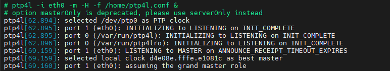

**phc2sys 输出示例**

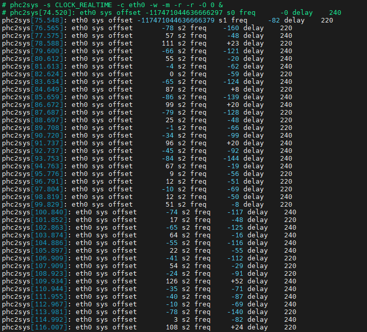

---

## 3. 配置从机（Slave/Ordinary Clock）

从机作为从时钟，需要同步服务器的时间。

### 3.1 启动 ptp4l（同步 PHC）

```bash
# -i 指定网卡, -m 打印日志, -4 UDP协议
# 对于纯从时钟，通常不需要额外参数，ptp4l 会自动协商为 SLAVE
ptp4l -i <interface_name> -m -4
```

> **观察日志**：等待出现 `port 1: SLAVE to MASTER on UNICAST` 或类似字样，表明已锁定主时钟

### 3.2 启动 phc2sys（同步 PHC → System Time）

从机通常需要将网卡的硬件时钟同步到操作系统的系统时间，以便应用程序获取正确时间。

```bash
# -s <interface_name> (源：网卡 PHC)
# -c CLOCK_REALTIME (目标：系统时间)
# -w (等待 ptp4l 进入 SLAVE 状态)
phc2sys -s <interface_name> -c CLOCK_REALTIME -w -m
```

### 3.3 配置示例

**从机端：**

```bash
ptp4l -i eth0 -m -s -H &
phc2sys -s eth0 -c CLOCK_REALTIME -w -m -r -O 0 &
```

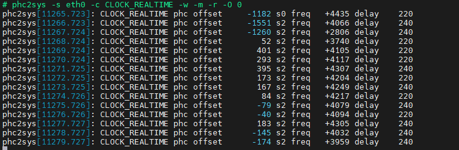

---

## 4. 验证与调试

### 4.1 查看同步状态

使用 pmc (PTP Management Client) 工具查看详细信息：

```bash
# 查看当前时钟状态
# pmc -u -b 0 'GET CURRENT_DATA_SET'
sending: GET CURRENT_DATA_SET
        d4e08e.fffe.104d81-0 seq 0 RESPONSE MANAGEMENT CURRENT_DATA_SET
                stepsRemoved     1
                offsetFromMaster 6.0
                meanPathDelay    3386.0

Steps Removed: 1
表示这台设备距离主时钟（Grandmaster）有 1 跳，也就是它直接从主时钟同步时间，中间没有经过其他从时钟。
Offset From Master: 6.0
表示当前设备的时间比主时钟快了 6 纳秒。这个偏差非常小，说明同步精度很高。
Mean Path Delay: 3386.0
表示主从设备之间的平均网络传输延迟是 3386 纳秒（约 3.4 微秒）。

# 

```

> 关注 **offsetFromMaster**（时间偏移）和 **meanPathDelay**（链路延迟）

或者查看 phc2sys 的输出日志，关注 offset 值：
- 硬件时间戳：稳定在微秒级
- 软件时间戳：稳定在毫秒级

### 4.2 获取时间信息

```bash
# 获取网卡时间
phc_ctl eth0 get

# 获取系统时间
date +%s%N

# phc_ctl eth0 get ; date +%s
phc_ctl[11576.094]: clock time is 1776783654.214753612 or Tue Apr 21 15:00:54 2026

1776783654
```
> 网卡时间和系统时间应该是一样的
---


## 5. 音频同步方案

### 5.1 方案一：软件模拟 PPS 驱动音频同步

#### 5.1.1 方案架构

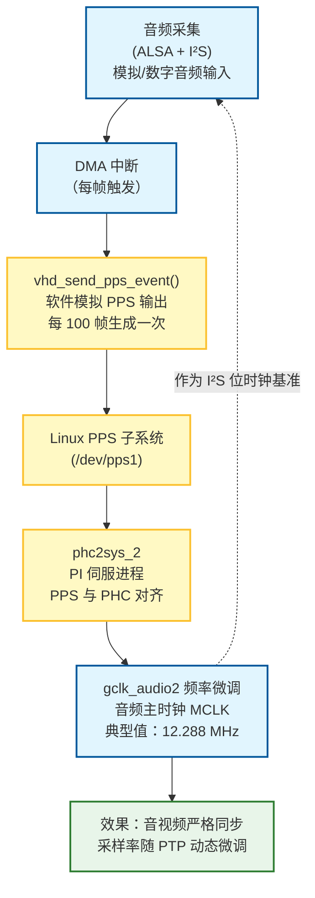

#### 5.1.2 启动命令

```bash
system("ptp4l -i eth0 -m -H -s > /dev/null &");
system("phc2sys -s /dev/ptp0 -r -w  > /dev/null &");
system("phc2sys_2 -c CLOCK_REALTIME -d /dev/pps1 -w -m -E pi -l 7 -P 0.1 -I 0.16 > /dev/null &")
```

**参数说明：**

| 参数 | 含义 |
|------|------|
| `-c CLOCK_REALTIME` | 目标时钟是系统时钟 |
| `-d /dev/pps1` | PPS 源设备 |
| `-w` | 等待同步完成 |
| `-m` | 显示详细信息 |
| `-E pi` | PI 伺服算法 |
| `-l 7` | 日志级别 |
| `-P 0.1` | 比例常数 |
| `-I 0.16` | 积分常数 |

---

#### 5.1.3 ALSA 音频采集

##### 5.1.3.1 查看 DMA 驱动通道

```bash
# 查看 DMA 中断
cat /proc/interrupts | grep dma

# 输出示例：
# 31:        763          0     GIC-0 151 Level     ffe0020000.dma
# 32:          0          0     GIC-0 152 Level     ffe0021000.dma
# 33:          0          0     GIC-0 153 Level     ffe0029000.dma
# 34:          0          0     GIC-0 108 Edge      ffe000b000.gdma
# 35:          0          0     GIC-0 109 Edge      ffe001b000.gdma
# 36:          0          0     GIC-0 110 Edge      ffe001e000.gdma
# 37:     286422          0     GIC-0 111 Edge      ffe001f000.gdma
```

##### 5.1.3.2 注册 PPS 设备

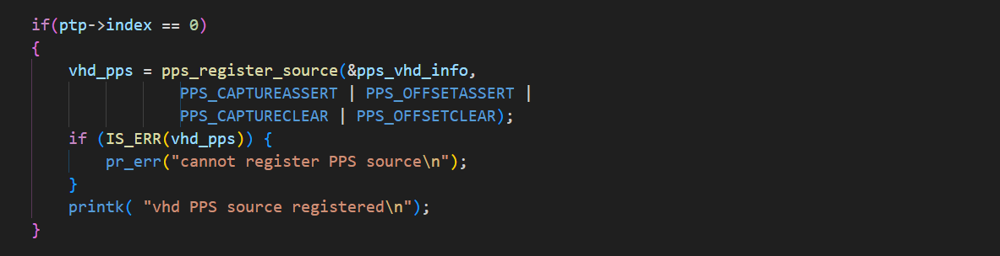

##### 5.1.3.3 模拟 PPS 信号

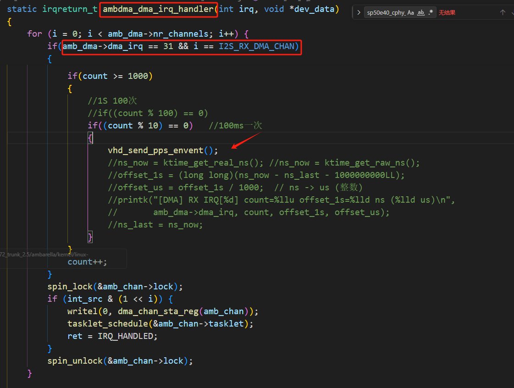

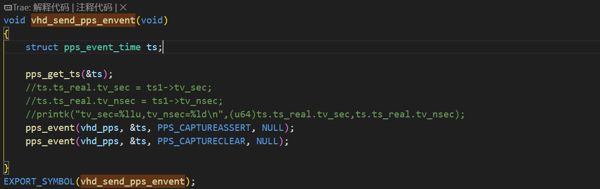


##### 5.1.3.4 phc2sys 修改

基于原生 phc2sys 的 `update_clock` 函数修改，重命名为 `phc2sys_2`。不再调整系统时钟，改为根据 PPS 与 PHC 的偏差计算 MCLK 频率调整量，通过 `/proc/ambarella/clock` 写入 `gclk_audio2`：

```c
static void update_clock(struct domain *domain, struct clock *clock,
			 int64_t offset, uint64_t ts, int64_t delay)
{
	enum servo_state state = SERVO_UNLOCKED;
	double ppb = 0.0;

	if (!clock->servo) {
		clock->servo = servo_add(domain, clock);
		if (!clock->servo)
			return;
	}

	if (clock_handle_leap(domain, clock, offset, ts))
		return;

	offset += get_sync_offset(domain, clock);
    //pr_info("get_sync_offset offset %lld",offset);
	if (domain->free_running)
		goto report;

	if (clock->sanity_check && clockcheck_sample(clock->sanity_check, ts))
		servo_reset(clock->servo);
	ppb = servo_sample(clock->servo, offset, ts, 1.0, &state);
    //pr_info("servo_sample ppb %lf",ppb);
	clock->servo_state = state;

	switch (state) {
	case SERVO_UNLOCKED:
		break;
    case SERVO_LOCKED:
    case SERVO_LOCKED_STABLE:
            int64_t base_freq = 12288000LL;
            static int64_t last_freq = 12288000LL;
            int64_t ppbi = ((int64_t)ppb) / 500 * 500;
            int64_t new_freq = base_freq - base_freq * ppbi / 1000000000L / 4;
            
            pr_info("new_freq  %lld, changed  %lld,  changed from base  %lld",
                new_freq, new_freq - last_freq, new_freq - base_freq);
            if((new_freq - last_freq > 100LL) || (new_freq - last_freq < -100LL))
            {
                new_freq = last_freq;
                s_reset_offset = 1;
                pr_info("new_freq %lld is not possible!new_freq keep",last_freq);
            }
            if(new_freq > 12289000LL)
            {
                new_freq = 12289000LL;
                s_reset_offset = 1;
            }
            if(new_freq < 12287000LL)
            {
                new_freq = 12287000LL;
                s_reset_offset = 1;
            }
            if (new_freq != last_freq)
            {
                char cmd[256];
				//更新音频时钟频率
                snprintf(cmd, sizeof(cmd), "echo gclk_audio2 %llu > /proc/ambarella/clock", new_freq);
                system(cmd);
                last_freq = new_freq;
                s_reset_offset = 1;
            }
        break;
	}

report:
	if (clock->offset_stats) {
		update_clock_stats(clock, domain->stats_max_count, offset, ppb, delay);
	} else {
		if (delay >= 0) {
			pr_info("%s %s offset %9" PRId64 " s%d freq %+7.0f "
				"delay %6" PRId64"\n",
				clock->device, domain->src_clock->source_label,
				offset, state, ppb, delay);
		} else {
			pr_info("%s %s offset %9" PRId64 " s%d freq %+7.0f\n",
				clock->device, domain->src_clock->source_label,
				offset, state, ppb);
		}
	}
	return;

servo_unlock:
	servo_reset(clock->servo);
	clock->servo_state = SERVO_UNLOCKED;
}
```

##### 5.1.3.5 测试 MIC 录音触发中断

**查看声卡**

查看系统声卡设备，当前测试使用的是 ES7210 四通道 ADC：
```bash
arecord -l

# **** List of CAPTURE Hardware Devices ****
# card 0: es7210 [es7210], device 0: ffe001c000.i2s-ES7210 4CH ADC 0 es7210.5-0040-0
# Subdevices: 1/1
# Subdevice #0: subdevice #0
# card 1: es8389 [es8389], device 0: ffe001d000.i2s-ES8389 HiFi es8389.5-0011-0
# Subdevices: 1/1
# Subdevice #0: subdevice #0
# card 2: UAC1Gadget [UAC1_Gadget], device 0: UAC1_PCM [UAC1_PCM]
# Subdevices: 1/1
# Subdevice #0: subdevice #0
```

**录音测试**

使用 es7210 进行录音测试。为模拟 PPS 信号，需要配置每秒 100 次中断（即每秒 100 帧），因此：

- **采样率**：48000 Hz
- **period-time**：10000 µs（10ms）→ 每秒 100 次中断
- **每次中断采样点数**：48000 × 0.01 = 480 采样点

```bash
# 录音测试
arecord -D hw:0,0 -f S16_LE -r 48000 -c 4 test.wav

# 如果需要 1 秒 100 帧，需要设置 period-time=10000，d=5
# d 是录音时间，单位是秒
arecord -D hw:0,0 -f S16_LE -r 48000 -c 4 --period-time=10000 -d 5 /tmp/test.wav

# 无线录制并丢弃（调试使用）
arecord -D hw:0,0 -f S16_LE -r 48000 -c 4 --period-time=10000 /dev/null
```

**查看当前录音配置**

确认配置是否符合预期，尤其是 period_size 是否为 480（即 48000 × 10ms）：

```bash
cat /proc/asound/card0/pcm0c/sub0/hw_params
```

**预期输出示例：**

``` plaintext
access: MMAP_INTERLEAVED
format: S16_LE
subformat: STD
channels: 4
rate: 48000 (48000/1)
period_size: 480
buffer_size: 1920
```

#### 5.1.4 存在问题

- **依赖音频采集**：PPS 信号由 DMA 中断触发，未开启录音时无法产生中断
- **period-time 固定**：必须设置为 10000 µs（10ms），其他值会导致 PPS 信号同步不准确
- **CPU 调度抖动**：软件模拟 PPS 信号受系统调度影响，频率偏差较大（核心问题）

**高负载情况下**

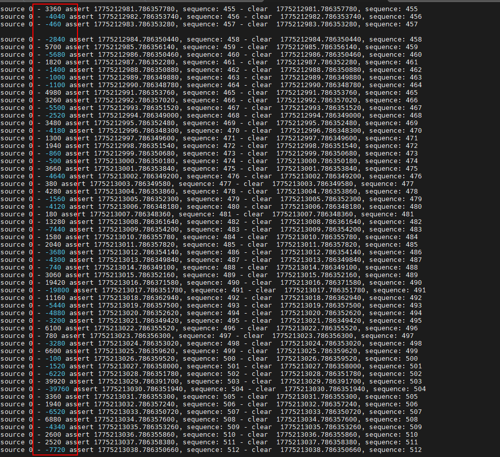

**低负载情况下**

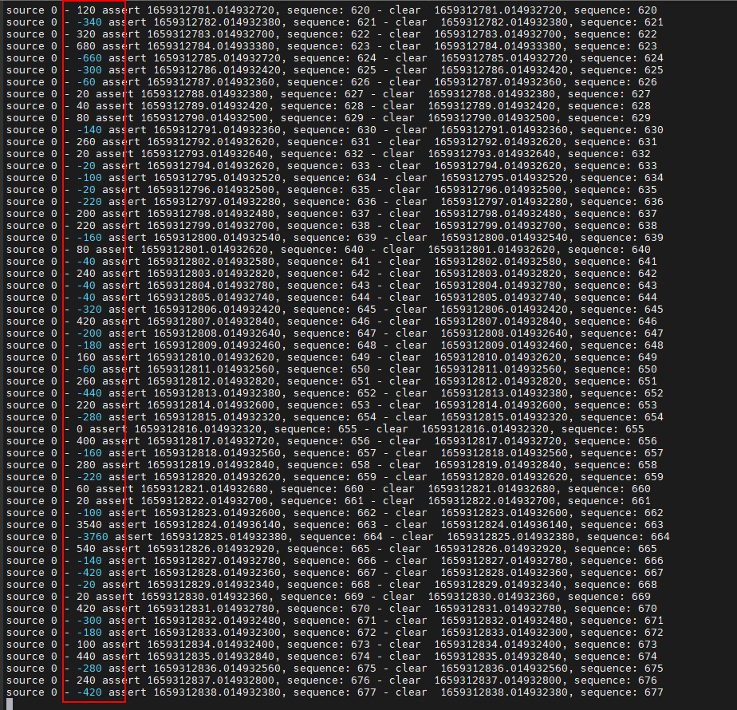

---

### 5.2 方案二：直接利用 PHC 时钟偏移量调整 MCLK

方案一受限于软件模拟 PPS 信号的稳定性。本方案直接在 ptp4l 中读取 PHC 时钟与远端主时钟的频率偏差（adj），经指数移动平均平滑后输出到 MCLK 频率控制，避免了 CPU 调度对 PPS 信号的影响。

> **前提**：系统时钟和 MCLK 时钟同源，温漂趋势一致

#### 5.2.1 修改 ptp4l 代码（clock.c）

基于原生 ptp4l 代码进行修改，在保留原有功能的基础上，利用 PHC 与远端主时钟的 offset 来调整 MCLK 频率。

```c
static int clock_synchronize_locked(struct clock *c, double adj)
{
	if (c->sanity_check) {
		clockcheck_freq(c->sanity_check, clockadj_get_freq(c->clkid));
	}
	if (clockadj_set_freq(c->clkid, -adj)) {
		return -1;
	}
	if (c->clkid == CLOCK_REALTIME) {
		sysclk_set_sync();
	}
	if (c->sanity_check) {
		clockcheck_set_freq(c->sanity_check, -adj);
	}

	/* 写入音频时钟 (与 PTP 同步) */
	/* 只在从模式下执行 */
	if (clock_best_foreign(c)) {
		static FILE *audio_clk_fp = NULL;
		static double smoothed_adj = 0.0;
		static int init = 0;
		double BASE_FREQ = 12288000.0;
		double SMOOTH_FACTOR = 0.1;
		long MAX_FREQ_DIFF = 1000;  /* 最大频率偏差 1000 Hz */

		if (!init) {
			smoothed_adj = adj;
			init = 1;
		} else {
			/* 指数移动平均平滑 */
			smoothed_adj = SMOOTH_FACTOR * adj + (1.0 - SMOOTH_FACTOR) * smoothed_adj;
		}

		/* 计算目标频率: base - (base * adj / 1e9) */
		long target_freq = (long)(BASE_FREQ - BASE_FREQ * smoothed_adj / 1e9);

		/* 限制目标频率不超过 +/-1000 Hz */
		if (target_freq > BASE_FREQ + MAX_FREQ_DIFF) {
			target_freq = BASE_FREQ + MAX_FREQ_DIFF;
		} else if (target_freq < BASE_FREQ - MAX_FREQ_DIFF) {
			target_freq = BASE_FREQ - MAX_FREQ_DIFF;
		}

		if (!audio_clk_fp) {
			audio_clk_fp = fopen("/proc/ambarella/clock", "w");
		}
		if (audio_clk_fp) {
			fprintf(audio_clk_fp, "gclk_audio2 %ld\n", target_freq);
			fflush(audio_clk_fp);
		}

		pr_info("audio clock: raw freq %+7.0f -> smoothed %+7.2f -> set %ld Hz",
			adj, smoothed_adj, target_freq);
	}

	return 0;
}
```

#### 5.2.2 编写音频采样测试程序

通过主从机在相同时间段内采集音频数据，对比实际采样帧数与理论帧数，验证 MCLK 是否同步，并计算时钟偏差（PPM）。

```c
/*
 * ALSA Clock Drift Test Tool
 * 用于测试音频时钟漂移 (晶振偏差)
 */

#include <stdio.h>
#include <stdlib.h>
#include <string.h>
#include <time.h>
#include <alsa/asoundlib.h>
#include <unistd.h>
#include <signal.h>
#include <stdint.h>

/* Clock IDs for monotonic raw */
#ifndef CLOCK_REALTIME
#define CLOCK_REALTIME 4
#endif
#ifndef CLOCK_REALTIME
#define CLOCK_REALTIME 0
#endif
#ifndef CLOCK_MONOTONIC
#define CLOCK_MONOTONIC 1
#endif

/* 配置参数 */
#define SAMPLE_RATE 48000
#define CHANNELS    2
#define BUFFER_SIZE 480          /* 每秒 100 中断，每次 480 采样点 */
#define FORMAT      SND_PCM_FORMAT_S16_LE

/* 全局变量用于中断处理 */
static volatile int running = 1;

static void signal_handler(int sig)
{
    (void)sig;
    printf("\n收到中断信号，正在停止...\n");
    running = 0;
}

int main(int argc, char *argv[])
{
    int err;
    unsigned int rate = SAMPLE_RATE;
    snd_pcm_t *capture_handle = NULL;
    snd_pcm_hw_params_t *hw_params = NULL;
    char *buffer = NULL;
    int buffer_bytes;
    int64_t total_frames = 0;
    int64_t duration = 300; /* 默认录制 300 秒 (5分钟) */
    int64_t loops;
    int64_t progress_step;
    int64_t frames_per_loop;
    int i;

    /* 时间测量 */
    struct timespec start_time, end_time;
    double elapsed_seconds = 0;
    struct tm *tm_now;
    struct tm *tm_start;
    char time_str[64];

    /* 解析命令行参数 */
    if (argc > 1) {
        duration = atoi(argv[1]);
        if (duration <= 0) {
            duration = 300;
        }
    }

    /* 目标时间必须在参数解析后赋值 */
    double target_seconds = (double)duration;

    printf("========================================\n");
    printf("   Linux ALSA Clock Drift Test Tool\n");
    printf("========================================\n");
    printf("采样率: %d Hz\n", rate);
    printf("声道数: %d\n", CHANNELS);
    printf("时长: %ld 秒\n", (long)duration);
    printf("模式: 丢弃数据 (不保存文件)\n");

    /* 记录准备时间 */
    clock_gettime(CLOCK_REALTIME, &start_time);
    time_t prep_sec = start_time.tv_sec;
    long prep_nsec = start_time.tv_nsec;
    struct tm *tm_prep = localtime(&prep_sec);
    strftime(time_str, sizeof(time_str), "%Y-%m-%d %H:%M:%S", tm_prep);
    printf("准备时间: %s.%09ld\n", time_str, prep_nsec);

    /* 注册 Ctrl+C 信号 */
    signal(SIGINT, signal_handler);
    signal(SIGTERM, signal_handler);

    /* 1. 打开 PCM 设备 */ 
    //hw:0,0 es7210
    err = snd_pcm_open(&capture_handle, "hw:0", SND_PCM_STREAM_CAPTURE, 0);
    if (err < 0) {
        printf("无法打开音频设备: %s\n", snd_strerror(err));
        return 1;
    }

    /* 2. 分配硬件参数对象 */
    err = snd_pcm_hw_params_malloc(&hw_params);
    if (err < 0) {
        printf("无法分配硬件参数: %s\n", snd_strerror(err));
        snd_pcm_close(capture_handle);
        return 1;
    }

    /* 3. 初始化硬件参数 */
    err = snd_pcm_hw_params_any(capture_handle, hw_params);
    if (err < 0) {
        printf("无法初始化硬件参数: %s\n", snd_strerror(err));
        goto cleanup;
    }

    /* 4. 设置参数 */
    /* 设置访问方式 (interleaved: 左右声道交错) */
    err = snd_pcm_hw_params_set_access(capture_handle, hw_params, SND_PCM_ACCESS_RW_INTERLEAVED);
    if (err < 0) {
        printf("无法设置访问类型: %s\n", snd_strerror(err));
        goto cleanup;
    }

    /* 设置格式 (16位小端) */
    err = snd_pcm_hw_params_set_format(capture_handle, hw_params, FORMAT);
    if (err < 0) {
        printf("无法设置采样格式: %s\n", snd_strerror(err));
        goto cleanup;
    }

    /* 设置声道数 */
    err = snd_pcm_hw_params_set_channels(capture_handle, hw_params, CHANNELS);
    if (err < 0) {
        printf("无法设置声道数 (%d): %s\n", CHANNELS, snd_strerror(err));
        goto cleanup;
    }

    /* 设置采样率 */
    err = snd_pcm_hw_params_set_rate_near(capture_handle, hw_params, &rate, 0);
    if (err < 0) {
        printf("无法设置采样率: %s\n", snd_strerror(err));
        goto cleanup;
    }
    if (rate != SAMPLE_RATE) {
        printf("警告: 硬件实际采样率为 %d, 非 %d\n", rate, SAMPLE_RATE);
    }

    /* 设置 period size */
    snd_pcm_uframes_t period_size = BUFFER_SIZE;
    err = snd_pcm_hw_params_set_period_size_near(capture_handle, hw_params, &period_size, 0);
    if (err < 0) {
        printf("无法设置period size: %s\n", snd_strerror(err));
        goto cleanup;
    }
    printf("Period size: %lu\n", period_size);

    /* 设置 buffer size */
    snd_pcm_uframes_t buffer_size = period_size * 4;
    err = snd_pcm_hw_params_set_buffer_size_near(capture_handle, hw_params, &buffer_size);
    if (err < 0) {
        printf("无法设置buffer size: %s\n", snd_strerror(err));
        goto cleanup;
    }
    printf("Buffer size: %lu\n", buffer_size);

    /* 5. 应用参数 */
    err = snd_pcm_hw_params(capture_handle, hw_params);
    if (err < 0) {
        printf("无法应用硬件参数: %s\n", snd_strerror(err));
        goto cleanup;
    }

    /* 释放参数内存 */
    snd_pcm_hw_params_free(hw_params);
    hw_params = NULL;

    /* 6. 准备录音 */
    err = snd_pcm_prepare(capture_handle);
    if (err < 0) {
        printf("无法准备音频接口: %s\n", snd_strerror(err));
        goto cleanup;
    }

    /* 7. 分配数据缓冲区 */
    buffer_bytes = BUFFER_SIZE * CHANNELS * 2; /* 2字节 = 16bit */
    buffer = (char *)malloc(buffer_bytes);
    if (!buffer) {
        printf("内存分配失败\n");
        goto cleanup;
    }
    
    /* 记录开始时间 */
    clock_gettime(CLOCK_REALTIME, &start_time);
    tm_start = localtime(&start_time.tv_sec);
    strftime(time_str, sizeof(time_str), "%Y-%m-%d %H:%M:%S", tm_start);
    printf("开始时间: %s.%09ld\n", time_str, start_time.tv_nsec);
    printf("----------------------------------------\n");

    /* 8. 循环读取数据 - 按精确时间停止 */
    frames_per_loop = BUFFER_SIZE;

    /* 预估循环次数（作为进度参考） */
    int64_t expected_loops = (int64_t)rate * duration / frames_per_loop;
    loops = expected_loops;
    progress_step = loops / 10;
    if (progress_step < 1) {
        progress_step = 1;
    }

    for (i = 0; running; i++) {
        /* 读取数据 */
        err = snd_pcm_readi(capture_handle, buffer, BUFFER_SIZE);

        if (err == -EPIPE) {
            /* 溢出/欠载 (Overrun) */
            printf("[错误] 缓冲区溢出 (Overrun)! 系统负载过高。\n");
            snd_pcm_prepare(capture_handle);
            continue;
        } else if (err < 0) {
            printf("[错误] 读取失败: %s\n", snd_strerror(err));
            break;
        }

        /* 累加帧数 */
        total_frames += err;

        /* 读取后检查是否超时，如果超时则扣除最后一帧 */
        clock_gettime(CLOCK_REALTIME, &end_time);
        elapsed_seconds = (end_time.tv_sec - start_time.tv_sec) +
                          (end_time.tv_nsec - start_time.tv_nsec) / 1000000000.0;
        if (elapsed_seconds >= target_seconds) {
            /* 扣除超时的帧数 */
            total_frames -= err;
            break;
        }

        /* 显示进度 (每 10% 打印一次) */
        if (i % progress_step == 0) {
            clock_gettime(CLOCK_REALTIME, &end_time);
            elapsed_seconds = (end_time.tv_sec - start_time.tv_sec) +
                              (end_time.tv_nsec - start_time.tv_nsec) / 1000000000.0;
            tm_now = localtime(&end_time.tv_sec);
            long progress_nsec = end_time.tv_nsec;
            strftime(time_str, sizeof(time_str), "%Y-%m-%d %H:%M:%S", tm_now);
            printf("进度: %ld%% (%lld 样本, %s.%09ld, 间隔%.6f秒)\n",
                   (long)(i * 100 / loops), (long long)total_frames,
                   time_str, progress_nsec, elapsed_seconds);
        }
    }

    /* 记录最终结束时间 */
    clock_gettime(CLOCK_REALTIME, &end_time);
    elapsed_seconds = (end_time.tv_sec - start_time.tv_sec) +
                      (end_time.tv_nsec - start_time.tv_nsec) / 1000000000.0;

    tm_now = localtime(&end_time.tv_sec);
    strftime(time_str, sizeof(time_str), "%Y-%m-%d %H:%M:%S", tm_now);

    /* 9. 清理 */
    snd_pcm_drop(capture_handle);
    snd_pcm_close(capture_handle);
    capture_handle = NULL;
    free(buffer);
    buffer = NULL;

    /* 10. 输出结果 */
    /* 理论帧数 = 实际经过时间 × 采样率 */
    int64_t theoretical_frames = (int64_t)(elapsed_seconds * rate);

    printf("\n========================================\n");
    printf("           测试结果统计\n");
    printf("========================================\n");
    printf("结束时间: %s.%09ld\n", time_str, end_time.tv_nsec);
    printf("实际时长: %.6f 秒\n", elapsed_seconds);

    printf("理论帧数 (Frames): %lld\n", (long long)theoretical_frames);
    printf("实际帧数 (Frames): %lld\n", (long long)total_frames);

    int64_t diff = total_frames - theoretical_frames;
    printf("样本偏差 (Samples): %lld\n", (long long)diff);

    /* 计算 PPM */
    if (theoretical_frames > 0) {
        double ppm = ((double)diff / (double)theoretical_frames) * 1000000.0;
        printf("时钟偏差 (PPM): %.2f\n", ppm);

        if (diff == 0) {
            printf("评价: 完美 (误差 < 1个采样点)\n");
        } else if (diff > 0) {
            printf("评价: 晶振偏快 (录多了)\n");
        } else {
            printf("评价: 晶振偏慢 (录少了)\n");
        }
    }
    printf("========================================\n");

    return 0;

cleanup:
    if (hw_params) {
        snd_pcm_hw_params_free(hw_params);
    }
    if (capture_handle) {
        snd_pcm_close(capture_handle);
    }
    if (buffer) {
        free(buffer);
    }
    return 1;
}
```


#### 5.2.3 测试结果

| 测试   | 结果截图                                     |
| ------ | -------------------------------------------- |
| 测试 1 | 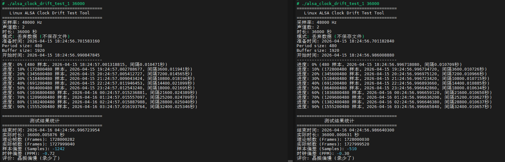          |
| 测试 2 | 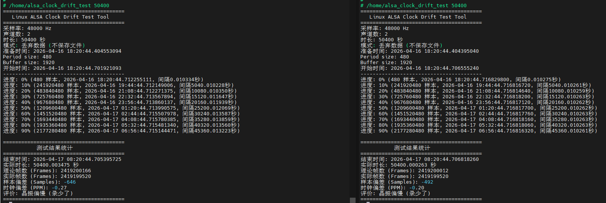          |

### 5.3 音频同步效果

使用示波器抓取两台设备的 MCLK 波形，确认两者保持同步（视觉上相对静止）。

<video controls="controls" width="500" height="300">
    <source src="/docs/cv72/video/audio_ptp.mp4" type="video/mp4">
</video>

## 6. 视频同步方案

### 6.1 方案原理

通过 PTP 协议将两台设备的系统时钟同步到同一参考时钟，Sensor 工作在从模式，根据 SoC 发出的 FSIN 脉冲信号触发出帧。

- **频率同步**：系统时钟经 PTP 同步后，两台设备的视频帧频率一致
- **相位同步**：通过高精度定时器（hrtimer）周期性发出 FSIN 信号，并确保 FSIN 周期能被目标帧率整除，实现多台从机相位对齐

### 6.2 方案实现

使用高精度定时器周期性发出 FSIN 信号，确保 FSIN 周期能被目标帧率整除，从而实现多台设备的视频帧相位同步。

```c
u64 get_sync_ptp_time_wait(void)
{
    // 获取当前系统时间（纳秒）
    u64 now = ktime_get_real_ns();
    // 计算到下一个周期边界的等待时间
    // 公式：target_interval_ns - (当前时间 % 周期)
    // 结果：当前时间距离下一个完整周期的时间差
	//例如4K30视频每帧33.33ms，FSIN需要与33ms周期对齐 
    return target_interval_ns - (now % target_interval_ns);
}

static enum hrtimer_restart  hrtimer_test_timer_poll(struct hrtimer *timer)
{
	ktime_t next_interval;
    
    switch (current_state) {
		case AJUST_PTPTIME_STATE://调整到和系统时间同步，同步依据是能被（目标周期）整除，因为ptp不断调整，系统时间也不断调整
			s_diff_ptptime = get_sync_ptp_time_wait();
			next_interval = ktime_set(0,s_diff_ptptime);
			current_state = LOW_STATE;
			break;

		case LOW_STATE:
			gpio_set_value(GPIO_PIN, 1);
			current_state = HIGH_STATE;
			next_interval = ktime_set(0, 1000000); // 1ms 高电平脉冲
			break;
			
		case HIGH_STATE:
			gpio_set_value(GPIO_PIN, 0);
			current_state = AJUST_PTPTIME_STATE;
			#ifdef DEBUG
			{
				u64 now = ktime_get_real_ns();
				static u64 last_frame_time = 0;
				if (last_frame_time > 0) {
					u64 period_ns = now - last_frame_time;
					// 每100帧打印一次统计
					static int frame_count = 0;
					frame_count++;
					if (frame_count >= 100) {
						u64 period_ns = now - last_frame_time;
						long diff_ns = (long)period_ns - (long)target_interval_ns;
						// printk 每100帧打印一次帧率统计
						printk("FSIN: period=%llu.%03llu ms diff=%ld ns",
							period_ns / 1000000, (period_ns % 1000000) / 1000, diff_ns);
						frame_count = 0;
					}
					// 每帧都打印周期
					// printk("FSIN frame: %llu ns, FPS: %llu\n", period_ns, fps);
				}
				last_frame_time = now;
			}
			#endif
			// 使用精确半周期减去LOW_STATE的1ms，确保总周期准确
			// 如果是30帧，若不对齐ptp此处设置为27、此处设小预留时间给ptp对齐
			next_interval = ktime_set(0, target_interval_ns / 2 - 1000000);
			break;
    }

    hrtimer_forward_now(timer, next_interval);
    return HRTIMER_RESTART;
}

```
### 6.3 Sensor 从机出帧现象

MIPI 数据跟随 FSIN 信号输出，验证帧同步效果：


### 6.4 应用层启动

应用层通过visca启动视频同步应用：

```bash
int net_visca_switch_ptp_func(unsigned char *command, ptz_return_content_s * p_content)
{
 	unsigned char val = command[3];
    visca_info("val:%d",val);
	if(val==0){
		system("killall ptp4l;killall phc2sys");
        //切成主模式
        if(1){
            system("echo s > /dev/hrtimer_test");
            system("test_vin -w 0x0100 -d 0x00");
            system("test_vin -w 0x3002 -d 0x08");
            system("test_vin -w 0x3008 -d 0x00");
            system("test_vin -w 0x382e -d 0x41");
            system("test_vin -w 0x368d -d 0x10");
            system("test_vin -w 0x3844 -d 0x00");
            system("test_vin -w 0x385c -d 0x00");
            system("test_vin -w 0x385d -d 0x02");
            system("test_vin -w 0x385e -d 0x00");
            system("test_vin -w 0x385f -d 0x01");
            system("test_vin -w 0x3863 -d 0x00");
            system("test_vin -w 0x3864 -d 0x04");
            system("test_vin -w 0x0100 -d 0x01");
        }
	}else{
		system("ptp4l -i eth0 -m -H -s > /dev/null &");
		system("phc2sys -s /dev/ptp0  -r -w  > /dev/null &");
        if(1){  
            //先发脉冲，然后再切从模式，目前还是默认30fps，后面再根据需要调整
            system("echo 1 > /dev/hrtimer_test"); 
            system("test_vin -w 0x0100 -d 0x00");
            system("test_vin -w 0x3002 -d 0x00");
            system("test_vin -w 0x3008 -d 0x00");
            system("test_vin -w 0x3009 -d 0x00");
            system("test_vin -w 0x3865 -d 0x60");
            system("test_vin -w 0x382a -d 0xbb");
            system("test_vin -w 0x3834 -d 0x14");
            system("test_vin -w 0x3843 -d 0x00");
            system("test_vin -w 0x3835 -d 0x00");
            system("test_vin -w 0x3836 -d 0x10");
            system("test_vin -w 0x0100 -d 0x01");
        }
	}

    return EXECUTE_COMPLETE;
}
```

### 6.5 方案缺陷

高精度定时器仍受 CPU 调度影响。测试结果显示：33ms 视频帧周期下，CPU 高负载时 FSIN 信号的相位同步最大误差约 0.1ms。


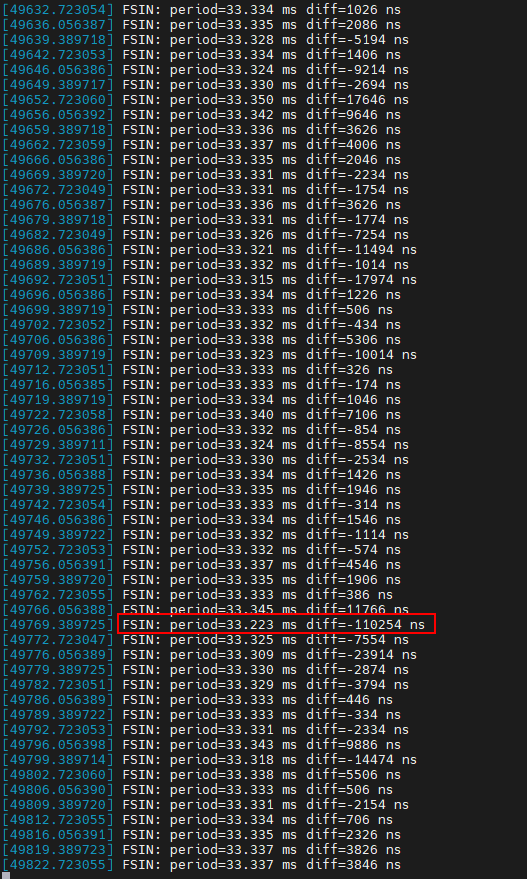

## 7. 常用调试方法

### 7.1 PPS 信号质量测试

```bash
ppstest /dev/pps1
```

### 7.2 中断绑核

将 PTP 相关中断绑定到指定 CPU 核心，减少调度延迟：

```bash
echo 1 > /proc/irq/31/smp_affinity_list
```

### 7.3 提高进程优先级

将 ptp4l / phc2sys 进程的 nice 值调至最高，减少 CPU 竞争：

```bash
renice -n -20 -p 1894
```

### 7.4 查看进程优先级

```bash
ps -eo pid,nice,comm | grep 1894
```


## 附录：命令速查表

| 用途 | 命令 |
|------|------|
| 检查网卡 PTP 支持 | `ethtool -T eth0` |
| 查看 PTP 设备 | `ls /sys/class/ptp/` |
| 获取网卡时间 | `phc_ctl eth0 get` |
| 获取系统时间 | `date +%s%N` |
| 查看同步状态 | `pmc -u -b 0 'GET CURRENT_DATA_SET'` |
| 查看 DMA 中断 | `cat /proc/interrupts \| grep dma` |
| 查看声卡 | `arecord -l` |
| 查看录音配置 | `cat /proc/asound/card0/pcm0c/sub0/hw_params` |
| 检测网络延时 | `traceroute <IP>` |
