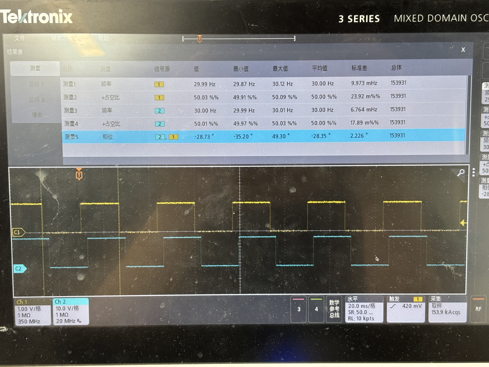
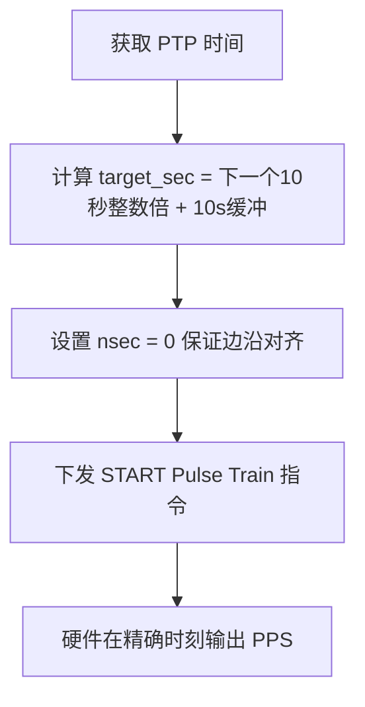
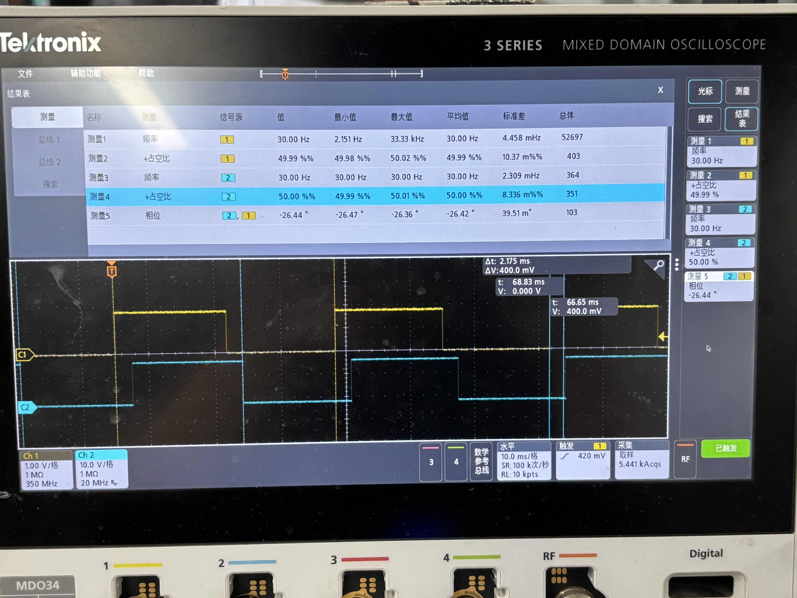
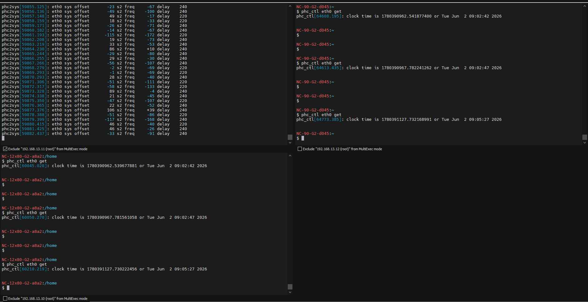
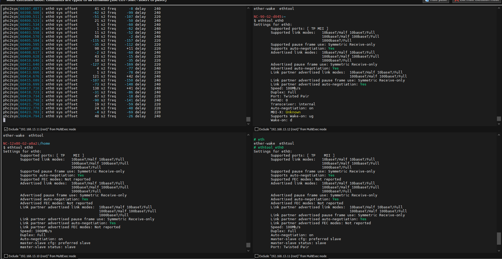

# PTP 软件 PPS 输出方案

## 1. 问题概述

多从机 PPS 信号之间存在约 28° 相位误差。

**相位误差换算：**

| 频率 | 时间偏差 |
| :--- | :--- |
| @ 1 Hz | 28° / 360° × 1s ≈ 78 µs |
| **@ 30 Hz** | 28° / 360° × (1/30)s ≈ **2.6 ms** |



---

## 2. 问题原因分析

### 2.1 原因一：启动时未做相位同步

**问题描述：**

启动 PTP 网卡输出 PPS 时，没有进行相位同步，导致初始相位存在偏差。

**问题分析：**

PHC 计数器溢出产生 PPS 的时刻由 MAC_PPS0_Target_Time 决定。如果不主动对齐，PPS 触发时刻就是随机的，导致多机 PPS 相位不一致。

要让多机 PPS 在示波器上完全重合，必须让各机约定在一个精确的"绝对时刻"起跑。

---

#### 硬件寄存器原理

| 寄存器 | 地址偏移 | 功能 |
| :--- | :---: | :--- |
| MAC_PPS0_Target_Time_Seconds | 0xb80 | 目标时间（秒） |
| MAC_PPS0_Target_Time_Nanoseconds | 0xb84 | 目标时间（纳秒） |
| MAC_PPS_Control | 0xb70 | PPS 控制寄存器 |

**手册原文：**

> **出处：** Ambarella CV72 Datasheet, Section 13.3.1.75 / 13.3.1.76
>
> "This register stores the time in (signed) nanoseconds. When the value of the timestamp matches the value in both Target Timestamp registers, the MAC starts or stops the PPS signal output..."
>
> (翻译：该寄存器存储纳秒级时间。当时间戳的值与这两个目标时间戳寄存器中的值匹配时，MAC 开始或停止 PPS 信号输出。)

---

> **出处：** Ambarella CV72 Datasheet, Section 13.3.1.74
>
> "Target Time registers are programmed only for starting or stopping the PPS0 output signal generation."
>
> (翻译：目标时间寄存器专门用于启动或停止 PPS0 输出信号的生成。)

---

> **出处：** Ambarella CV72 Datasheet, Section 13.3.1.74
>
> "This command generates the train of pulses rising at the start point defined in the Target Time Registers..."
>
> (翻译：此命令生成脉冲列，其上升沿在 Target Time 寄存器定义的起始点触发。)

**结论：**

- 向 0xb70 寄存器下发 `0010 (START Pulse Train)` 指令后，硬件会在精确时刻打出第一个脉冲
- 0xb84 寄存器用于设置"初始相位"

---

#### 修改方案（绝对时间对齐）

**流程图：**



**代码实现：**

```c
// 1. 获取当前 PTP 时间
clockid_t clkid = FD_TO_CLOCKID(fd);
struct timespec ts;
if (clock_gettime(clkid, &ts) == -1) {
    perror("clock_gettime failed");
    close(fd);
    return -1;
}

// 2. 配置 Periodic Output (PPS) 请求
struct ptp_perout_request perout_req;
memset(&perout_req, 0, sizeof(perout_req));
perout_req.index = 0; // 对应硬件上的 MAC_PPS0

// 3. 绝对时间对齐
uint64_t align_sec = 10;
uint64_t target_sec = ((ts.tv_sec / align_sec) + 1) * align_sec + 10;
perout_req.start.sec = target_sec;
perout_req.start.nsec = 0;  // 纳秒必须为 0
```

**验证是否写入：**

```bash
# 读取纳秒寄存器
devmem 0xFFE000EB84

# 读取秒寄存器
devmem 0xFFE000EB80
```

**核心要点：**

| 要点 | 说明 |
| :--- | :--- |
| `align_sec = 10` | 对齐到 10 秒整数倍，便于多机同步 |
| `target_sec += 10` | 多加 10 秒缓冲，确保来得及配置 |
| `nsec = 0` | 纳秒必须为 0，保证边沿对齐 |

---

### 2.2 原因二：千兆/百兆混用

烤机后发现多从机相位差达 2.175 ms，进一步定位发现 PHC 时间本身就存在偏差。



**问题定位过程：**

1. 用 MultiExec 同时在两台机器执行 `phc_ctl eth0 get`，读取最原始的 PHC 硬件时间
2. 做减法（右侧 - 左侧）：

```bash
第一次：0.002199519 秒 (2.2 ms)
第二次：0.000680204 秒 (0.68 ms)
第三次：0.001946535 秒 (1.94 ms)
```

💡 结论：与示波器测量的 2.175 ms 相位偏差吻合，问题根源在于 PHC 时间本身存在偏差。



#### 最终定位：网络链路速率不一致



| 机器 | 链路速率 | 状态 |
| :--- | :---: | :--- |
| NC-12x80... | 1000Mb/s | 正常 |
| NC-90-G2... | 100Mb/s | ⚠️ 降级了 |
| 其他机器 | 100Mb/s | ⚠️ 降级了 |

**为什么链路速度不一致对 PTP 是毁灭性的：**

1. **序列化延迟暴增**：100M 网卡发送相同数据包的时间是 1000M 网卡的 10 倍，导致纳秒级时间戳产生巨大物理误差。

2. **交换机非对称缓冲**：千兆发往百兆时交换机需要排队缓存，百兆发往千兆则畅通无阻，导致延迟不对称。

**后果：** PTP 算法假设网络收发延迟对称，一旦混用则计算的时间补偿值完全错误，从板累积出毫秒级偏差。

---

## 3. 排查步骤

| 步骤 | 操作 | 预期结果 |
| :--- | :--- | :--- |
| 1 | 检查网卡链路速率 | 所有设备应为 1000Mb/s |
| 2 | 检查 PHC 时间偏差 | 多机偏差 < 1 µs |
| 3 | 等待 phc2sys 锁定 | s2 freq 稳定 < 100 ppb |
| 4 | 用示波器测量 PPS 对齐度 | 多机 PPS 边沿对齐 < 200 ns |

---

## 4. 关键注意事项

1. ⚠️ 所有设备网卡链路速率必须一致（推荐全 1000Mb/s）
2. ⚠️ 等待 phc2sys 完全锁定后再输出 PPS
3. ⚠️ 使用绝对时间对齐确保 PPS 触发时刻精确
4. ⚠️ 定期检查 PHC 时间偏差
