## HI3559平台uboot源码分析以及DDR配置

### 0.基本内存常识
#### 0.1 eMMC和DDR在嵌入式系统中的核心区别如下

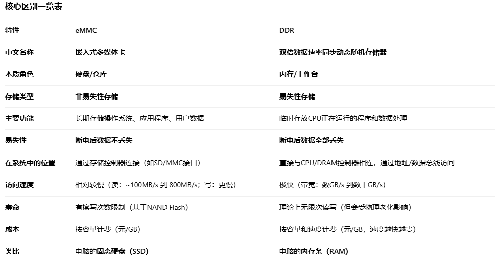

**详细解释**

1. 角色和功能：仓库 vs. 工作台
这是理解两者区别最关键的一点。

- ​eMMC 是“仓库”​​：

    - 它的作用是长期、稳定地存储大量数据。比如：

      - 嵌入式设备的操作系统（如Android、Linux）

      - 应用程序代码

      - 用户保存的文档、图片、设置文件

     - 只有当系统需要运行某个程序或读取某个文件时，才会将数据从eMMC这个“仓库”里搬出来。

- ​DDR 是“工作台”​​：

  - 它的作用是为CPU（中央处理器）提供临时的工作空间。CPU所有正在进行的计算和任务，都需要在DDR这个“工作台”上完成。

  - 当你要打开一个软件时，这个软件的代码和数据会从eMMC“仓库”被加载到DDR“工作台”上，然后CPU才能在DDR里快速执行它。

  - “工作台”（DDR）越大（容量大）、物流越快（速率高），CPU就能同时、快速地处理更多任务。

2. 易失性：断电后数据是否保存
- ​eMMC（非易失性）​​：就像笔记本，写下的内容会一直保存，即使关机。所以它能用来存储需要长期保留的东西。


- ​DDR（易失性）​​：就像黑板，写字、擦除非常快，适合临时演算，但一旦断电（擦黑板），上面的所有内容就都消失了。这就是为什么电脑关机再开机后，之前打开的程序都没了。

3. 速度和延迟：为什么需要DDR？
- ​eMMC速度慢​：虽然比传统的机械硬盘快，但相比CPU的处理速度，eMMC仍然太慢了。如果CPU直接去eMMC里读取数据，会花费大量时间等待，形成性能瓶颈。这就像厨师每次需要一颗菜都要跑回遥远的仓库去取，效率极低。

- DDR速度极快​：DDR的设计目标就是尽可能接近CPU的速度。它将最常用、最急需的数据放在CPU身边，让CPU能够以“思考”的速度进行访问，从而充分发挥其性能。这就像厨师身边有一个备菜台（DDR），上面放着马上要用的食材。

4. 在系统启动过程中的协作流程
它们的协作关系在设备启动时体现得淋漓尽致：

- ​上电​：设备通电。

- ​BootROM​：CPU内部一小块固件从eMMC的特定位置读取引导程序​ 到DDR中并执行。

- ​加载内核​：引导程序将庞大的操作系统内核​ 从eMMC加载到DDR中。

- ​系统运行​：内核在DDR中启动，并继续从eMMC加载各种系统服务和应用程序到DDR中运行。

- ​用户操作​：你打开一个App，这个App的代码同样从eMMC被加载到DDR，然后CPU在DDR中执行它。

​简单总结​：​eMMC决定了你的设备能“存储”多少东西，而DDR决定了你的设备能“同时流畅地运行”多少东西。​​

**一个简单的类比**
把嵌入式系统想象成一个**图书馆**​：

- ​eMMC​ 是图书馆的书库，里面存放着所有的书籍（数据）。书库很大，但找书、取书需要时间。

- ​DDR​ 是图书馆的阅览桌。读者（CPU）会把要看的几本书从书库拿到阅览桌上阅读。阅览桌大小有限，但阅读速度极快。

- ​CPU​ 是读者，他只能在阅览桌（DDR）上看书。

如果读者每次查一个单词都要跑回书库（eMMC）去翻书，效率会极低。而把可能用到的书都放在手边的阅览桌（DDR）上，查阅速度就快多了。阅览桌越大（DDR容量大），能同时摊开的书就越多，读者工作效率就越高。

---

#### 0.2 MMZ内存和OS内存的区别

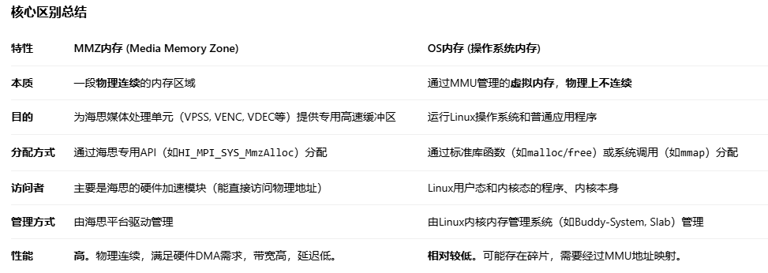

1. MMZ内存 (Media Memory Zone)
MMZ是海思平台中一个非常关键的概念。它的设计初衷是为了解决媒体数据处理的性能瓶颈。

- ​为什么需要MMZ？​​
海思芯片的强大之处在于其集成了大量的硬件加速模块（如编码器、解码器、图像处理单元VPSS等）。这些模块通常通过DMA（直接内存访问）​​ 方式与内存交换数据，而不需要CPU参与。为了高效工作，**DMA要求其操作的内存缓冲区在物理地址上是连续的**。普通的OS内存由于经过MMU（内存管理单元）的虚拟化，应用程序看到的是虚拟地址，其对应的物理地址很可能是碎片化的，无法满足DMA的要求。
 
- ​工作原理​
在系统启动时，通过内核启动参数（如mmz=）或驱动配置，从整个DDR内存中划出一大块物理连续的内存区域专门给MMZ使用。这块内存由海思的驱动单独管理。

  - ​分配​：媒体应用程序调用海思的API（如HI_MPI_SYS_MmzAlloc）从MMZ池中分配物理连续的内存块。

  - ​使用​：将分配得到的MMZ内存地址（通常是物理地址或驱动映射后的虚拟地址）配置给硬件编解码器等模块使用。模块通过DMA高效地读写数据。

  - ​释放​：使用完毕后，调用对应的API释放内存回MMZ池。

- ​典型应用场景​
存储视频帧（如YUV数据）、码流数据（H.264/H.265码流）、AI模型的输入/输出数据等任何需要硬件加速模块处理的数据缓冲区。
2. OS内存 (操作系统内存)
这就是我们通常理解的，由Linux操作系统管理的内存。
- ​工作原理​
Linux内核通过MMU为每个进程提供一个独立的、统一的虚拟地址空间。应用程序使用malloc()等函数申请内存时，获得的是虚拟地址。内核的内存管理系统负责将虚拟地址映射到物理页上。**这些物理页很可能是分散的、不连续的**。

- ​典型应用场景​
运行应用程序的代码、栈、堆，分配一些不需要硬件模块直接访问的普通数据缓冲区。

这是VX720的内存配置：

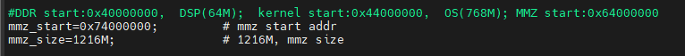

| 区域类型   | 起始地址   | 结束地址   | 大小     | 用途说明              |
|------------|------------|------------|----------|-----------------------|
| DDR    | 0x40000000 | 0xBFFFFFFF | 2048M    | 总内存空间            |
| DSP        | 0x40000000 | 0x43FFFFFF | 64M      | 数字信号处理          |
| Kernel     | 0x44000000 | 0x73FFFFFF | 768M     | 操作系统内核          |
| MMZ        | 0x74000000 | 0xBFFFFFFF | 1216M    | 多媒体缓冲区          |
---

#### 0.3 DDR带宽和DDR占用率

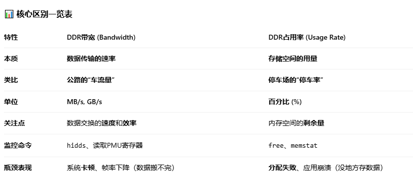

1. DDR带宽 (Bandwidth)
- ​是什么​：单位时间内通过DDR总线的数据量。**它衡量的是数据流动的速度**。
- ​为什么重要​：芯片的各个主控（CPU、VPSS、VENC、VDE、IVE等）都需要通过DDR总线访问内存。如果带宽达到瓶颈，就意味着数据“堵车”了，各个模块需要排队等待访问内存，导致整体性能下降。
- ​如何监控​：使用海思工具 ​hidds。或通过 himm命令读取 ​DDRC（DDR控制器）的性能计数器寄存器。
- ​典型场景​：
同时进行多路4K编码、解码和AI分析时，数据吞吐量极大，容易造成带宽瓶颈。
症状：视频流卡顿，但查看内存容量却还很充足。

2. DDR占用率 (Usage Rate)
​是什么​：已分配的DDR内存容量占总容量的比例。**它衡量的是存储空间的消耗**。
​为什么重要​：如果占用率接近100%，意味着内存即将耗尽，新的应用程序或媒体缓冲区将无法分配，导致系统错误。
​如何监控​：


*​OS内存占用率​：使用 free命令。看 MemAvailable与 MemTotal的比值。*
*​MMZ内存占用率​：使用  cat /proc/umap/media-mem查看。看 Used与 Total的比值。*

**​典型场景​：**
设置了过大的视频缓存池（vb_pool）。
内存泄漏，分配的内存未释放。
症状：程序报错分配内存失败，但系统可能并不卡顿。

```c
~ # hiddrs -h
*** Board tools : ver0.0.1_20121120 ***
[debug]: {source/utils/cmdshell.c:171}cmdstr:hiddrs
NAME
  ddrs - ddr statistic

DESCRIPTION
  Statistic percentage of occupation of ddr.

  -d, --ddrc
      which ddrc you want statistic. "0" statistic ddrc0,
      "1" statistic ddrc1,  "2" statistic ddrc2, "3" statistic ddrc3,"4" statistic ddrc0-3 at the same time. "0" as default.
  -f, --freq
      one ddrc freq, one chip, please set the freq referring to the chip.
      "667" as default.
  -w, --width
      set the single channel's bit-width referring to the chip. "32" or "16".
      "32" as default.
  -i, --interval
      the range is 1~3 second, 1 second as default.
  -h, --help
      display this help and exit
  eg:
      $ hiddrs -d 0 -f 667 -i 1
      or
      $ hiddrs

do errro
[END]

```
**使用例子**
```c

~ # hiddrs -d 0 -f 2664 -w 32 -i 1
*** Board tools : ver0.0.1_20121120 ***
[debug]: {source/utils/cmdshell.c:171}cmdstr:hiddrs
===== ddr statistic =====
ddrc0[0.03%]
ddrc0[2.07%]
ddrc0[6.88%]
ddrc0[11.67%]
ddrc0[16.47%]
ddrc0[19.23%]
ddrc0[4.78%]
ddrc0[9.57%]
ddrc0[14.38%]
ddrc0[19.18%]
ddrc0[19.23%]
ddrc0[4.81%]
ddrc0[9.59%]
ddrc0[14.38%]
ddrc0[19.21%]
ddrc0[19.24%]
ddrc0[4.79%]
ddrc0[9.61%]
ddrc0[14.40%]
ddrc0[19.19%]
ddrc0[19.23%]
ddrc0[4.78%]
ddrc0[9.57%]
ddrc0[14.39%]
ddrc0[19.17%]
ddrc0[19.23%]


```

---

### 1、uboot配置及编译

```c
目录结构：
osdrv目录结构说明：
osdrv
├─Makefile -------------------------------------- osdrv目录编译脚本
├─tools ----------------------------------------- 存放各种工具的目录
│  ├─board -------------------------------------- 各种单板上使用工具
│  │  ├─reg-tools-1.0.0 ------------------------- 寄存器读写工具
│  │  ├─udev-167 -------------------------------- udev工具集
│  │  ├─mtd-utils ------------------------------- flash裸读写工具集
│  │  ├─gdb ------------------------------------- gdb工具
│  │  └─e2fsprogs ------------------------------- mkfs工具集
│  └─pc ----------------------------------------- 各种pc上使用工具
│      ├─jffs2_tool------------------------------ jffs2文件系统制作工具
│      ├─cramfs_tool ---------------------------- cramfs文件系统制作工具
│      ├─squashfs4.3 ---------------------------- squashfs文件系统制作工具
│      ├─mkimage_tool --------------------------- uImage制作工具
│      ├─nand_production ------------------------ nand量产工具
│      ├─lzma_tool ------------------------------ lzma压缩工具
│      ├─zlib ----------------------------------- zlib工具
│      ├─mkyaffs2image -- ----------------------- yaffs2文件系统制作工具
│      └─uboot_tools ---------------------------- uboot表格xls文件
├─pub ------------------------------------------- 存放各种镜像的目录
│  ├─xxx_image_glibc_xxx ------------------------ 基于himix100工具链编译，可供FLASH烧写的映像文件，包括uboot、内核、文件系统
│  ├─bin ---------------------------------------- 各种未放入根文件系统的工具
│  │  ├─pc -------------------------------------- 在pc上执行的工具
│  │  └─board_glibc_xxx ------------------------- 基于himix100工具链编译，在单板上执行的工具
│  └─xxx_rootfs_glibc_xxx.tgz ------------------- 基于himix100工具链编译的根文件系统
├─platform--------------------------------------- 存放各种开源源码目录
│  ├─liteos_a53 --------------------------------- 存放a53 liteos的目录
│  └─liteos_m7 ---------------------------------- 存放m7 liteos的目录
├─components------------------------------------- 存放各种开源源码目录
│  ├─ipcm --------------------------------------- 存放ipcm组件源代码的目录
│  └─pcie_mcc ----------------------------------- 存放pcie从启动驱动源代码的目录
├─opensource------------------------------------- 存放各种开源源码目录
│  ├─busybox ------------------------------------ 存放busybox源代码的目录
│  ├─uboot -------------------------------------- 存放uboot源代码的目录
│  └─kernel ------------------------------------- 存放kernel源代码的目录
└─rootfs_scripts -------------------------------- 存放根文件系统制作脚本的目录


osdrv内存配置说明
内存配置脚本为osdrv_mem_cfg.sh，此脚本会在osdrv/Makefile中调用。用户可直接修改此脚本中一些配置项。可修改的配置如下：
（以下配置都为十六进制，前缀0x。给出的一些默认配置项是通过其它配置项计算得出，用户可不必配置）
DDR_MEM_BASE 芯片DDR起始地址
DSP_MEM_SIZE DSP核预留空间
LINUX_SYS_MEM_BASE  Linux系统起始地址

LITEOS_DDR_MEM_BASE LiteOS中DDR起始地址，一般为芯片DDR起始地址
LITEOS_DDR_MEM_SIZE LiteOS中DDR实际大小，一般按物理内存大小作配置
LITEOS_SYS_MEM_BASE LiteOS系统起始地址
LITEOS_TEXT_OFFSET  LiteOS系统起始地址与启动地址的偏移空间，此空间作为LiteOS页表配置区间
LITEOS_SYS_MEM_SIZE LiteOS系统使用空间大小

LINUX_MEM_SIZE      Linux系统使用空间大小
LITEOS_MMZ_MEM_BASE LiteOS的MMZ起始地址
LITEOS_MMZ_MEM_LEN  LiteOS的MMZ使用空间大小


代码路径：
kernel:
ssh://git@192.168.1.204:33/hisilicon/hi3559/chip_sdk/hi3559av100r001c02spc040_vhd/hi3559av100_sdk_v2.0.4.0.git 
https://192.168.1.201/svn/J1200/Document/Hisi/Hi3559AV100R001C02SPC040 

uboot:
ssh://git@192.168.1.204:33/hisilicon/hi3559/chip_sdk/hi3559av100r001c02spc031cp0002.git

vhd_sdk:
ssh://git@192.168.1.204:33/hisilicon/hi3559/vhd_sdk/vx730.git 
```

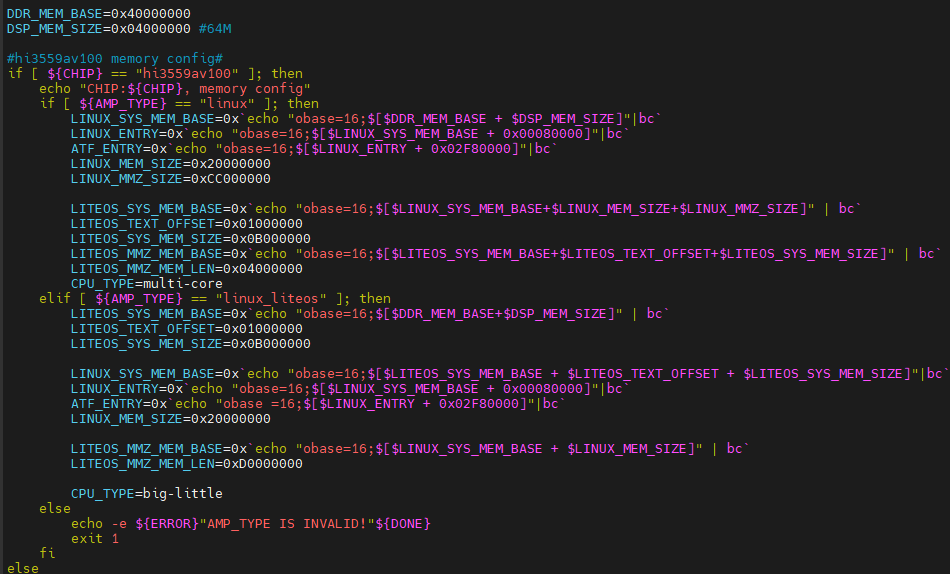

### 1.1 编译选择
```c
路径：/hi3559av100r001c02spc031cp0002/Hi3559AV100_SDK_V2.0.3.1CP0002/osdrv/tools/pc/uboot_tools
```
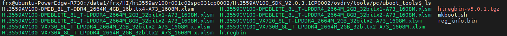
```c

编译路径：/hi3559av100r001c02spc031cp0002/Hi3559AV100_SDK_V2.0.3.1CP0002/osdrv
编译uboot指令：make BOOT_MEDIA=emmc AMP_TYPE=linux hiboot
编译完整镜像：make BOOT_MEDIA=emmc AMP_TYPE=linux all
```
    编译结果输出：/Hi3559AV100_SDK_V2.0.3.1CP0002/osdrv/pub/emmc_image_glibc_multi-core_arm64

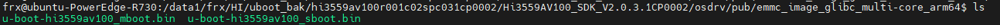

---
### 1.2 Makefile分析
选择对应的DDR配置表
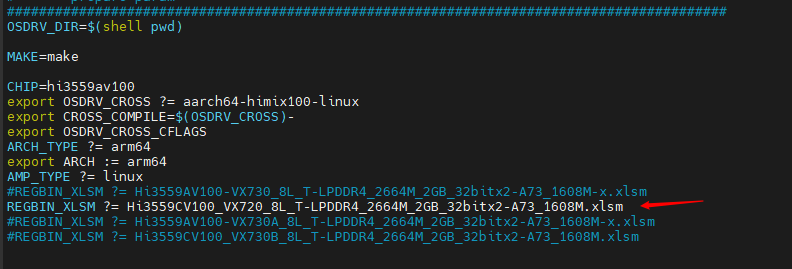

---

### 1.3 DDR配置表修改
**一些关键的时序参数：**

- **tCL (CAS Latency)​: 列地址选通延迟，从发出读命令到数据输出的时间。**
- **​tRCD (RAS to CAS Delay)​: 行地址到列地址的延迟，激活命令到读/写命令的时间。**
- **​tRP (Row Precharge Time)​: 行预充电时间，预充电命令到下一次激活命令的时间。**
- **​tRAS (Row Active Time)​: 行激活时间，激活命令到预充电命令的时间。**
- **​tRC (Row Cycle Time)​: 行周期时间，同一bank两次激活命令之间的时间。**
- ​tWR (Write Recovery Time)​: 写恢复时间，写操作到预充电命令的时间。
- ​tWTR (Write to Read Delay)​: 写到读延迟，同一bank写命令到读命令的时间。
- ​tRRD (Row to Row Delay)​: 行到行延迟，不同bank之间激活命令的时间。
- ​tFAW (Four Activation Window)​: 四个激活窗口，在tFAW时间内最多只能有四个激活命令。
- ​tCWL (CAS Write Latency)​: 写操作的CAS延迟，从写命令到数据输入的时间。
- ​tRTP (Read to Precharge)​: 读到预充电延迟，读命令到预充电命令的时间。
- ​tRFC (Refresh Cycle Time)​: 刷新周期时间，刷新命令到下一次刷新命令的时间。

*核心参数修改：tCL-tRP-tRCD-tRAS   tRC*

**在实际操作中，可以通过以下步骤来确保时序兼容性：**
1. ​查阅DDR颗粒数据手册​：获取颗粒的额定时序参数。
2. ​查阅SoC数据手册​：了解内存控制器支持的时序参数范围。
3. ​配置时序寄存器​：在UBoot或内核中配置时序参数，确保它们满足DDR颗粒的要求。
​进行稳定性测试​：使用内存测试工具（如memtester）进行长时间测试，确保系统稳定。


例如，如果DDR运行在800MHz（时钟周期为1.25ns），tCL为10个周期，则实际延迟为10 * 1.25 = 12.5ns。
在Hi3559的DDR配置中，这些时序参数通常会在ddrconfig工具中设置，并生成头文件供UBoot使用。因此，在调
试DDR兼容性时，需要调整ddrconfig中的参数，并重新编译UBoot。
最后，如果遇到概率性启动失败，可以尝试放宽时序参数（即增加延迟）来提高稳定性，但会牺牲一些性能。

**VX720**
假设：数据速率：2664 Mbps（即2664×10^6 bps）

因为是DDR（双倍数据速率），所以内存总线的时钟频率（CK_t/CK_c）是数据速率的一半。
**时钟频率 = 数据速率 / 2 = 2664 / 2 = 1332 MHz**

一个时钟周期的时间（以纳秒为单位）是时钟频率的倒数： 
**周期T = 1 / (1332 × 10^6) 秒 = (1 / 1332) × 10^9 纳秒 ≈ 0.75075 ns**，

因此，换算公式： ns = clk × T = clk × (1000 / 频率_MHz)
[因为1秒=10^9纳秒，所以乘以1000是换算成兆赫兹下的纳秒数] 

这里频率 MHz=1332，所以： ns = clk * (1000 / 1332) ≈ clk * 0.75075 
反过来： clk = ns / T = ns / (1000/1332) = ns * (1332/1000) = ns * 1.332

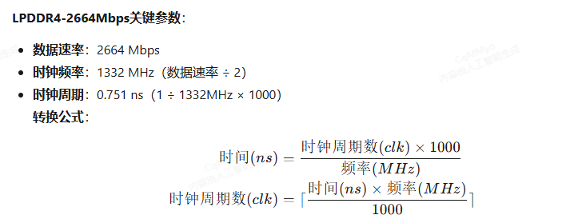


*算这个的主要原因是不同的SOC DDR配置可能以T为单位也可能以ns为单位，以及DDR datesheet的单位可能和SOC用的不是同一个单位*

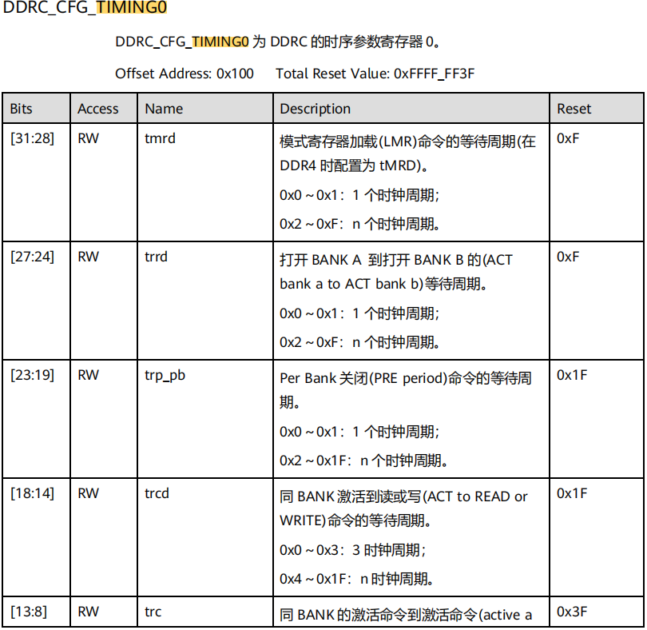
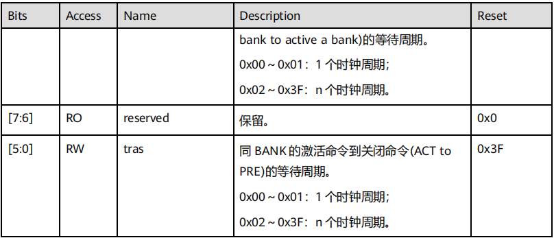
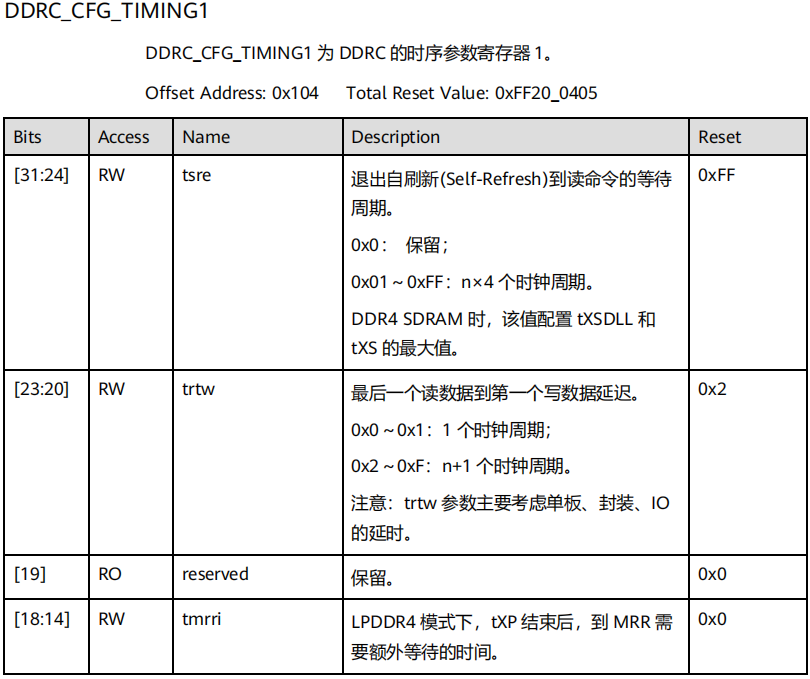
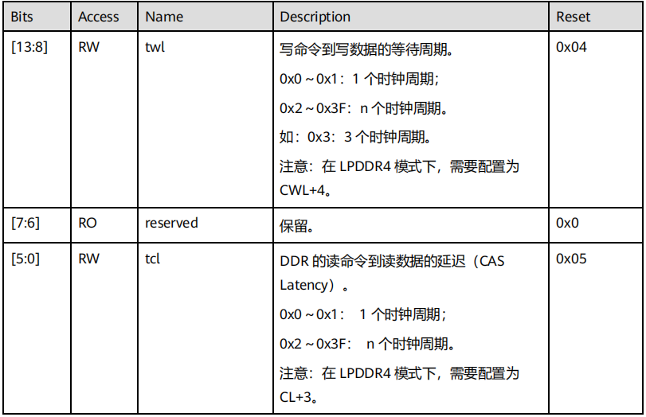

从这个寄存器可以看得出海思的DDR配置是以T为单位，而DDR datasheet是以ns为单位需要换算。

tRP范围：1~31 clk
tRCD范围：3~31 clk
tRC范围：1~63 clk
tRAS范围：1~63 clk
tCL范围：1~63 clk

tCK = 0.75 ns (DDR 频率 1333 MHz)

---

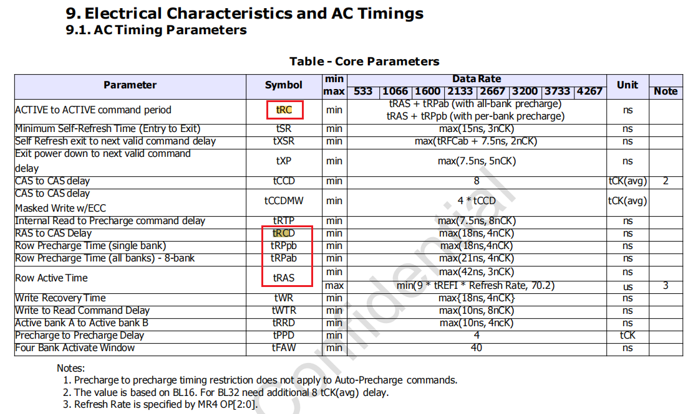

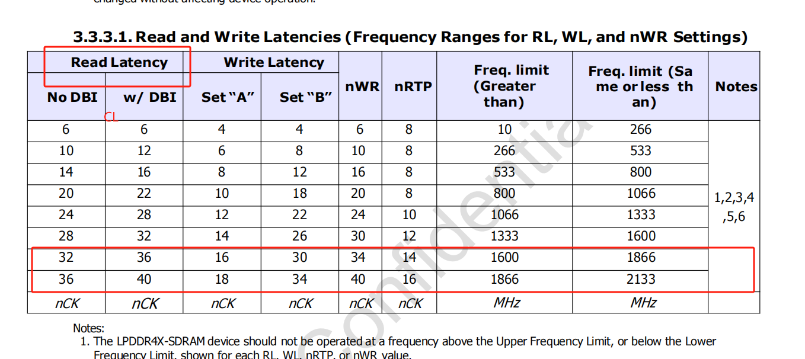

```c
根据换算clk
tRCD = 18÷0.75 = 24.0 clk 
tRP = 18÷0.75 = 24.0 clk
tRAS = 42÷0.75 = 56.0 clk 
tCL = 32 ÷ 0.75 = 42.6667 
tRC = tRAS + tRP = 56 + 24 = 80 clk 

这里有个问题海思的tRAS范围是1~63，80超出范围
```

*目前跑通的时序tcl-trp-trcd-tras 31-24-31-56-63*

```c
海思原始XSL参数反推：
tRCD = 16×0.75 = 12.0 ns 
tRP = 16 × 0.75 = 12.0 ns
tRAS = 30 × 0.75 = 22.5 ns 
tRC = 45 × 0.75 = 33.75 ns  
```
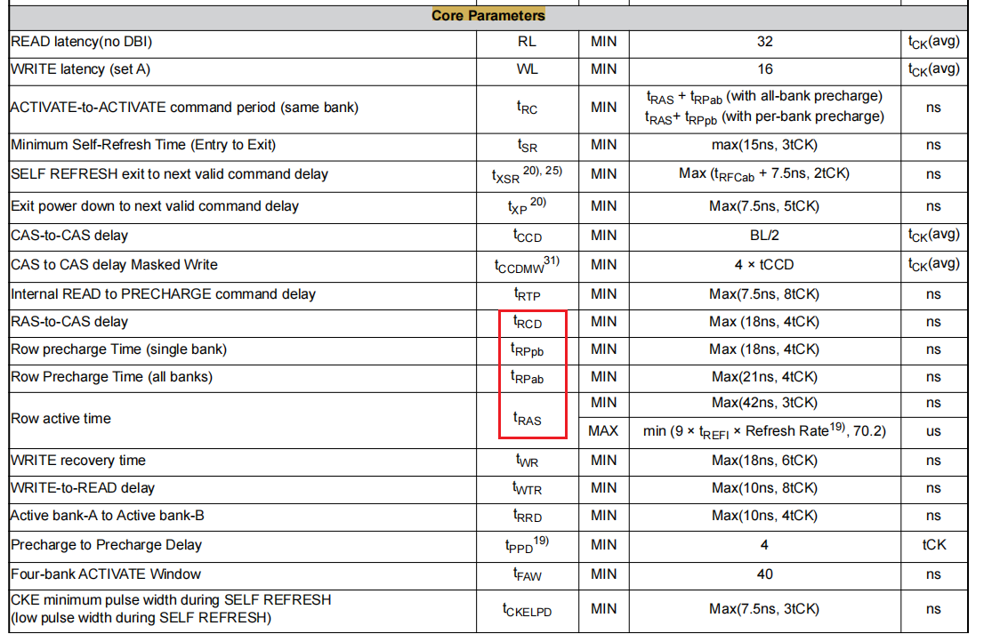
**疑问：单Rank和双Rank的DDR时序有区别吗？**

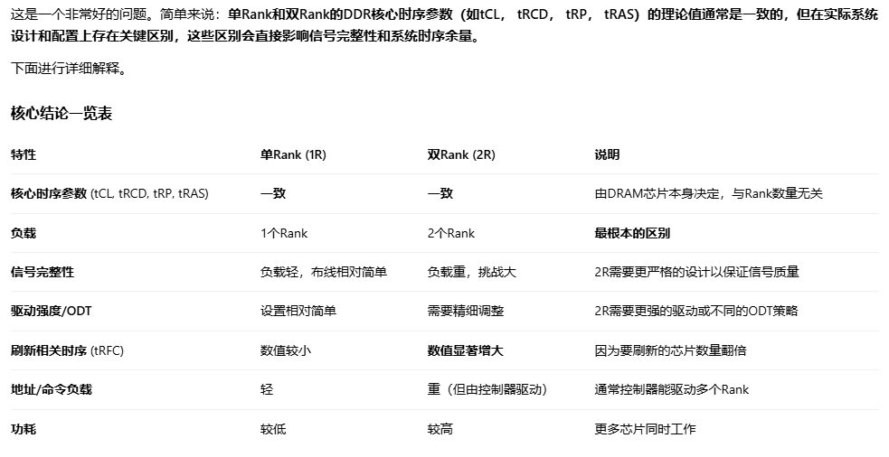

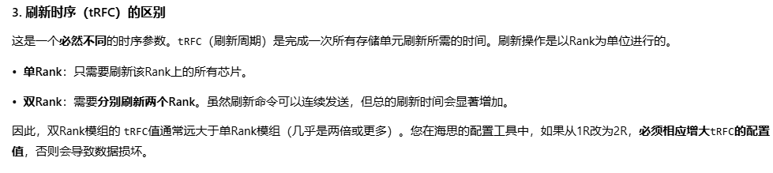


**疑问：有四组DDR tranning寄存器?配置是否要一致？**

---

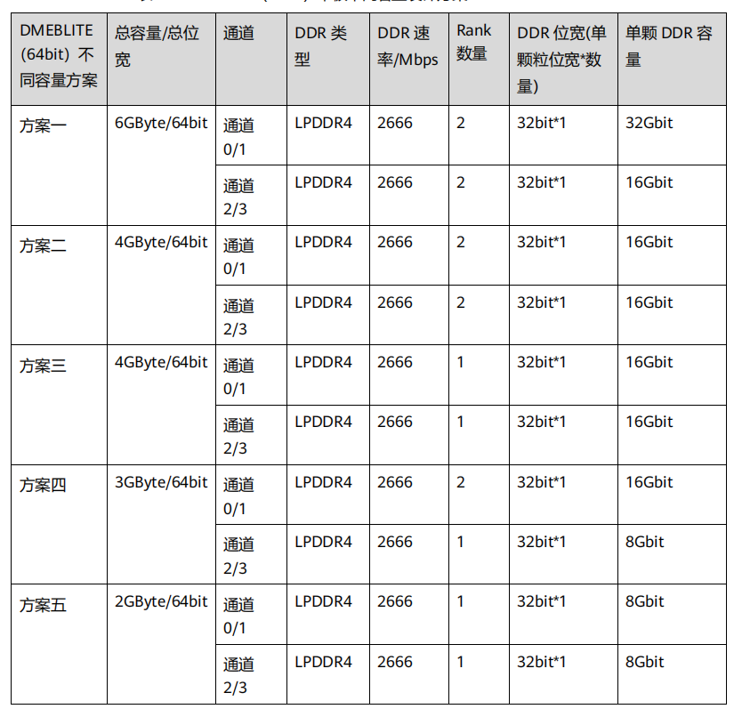

**关键寄存器**

根据配置DDR容量，速率，位宽，RANK，通道配置。

- DDR速率配置：
PERI_CRG_PLL4
PERI_CRG_PLL5

- RANK数量配置：
DDR0_RANK0_HW_TRAINING_CFG
DDR0_RANK1_HW_TRAINING_CFG
DDR1_RANK0_HW_TRAINING_CFG
DDR1_RANK1_HW_TRAINING_CFG

- DDR容量配置
DMC0_CFG_RNKVOL
DMC0_CFG_RNKVOL
DMC1_CFG_RNKVOL
DMC1_CFG_RNKVOL
DMC2_CFG_RNKVOL
DMC2_CFG_RNKVOL
DMC3_CFG_RNKVOL
DMC3_CFG_RNKVOL

- DDR时序配置
**DMC0_CFG_TIMING0**
**DMC0_CFG_TIMING1**
DMC0_CFG_TIMING2
DMC0_CFG_TIMING3
DMC0_CFG_TIMING4
DMC0_CFG_TIMING5
DMC0_CFG_TIMING6
DMC0_CFG_TIMING7
DMC0_CFG_TIMING8


### 1.4 DDR单独编译

    hiregbin-v5.0.1

---


### 1.5 常用的DDR压测工具
#### 1.5.1 DDR眼图

    mw 0x120200a0 0x0 //打开 rank0 的 PHY0 和 PHY1 training
    mw 0x120200a4 0x0 //打开 rank1 的 PHY0 和 PHY1 training
    ddr dataeye //查看 DQ 的窗口
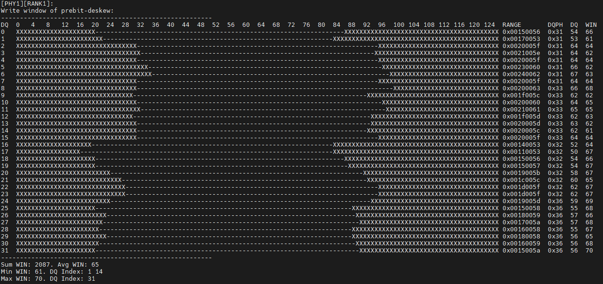
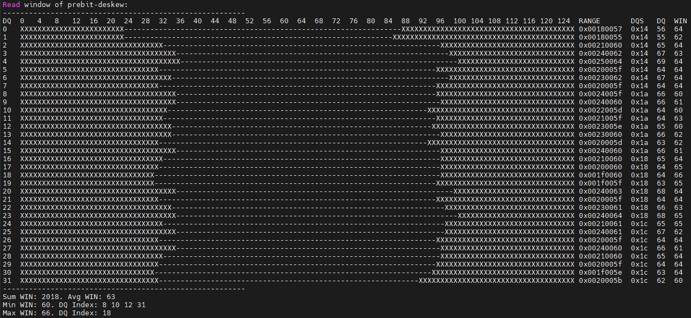

**结果分析**

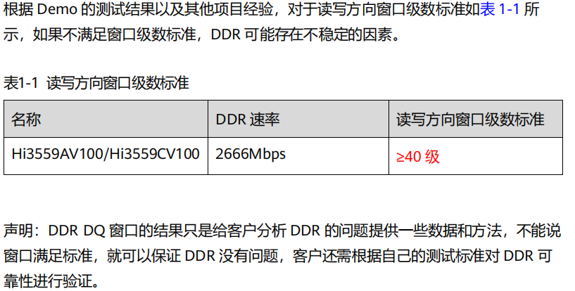


#### 1.5.2 memtester
1. 下载源码
wget http://pyropus.ca/software/memtester/old-versions/memtester-4.3.0.tar.gz
2. 解压缩
tar xzvf memtester-4.3.0.tar.gz
3. 交叉编译
vi conf-cc
  vi conf-ld

把这两个文件中的cc 改成arm-linux-gnueabihf-gcc就可以了，然后make。会自动生成memtester。然后把它下载到自己arm板子上测试DDR。

4. 压测命令 memtester 256M
5. 常见的DDR压测报错
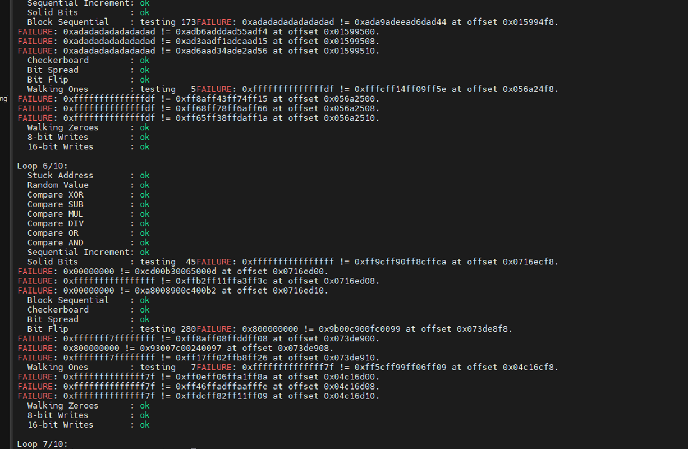

#### 1.5.3 stressapptest

代码获取和编译：
```c
git clone https://github.com/stressapptest/stressapptest.git
编译：

#!/bin/sh

export PATH="/opt/hisi-linux/x86-arm/aarch64-himix210-linux/bin:$PATH"
export CC=aarch64-himix210-linux-gcc
export CXX=aarch64-himix210-linux-g++
export LDFLAGS="-static -lstdc++ -static-libgcc -pthread"

./configure --host=aarch64-himix210-linux

make clean
make
```
压测命令：
```c 
可使用stressapptest --help查看参数说明

参考测试命令：stressapptest -s 600 -M 64 -m 8 -C 8 -W

 参数说明：              

-s: number of second to run the application  测试时间

-m: number of memory copy threads to run  复制线程数  (Memory Copy)

-i: number of memory invert threads to run  反转线程数 (Invert Copy)

-c: CRC check  CRC校验                                (Data Check)

-C: number of memory CPU stress threads to run    CPU压力线程数

-M: Megabytes of ram to run  尽可能测试最大的可用存储空间，（设置超过了memfree，就会被kill）


./stressapptest  -M 600 -s 43200 -C 4

stressapptest -s 43200 -i 4 -C 4 -W --stop_on_errors -M 256

-M mbytes，指定申请测试的内存空间大小，单位为MB。一般申请总容量的八分之一进行测试，如果总容量是 1GB 则申请 128MB 进行 测试，如果总容量是 2GB 则申请 256MB 进行测试。

```

### 2、链接脚本分析
---

#### 2.1 芯片启动流程

**阶段1：BootROM → U-Boot A (SRAM)​**
```c
BootROM (芯片内置)
    ↓
从 eMMC 加载 U-Boot A (SPL)
    ↓
在 SRAM 中运行 U-Boot A
    ↓
初始化主芯片时钟、DDR 控制器
    ↓
执行 DDR 硬件训练
```
**阶段2：U-Boot A → U-Boot B (DDR)​**
```c

DDR 训练完成，DDR 内存可用
    ↓
从 eMMC 加载完整的 U-Boot B
    ↓
跳转到 DDR 中运行 U-Boot B
    ↓
继续加载 Kernel、RootFS
```

---

####  2.2 ​U-Boot引导程序的汇编语言列表文件

    u-boot-hi3559av100.elf.asm
 .asm文件是深入分析 U-Boot 启动问题和硬件初始化时序的宝贵调试工具

---

#### 2.3 Makefile分析

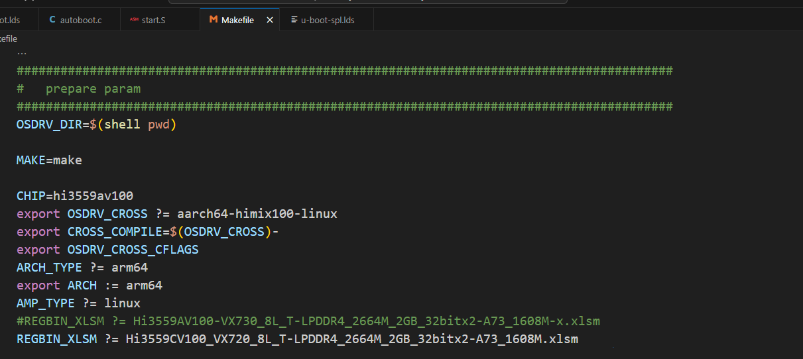

DDR配置表：

    REGBIN_XLSM ?= Hi3559CV100_VX720_8L_T-LPDDR4_2664M_2GB_32bitx2-A73_1608M.xlsm

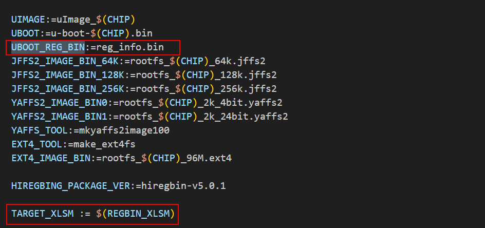

DDR表格编译工具


编译
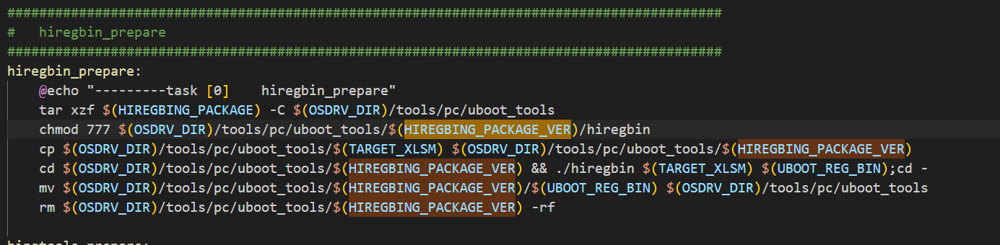
产物

拷贝
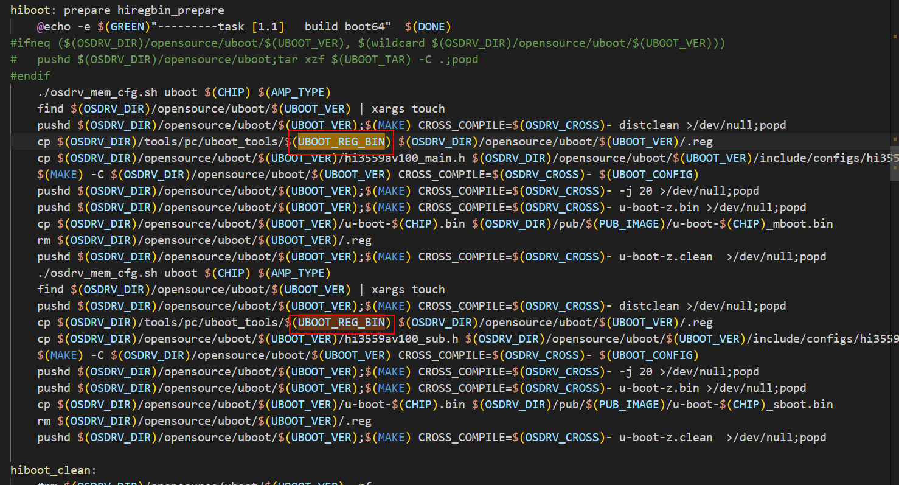


**DDR 配置表处理流程**
1. ​REGBIN_XLSM 文件定义​

```makefile
REGBIN_XLSM ?= Hi3559CV100_VX720_8L_T-LPDDR4_2664M_2GB_32bitx2-A73_1608M.xlsm
```
- 这是一个 ​Excel 宏文件，包含 DDR 的时序参数、电气特性等配置

- 针对特定的 DDR 芯片和 PCB 设计进行定制

2. ​编译生成过程​
在 hiregbin_prepare目标中：

```makefile
hiregbin_prepare:
    tar xzf $(HIREGBING_PACKAGE) -C $(OSDRV_DIR)/tools/pc/uboot_tools
    chmod 777 $(OSDRV_DIR)/tools/pc/uboot_tools/$(HIREGBING_PACKAGE_VER)/hiregbin
    cp $(TARGET_XLSM) $(OSDRV_DIR)/tools/pc/uboot_tools/$(HIREGBING_PACKAGE_VER)
    cd ... && ./hiregbin $(TARGET_XLSM) $(UBOOT_REG_BIN)  # 关键步骤！
    mv .../$(UBOOT_REG_BIN) $(OSDRV_DIR)/tools/pc/uboot_tools
```
- ​关键工具: hiregbin将 Excel 文件转换为二进制配置文件 reg_info.bin

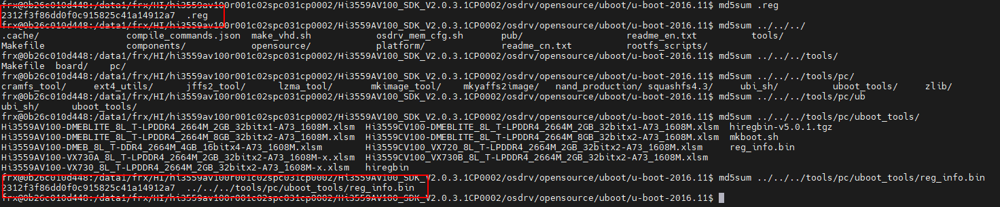

1. ​集成到 U-Boot​
在 hiboot目标中：

```makefile
hiboot: prepare hiregbin_prepare
    cp $(OSDRV_DIR)/tools/pc/uboot_tools/$(UBOOT_REG_BIN) \
       $(OSDRV_DIR)/opensource/uboot/$(UBOOT_VER)/.reg  # 复制到U-Boot目录
```
- 生成的 reg_info.bin被重命名为 <font color='red'>.reg</font>并放入 U-Boot 源码树
- 这个文件最终会被编译进 U-Boot 镜像

查看uboot目录下的顶层Makefile没有发现关于.reg的使用。
说明具体的实现在子层Makefile,继续往下找

根据编译目标找到**u-boot-z.bin**

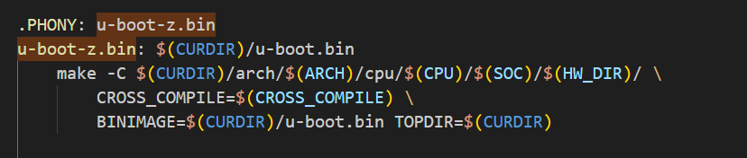

确认子目录的Makefile


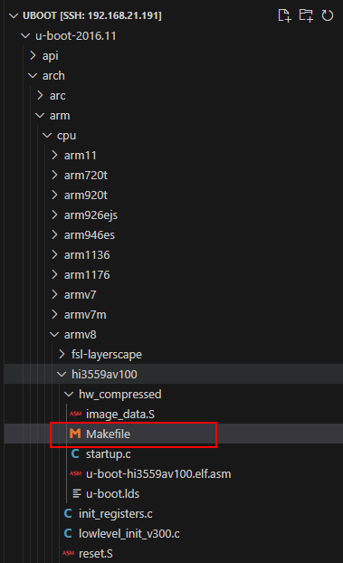


**DDR配置的完整路径**

  1. Excel 文件 (.xlsm)
     ↓ hiregbin 工具处理
  2. reg_info.bin (二进制 DDR 参数)
     ↓ 复制并重命名  
  3. U-Boot 源码树中的 .reg 文件
     ↓ 编译时链接
  4. 嵌入到 U-Boot 镜像的特定段
     ↓ 上电时读取
  5. DDR 初始化代码使用这些参数

**下面是子目录的Makefile:**

```Makefile
################################################################################
#    Create By Hisilicon
################################################################################

PWD           = $(shell pwd)
HW_CROSS_COMPILE = aarch64-himix100-linux-
TOPDIR        =
BINIMAGE      = $(TOPDIR)/full-boot.bin

#PWD：当前工作目录。
#HW_CROSS_COMPILE：交叉编译工具链前缀。
#TOPDIR：顶层目录，默认为空，需要在调用时指定。
#BINIMAGE：完整引导镜像的路径。

################################################################################
CC       := $(HW_CROSS_COMPILE)gcc
AR       := $(HW_CROSS_COMPILE)ar
LD       := $(HW_CROSS_COMPILE)ld
OBJCOPY  := $(HW_CROSS_COMPILE)objcopy
OBJDUMP  := $(HW_CROSS_COMPILE)objdump

#定义交叉编译工具

################################################################################
BOOT     := u-boot-$(SOC)
TEXTBASE := 0x48700000
CFLAGS   :=-g -Os -fno-builtin -ffreestanding \
	-D__KERNEL__ -DTEXT_BASE=$(TEXTBASE) \
	-I$(TOPDIR)/include \
	-I$(TOPDIR)/drivers/ddr/hisilicon/default \
	-I$(TOPDIR)/drivers/ddr/hisilicon/$(SOC) \
	-I$(TOPDIR)/arch/arm/include \
	-fno-pic  -mstrict-align  -ffunction-sections \
	-fdata-sections -fno-common -ffixed-r9    \
	-fno-common -ffixed-x18 -pipe -march=armv8-a \
	-Wall -Wstrict-prototypes -fno-stack-protector \
	-D__LINUX_ARM_ARCH__=8 -D__ARM__ \
	-DCONFIG_HI3559AV100 -DCONFIG_MMC -DCONFIG_UFS \
	$(MKFLAGS) -fno-strict-aliasing

#优化标志：-Os（优化大小）、-fno-builtin（不使用内建函数）等。
#定义宏：如TEXTBASE（文本基地址）、芯片相关配置。

################################################################################

START := start.o
COBJS := lowlevel_init_v300.o \
	init_registers.o \
	sdhci_boot.o \
	ufs.o \
	uart.o \
	ddr_training_impl.o \
	ddr_training_ctl.o \
	ddr_training_boot.o \
	ddr_training_custom.o \
	ddr_training_console.o \
	startup.o \
	image_data.o \
	div0.o \
	reset.o

SSRC  := arch/arm/cpu/armv8/$(SOC)/start.S \
	arch/arm/cpu/armv8/$(SOC)/reset.S \
	arch/arm/cpu/armv8/$(SOC)/sdhci_boot.c \
	arch/arm/cpu/armv8/$(SOC)/scsi.c \
	arch/arm/cpu/armv8/$(SOC)/scsi.h \
	arch/arm/cpu/armv8/$(SOC)/uart.S \
	arch/arm/cpu/armv8/$(SOC)/ufs.c \
	arch/arm/cpu/armv8/$(SOC)/ufs.h \
	arch/arm/cpu/armv8/$(SOC)/init_registers.c \
	arch/arm/cpu/armv8/$(SOC)/lowlevel_init_v300.c \
	drivers/ddr/hisilicon/default/ddr_training_impl.c \
	drivers/ddr/hisilicon/default/ddr_training_ctl.c \
	drivers/ddr/hisilicon/default/ddr_training_boot.c \
	drivers/ddr/hisilicon/default/ddr_training_console.c \
	drivers/ddr/hisilicon/$(SOC)/ddr_training_custom.c \
	arch/arm/lib/div0.c \
	lib/hw_dec/hw_decompress.c \
	lib/hw_dec/hw_decompress_$(SOC).c \
	lib/hw_dec/hw_decompress_v2.c \
	lib/hw_dec/hw_decompress_v2.h

REG := $(wildcard $(TOPDIR)/*.reg $(TOPDIR)/.reg)
SRC := $(notdir $(SSRC))

#START：启动文件对象。
#COBJS：编译产生的对象文件列表，包括DDR训练相关模块。
#SSRC：源文件路径列表。
#REG：查找TOPDIR下的.reg文件（DDR配置文件）。
#SRC：源文件的基本名（不含路径）。

################################################################################

#生成最终镜像
.PHONY: $(BOOT).bin
$(BOOT).bin: $(BOOT).tmp regfile
	@dd if=./$(BOOT).tmp of=./tmp1 bs=1 count=64 2>/dev/null
	@dd if=$(REG) of=./tmp2 bs=10240 conv=sync 2>/dev/null
	@dd if=./$(BOOT).tmp of=./tmp3 bs=1 skip=10304 2>/dev/null
	@cat tmp1 tmp2 tmp3 > $(BOOT).bin
	@rm -f tmp1 tmp2 tmp3
	@chmod 754 $(BOOT).bin
	@cp -fv $@ $(TOPDIR)
	@echo $(BOOT).bin is Ready.

#依赖：$(BOOT).tmp（临时镜像）和regfile（检查.reg文件）。
#使用dd命令将镜像分成三部分：
#tmp1：原镜像的前64字节。
#tmp2：.reg文件内容，填充到10240字节。
#tmp3：原镜像从10304字节开始的后半部分。
#拼接三部分生成最终镜像。

#生成中间文件
$(BOOT).tmp: $(BOOT).elf
	$(OBJCOPY) -O srec $< $(BOOT).srec
	$(OBJCOPY) -j .text -O binary $< $(BOOT).text
	$(OBJCOPY) --gap-fill=0xff -O binary $< $@

$(BOOT).elf: image_data.gzip $(SRC) $(START) $(COBJS)
	$(LD) -Bstatic -T u-boot.lds -Ttext $(TEXTBASE) $(START) \
		$(COBJS) -Map $(BOOT).map -o $@
	$(OBJDUMP) -d  $@ > $@.asm

#$(BOOT).tmp：从ELF文件生成二进制文件，填充间隙为0xFF。
#$(BOOT).elf：链接所有对象文件生成ELF文件。

#检查.reg文件
.PHONY: regfile
regfile:
	@if [ "$(words $(REG))" = "0" ]; then ( \
		echo '***' Need '.reg' or '*.reg' file in directory $(TOPDIR); \
		exit 1; \
	) fi
	@if [ "$(words $(REG))" != "1" ]; then ( \
		echo '***' Found multi '.reg' or '*.reg' file in directory $(TOPDIR); \
		echo '***' Files: $(notdir $(REG)); \
		exit 1; \
	) fi

#确保在TOPDIR下存在且仅存在一个.reg文件。

################################################################################
#编译规则
start.o: start.S
	$(CC) -D__ASSEMBLY__ $(CFLAGS) -o $@ $< -c

# -1 : --fast      -9 : --best
image_data.gzip: $(BINIMAGE)
	gzip -fNqc -7 $< > $@

%.o: %.c
	$(CC) $(CFLAGS) -Wall -Wstrict-prototypes \
		-fno-stack-protector -o $@ $< -c

%.o: %.S
	$(CC) -D__ASSEMBLY__ $(CFLAGS) -o $@ $< -c

image_data.o: image_data.S image_data.gzip
	$(CC) -D__ASSEMBLY__ $(CFLAGS) -o $@ $< -c

#编译汇编和C文件。
#生成压缩的镜像数据
#############################################################################
#符号链接源文件
$(SRC):
	ln -sf ../../../../../../$(filter %/$@,$(SSRC)) $@
################################################################################
TMPS := $(COBJS) start.o $(SRC) \
	$(BOOT).map $(BOOT).elf $(BOOT).srec $(BOOT).bin $(BOOT).text $(BOOT).tmp \
	image_data.gzip

distclean: clean

clean:
	-rm -f $(TMPS)

################################################################################
.PHONY: clean
################################################################################

```

**找到.reg文件**
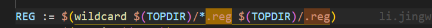

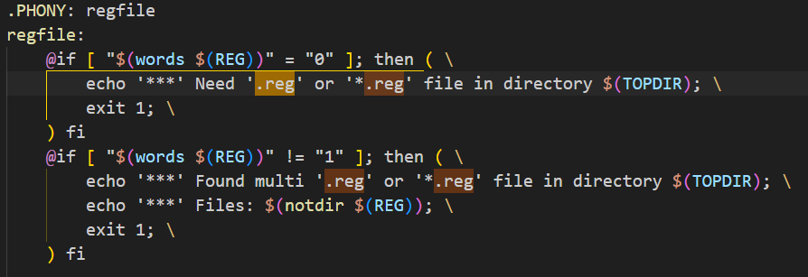

**DDR 配置文件嵌入到镜像**

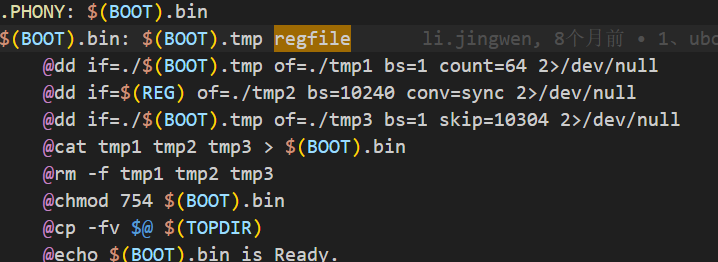


**DDR 配置嵌入流程详解**


**镜像结构布局**

```bash
u-boot.tmp 镜像结构：
+-------------------+ ← 0x0000
|   头部 64 字节     |  → 保存到 tmp1
+-------------------+ ← 0x0040
|   未使用空间       |  (10304 - 64 = 10240 字节)
+-------------------+ ← 0x2840 (10304 字节)
|   主程序代码       |  → 保存到 tmp3
+-------------------+

最终镜像结构：
+-------------------+
| tmp1 (64字节)     |  ← 原镜像头部
+-------------------+
| tmp2 (10240字节)  |  ← .reg 文件内容（DDR配置）
+-------------------+
| tmp3 (剩余部分)   |  ← 原镜像主程序
+-------------------+

```

**嵌入过程分解**

从Makefile文件可以知道DDR配置位置：

```bash
# 步骤1：提取镜像前64字节（头部信息）
dd if=u-boot-hi3559av100.tmp of=tmp1 bs=1 count=64

# 步骤2：将.reg文件填充到10240字节（不足补0）
dd if=reg_info.bin of=tmp2 bs=10240 conv=sync

# 步骤3：跳过原镜像的10304字节（64+10240），提取剩余部分
dd if=u-boot-hi3559av100.tmp of=tmp3 bs=1 skip=10304

# 步骤4：拼接三部分生成最终镜像
cat tmp1 tmp2 tmp3 > u-boot-hi3559av100.bin

```
<font color='red'>所以.reg文件被内嵌入在10304-20544偏移处（10240字节），也就是10K</font>

结合Start.S分析：


分配的大小就是10240

最后根据u-boot-hi3559av100.elf.asm反汇编文件确认
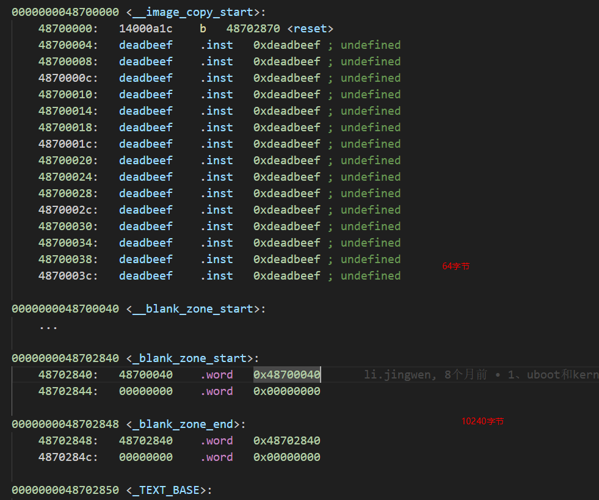

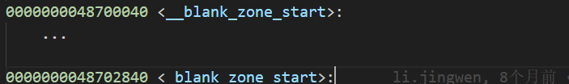
这就是DDR配置表在内存中存放的位置。


**完整的 DDR 初始化流程**
1. ​BootROM​ → 加载硬件压缩的 U-Boot 到 SRAM

2. ​SRAM 中的代码​ → 读取嵌入的 .reg文件(DDR 参数)
   
3. DDR 训练​ → 使用参数初始化 DDR 控制器

4. ​解压主程序​ → 将主 U-Boot 解压到 DDR

5. ​跳转到 DDR​ → 执行完整的 U-Boot


---

**DDR 稳定后，加载完整 U-Boot 到 DDR**

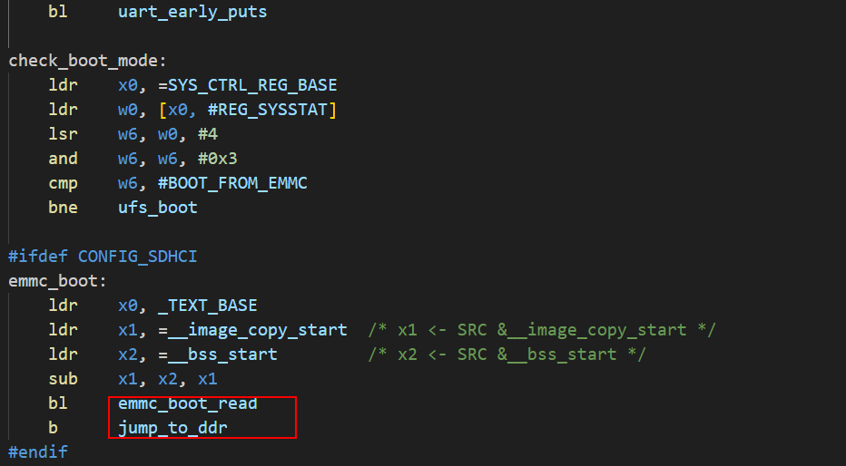
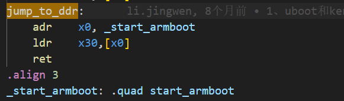
--- 

#### 2.4 DDR兼容方案

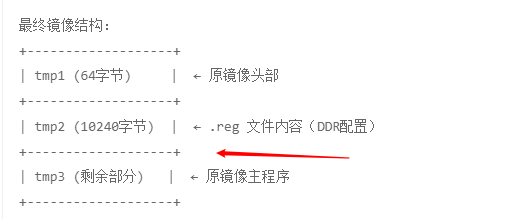
目前设想是在tmp2后面插入另一份DDR的配置，主程序的位置往后移动。

第一步需要验证，验证uboot_a，加一份块空的10K内存，还能否运行的起来

从反汇编代码看，__blank_zone_start位于地址 0x48700040，大小为 0x2840 - 0x40 = 0x2800（10KB）。


#### 2.5 第一个链接脚本 u-boot.lds

路径：uboot/u-boot-2016.11

```c


    1. Excel 文件 (.xlsm)
    ↓ hiregbin 工具处理
    2. reg_info.bin (二进制 DDR 参数)
    ↓ 复制并重命名  
    3. U-Boot 源码树中的 .reg 文件
    ↓ 编译时链接
    4. 嵌入到 U-Boot 镜像的特定段
    ↓ 上电时读取
    5. DDR 初始化代码使用这些参数

OUTPUT_FORMAT("elf64-littleaarch64", "elf64-littleaarch64", "elf64-littleaarch64")
OUTPUT_ARCH(aarch64)
ENTRY(_start)
SECTIONS
{
 . = 0x00000000;
 . = ALIGN(8);
 .text :
 {
  *(.__image_copy_start)
  arch/arm/cpu/armv8/start.o (.text*)
  *(.text*)
 }
 . = ALIGN(8);
 .image : { *(.image) }
 . = ALIGN(8);
 .rodata : { *(SORT_BY_ALIGNMENT(SORT_BY_NAME(.rodata*))) }
 . = ALIGN(8);
 .data : {
  *(.data*)
 }
 . = ALIGN(8);
 . = .;
 . = ALIGN(8);
 .u_boot_list : {
  KEEP(*(SORT(.u_boot_list*)));
 }
 . = ALIGN(8);
 .efi_runtime : {
                __efi_runtime_start = .;
  *(efi_runtime_text)
  *(efi_runtime_data)
                __efi_runtime_stop = .;
 }
 .efi_runtime_rel : {
                __efi_runtime_rel_start = .;
  *(.relaefi_runtime_text)
  *(.relaefi_runtime_data)
                __efi_runtime_rel_stop = .;
 }
 . = ALIGN(8);
 .image_copy_end :
 {
  *(.__image_copy_end)
 }
 . = ALIGN(8);
 .rel_dyn_start :
 {
  *(.__rel_dyn_start)
 }
 .rela.dyn : {
  *(.rela*)
 }
 .rel_dyn_end :
 {
  *(.__rel_dyn_end)
 }
 _end = .;
 . = ALIGN(8);
 .bss_start : {
  KEEP(*(.__bss_start));
 }
 .bss : {
  *(.bss*)
   . = ALIGN(8);
 }
 .bss_end : {
  KEEP(*(.__bss_end));
 }
 /DISCARD/ : { *(.dynsym) }
 /DISCARD/ : { *(.dynstr*) }
 /DISCARD/ : { *(.dynamic*) }
 /DISCARD/ : { *(.plt*) }
 /DISCARD/ : { *(.interp*) }
 /DISCARD/ : { *(.gnu*) }
}

```

从链接脚本可以看到uboot的入口函数arch/arm/cpu/armv8/start.S文件中的_start，链接起始地址这里是0x0000000，这个最终是有Makefile指定的，从u-boot.map文件中可以看出链接的起始地址是0x48800000，uboot的链接地址在ddr中，因为hi3559的ddr寻址范围是0x0_4000_0000~0x2_3FFF_FFFF。

#### u-boot.map

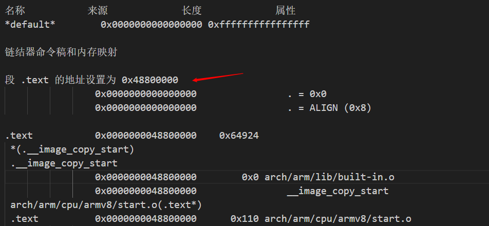

__image_copy_start和__image_copy_end表示uboot代码的拷贝其实地址和结束地址，如下所示：

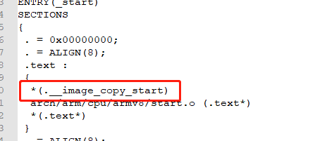

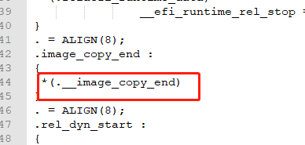


u-boot/arch/arm/lib/relocate_64.S中拷贝uboot代码到ddr就用到了__image_copy_start和__image_copy_end这两个变量。


#### 第二个链接脚本 u-boot.lds
路径：/uboot/u-boot-2016.11/arch/arm/cpu/armv8/hi3559av100

```c
/*
 * (C) Copyright 2013
 * David Feng <fenghua@phytium.com.cn>
 *
 * (C) Copyright 2002
 * Gary Jennejohn, DENX Software Engineering, <garyj@denx.de>
 *
 * SPDX-License-Identifier:	GPL-2.0+
 */

OUTPUT_FORMAT("elf64-littleaarch64", "elf64-littleaarch64", "elf64-littleaarch64")
OUTPUT_ARCH(aarch64)
ENTRY(_start)
SECTIONS
{
	. = 0x48700000;
	__image_copy_start =.;
	. = ALIGN(8);
	.text :
	{
        __text_start = .;
		start.o (.text*)
		init_registers.o (.text*)
		lowlevel_init_v300.o (.text*)
		ddr_training_impl.o (.text*)
		ddr_training_console.o (.text*)
		ddr_training_ctl.o (.text*)
		ddr_training_boot.o (.text*)
		ddr_training_custom.o (.text*)
		uart.o (.text*)
		ufs.o (.text*)
		div0.o (.text*)
		sdhci_boot.o (.text*)
		image_data.o (.text*)
        startup.o(.text*)
        reset.o(.text*)
        __init_end = .;
        ASSERT(((__init_end - __text_start) < 0x8000), "init sections too big!");
		*(.text*)
	}

	. = ALIGN(8);
	.image : { *(.image) }

	. = ALIGN(8);
	.rodata : { *(SORT_BY_ALIGNMENT(SORT_BY_NAME(.rodata*))) }

	. = ALIGN(8);
	.data : {
		*(.data*)
	}

	. = ALIGN(8);

	.got : { *(.got) }

	. = ALIGN(8);
	__image_copy_end =.;
	__bss_start = .;
	.bss :
	{ 
		*(.bss)
	}
	__bss_end = .;


	_end = .;
}

```

从链接脚本可以看出，hw_compressed目录下的代码入口地址是start.S文件中的_start函数，链接起始地址是0x48700000，处于最前面。hw_compressed目录下的代码主要是配置.reg文件中的寄存器，初始化pll，ddr，初始化串口等操作。由于初始化ddr代码在这部分，可以猜测，这部分代码是在soc内部的ram运行的。

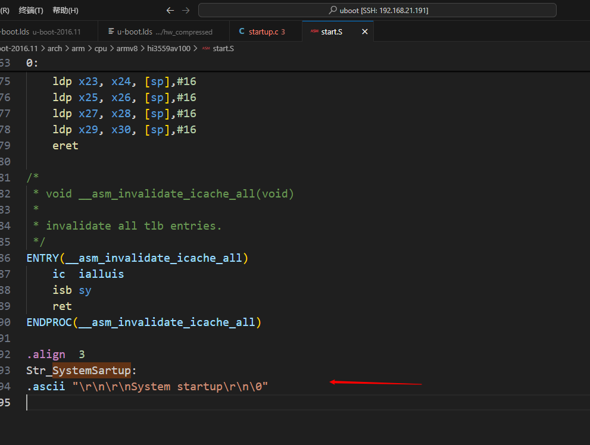

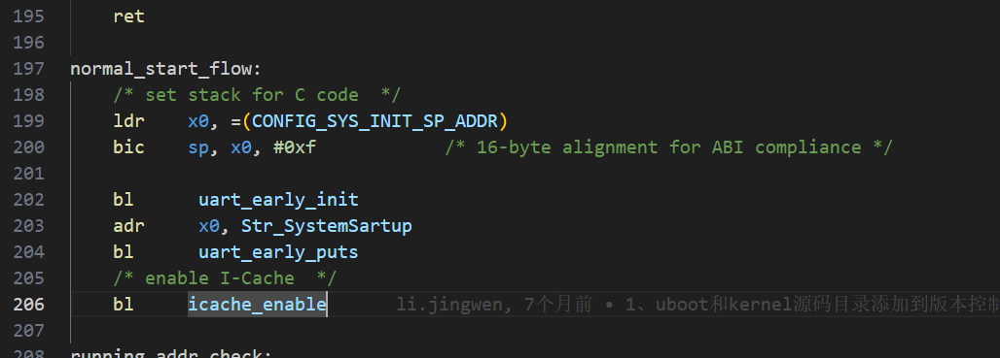

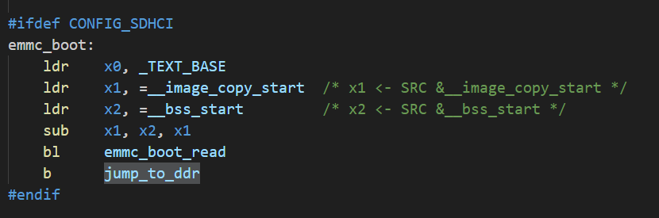

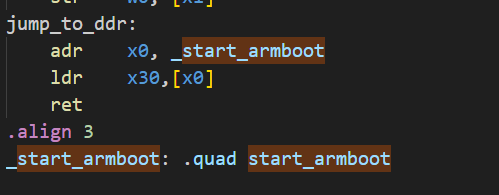

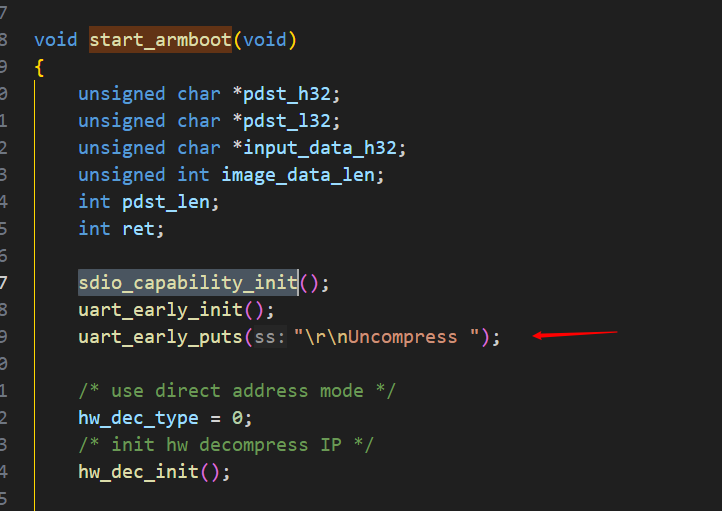

### 第一段初始化代码 
1、运行芯片内部rom中的引导加载程序，这部分程序主要是将uboot前一部分代码(包过.reg)拷贝到内部的ram中，拷贝的这部分代码应该就是hw_compressed目录下面的代码，因为flash是标准器件，所以引导加载程序可以对flash进行读写。

2、hw_compressed目录下的是厂家的代码，主要是配置soc的运行环境包过ddr、pll、管脚复用等。

3、解压image_data.gzip，跳转到arch/arm/cpu/armv8/start.S中有运行，这时开始运行uboot代码。

```c
　　_start　　//u-boot-2016.11/arch/arm/cpu/armv8/hi3559av100/hw_compressed/start.S

　　　　-->reset

　　　　　　-->normal_start_flow

　　　　　　　　-->uart_early_init　　　　//uart.S，初始化串口，默认初始化uart0

　　　　　　　　-->uart_early_puts　　　//打印字符串，打印的字符串是在start.S中的Str_SystemSartup，内容是System startup，这个就是uboot启动时第一条打印的信息

　　　　　　-->init_registers　　　　　　//根据.reg表格配置寄存器

　　　　　　-->start_ddr_training　　　　//配置ddr

　　　　　　-->jump_to_ddr　　　　　　

　　　　　　　　-->start_armboot　　　　//hw_compressed/setup.c，解压image_data.gzip，解压成功后会打印Uncompress Ok，调动0x48800000地址的函数，这个函数就是arch/arm/cpu/armv8/start.S文件中的_start
```


```c
/*
     * Cache/BPB/TLB Invalidate
     * i-cache is invalidated before enabled in icache_enable()
     * tlb is invalidated before mmu is enabled in dcache_enable()
     * d-cache is invalidated before enabled in dcache_enable()
     */

    /*
     *  read system register REG_SC_GEN2
     *  check if ziju flag
     */
    ldr    x0, =SYS_CTRL_REG_BASE
    ldr    w1, [x0, #REG_SC_GEN2]
    ldr    w2, =0x7a696a75         /* magic for "ziju" */
    cmp    w1, w2
    bne    normal_start_flow
    mov    x1, sp                  /* save sp */
    str    w1, [x0, #REG_SC_GEN2]  /* clear ziju flag */

ziju_flow:
    ldr    x2, =(STACK_TRAINING)
    bic    sp, x2, #0xf            /* 16-byte alignment for ABI compliance */
    ldr    x0, _blank_zone_start
    ldr    x1, _TEXT_BASE
    sub    x0, x0, x1
    adr    x1, _start
    add    x0, x0, x1
    mov    x1, #0x0                /* flags: 0->normal 1->pm */
    bl     init_registers          /* init PLL/DDRC/... */
    bl	   start_ddr_training      /* DDR training */

    ldr    x0, =SYS_CTRL_REG_BASE
    ldr    w1, [x0, #REG_SYSSTAT]
    lsr    w1, w1, #8
    and    w1, w1, #0x1
    cmp    w1, #1
    beq    pcie_slave_boot

```

```c
normal_start_flow:
    /* set stack for C code  */
    ldr    x0, =(CONFIG_SYS_INIT_SP_ADDR)
    bic    sp, x0, #0xf            /* 16-byte alignment for ABI compliance */

    bl      uart_early_init
    adr     x0, Str_SystemSartup
    bl      uart_early_puts
    /* enable I-Cache  */
    bl     icache_enable

running_addr_check:
    adr    x0,running_addr_check
    lsr    x0, x0, #28
    cmp    x0, #4
    bge    not_ddr_init

    /* read init table and config registers */
    ldr    x0, _blank_zone_start
    ldr    x1, _TEXT_BASE
    sub    x0, x0, x1
    adr    x1, _start
    add    x0, x0, x1
    mov    x1, #0                  /* flags: 0->normal 1->pm */
    bl     init_registers
    bl	   start_ddr_training
check_boot_mode:
    ldr    x0, =SYS_CTRL_REG_BASE
    ldr    w0, [x0, #REG_SYSSTAT]
    lsr    w6, w0, #4
    and    w6, w6, #0x3
    cmp    w6, #BOOT_FROM_EMMC
    bne    ufs_boot

#ifdef CONFIG_SDHCI
emmc_boot:
    ldr    x0, _TEXT_BASE
    ldr    x1, =__image_copy_start  /* x1 <- SRC &__image_copy_start */
    ldr    x2, =__bss_start         /* x2 <- SRC &__bss_start */
    sub    x1, x2, x1
    bl     emmc_boot_read
    b      jump_to_ddr
#endif

ufs_boot:
    cmp    w6, #BOOT_FROM_UFS
    bne    not_ddr_init
#ifdef CONFIG_UFS
    ldr    x0, _TEXT_BASE
    ldr    x1, =__image_copy_start    /* x1 <- SRC &__image_copy_start */
    ldr    x2, =__bss_start           /* x2 <- SRC &__bss_start*/
    sub    x1, x2, x1
    bl     ufs_boot_read
    b      jump_to_ddr
#endif
```

这段代码是ARMv8架构的启动代码，主要完成从复位到跳转到U-Boot主函数的过程。以下是详细的执行顺序分析：
### 脚本分析

1. ​复位向量入口​
硬件复位后，从_start标签开始执行：
```c
_start:
    b reset   ; 跳转到reset标签
```
2. ​异常向量表设置​
在reset标签中，根据当前异常级别设置异常向量基地址寄存器（VBAR）：

```c
reset:
    adr    x0, vectors      ; 获取vectors的地址
    switch_el x1, 3f, 2f, 1f  ; 根据当前EL跳转
3:  msr    vbar_el3, x0     ; EL3设置VBAR
    ... 
2:  msr    vbar_el2, x0     ; EL2设置VBAR
    ...
1:  msr    vbar_el1, x0     ; EL1设置VBAR
```
3. ​检查ZIJU标志​
读取系统寄存器REG_SC_GEN2，检查是否为特定值（0x7a696a75，即"ziju"的ASCII）：
```c
ldr    x0, =SYS_CTRL_REG_BASE
ldr    w1, [x0, #REG_SC_GEN2]
ldr    w2, =0x7a696a75         ; "ziju"
cmp    w1, w2
bne    normal_start_flow      ; 不相等则跳转到正常流程
如果相等，执行ziju_flow（自举流程），否则执行normal_start_flow（正常启动流程）。
```

4. ​ZIJU流程（特殊启动）​​
初始化栈指针，调用init_registers和start_ddr_training初始化硬件和DDR训练。

检查系统状态，决定是否进入PCIe从模式启动或返回BootROM。

5. ​正常启动流程（normal_start_flow）​​
​设置栈指针​：

```c
ldr    x0, =(CONFIG_SYS_INIT_SP_ADDR)
bic    sp, x0, #0xf            ; 16字节对齐
​初始化串口并打印启动信息​：
```
```c
bl      uart_early_init
adr     x0, Str_SystemSartup
bl      uart_early_puts        ; 打印"System startup"
​启用指令缓存​：
```

```c
bl     icache_enable
​地址检查​（running_addr_check）：

检查当前运行地址是否在DDR范围内，如果不是则跳过DDR初始化。

​初始化寄存器​（init_registers）：

初始化PLL、DDR控制器等关键寄存器。
```

```c
bl     init_registers
bl     uart_early_init         ; 重新初始化串口（时钟可能改变）
adr    x0, Str_RegistersInitDone
bl     uart_early_puts         ; 打印"Registers init done!"
​DDR训练​（start_ddr_training）：

执行DDR内存训练。

```

```c
bl     start_ddr_training
bl     uart_early_init         ; 再次初始化串口
adr    x0, Str_DDRTrainingDone
bl     uart_early_puts         ; 打印"DDR training done!"
​打印进入启动模式检查​：
```
```c
adr    x0, Str_EnterCheckBoot
bl     uart_early_puts         ; 打印"Entering boot mode check..."
1. ​启动模式检查（check_boot_mode）​​
读取系统状态寄存器REG_SYSSTAT，解析启动模式：
```

```c
ldr    x0, =SYS_CTRL_REG_BASE
ldr    w0, [x0, #REG_SYSSTAT]
lsr    w6, w0, #4
and    w6, w6, #0x3            ; 获取启动模式位[5:4]
如果为BOOT_FROM_EMMC，则执行emmc_boot。

如果为BOOT_FROM_UFS，则执行ufs_boot。

否则跳转到not_ddr_init（非DDR初始化路径）。

1. ​从存储设备加载镜像​
​eMMC启动​（emmc_boot）：

```c

```c
ldr    x0, _TEXT_BASE          ; 目标地址（U-Boot加载地址）
ldr    x1, =__image_copy_start ; 源地址（镜像起始）
ldr    x2, =__bss_start        ; 结束地址
sub    x1, x2, x1              ; 计算长度
bl     emmc_boot_read          ; 从eMMC读取数据
b      jump_to_ddr             ; 跳转到DDR中的U-Boot
​UFS启动​（ufs_boot）：

类似eMMC流程，调用ufs_boot_read。

8. ​非DDR初始化路径（not_ddr_init）​​
如果未启用DDR（如从SRAM启动），则执行代码重定位：

```

```c
relocate:
    adr    x0, _start           ; 当前运行地址
    ... ; 复制代码到链接地址（_TEXT_BASE）
9. ​跳转到U-Boot主函数​
通过jump_to_ddr跳转到start_armboot（U-Boot的C入口）：
```
```c
jump_to_ddr:
    adr    x0, _start_armboot   ; 获取start_armboot函数指针
    ldr    x30, [x0]             ; 加载到x30（链接寄存器）
    ret                          ; 跳转到start_armboot
```
1.  ​U-Boot主函数​
最终执行start_armboot（在U-Boot的C代码中），完成后续初始化。

关键执行顺序总结
复制
复位 → 设置VBAR → 检查ZIJU标志 → 正常启动流程 → 串口初始化 → 打印启动信息 → 启用缓存 → 地址检查 → 初始化寄存器 → DDR训练 → 检查启动模式 → 从eMMC/UFS加载U-Boot → 跳转到U-Boot入口
添加的调试打印点
​Registers init done!​​：在init_registers后打印，确认寄存器初始化完成。

​DDR training done!​​：在start_ddr_training后打印，确认DDR训练完成。

​Entering boot mode check...​​：在启动模式检查前打印，标志进入启动设备选择阶段。

这些打印点帮助定位启动卡死的位置，例如：

如果卡在"Registers init done!"之前，问题在init_registers。

如果卡在"DDR training done!"之前，问题在DDR训练。

如果卡在"Entering boot mode check..."之后，问题在启动设备读取。

### 3、DDR兼容方案