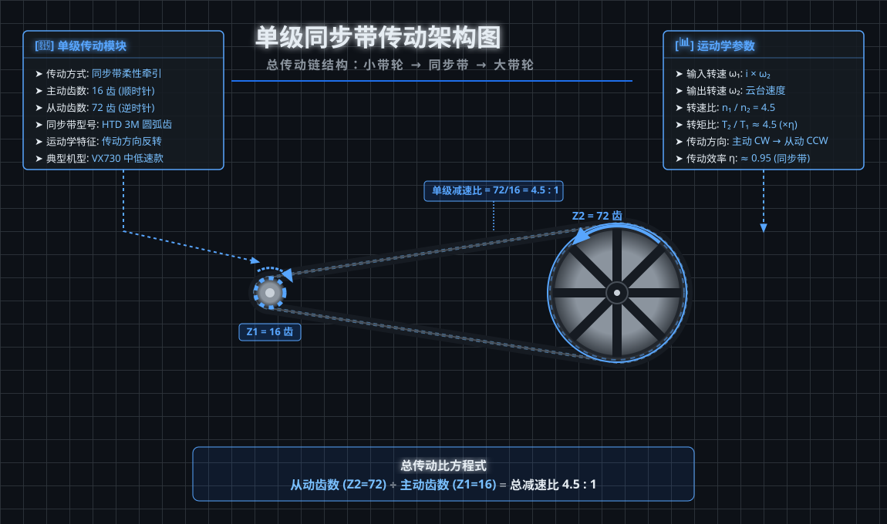
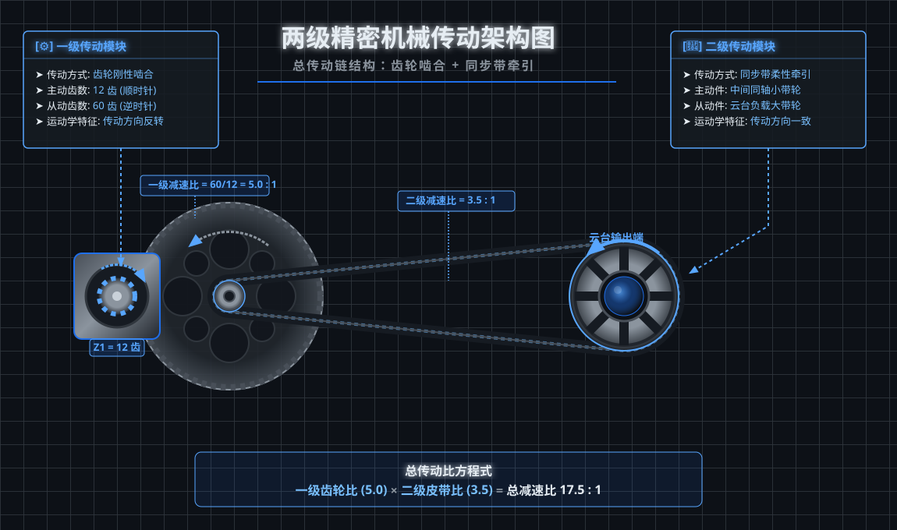
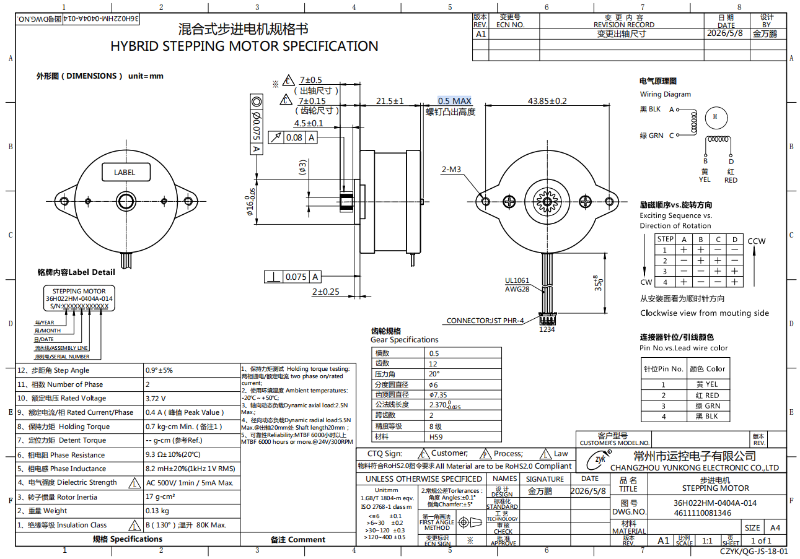
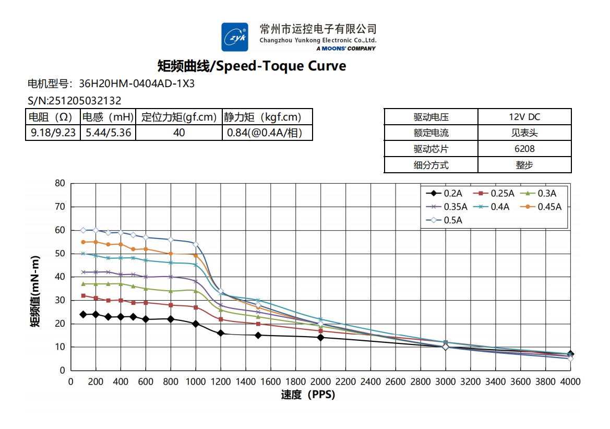

# 云台概述
---
## 1. 基础概念与换算

### 1.1 机械侧：转速单位

RPM（Revolutions Per Minute）即每分钟转数。

**换算关系：**

- 1 RPM = 1 转/分钟
- 1 转/秒 = 60 RPM
- 1 RPM = 6°/秒（一圈 = 360°，360° / 60 秒 = 6°/秒）

### 1.2 电机侧：步距角与细分数

步进电机的运动单位是「**步**」而非「圈」。一步转过的角度叫 **步距角** $\alpha$。

| 步距角 $\alpha$ | 全步数/圈 $S = 360°/\alpha$ | 常见应用 |
| ---- | ---- | ---- |
| **1.8°** | 200 步/圈 | 通用电机（如 TMC5272/驱动常见型号） |
| **0.9°** | 400 步/圈 | 高精度电机（极对数 100 对，定位更细） |

**微步细分** $M$：把一个全步再细分为 $M$ 等份，驱动 IC 实际给的是微步脉冲。

| 细分 $M$ | 每圈脉冲数 $N$ | 步距分辨率 | 工程意义 |
| ---- | ---- | ---- | ---- |
| $M = 1$（整步） | 400（0.9°电机） | 0.9° | 软件定时器可直接生成 1~2 kHz PPS |
| $M = 256$（256 细分） | 102,400（0.9°电机） | 0.0035° | 必须依赖硬件 Ramp 高速生成 PPS |

每圈脉冲数公式：

$$ N = S \times M = \frac{360°}{\alpha} \times M $$

### 1.3 脉冲频率 PPS

电机每接收一个脉冲走一个（微）步。脉冲频率 $f$ 的单位是 **PPS（Pulses Per Second，脉冲/秒）**，数值上等于 **Hz**。公式：

$$ f_{PPS} = \frac{RPM}{60} \times N = \frac{\omega_{motor}}{360} \times N $$

把 §3 的电机转速代进来，以 **0.9° 电机 / 256 细分** 算两个示例：

| 项 | 示例 A（VX730） | 示例 B（QSC） |
| ---- | ---- | ---- |
| 减速比 $i$ | 4.5 : 1 | 17.5 : 1 |
| 电机转速 | 75 RPM | 291.67 RPM |
| 整步 PPS（$M=1$） | $\frac{75}{60} \times 400 = 500\ \text{Hz}$ | $\frac{291.67}{60} \times 400 \approx 1{,}944\ \text{Hz}$ |
| **256 细分 PPS** | $\frac{75}{60} \times 102{,}400 = 128{,}000\ \text{Hz}$ | $\frac{291.67}{60} \times 102{,}400 \approx 497{,}778\ \text{Hz}$ |

> PPS 与细分 $M$ 严格成正比——**256 细分下 PPS 是整步的 256 倍**。工程上常在**中低速用 256 细分**（保证定位平滑）、**高速降细分**（降低 PPS 让电流充分建立）。详细推导与 9 档细分对比见 [§4 脉冲频率](/docs/monitor/common/ptz#4-脉冲频率-pps--hz)。

## 2. 传动结构与减速比

云台中减速机构主要采用 **齿轮传动** 与 **同步带传动** 两种形式，工程上经常组合使用。

### 传动方式总览

| 维度 | 齿轮传动 | 同步带传动 |
| ---- | ---- | ---- |
| **传动原理** | 两个齿轮齿廓啮合传递运动 | 同步带与带轮圆弧齿啮合牵引 |
| **传动比范围** | 单级可达 1:1~10:1（多级叠加可达 100:1） | 单级可达 1:1~10:1 |
| **传动效率 η** | 95%~98%（高） | 95%~98%（高，加润滑可更高） |
| **传动刚度** | **高**（金属刚性接触，无弹性变形） | **中**（带本身有柔性，可吸收冲击） |
| **传动精度** | 高（无滑动） | 较高（同步带无滑动） |
| **传动方向** | **反向**（外啮合） | **同向**（开口传动）/ **反向**（交叉/半交叉） |
| **允许中心距** | 小（两齿轮中心距受齿数与模数约束） | 大（带长灵活，可远距离传动） |
| **过载保护** | 无（卡死易崩齿） | **有**（带打滑可吸收过载，保护电机与齿轮） |
| **噪声** | 中（啮合节拍噪声，与转速/齿数相关） | **低**（柔性啮合，振动小） |
| **润滑需求** | 需定期润滑 | 免维护 |
| **寿命** | 长（齿面磨损） | 中（带齿疲劳，3~5 年） |
| **适用场景** | 大减速比、高刚度、紧凑布局 | 长中心距、低噪声、需过载保护 |

**总结选型**：

- 单一目标 → **齿轮**：高刚度、紧凑、大减速比（多级叠加）
- 单一目标 → **同步带**：低噪声、远距离传动、需过载缓冲
- **组合使用（齿轮 + 皮带）**：用齿轮级做主减速（5:1），用皮带级再减速（3.5:1）+ 隔离电机振动——这是 QSC 高分辨率云台 17.5:1 结构的典型设计

### 减速比定义

$$ i = \frac{\theta_{motor}}{\theta_{ptz}} = \frac{\omega_{motor}}{\omega_{ptz}} $$

减速比越大，**力矩放大越多、定位分辨率越高**，但同一云台速度所需的电机转速也被成比例放大——这正是高速工况下脉冲频率飙升、电流建立困难的根源。

| 机型 / 示例 | 减速比 | 传动方式 | 适用场景 |
| ---- | ---- | ---- | ---- |
| VX730 | 4.5 : 1 | 单级同步带 | 中低速巡航、预置位定位 |
| QSC 云台 | 17.5 : 1 | 齿轮 + 皮带（两级） | 高速扫描、高精度定位 |

### 2.1 单级同步带传动（4.5 : 1）— VX730



### 结构

```text
[输入轴]──[主动小带轮 D1=10mm]──同步带──[从动大带轮 D2=45mm]──[输出轴]
           Z1=16 齿                              Z2=72 齿
```

| 部件 | 参数 | 说明 |
| ---- | ---- | ---- |
| 主动小带轮 $D_1$ / $Z_1$ | 10 mm / 16 齿 | 装在电机轴，随电机 CW 旋转 |
| 从动大带轮 $D_2$ / $Z_2$ | 45 mm / 72 齿 | 装在云台输出轴，CCW 旋转（方向反转） |
| 同步带 | HTD 3M 圆弧齿 | 抗冲击、吸收振动、隔离电机噪声 |
| 总减速比 | $i = Z_2/Z_1 = 72/16 = 4.5 : 1$ | 同时也是齿数比 |

### 运动学

- 角速度：$\omega_{motor} = \omega_{ptz} \times 4.5$
- 电机转 1 圈 → 云台转 $1/4.5 \approx 0.222$ 圈
- 电机 CW ↔ 云台 CCW（**传动方向反转**）
- 力矩放大 4.5 倍（忽略带轮打滑与摩擦损耗）

### 2.2 两级精密传动（17.5 : 1）— QSC



#### 两级结构组成

```text
[输入轴]──[主动小齿轮 Z1=12]──齿轮啮合──[中间轴 大齿轮 Z2=60]──同轴──[小带轮]──同步带──[云台大带轮]──[输出轴]
                                  5:1                              3.5:1
```

| 部件 | 参数 | 说明 |
| ---- | ---- | ---- |
| 一级 主动小齿轮 $Z_1$ | 12 齿 | 装在电机轴，随电机 CW 旋转 |
| 一级 从动大齿轮 $Z_2$ | 60 齿 | 装在中间轴，与 $Z_1$ 外啮合，**CCW 旋转（方向反转）** |
| 二级 中间同轴小带轮 | r = 20 | 与大齿轮同轴，**与 $Z_2$ 同向** CCW |
| 二级 云台大带轮 | r = 70 | 装在云台输出轴，与小带轮同向旋转，**反转 1 次** |
| 一级传动比 | $i_1 = Z_2/Z_1 = 60/12 = 5.0$ | 齿轮刚性啮合，刚度高 |
| 二级传动比 | $i_2 = D_2/D_1 = 70/20 = 3.5$ | 同步带柔性牵引，吸收振动 |
| 总传动比 | $i = i_1 \times i_2 = 5 \times 3.5 = 17.5$ | 多级叠加 |

#### 运动学与方向

- 角速度：$\omega_{motor} = \omega_{ptz} \times 17.5$
- 电机转 1 圈 → 中间轴转 1/5 圈 → 云台再转 1/3.5 圈
- **总方向反转 1 次**：电机 CW → 大齿轮 CCW → 小带轮 CCW → 大带轮 CCW（两段都是反向，等价于 1 次反向）
- 力矩放大 17.5 倍（忽略两级效率损失：$\eta_{tot} \approx 0.95 \times 0.95 \approx 0.90$）

#### 单级 vs 两级 对比

| 维度 | 单级同步带（4.5:1） | 两级齿轮+皮带（17.5:1） |
| ---- | ---- | ---- |
| 传动级数 | 1 | 2 |
| 定位分辨率 | 1× | **3.9×**（17.5/4.5） |
| 传动刚度 | 中 | **高**（齿轮级刚性主导） |
| 噪声 | 低 | 中（齿轮节拍噪声） |
| 结构复杂度 | 低 | 高（多一根中间轴、4 个传动件） |
| 效率 | ~0.95 | ~0.90（多级损耗累积） |
| 适用场景 | 中低速巡航、预置位 | 高速扫描、高精度定位 |

两级结构用复杂度换性能：齿轮级提供主要减速与高刚度，皮带级再减速并隔离电机振动，总刚度比纯单级皮带大幅提升，定位分辨率提升 3.9×，但代价是结构变复杂、效率略降、引入齿轮节拍噪声。

## 3. 云台速度 ↔ 电机转速

### 核心公式

$$ \omega_{motor} = \omega_{ptz} \times i \qquad RPM = \frac{\omega_{motor}}{6} $$

### 示例对比

两个示例统一以 **云台速度 100°/s** 为基准，便于横向比较。

| 项 | 示例 A（VX730） | 示例 B（QSC 最大速） |
| ---- | ---- | ---- |
| 减速比 $i$ | 4.5 : 1 | 17.5 : 1 |
| 云台速度 | 100°/s | 100°/s |
| 电机角速度 | 450°/s | 1750°/s |
| 电机转速 | 75 RPM | 291.67 RPM |

> 同一云台速度下，17.5:1 结构的电机转速是 4.5:1 结构的 **3.9 倍**——这是高减速比方案在脉冲频率、电流建立、电机噪声等维度的核心压力来源。

## 4. 脉冲频率（PPS / Hz）

步进电机靠脉冲驱动，每接收一个脉冲走一个（微）步。脉冲频率 $f$ 的单位是 **PPS（Pulses Per Second，脉冲/秒）**，数值上等于 **Hz**。

### 关键参数

| 参数 | 符号 | 常见取值 |
| ---- | ---- | ---- |
| 步距角 | $\alpha$ | 1.8°（200 步/圈）或 0.9°（400 步/圈） |
| 微步细分 | $M$ | 16 / 32 / … / 256 |
| 每圈微步数 | $N$ | $N = \dfrac{360}{\alpha} \times M$ = 全步数/圈 × 细分 |

### 公式

$$ f_{PPS} = \frac{RPM}{60} \times N = \frac{\omega_{motor}}{360} \times N $$


### 整步 vs 微步 PPS 对比

以 0.9° 步距角电机（400 全步/圈）、云台 100°/s 为基准，列出整步与各档细分下的 PPS：

| 细分 $M$ | 每圈脉冲数 $N$ | QSC（17.5:1, 291.67 RPM） | VX730（4.5:1, 75 RPM） |
| ---- | ---- | ---- | ---- |
| **整步** $M=1$ | 400 | $\approx 1{,}944\ \text{Hz}$ | $\approx 500\ \text{Hz}$ |
| 半步 $M=2$ | 800 | $\approx 3{,}889\ \text{Hz}$ | $\approx 1{,}000\ \text{Hz}$ |
| 4 细分 | 1,600 | $\approx 7{,}778\ \text{Hz}$ | $\approx 2{,}000\ \text{Hz}$ |
| 8 细分 | 3,200 | $\approx 15{,}556\ \text{Hz}$ | $\approx 4{,}000\ \text{Hz}$ |
| 16 细分 | 6,400 | $\approx 31{,}111\ \text{Hz}$ | $\approx 8{,}000\ \text{Hz}$ |
| 32 细分 | 12,800 | $\approx 62{,}222\ \text{Hz}$ | $\approx 16{,}000\ \text{Hz}$ |
| 64 细分 | 25,600 | $\approx 124{,}444\ \text{Hz}$ | $\approx 32{,}000\ \text{Hz}$ |
| 128 细分 | 51,200 | $\approx 248{,}889\ \text{Hz}$ | $\approx 64{,}000\ \text{Hz}$ |
| **256 细分** | **102,400** | $\approx \mathbf{497{,}778\ \text{Hz}}$ | $\approx \mathbf{128{,}000\ \text{Hz}}$ |

### 观察

- PPS 与细分 $M$ 严格成正比：$M$ 加倍，PPS 加倍（因为每圈脉冲数 $N$ 与 $M$ 同步放大）
- 同一细分下，QSC 的 PPS 是 VX730 的 **3.9 倍**（即 17.5 / 4.5）
- **整步**（M=1）时 PPS 仅 1~2 kHz，软件定时器完全可承载；**256 细分** 时 PPS 飙到 500 kHz，必须依赖硬件 Ramp
- 工程上常在**中低速用 256 细分**（保证定位平滑）、**高速降细分**（降低 PPS 让电流充分建立，参见 §6 斩波器部分）

## 5. 矩频曲线（T-F Curve）

矩频曲线描述**输出力矩**随**脉冲频率**（PPS）变化的特性，是评估步进电机「能跑多快、还能输出多少力矩」的核心图表。同一电机在不同驱动电流下曲线形态差异显著——**选型原则：在目标 PPS 区间保留 50% 以上的额定力矩**。

### 5.1 真实样例：36H022HM-0404A-014（本仓库实物）

**电机规格书：**



**矩频曲线（整步 / 12V DC / 实测）：**



### 5.2 曲线数据读数

下表为从图中读出的各电流档典型数据点（**整步工况，12V DC**）：

| PPS | 0.2A | 0.25A | 0.3A | 0.35A | 0.4A | 0.45A | 0.5A |
| --- | --- | --- | --- | --- | --- | --- | --- |
| **100**（低速平台） | ~24 | ~32 | ~37 | ~42 | ~50 | ~55 | ~60 |
| **500**（平台尾部） | ~22 | ~28 | ~35 | ~40 | ~48 | ~52 | ~58 |
| **1000**（拐点附近） | ~20 | ~26 | ~33 | ~37 | ~45 | ~50 | ~52 |
| **1200**（强衰减起点） | ~15 | ~20 | ~26 | ~32 | ~38 | ~42 | ~45 |
| **1500**（衰减中段） | ~13 | ~18 | ~22 | ~28 | ~30 | ~32 | ~35 |
| **2000**（衰减后段） | ~10 | ~14 | ~17 | ~20 | ~21 | ~21 | ~21 |
| **3000**（接近牵出） | ~6 | ~8 | ~10 | ~10 | ~11 | ~10 | ~10 |
| **4000**（牵出区） | ~5 | ~6 | ~6 | ~6 | ~5 | ~5 | ~5 |

> 单位：mN·m。表格数据为图中读数估算，用于说明曲线形态与拐点位置，**精确值以原图为准**。

### 5.3 三个关键区域

| 区域 | PPS 范围 | 力矩特性 | 物理机制 |
| ---- | ---- | ---- | ---- |
| **低速平台**（保持区） | 0 ~ ~800 | 力矩几乎恒定在峰值附近 | 单步周期长（≥1.25 ms），电流能充分建立到目标值 |
| **强衰减区** | ~1000 ~ ~1500 | 力矩**急剧下降**（拐点） | 整步周期缩短至 1 ms 以下，电感阻碍电流建立 + BEMF 抵消供电 |
| **牵出区** | > 3000 | 力矩跌至峰值的 10% 以下 | 电流建立严重不足，电机难以维持同步 |

**关键拐点：~1000 PPS** ——这是该电机在 12V 整步工况下的**实用速度上限**。超过此频率后力矩衰减斜率显著变陡。

### 5.4 关键参数

| 参数 | 符号 | 该电机上的值 |
| ---- | ---- | ---- |
| 额定静力矩 | $T_{hold}$ | 0.84 kgf·cm = **82.4 mN·m**（实测 @ 0.4A/相） |
| 峰值力矩 | $T_{peak}$ | ~60 mN·m @ 0.5A, 100 PPS |
| 实用上限频率 | $f_{work}$ | ~1000 PPS（力矩保持 80%+） |
| 牵出频率 | $f_{max}$ | ~4000 PPS（力矩衰减至 ~5 mN·m） |
| 力矩减半频率 | $f_{1/2}$ | ~1200 PPS（0.4A 工况下） |

### 5.5 多电流档的影响

| 现象 | 说明 | 工程含义 |
| ---- | ---- | ---- |
| **低速平台高度与电流正相关** | 100 PPS 时 0.2A → 24 mN·m，0.5A → 60 mN·m（**2.5 倍差距**） | 提高电流是低速增力矩的直接手段 |
| **拐点位置几乎不随电流变化** | 7 条曲线都在 ~1000 PPS 同步开始急剧衰减 | 拐点由**电感 + 供电电压**决定，与电流无关 |
| **高速段曲线收敛** | 2000+ PPS 时 7 条曲线收束到 5~21 mN·m 区间 | 高速下电流大小已不重要——**BEMF 才是瓶颈** |
| **过流可能反而掉力矩** | 1000 PPS 时 0.45A → 50，0.5A → 52；1500 PPS 时 0.5A 反被 0.4A 追平 | 高电流带来更大 BEMF 损失，存在最优工作点 |

### 5.6 简化数学验证

**单步周期** $\Delta t = 1/f_{PPS}$ 内，线圈电流从 $0$ 上升到目标值的时间常数 $\tau = L/R$。

**电流建立条件**（经验法则 $\Delta t \geq 3\tau$）：

$$ f_{PPS} \leq \frac{R}{3L} $$

代入该电机参数（规格书 $R = 9.3\ \Omega$，$L = 4.6\ \text{mH}$）：

$$ f_{PPS} \leq \frac{9.3}{3 \times 4.6 \times 10^{-3}} = \frac{9.3}{0.0138} \approx 674\ \text{PPS} $$

**对比实测拐点 ~1000 PPS**：

- 理论上限 674 PPS 是「**电流能 95% 建立**」的保守估计
- 实测拐点 1000 PPS 说明：**12V 供电对 4.6 mH 电感仍有约 1.5× 余量**（驱动器斩波算法在帮忙）
- 超出 1000 PPS 后电流建立条件被打破，**进入工程上的强衰减区**——与 §6 斩波器主题呼应


## 6. 斩波器（Chopper）与衰减（Decay）

步进电机驱动 IC（以 TMC5272 为例）使用 **12V 母线** 直接给 **3.72V 额定线圈** 供电时，必须用 **PWM 斩波** 方式把电流控制在目标值附近。

> **本章脉络**：为什么必须斩波（§6.1）→ 高速主因反电动势（§6.2）→ 衰减方式与 CHOPCONF 参数（§6.3）→ 斩波频率（§6.4）→ 两套斩波算法（§6.5）→ 选型建议（§6.6）。

### 6.1 为什么要斩波

12V 母线直接驱动 3.72V 额定线圈时，线圈两端电压服从完整方程：

$$ U_{supply} = R \cdot i + L \frac{di}{dt} + U_{BEMF}(t) $$

右侧三项是电流控制的**三道难关**，性质各异：

| 项 | 名称 | 取决于 | 何时主导 |
| ---- | ---- | ---- | ---- |
| $R \cdot i$ | 电阻压降 | 电流 $i$ | 稳态——决定额定电流所需电压 |
| $L \dfrac{di}{dt}$ | 感性压降 | 电流变化率 | 每步电流**建立过程**，$L$ 越大越慢（见 §5.6） |
| $U_{BEMF}(t)$ | 反电动势 | 机械转速 $\omega$ | 电机**转起来**才出现，转速越高越蚕食余量（见 §6.2） |

**为什么必须斩波**：12V 远高于线圈额定 3.72V，若不加限制会在极短时间内产生远超额定（≫ 0.4A）的大电流烧毁电机。驱动器周期性「全开 → 全关」，把**平均电流**限制在目标值附近——每个 PWM 周期内电流先上升（磁化）、再通过不同方式泄放（**衰减**，见 §6.3）、重新磁化，形成围绕目标的锯齿状电流波。

### 6.2 反电动势（BEMF）

线圈随转子旋转时，会切割转子永磁体磁场，感应出一个**与供电电压反向**的电动势——即 §6.1 方程中的**反电动势（Back-EMF，简称 BEMF）**项 $U_{BEMF}(t)$。它是决定电机**高速性能上限**的关键：转速越高、越贪婪地蚕食供电余量，本节单独展开。

#### 6.2.1 BEMF 的大小：与转速成正比

转子旋转时，气隙磁场以正弦规律扫过相绕组，感应电动势的峰值与**机械角速度严格正比**：

$$ U_{BEMF,peak} = K_e \cdot \omega_{motor} $$

| 符号 | 含义 | 单位 |
| ---- | ---- | ---- |
| $K_e$ | 反电动势常数（由磁通、相数、匝数决定） | V·s/rad |
| $\omega_{motor}$ | 电机机械角速度 | rad/s |

#### 6.2.2 为什么 BEMF 是高速力矩杀手

移项得到真正用于驱动电流的**有效电压**：

$$ U_{eff} = U_{supply} - U_{BEMF} - R \cdot i $$

转速↑ → $U_{BEMF}$ 线性↑ → $U_{eff}$ 不断被压缩：

| 转速区间 | BEMF 占比 | 有效电压 $U_{eff}$ | 结果 |
| ---- | ---- | ---- | ---- |
| 低速（拐点前） | 很小（$\ll U_{supply}$） | 接近满供 | 电流充分建立，力矩维持平台 |
| 中速（拐点附近） | 占用可观一部分 | 明显减小 | 电流开始建立不足，力矩下滑 |
| 高速（接近牵出） | $\to U_{supply}$ | $\to 0$ | 电流几乎无法注入，力矩跌至 10% 以下 |

当 $U_{BEMF} = U_{supply}$ 时，理论上电流完全无法建立，对应的**临界转速**：

$$ \omega_{max} = \frac{U_{supply}}{K_e} $$

这印证了 §5 矩频曲线「**拐点位置几乎不随电流变化**」的观察——BEMF 抢余量的速度只取决于 $K_e$ 和 $U_{supply}$，叠加电感 $L$ 的电流建立时间常数，两者都与设定电流无关，所以拐点位置由电机本征参数（$K_e$、$L$）与供电电压共同决定；提高电流只能在低速平台段抬高力矩（见 §5.5），**推不动拐点**。

#### 6.2.3 三个工程推论

| 推论 | 物理依据 | 在本场景的体现 |
| ---- | ---- | ---- |
| **① 提高供电电压 → 推高拐点** | $\omega_{max} = U_{supply}/K_e$，电压越高 BEMF 临界点越远 | TMC5272 用 **12V** 驱动 **3.72V** 线圈，比值仅 ~3×，余量有限；工业驱动常取额定电压的 **8~25×** 换高速性能 |
| **② BEMF 只看机械转速，与细分无关** | $U_{BEMF} = K_e \cdot \omega_{motor}$，$\omega$ 由 RPM 决定 | 同一 RPM 下，整步 1000 PPS 与 256 细分 256 kPPS 的 BEMF **完全相同**；细分只放大 PPS、压缩单步建立时间，是叠加在 BEMF 之上的**第二重**压力 |
| **③ 高速必须切电流闭环** | 开环恒压会被 BEMF 抢走余量，电流随转速漂移 | 这正是 TMC5272 的 **SpreadCycle**（直接电流闭环）对抗 BEMF、**StealthChop2**（电压模式）只能用于低速的本质区别（详见 §6.5） |

> **小结**：BEMF 是「电机转得越快、自身发电抵消供电越多」的物理必然。它与电感（$L \cdot di/dt$）共同构成高速电流饥饿的**双重根源**——前者吃掉电压余量，后者压缩电流建立时间。§5 矩频曲线的衰减区、§6.1 必须斩波的动机、§6.5 两种斩波模式的切换，根源都汇聚于此。

### 6.3 衰减方式与 CHOPCONF 参数

§6.1 锯齿波的「泄放」环节由**衰减方式**决定；衰减形态、斩波周期、采样时刻则统一由 **CHOPCONF** 寄存器配置。两者一并看：

| 衰减方式 | 英文 | 行为 | 电流纹波 | 适用场景 |
| ---- | ---- | ---- | ---- | ---- |
| 慢衰减 | Slow Decay | 关断高低侧，电流经低侧二极管环流 | 最小 | 低速、保持力矩 |
| 快衰减 | Fast Decay | 反向加电（强制电流反向衰减） | 最大 | 高速、抑制过零畸变 |
| 混合衰减 | Mixed Decay | 先慢后快（`HSTRT`/`HEND` 切换） | 居中 | 中高速（最常用） |

**CHOPCONF 寄存器关键位（TMC5272）**

| 参数 | 含义 | 典型值 |
| ---- | ---- | ---- |
| `TOFF` | 关断时间（clocks），周期决定斩波频率 | 0xF (15) → 504 clocks |
| `HSTRT` / `HEND` | 混合衰减切换点 | `HSTRT=0xF`、`HEND=0x8` |
| `TBL` | 电流采样前的**空白时间** | 2 → 36 clocks |
| `CHM` | 0 = 经典恒定关断时间；1 = 恒定关断时间快衰减 | 1 |

### 6.4 斩波频率 $f_{chop}$

斩波器频率由 `TOFF` 与内部时钟共同决定：

$$ f_{chop} = \frac{f_{clk}}{24 + 32 \cdot TOFF} $$

以美蓓亚电机 `TOFF=0xF=15` 为例，$f_{chop} = f_{clk}/504$。TMC5272 内部分频时钟 ≈ **16 MHz** 量级（$16\,\text{MHz} / 504 \approx 31.7\,\text{kHz}$），斩波频率通常落在 **20~60 kHz** 区间——**高于人耳听觉上限（~20 kHz）** 是「静音斩波」成立的物理基础；过低会进入人耳敏感区产生啸叫。

### 6.5 静音模式 vs 高速模式

TMC5272 提供两套斩波算法，通过 `CHM` 和 `TPWMTHRS` 阈值速度自动切换：

| 维度 | **StealthChop2（静音模式）** | **SpreadCycle（高速模式）** |
| ---- | ---- | ---- |
| 触发 | 速度 < `TPWMTHRS`（电压模式 PWM） | 速度 ≥ `TPWMTHRS`（经典斩波） |
| 控制对象 | **电压**（PWM 占空比调节有效电压） | **电流**（直接闭环到目标电流） |
| 衰减策略 | 主要慢衰减，无续流尖峰 | 混合衰减（慢+快），`HSTRT/HEND` 切换 |
| 噪声 | 接近静音（频率 > 20 kHz） | 有可闻开关噪声（斩波频率进入听觉带） |
| 电流精度 | 中（PWM 电压→电流的传递函数随转速变化） | 高（直接电流闭环） |
| 力矩 | 低速力矩好；中速（2~15 rps 电机端）易出现纹波与切换噪声 | 全速段稳定；高速力矩保持好 |
| 适用 | 巡航、低速、预置位定位 | 高速扫描、回零、堵转检测 |
| 切换 | 通过 `TPWMTHRS` 自动过渡（避免在过零点切换造成冲击） | |

### 6.6 选型建议

```text
低速静音优先  →  StealthChop2 全程
中速段抖动    →  在 StealthChop2 区间内调整 PWMFREQ / microstep entries
高速/重载     →  切换到 SpreadCycle
混合策略      →  通过 TPWMTHRS 在某速度门槛自动切换两种模式
```

## 7. 位置脉冲数与行程限位

§4 讲的是脉冲**速率**（PPS——单位时间发多少脉冲，决定**速度**）；本节讲脉冲**数量**——云台从某位置运动到另一位置，电机需要**累计**多少个脉冲，以及行程两端（最大/最小位置）对应的脉冲计数值。

### 7.1 核心公式：角度 → 脉冲数

$$ P(\theta_{ptz}) = \frac{\theta_{ptz}}{360°} \times N \times i, \qquad N = \frac{360°}{\alpha} \times M $$

**推导**：云台转 360°（1 圈）→ 电机经减速比 $i$ 转 $i$ 圈 → 每圈 $N$ 脉冲 → 共 $N \cdot i$ 脉冲；按角度线性缩放即得。

| 符号 | 含义 | 来源 |
| ---- | ---- | ---- |
| $\theta_{ptz}$ | 云台行程角度（°） | 机械行程设计 |
| $\alpha$ | 步距角（0.9° / 1.8°） | §1.2 |
| $M$ | 微步细分（整步 = 1） | §1.2 |
| $N$ | 每圈脉冲数 $= (360/\alpha) \cdot M$ | §1.2 |
| $i$ | 减速比 | §2 |
| $P$ | 电机脉冲累计数 | 位置寄存器值 |

### 7.2 最大位置与最小位置

行程区间 $[\theta_{min},\ \theta_{max}]$ 对应脉冲区间 $[P_{min},\ P_{max}]$。约定**以机械零位为脉冲计数 0 点**，驱动器用**有符号**位置寄存器表示（负向行程记为负值）：

| 行程类型 | 最小位置 $P_{min}$ | 最大位置 $P_{max}$ | 典型轴 |
| ---- | ---- | ---- | ---- |
| **单向**（零位即下限） | $0$ | $\dfrac{\theta_{max}}{360°} \cdot N \cdot i$ | 水平 $0° \sim 355°$ |
| **双向**（零位居中） | $-\dfrac{\lvert\theta_{min}\rvert}{360°} \cdot N \cdot i$ | $\dfrac{\theta_{max}}{360°} \cdot N \cdot i$ | 俯仰 $-30° \sim +90°$ |

> 「最小位置」在双向行程下为**负脉冲数**（见 §7.4 示例）；最大/最小位置的脉冲数都与细分 $M$ 成正比（见 §7.3）。

### 7.3 示例计算：最大位置脉冲数

以**水平行程** $\theta_{max} = 355°$、**0.9° 电机**（400 全步/圈）为例，代入公式：

$$ P_{max} = \frac{355°}{360°} \times \underbrace{400 \times M}_{N} \times i $$

可见 **$P_{max}$ 与细分 $M$ 严格成正比**——细分加倍，同一行程的脉冲数加倍。下表列出两机型从整步到 256 细分的 $P_{max}$：

| 细分 $M$ | 每圈脉冲 $N$ | VX730（$i=4.5$）$P_{max}$ | QSC（$i=17.5$）$P_{max}$ |
| ---- | ---- | ---- | ---- |
| 整步 $M=1$ | 400 | 1,775 | 6,903 |
| 2 | 800 | 3,550 | 13,806 |
| 4 | 1,600 | 7,100 | 27,611 |
| 8 | 3,200 | 14,200 | 55,222 |
| 16 | 6,400 | 28,400 | 110,444 |
| 32 | 12,800 | 56,800 | 220,889 |
| 64 | 25,600 | 113,600 | 441,778 |
| 128 | 51,200 | 227,200 | 883,556 |
| **256** | **102,400** | **454,400** | **1,767,111** |

最小位置 $P_{min} = 0$（机械零位），与细分无关。

> - **细分只改刻度，不改行程**：整步 1,775 个脉冲走完 355°，256 细分要 454,400 个脉冲走完**同一个 355°**。不同细分下 $P_{max}$ 数值差 256 倍，但物理位置完全相同。
> - **机型维度**：同一细分下 QSC 的 $P_{max}$ 始终是 VX730 的 **3.9 倍**（$17.5/4.5$），与 $M$ 无关。
> - **选细分的权衡**：高细分 → 分辨率更细（$\delta$ 更小，见 §7.5）、定位更平滑；代价是脉冲计数值更大、运行 PPS 更高（见 §4）。这也是工程上「中低速用 256 细分、高速降细分」在位置侧的对应体现。

### 7.4 双向行程示例（俯仰轴）

俯仰轴常为不对称区间 $[-30°,\ +90°]$，零位居中。以 QSC（$i=17.5$）、**256 细分**（$N=102\,400$）代入 §7.1 公式：

| 端点 | 角度 | 脉冲数 |
| ---- | ---- | ---- |
| 下限 | $-30°$ | $-\dfrac{30}{360} \times 102\,400 \times 17.5 \approx \mathbf{-149\,333}$ |
| 零位 | $0°$ | $0$ |
| 上限 | $+90°$ | $\dfrac{90}{360} \times 102\,400 \times 17.5 = \mathbf{+448\,000}$ |

计数区间 $[-149\,333,\ +448\,000]$，两端脉冲数同样与细分 $M$ 成正比。

### 7.5 单脉冲角分辨率（量化精度）

一个脉冲对应的云台最小转动角度：

$$ \delta = \frac{360°}{N \times i} = \frac{\alpha}{M \times i} $$

**$\delta$ 与细分 $M$ 成反比**——细分越高，分辨率越细。以 0.9° 电机（$\alpha = 0.9°$）为例：

| 细分 $M$ | VX730（$i=4.5$）$\delta$ | QSC（$i=17.5$）$\delta$ |
| ---- | ---- | ---- |
| 整步 $M=1$ | $0.2°$（$720''$） | $\approx 0.0514°$（$185''$） |
| 16 | $0.0125°$（$45''$） | $\approx 0.0032°$（$11.6''$） |
| 64 | $0.003125°$（$11.25''$） | $\approx 0.0008°$（$2.89''$） |
| **256** | $\mathbf{0.000781°}$（$\mathbf{2.81''}$） | $\mathbf{0.000201°}$（$\mathbf{0.72''}$） |

- 量化误差为 $\pm\delta/2$（只能停在最近的脉冲点）
- 256 细分下 QSC 单脉冲 $0.72''$ 已**远低于机械背隙与传感器噪声**，分辨率不再是瓶颈，实际定位精度由机械刚度与回差主导

### 7.6 工程实现要点

| 要点 | 说明 |
| ---- | ---- |
| **软限位** | 软件在下发目标位置前判断 $P_{target} \in [P_{min},\ P_{max}]$，超出即截断 / 报警，避免撞击机械限位 |
| **硬限位** | 行程两端加装限位开关（光电 / 机械），触发后驱动器 STOP 信号急停 |
| **上电回零** | 断电后位置丢失，上电须先回零（寻找零位开关）建立 $P=0$ 基准，再进行定位 |
| **位置寄存器** | TMC5272 用 `XACTUAL`（实际位置）/ `XTARGET`（目标位置），32 位有符号，范围 $\pm 2^{31} \approx \pm 2.1 \times 10^{9}$，远大于 $P_{max}$，无溢出风险 |
| **丢步监测** | 开环下实际位置会因丢步偏离计数，重要场景需堵转 / 丢步检测或加编码器闭环校准 |

> **取整**：$P_{max}$ 计算结果常为非整数，需取整（四舍五入或向下取整），残留角度误差 $< \delta$，可忽略；若要精确对齐，可将零位偏移量一并写入位置寄存器。
