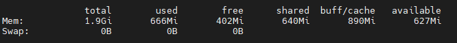
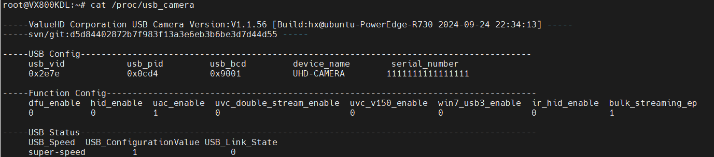
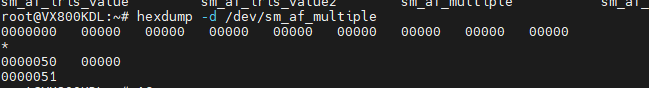

# RK3576 开发心得

## 1. 下载 SDK

```bash
mkdir rk3576 && cd rk3576

# 下载 repo 工具
git clone ssh://git@192.168.1.204:33/rk3576_linux/repo/repo.git

# 初始化并同步 SDK
python2.7 ./repo/repo init -u ssh://git@192.168.1.204:33/rk3576_linux/repo/manifests.git \
    -m rk3576_linux6.1_release.xml
python2.7 ./repo/repo sync
```

## 2. 下载 APP

```bash
# 应用代码
git clone ssh://git@192.168.1.204:33/rk3576/vhd_rk3576.git

# 交叉编译工具链
git clone ssh://git@192.168.1.204:33/rk3576/vhd_rk3576_cross_compiler.git

# VX800KDL 教育版代码
mkdir vx800kdl_edu && cd vx800kdl_edu
git clone ssh://git@192.168.1.204:33/rk3576/manifests.git
vcs import < manifests/vx800kdl_edu_sdk.repos

# 编译
cd software/v80x
./build_vx800kdl.sh
```

## 3. Kernel SDK 搭建

板级配置文件目录：`device/rockchip/rk3576/`

### 3.1 新建 defconfig

创建 `vhd_rk3576_vx800kdl_defconfig`：

```text
RK_UBOOT_SPL=y
RK_KERNEL_DTS_NAME="vhd-rk3576-vx800kdl"
RK_USE_FIT_IMG=y
RK_PARAMETER="parameter-vhd-8GB.txt"
RK_KERNEL_CFG="vhd_rk3576_linux_common_defconfig"
RK_KERNEL_CFG_FRAGMENTS="vhd-rk3576-vx800kdl-fragments.config"
```

### 3.2 需要添加的文件

- `vhd-rk3576-vx800kdl.dts` — 设备树
- `vhd_rk3576_linux_common_defconfig` — 内核默认配置
- `vhd-rk3576-vx800kdl-fragments.config` — 内核配置片段

## 4. 系统调试命令

### 4.1 CPU

```bash
cat /proc/cpuinfo
```

> RK3576 核心 0-3：Cortex-A53（节能核心），核心 4-7：Cortex-A72（高性能核心）

### 4.2 内存

```bash
free
```

| 字段 | 含义 |
| ------ | ------ |
| total | 系统总可用物理内存 |
| used | 已使用的物理内存 |
| free | 真正未被使用的物理内存 |
| shared | 被共享使用的物理内存 |
| buff/cache | 被 buffer 和 cache 使用的物理内存 |
| available | 应用程序可用的内存（≈ free + buffer + cache） |

> free 与 available 的区别：free 是真正尚未使用的物理内存；available 是应用程序认为可用的内存数量，当 free 不够时内核会回收 buffer/cache 来满足申请。



### 4.3 各子系统负载

```bash
# RGA（2D 图形加速）负载
cat /sys/kernel/debug/rkrga/load

# DDR 带宽
cat /sys/class/devfreq/dmc/load

# GPU 使用率
cat /sys/class/devfreq/27800000.gpu/load
```

### 4.4 中断

```bash
# 查看中断统计
cat /proc/interrupts

# 实时监控定时器中断
watch -n 1 grep timer /proc/interrupts
```

### 4.5 网络

```bash
# 查看端口状态
netstat -an
```

### 4.6 日志

```bash
rlogcat
```

### 4.7 USB 摄像头

```bash
cat /proc/usb_camera
```



### 4.8 AF（自动对焦）

```bash
hexdump -d /dev/sm_af_multiple
```



## 5. 升级内核

```bash
# 擦除 boot 分区
dd if=/dev/zero of=/dev/block/by-name/boot bs=1M count=40

# 写入新内核
dd if=/mnt/boot.img of=/dev/block/by-name/boot
```
