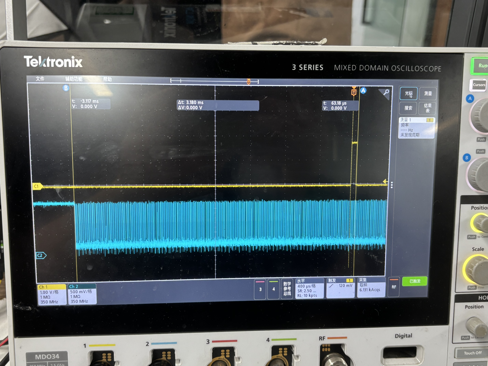
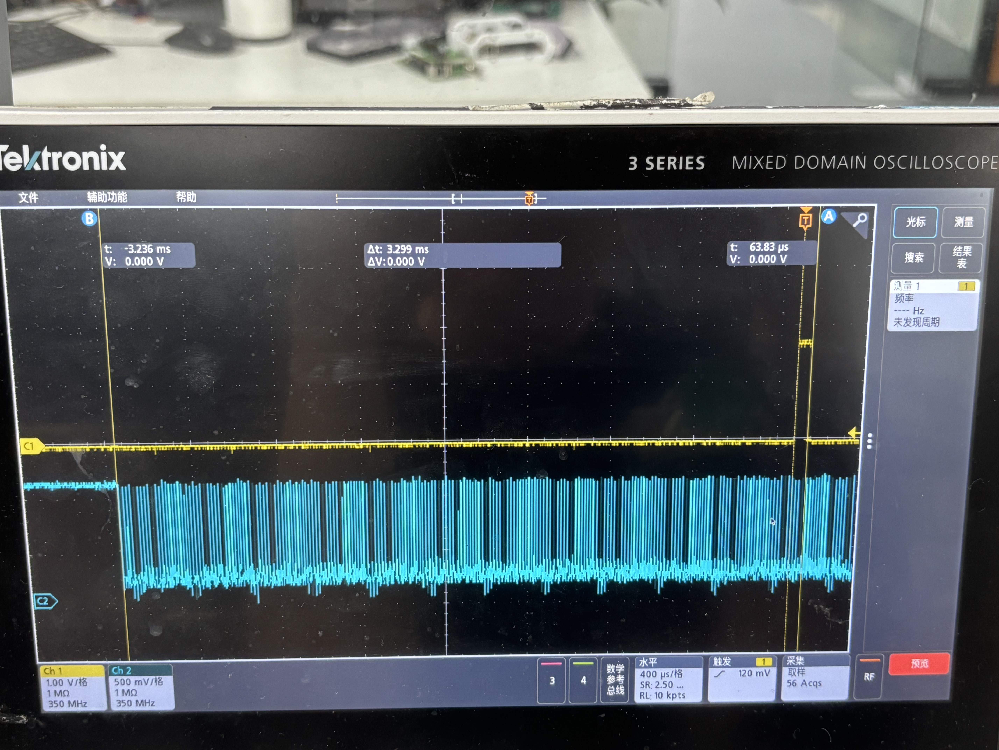
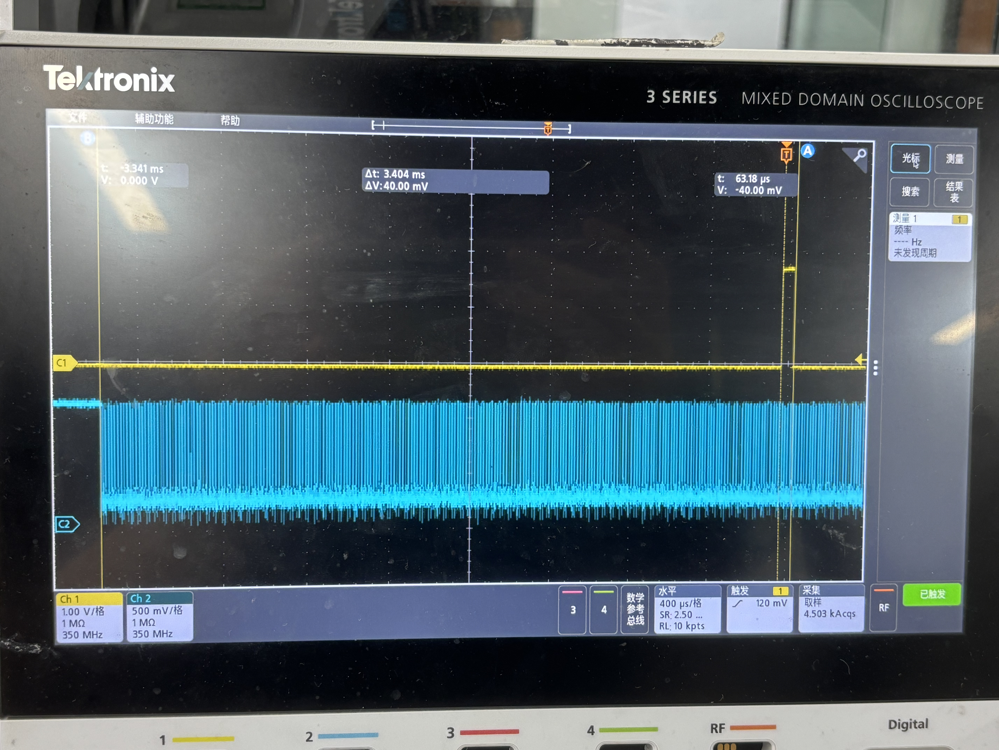
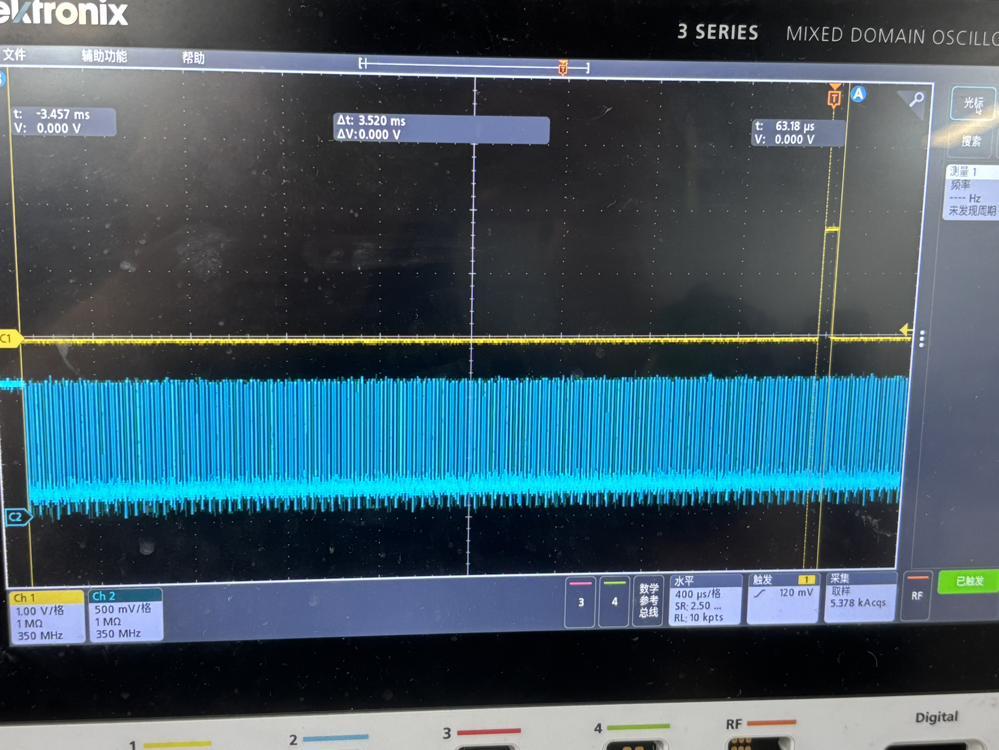
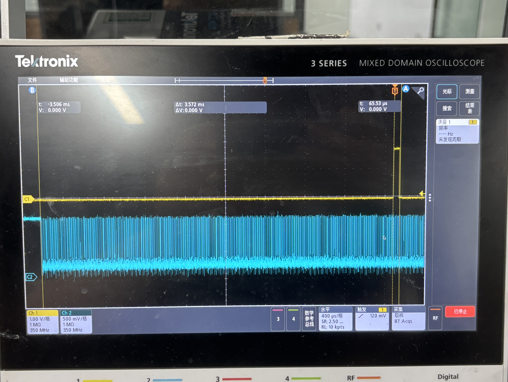
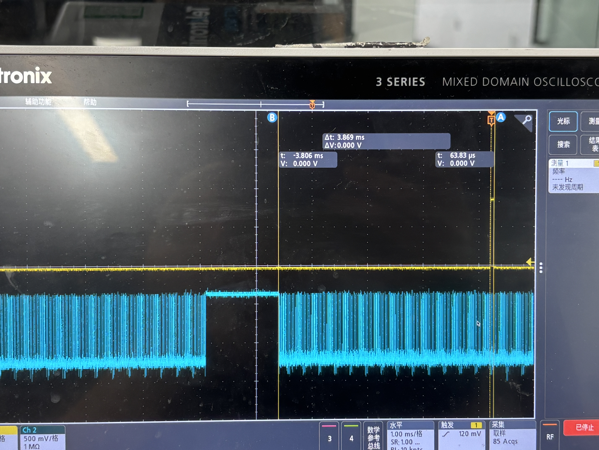
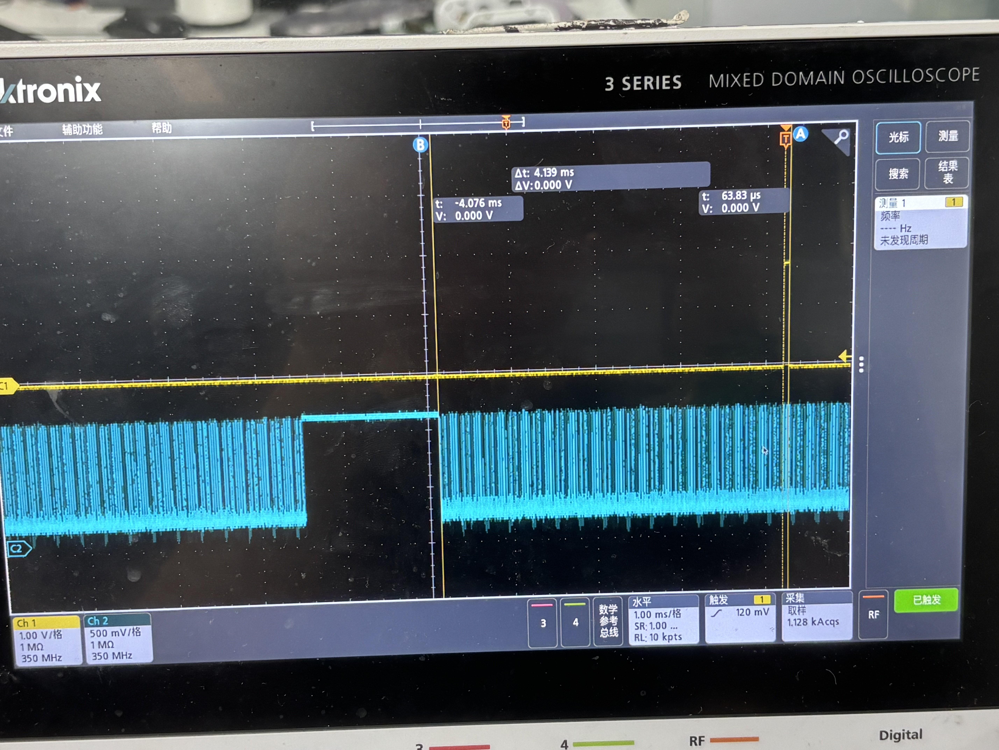
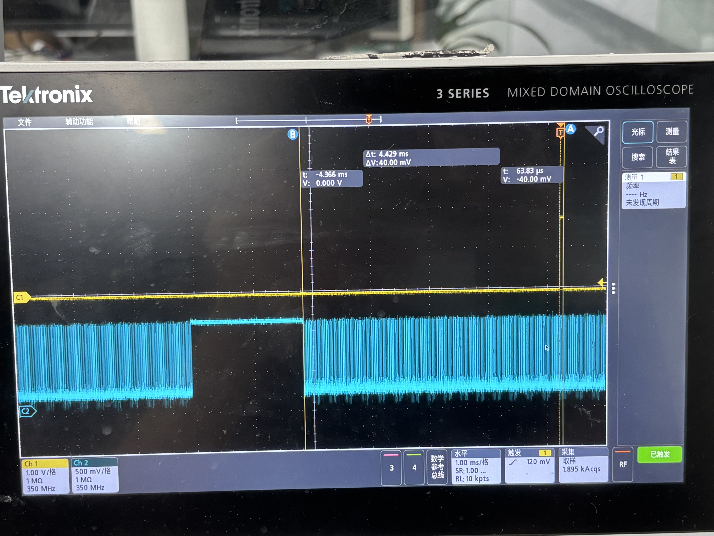
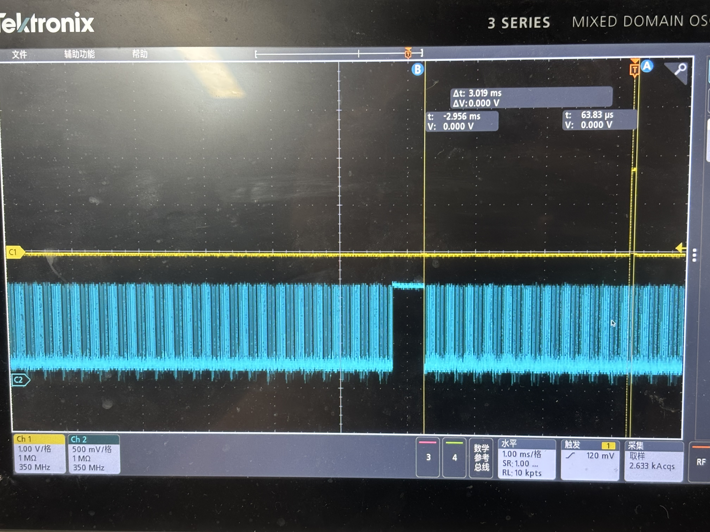

# ar2020 帧同步、频率、相位测试

## 测试环境

- **平台**：1900Q
- **sensor**：ar2020
- **接口**：D-PHY
- **Δt 定义**：vsync 信号下降沿到帧起始的间隔时间
- **备注**：SoC 产生的 vsync 本身存在 ±0.1 ms 的抖动

## 测试方法

以 vsync 信号为基准，测量帧起始位置的偏差（Δt）和抖动范围。VTS 模式设置为 auto（由 vsync 自动同步帧率）。

## 测试结果汇总

### 默认帧率 30 fps

| 序号 | vsync 帧率 | 实测帧率 | Δt 范围 | 帧起始抖动 | 截图 |
| ---- | ---------- | -------- | ------- | ---------- | ---- |
| 1 | 30.1 fps | 30.1 fps | -3.180 ms | — |  |
| 2 | 30 fps | 30 fps | -3.299 ms | — |  |
| 3 | 29.9 fps | 29.9 fps | -3.404 ms | — |  |
| 4 | 29.8 fps | 29.8 fps | -3.520 ms | — |  |
| 5 | 29.75 fps | 29.75 fps | -3.572 ms | — |  |
| 6 | 29.5 fps | 29.5 fps | -3.869 ms | — |  |
| 7 | 29.25 fps | 29.25 fps | -4.076 ms | — |  |
| 8 | 29 fps | 29 fps | -4.429 ms | — |  |
| 9 | 30.25 fps | — | -3.019 ms | — |  |

## 数据分析

### 30 fps Δt 与帧率偏差的关系

帧率每变化 **0.1 fps**，Δt 变化约 **110 μs**（即每 1 fps 约 1.1 ms）：

| vsync 帧率 | 帧率偏差 | Δt | 每 0.1 fps 增量 |
| ---------- | -------- | --- | --------------- |
| 30.1 fps | +0.1 fps | -3.180 ms | — |
| 30 fps | 0 | -3.299 ms | +119 μs |
| 29.9 fps | -0.1 fps | -3.404 ms | +105 μs |
| 29.8 fps | -0.2 fps | -3.520 ms | +116 μs |
| 29.75 fps | -0.25 fps | -3.572 ms | +104 μs |
| 29.5 fps | -0.5 fps | -3.869 ms | +119 μs |
| 29.25 fps | -0.75 fps | -4.076 ms | +83 μs |
| 29 fps | -1 fps | -4.429 ms | +141 μs |

> 注：ar2020 的 Δt 基线值（-3.299 ms）远大于 sp50e40（+260 μs），说明不同 sensor 的帧起始偏移差异较大；每 fps 增量（~1.1 ms）约为 sp50e40（~2.1 ms）的一半
