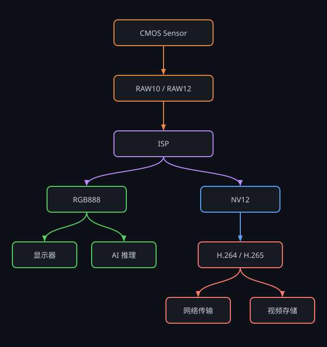

# 图像格式入门：RAW、RGB、YUV、NV12、MJPEG 一文讲透

> 从 CMOS Sensor 到 AI 推理、视频编码，彻底理解图像数据在视觉系统中的流转过程。


## 1. 为什么会有这么多图像格式

刚接触视觉系统时，会遇到一大堆名词：

```text
RAW10  RAW12  RGB888  RGB565  BGR888
YUYV   NV12   NV21    I420    MJPEG
H.264  H.265
```

很多人会疑惑：**为什么一张图要搞这么多格式？**

关键在于——**这些格式不是竞争关系，而是处于图像处理链路的不同阶段**。

```text
采集  →  处理  →  显示  →  编码  →  传输
```

每个阶段对**数据量、色彩精度、硬件亲和性**的要求不同，因此使用不同的格式。搞清楚"某个格式站在链路的哪个位置"，就理解了它存在的意义。

## 2. 图像处理链路全景图

理解下面这张图，就理解了本文 80% 的内容：



进一步简化成一条主线：

```text
RAW  →  ISP  →  RGB / YUV  →  编码  →  传输
```

后面提到的所有格式，都位于这条链路中的某个位置。

## 3. RAW：传感器最原始的数据

### 3.1 什么是 RAW

RAW 是 CMOS Sensor 输出的**原始数据**。IMX307、IMX335、IMX415、IMX585、OV5640、SC 系列……这些 Sensor 输出的都**不是** RGB，而是 **Bayer 阵列**排列的 RAW 数据。

原因很简单：Sensor 上每个像素点只覆盖了一种颜色滤光片，**只能感知一种颜色**。

最常见的排列（RGGB）：

```text
R G R G R G
G B G B G B
R G R G R G
G B G B G B
```

每个像素只知道自己是 R **或** G **或** B 中的一个分量，缺失的两个分量必须靠邻居"猜"出来。所以 RAW **无法直接显示**。

> 常见排列还有 BGGR、GRBG、GBRG 四种，驱动里配置错了会出现**红蓝互换**或**棋盘格**现象。

### 3.2 RAW8 / RAW10 / RAW12 / RAW14

| 格式 | 位深 | 每像素字节 | 特点 | 典型场景 |
| ---- | ---- | ---- | ---- | ---- |
| RAW8 | 8 bit | 1.0 B | 数据量最小，动态范围差 | 低端模组、调试 |
| RAW10 | 10 bit | 1.25 B | 数据量与画质平衡 | **监控领域主流** |
| RAW12 | 12 bit | 1.5 B | 动态范围高、暗光好 | 工业相机、车载、高端监控 |
| RAW14/16 | 14/16 bit | 1.75/2.0 B | 极高动态范围 | 科学成像、专业 HDR |

位深决定的是**动态范围**（能同时记录多亮和多暗）：

- RAW8：256 级灰阶
- RAW10：1024 级灰阶
- RAW12：4096 级灰阶

逆光、隧道口、夜间强光源等场景下，RAW12 相比 RAW10 能保留更多高光和暗部细节，这也是 HDR 效果的基础。

### 3.3 MIPI RAW10 的打包方式

RAW10 在 MIPI 总线上不是"1 像素占 2 字节"，而是**紧凑打包**：每 4 个像素打包进 5 个字节。

```text
Byte0    Byte1    Byte2    Byte3    Byte4
[P0 高8] [P1 高8] [P2 高8] [P3 高8] [P3P2P1P0 各低2位]
```

因此 RAW10 实际是 **1.25 Byte/pixel**。调试时如果按 2 字节对齐去解析，图像会呈现斜纹错位——这是新手调 RAW 抓图最常踩的坑。

## 4. ISP：图像质量的核心

RAW 数据无法直接显示，必须经过 **ISP**（Image Signal Processor）处理。

```text
RAW (Bayer)
   │
   ├─► BLC        黑电平校正
   ├─► LSC        镜头阴影校正
   ├─► DPC        坏点校正
   ├─► Demosaic   Bayer 插值 ★ 关键：RAW → RGB
   ├─► AWB        自动白平衡
   ├─► CCM        色彩校正矩阵
   ├─► Gamma      Gamma 校正
   ├─► NR / 3DNR  降噪
   ├─► Sharpen    锐化
   └─► CSC        色彩空间转换 ★ RGB → YUV
   │
   ▼
NV12 / YUV420
```

### 4.1 ISP 核心模块

| 模块 | 全称 | 作用 |
| ---- | ---- | ---- |
| BLC | Black Level Correction | 扣除暗电流带来的黑电平偏移 |
| DPC | Defect Pixel Correction | 修补 Sensor 坏点 |
| Demosaic | Demosaicing | Bayer 插值，把缺失的 R/G/B 分量补全 |
| AWB | Auto White Balance | 自动白平衡，消除色温偏色 |
| AE | Auto Exposure | 自动曝光，控制快门/增益 |
| AF | Auto Focus | 自动对焦 |
| NR | Noise Reduction | 2D/3D 降噪 |
| Gamma | Gamma Correction | 匹配人眼非线性亮度感知 |
| CCM | Color Correction Matrix | 色彩还原校正 |
| CSC | Color Space Conversion | RGB ↔ YUV 转换 |

> **ISP 的调校（Tuning）水平往往直接决定夜视效果是否优秀**。同一颗 Sensor，不同厂家的 ISP 参数出来的画质可能天差地别。这也是海思、安霸在监控领域长期占据优势的核心原因之一。

### 4.2 Demosaic 做了什么

以 RGGB 为例，对于一个只有 R 值的像素，ISP 需要从周围 G、B 像素插值出它的 G、B 分量：

```text
插值前（每像素 1 个分量）      插值后（每像素 3 个分量）
   R  G  R  G                   RGB RGB RGB RGB
   G  B  G  B         ───►      RGB RGB RGB RGB
   R  G  R  G                   RGB RGB RGB RGB
```

数据量在这一步**膨胀 3 倍**，这也是为什么后面必须转 YUV 压缩。

## 5. RGB：最直观的图像格式

RGB 由三个颜色分量组成：Red、Green、Blue。

### 5.1 RGB888

最常见的格式：

```text
R = 8 bit
G = 8 bit
B = 8 bit
────────────
合计 24 bit = 3 Byte/Pixel
```

内存排布（Packed，交错存放）：

```text
R0 G0 B0 | R1 G1 B1 | R2 G2 B2 | ...
```

### 5.2 RGB565

嵌入式 LCD 常见，为了省一半内存和带宽：

```text
R = 5 bit
G = 6 bit   ← 绿色多 1 bit，因为人眼对绿色最敏感
B = 5 bit
────────────
合计 16 bit = 2 Byte/Pixel
```

单个 16 bit 的位排布：

```text
 15        11 10          5 4         0
┌────────────┬─────────────┬───────────┐
│  R (5bit)  │   G (6bit)  │  B (5bit) │
└────────────┴─────────────┴───────────┘
```

常见于 STM32、ESP32、MCU 屏幕、小尺寸 SPI LCD。缺点是渐变区域容易出现**色带（Banding）**。

### 5.3 OpenCV 的 BGR 坑

很多新人踩过这个坑：

```python
img = cv2.imread("test.jpg")   # 读出来是 BGR，不是 RGB！
```

OpenCV 历史原因默认使用 **BGR** 排列。如果直接把它喂给按 RGB 训练的模型或用 matplotlib 显示，会出现**红蓝互换**（人脸发蓝、天空发红）。

```python
# 正确做法
rgb = cv2.cvtColor(img, cv2.COLOR_BGR2RGB)
```


## 6. YUV：视频行业的核心格式

### 6.1 RGB 的问题：数据量太大

以 1080P 为例：

```text
1920 × 1080 × 3 Byte ≈ 6.22 MB / 帧
30 FPS: 6.22 × 30 ≈ 186 MB/s
```

这个带宽对 DDR、总线、USB 都是巨大压力。

### 6.2 YUV 的核心思想

YUV 把图像拆成三个分量：

| 分量 | 含义 | 说明 |
| ---- | ---- | ---- |
| Y | Luma，亮度 | 相当于一张黑白图 |
| U (Cb) | 蓝色色差 | B − Y |
| V (Cr) | 红色色差 | R − Y |

核心依据是一个生理学事实：

> **人眼对亮度（Y）极其敏感，对色度（U/V）相对迟钝。**

所以可以**完整保留 Y，对 U/V 做降采样**，在视觉上几乎无损的前提下大幅减少数据量。

### 6.3 转换公式（BT.601）

```text
Y =  0.299 R + 0.587 G + 0.114 B
U = -0.169 R - 0.331 G + 0.500 B + 128
V =  0.500 R - 0.419 G - 0.081 B + 128
```

> 注意还有 BT.709（HD）、BT.2020（UHD）等不同标准，以及 **Full Range (0-255)** 与 **Limited Range (16-235)** 之分。转换标准或 Range 用错，会导致画面**发灰**或**对比度过冲**，这是跨平台移植时的经典问题。

## 7. YUV444 / YUV422 / YUV420 的区别

采样表示法 `J:a:b`，可以理解为在 4×2 的像素块里保留多少色度样本。

### 7.1 YUV444（4:4:4）

```text
Y Y Y Y        每个像素都有独立的 U 和 V
U U U U
V V V V
```

- 每像素 3 Byte，无压缩
- 画质最好，用于专业后期、色键抠图

### 7.2 YUV422（4:2:2）

```text
Y Y Y Y        水平方向每 2 个像素共享一组 UV
 U   U
 V   V
```

- 每像素 2 Byte，色度**水平**减半
- 典型格式：**YUYV**、UYVY
- 常见于 USB 摄像头、广播级设备、SDI

### 7.3 YUV420（4:2:0）

```text
Y Y Y Y        水平 + 垂直方向，每 2×2 个像素共享一组 UV
Y Y Y Y
  U
  V
```

- 每像素 1.5 Byte，色度水平垂直都减半
- 数据量最小、编码效率最高
- **目前视频行业绝对主流**：NV12、NV21、I420 都属于 YUV420

### 7.4 对比

| 格式 | 色度采样 | 每像素字节 | 相对 RGB888 | 典型用途 |
| ---- | ---- | ---- | ---- | ---- |
| YUV444 | 1:1 | 3.0 B | 100% | 专业后期、抠像 |
| YUV422 | 水平 1/2 | 2.0 B | 67% | USB 摄像头、SDI |
| YUV420 | 水平垂直各 1/2 | 1.5 B | 50% | 编码、AI、显示 |

## 8. YUYV：USB 摄像头最常见格式

YUYV（也写作 YUY2）属于 YUV422 的 **Packed** 排列。

```text
存储顺序：  Y0  U0  Y1  V0   Y2  U1  Y3  V1  ...
             └──────┬──────┘
             Pixel0 = (Y0, U0, V0)
             Pixel1 = (Y1, U0, V0)   ← 与 Pixel0 共享 UV
```

**每 4 个字节表示 2 个像素**，所以是 2 Byte/pixel。

| 优点 | 缺点 |
| ---- | ---- |
| 未经压缩，画质无损 | 数据量大，1080P@30 约 124 MB/s |
| 几乎所有 USB 摄像头都支持 | USB2.0 带宽扛不住 1080P30 |
| 无解码开销，延时低 | 高分辨率时帧率被迫下降 |

在 Linux 下可以直接查看：

```bash
v4l2-ctl -d /dev/video0 --list-formats-ext
```

典型输出会看到 `YUYV` 和 `MJPG` 两种，其中 YUYV 在 1080P 下通常只能跑到 5 FPS，而 MJPG 能跑满 30 FPS——这正是 USB2.0 带宽限制导致的。

## 9. NV12：视频行业事实标准

**如果只能掌握一个格式，请优先掌握 NV12。**

### 9.1 存储结构

NV12 属于 YUV420 的 **Semi-Planar**（半平面）排列：Y 单独一个平面，U 和 V 交错放在第二个平面。

```text
┌──────────────────────────┐
│                          │
│      Y Plane             │   W × H 字节
│   (亮度，全分辨率)         │
│                          │
├──────────────────────────┤
│   UV Plane (交错)         │   W × H / 2 字节
│   U0 V0 U1 V1 U2 V2 ...  │
└──────────────────────────┘
   总计 W × H × 1.5 字节
```

以 4×4 图像为例：

```text
Y  平面:  Y00 Y01 Y02 Y03
          Y10 Y11 Y12 Y13
          Y20 Y21 Y22 Y23
          Y30 Y31 Y32 Y33

UV 平面:  U0 V0 U1 V1        ← 对应左上、右上 2×2 块
          U2 V2 U3 V3        ← 对应左下、右下 2×2 块
```

### 9.2 为什么 NV12 如此重要

因为**整条产业链都围绕它构建**：

| 环节 | 支持情况 |
| ---- | ---- |
| ISP 输出 | 原生输出 NV12 |
| 硬件编码器 | H.264/H.265 编码器输入直接吃 NV12 |
| 硬件解码器 | 解码输出即 NV12 |
| GPU / 显示控制器 | 支持 NV12 直接叠加送显（零拷贝） |
| AI NPU | 多数 NPU 支持 NV12 输入，内部转 RGB |
| VPSS / 缩放模块 | 缩放、裁剪都以 NV12 为基础格式 |

**用 NV12 就能全程零拷贝（Zero-Copy）**，用别的格式就要来回做格式转换，白白吃掉 CPU 和内存带宽。

### 9.3 为什么是 UV 交错而不是分离

因为**硬件读取效率更高**：编码器需要同时用到 U 和 V，交错存放可以一次 DMA 突发读出，Cache 命中率更好。这是纯粹的工程优化。

### 9.4 常见平台

| 平台 | 芯片 | 说明 |
| ---- | ---- | ---- |
| 海思 HiSilicon | Hi3516 / Hi3559 | VI→VPSS→VENC 全链路 NV12 |
| 瑞芯微 Rockchip | RK3588 / RK3576 | RGA / MPP / RKNN 均支持 |
| 安霸 Ambarella | CV22 / CV72 | IAV 框架 DSP 输出 NV12 |
| Sigmastar | SSC268G | SCL / VENC 走 NV12 |
| 地平线 Horizon | X3 / J5 | BPU 推理支持 NV12 输入 |
| NVIDIA | Jetson 系列 | NvBufSurface 默认 NV12 |

### 9.5 Stride 对齐的坑

实际内存中，一行的实际宽度（Stride）通常大于图像宽度（Width），因为硬件要求 16/32/64 字节对齐：

```text
Width  = 1920            实际有效数据
Stride = 1920 或 2048    内存中一行占用的字节数

┌───────────── Stride ─────────────┐
┌────────── Width ──────────┬──────┐
│      有效图像数据           │ Padding │
└───────────────────────────┴──────┘
```

**直接按 `width × height × 1.5` 拷贝数据是错的**，必须按行 memcpy：

```c
for (int i = 0; i < height; i++)
    memcpy(dst + i * width, src + i * stride, width);
```

否则会看到图像**斜切、错位**——这是 NV12 调试中排名第一的坑。

## 10. NV21 与 I420

三者都是 YUV420，区别只在**内存排列**：

| 格式 | 类型 | UV 排布 | 主要出处 |
| ---- | ---- | ---- | ---- |
| **NV12** | Semi-Planar | `U V U V U V ...` | 芯片硬件、Windows、Jetson |
| **NV21** | Semi-Planar | `V U V U V U ...` | **Android Camera API** |
| **I420 (YU12)** | Planar | `UUUU... VVVV...` | FFmpeg、WebRTC、libyuv、x264 |

图示：

```text
NV12:   [YYYYYYYY][UVUVUVUV]
NV21:   [YYYYYYYY][VUVUVUVU]
I420:   [YYYYYYYY][UUUU][VVVV]
YV12:   [YYYYYYYY][VVVV][UUUU]     ← I420 的 U/V 平面对调
```

> **NV12 和 NV21 弄反的现象**：画面整体正常，但**人脸偏绿/偏紫**，蓝天变成粉色。看到这种"亮度正常、颜色诡异"的图，第一反应就应该去查 UV 顺序。

格式转换推荐使用 Google 的 **libyuv**，有 NEON/SSE 优化：

```c
NV12ToI420(...);  I420ToRGB24(...);  NV12ToARGB(...);
```

## 11. MJPEG：压缩后的图像流

### 11.1 MJPEG 的本质

MJPEG（Motion JPEG）= **一连串独立的 JPEG 图片**：

```text
[JPEG 帧1][JPEG 帧2][JPEG 帧3][JPEG 帧4] ...
```

每一帧都是**完整独立的 JPEG 图像**，帧与帧之间没有任何关联。

### 11.2 为什么需要 MJPEG

USB2.0 的实际有效带宽约 **35~40 MB/s**：

| 格式 | 1080P@30 带宽 | USB2.0 能否承载 |
| ---- | ---- | ---- |
| YUYV | ≈ 124 MB/s | ✗ 只能跑到 5 FPS |
| MJPEG | ≈ 10~30 MB/s | ✓ 可跑满 30 FPS |

所以绝大多数 USB 摄像头都提供 MJPEG 作为高帧率模式。

### 11.3 MJPEG 的优缺点

| 优点 | 缺点 |
| ---- | ---- |
| 每帧独立，丢帧不影响后续（无错误扩散） | 压缩率远低于 H.264（约差 5~10 倍） |
| 无帧间依赖，随机访问、剪辑方便 | 无法利用帧间冗余 |
| 编解码简单，延时低 | 高分辨率下码率仍然很大 |
| 兼容性极好 | 存在 JPEG 块效应 |

适合：USB 摄像头、工业检测（要求每帧独立）、低延时场景。
不适合：长时间录像、网络传输（用 H.264/H.265）。

## 12. H.264 / H.265 是什么

很多人误以为 "H.264 是一种图像格式"——**不是**。它属于**视频编码格式（Codec）**。

### 12.1 核心区别

- MJPEG：只做**帧内压缩**（每帧单独压）
- H.264/H.265：做**帧内 + 帧间压缩**（利用相邻帧的相似性）

```text
MJPEG:    [I][I][I][I][I][I][I][I]      每帧都是完整图
H.264:    [I][P][P][P][B][P][P][I]      只有 I 帧完整，P/B 帧存"差异"
           ▲                    ▲
        关键帧                 关键帧（GOP 边界）
```

| 帧类型 | 全称 | 说明 |
| ---- | ---- | ---- |
| I 帧 | Intra Frame | 关键帧，可独立解码，体积最大 |
| P 帧 | Predicted Frame | 参考前面的帧，只存差异 |
| B 帧 | Bi-directional | 同时参考前后帧，压缩率最高，但增加延时 |

> 监控/实时场景通常**关闭 B 帧**，因为 B 帧需要缓存后续帧才能解码，会引入额外延时。

### 12.2 编码流程

```text
Sensor → ISP → NV12 → 硬件编码器(VENC) → H.264/H.265 码流
                                              │
                          ┌───────────────────┼──────────────────┐
                          ▼                   ▼                  ▼
                     RTSP 推流            存储 MP4           RTMP 直播
```

### 12.3 H.264 vs H.265

| 对比项 | H.264 (AVC) | H.265 (HEVC) |
| ---- | ---- | ---- |
| 同画质码率 | 基准 | **节省约 40~50%** |
| 编码复杂度 | 低 | 高（约 2~5 倍） |
| 最大块尺寸 | 16×16 宏块 | 64×64 CTU |
| 兼容性 | 极好，浏览器原生支持 | 需硬件支持，Web 端受限 |
| 专利授权 | 相对清晰 | 复杂（多个专利池） |
| 典型用途 | 通用、Web、老设备 | 4K/8K、高码率节省场景 |

工程建议：**兼容性优先选 H.264，带宽/存储紧张选 H.265**。

## 13. AI 视觉中的图像格式

YOLO、TensorRT、RKNN、昇腾等推理框架通常使用 **RGB888** 作为输入。

### 13.1 典型流程

```text
Sensor(RAW) → ISP → NV12 ─┬─► VENC → H.264 → 录像/推流
                          │
                          └─► 缩放/裁剪 → RGB888 → 归一化 → NPU 推理 → 检测框
```

关键点：**AI 推理和视频编码走的是同一份 NV12 数据的两个分支**，不需要重复采集。

### 13.2 前处理链路

```text
NV12 (1920×1080)
   │  ① 缩放 (硬件加速：RGA / VPSS / VGS)
   ▼
NV12 (640×640)
   │  ② 色彩空间转换 CSC
   ▼
RGB888 Packed (HWC)
   │  ③ 通道转换
   ▼
RGB Planar (CHW)
   │  ④ 归一化 (x - mean) / std
   ▼
float32 / int8 Tensor → NPU
```

**优化建议**：步骤 ①② 尽量用硬件模块（RK 的 RGA、海思的 VGS、安霸的 DSP）完成，用 CPU 做 NV12→RGB 转换在 1080P 下会吃掉一整个核。

### 13.3 AI 项目最常见的三个格式

| 格式 | 出现位置 |
| ---- | ---- |
| NV12 | 摄像头 / ISP / 编码链路 |
| RGB888 | 模型输入（PyTorch、TensorRT 训练侧默认） |
| BGR888 | OpenCV 处理链路、部分 Caffe 时代模型 |

### 13.4 三个高频精度坑

1. **RGB / BGR 弄反** → 检测框乱飘、置信度普遍偏低
2. **归一化参数不一致** → 训练用 `/255` 部署用 `-128`，输出完全错乱
3. **Resize 方式不同** → 训练用 Letterbox（保持宽高比+填充），部署直接拉伸，小目标漏检

> 部署掉点时，**先排查前处理，再怀疑量化**。八成问题出在前处理上。

## 14. 常见格式数据量对比

以 **1920 × 1080** 为例（1 MB = 10⁶ Byte）：

| 格式 | 每像素占用 | 单帧大小 | 30 FPS 带宽 | 相对 RGB888 |
| ---- | ---- | ---- | ---- | ---- |
| RGB888 / BGR888 | 3.0 Byte | 6.22 MB | 186 MB/s | 100% |
| RGB565 | 2.0 Byte | 4.15 MB | 124 MB/s | 67% |
| YUYV (YUV422) | 2.0 Byte | 4.15 MB | 124 MB/s | 67% |
| RAW12 | 1.5 Byte | 3.11 MB | 93 MB/s | 50% |
| **NV12 / NV21 / I420** | **1.5 Byte** | **3.11 MB** | **93 MB/s** | **50%** |
| RAW10 (packed) | 1.25 Byte | 2.59 MB | 78 MB/s | 42% |
| RAW8 | 1.0 Byte | 2.07 MB | 62 MB/s | 33% |
| MJPEG | 压缩后 | 0.1~1 MB | 3~30 MB/s | 2~16% |
| H.264 (4 Mbps) | 压缩后 | ≈ 0.017 MB | 0.5 MB/s | **0.27%** |

结论一目了然：

- **未压缩格式之间**，NV12 已经是数据量最小的实用选择
- **真正的数量级差距来自编码**，H.264 比 NV12 小两个数量级

## 15. 工程实践中的格式选择

| 场景 | 推荐格式 | 原因 |
| ---- | ---- | ---- |
| USB 摄像头采集（USB2.0） | **MJPEG** | 带宽不够，YUYV 跑不满帧率 |
| USB 摄像头采集（USB3.0） | YUYV / NV12 | 带宽充足，避免解码开销 |
| MIPI Sensor 采集 | **RAW10 / RAW12** | 保留最大信息量给 ISP |
| ISP 输出 / 内部流转 | **NV12** | 全链路零拷贝 |
| 视频编码输入 | **NV12** | 编码器原生格式，效率最高 |
| AI 推理输入 | **RGB888** | 主流框架默认 |
| LCD 显示（MCU/小屏） | RGB565 | 省内存和带宽 |
| LCD 显示（SoC/大屏） | NV12 / RGB888 | 显示控制器可直接叠加 NV12 |
| 网络传输 | **H.264 / H.265** | 只有编码后才可能实时传输 |
| 图像算法调试 | BGR888 | OpenCV 生态 |
| 工业检测（单帧质量优先） | RAW / MJPEG | 无帧间损失 |

### 15.1 一条实用原则

> **在链路中尽可能长时间地保持 NV12，只在最后必须的地方才转换格式。**

每一次格式转换都意味着一次内存拷贝和 CPU/带宽消耗。典型的糟糕设计：

```text
✗ NV12 → RGB → 处理 → NV12 → 编码       多了两次无谓转换
✓ NV12 ─┬─► 编码
        └─► RGB（仅 AI 分支，且用硬件转）
```

### 15.2 排查格式问题的速查表

| 现象 | 可能原因 |
| ---- | ---- |
| 图像整体斜切、错位 | Stride 未对齐，或按 width 而非 stride 拷贝 |
| 亮度正常但颜色诡异（人脸偏绿/紫） | NV12 / NV21 的 UV 顺序反了 |
| 红蓝互换 | RGB / BGR 弄反，或 Bayer 排列配置错误 |
| 画面出现棋盘格、网格纹 | Bayer 相位（RGGB/BGGR）错误 |
| 画面发灰、对比度不足 | YUV Range（Full/Limited）不匹配 |
| 上半部分正常、下半部分绿色 | UV 平面数据缺失或长度算错 |
| 渐变区域出现色带 | RGB565 位深不足，或 Gamma 处理不当 |
| 图像上下颠倒 | 部分平台 BMP/纹理上传的行序相反 |

## 16. 常见面试题

**Q1：RAW 和 RGB 有什么区别？**

RAW 是 Sensor 直出的原始 Bayer 数据，每个像素只有一个颜色分量，无法直接显示；RGB 是经过 ISP 去马赛克等处理后的彩色图像，每个像素有完整的 R/G/B 三个分量。RAW 数据量小但需要 ISP，RGB 可直接显示但数据量大 3 倍。

**Q2：为什么 H.264 编码器输入通常是 NV12？**

因为 NV12 就是 YUV420，而 H.264/H.265 标准本身规定的编码色度采样格式就是 4:2:0。硬件编码器内部按 YUV420 设计，直接吃 NV12 无需转换；同时 YUV420 数据量只有 RGB 的一半，且 UV 交错排列对硬件 DMA 友好。

**Q3：NV12 和 NV21 的区别？**

只有 UV 平面的字节顺序不同：NV12 是 `UVUVUV...`，NV21 是 `VUVUVU...`。两者都是 YUV420 Semi-Planar，Y 平面完全一致。NV12 是芯片和 Windows 主流，NV21 是 Android Camera API 的默认输出。弄反的表现是亮度正常但颜色异常。

**Q4：NV12 和 I420 的区别？**

NV12 是 Semi-Planar（Y 平面 + UV 交错平面，共 2 个平面），I420 是 Planar（Y、U、V 三个独立平面）。数据量完全相同（1.5 B/pixel），只是内存组织不同。硬件偏好 NV12，软件库（FFmpeg/WebRTC）偏好 I420。

**Q5：OpenCV 默认是 RGB 吗？**

不是，是 **BGR**。`cv2.imread()`、`cv2.VideoCapture` 读出来都是 BGR 排列，需要 `cv2.cvtColor(img, cv2.COLOR_BGR2RGB)` 才能得到 RGB。

**Q6：YUV420 为什么能压缩色度而画质几乎不降？**

因为人眼视网膜中感知亮度的视杆细胞数量远多于感知色彩的视锥细胞，对亮度边缘的分辨能力比色彩边缘高得多。降低色度分辨率在正常观看距离下几乎不可察觉，但数据量能减少 50%。

**Q7：RAW10 一个像素占几个字节？**

在 MIPI 打包格式下是 **1.25 字节**（4 个像素打包进 5 个字节：4 个高 8 位 + 1 个字节存放 4 个低 2 位）。如果是 unpacked 存储则占 2 字节，实际只用低 10 位。

**Q8：为什么 USB 摄像头 1080P 用 YUYV 只有 5 FPS？**

USB2.0 有效带宽约 35~40 MB/s，而 1080P YUYV 单帧 4.15 MB，30 FPS 需要 124 MB/s，远超带宽上限。40 ÷ 4.15 ≈ 9，考虑协议开销后实际只能跑到 5 FPS 左右。改用 MJPEG 压缩后即可跑满 30 FPS。

**Q9：Stride 和 Width 有什么区别？**

Width 是图像的有效像素宽度，Stride（Pitch）是内存中一行实际占用的字节数。硬件通常要求 16/32/64 字节对齐，所以 Stride ≥ Width，多出的部分是 Padding。拷贝图像必须逐行按 Stride 偏移，否则图像会斜切错位。

**Q10：MJPEG 和 H.264 的本质区别？**

MJPEG 只做帧内压缩，每帧都是独立完整的 JPEG；H.264 除帧内压缩外还做帧间预测（P/B 帧只存与参考帧的差异），因此压缩率高出 5~10 倍。代价是 H.264 存在帧间依赖，丢包会导致错误扩散直到下一个 I 帧。

## 17. 总结

对于视觉开发工程师，最值得掌握的格式优先级：

| 优先级 | 格式 | 理由 |
| ---- | ---- | ---- |
| ★★★★★ | **NV12** | 整条视频链路的事实标准 |
| ★★★★★ | **RAW10 / RAW12** | Sensor 调试、ISP 调优的起点 |
| ★★★★★ | **RGB888 / BGR888** | AI 推理与图像算法的通用输入 |
| ★★★★☆ | H.264 / H.265 | 存储与传输的必经之路 |
| ★★★★☆ | YUYV | USB 摄像头调试高频遇到 |
| ★★★☆☆ | MJPEG | USB 高帧率方案 |
| ★★★☆☆ | I420 / NV21 | FFmpeg / Android 场景 |
| ★★☆☆☆ | RGB565 | MCU 小屏显示 |

最后记住这条主线：

```text
      RAW              (Sensor 直出，Bayer 阵列)
       ↓
      ISP              (去马赛克、AWB、降噪、Gamma)
       ↓
     NV12              (全链路流转的通用货币)
       ↓
   ┌───┴───┐
   ▼       ▼
 RGB888  H.264/H.265
(显示/AI)  (存储/传输)
```

**理解了这条链路，就掌握了摄像头、监控、机器人视觉系统中绝大多数图像格式的本质。**

## 参考

- [MIPI CSI-2 接口基础知识](/docs/sensor/mipi)
- [V4L2 框架](/docs/sensor/v4l2)
- [IAV 框架](/docs/sensor/iav)
- [Linux Camera 驱动调试](/docs/sensor/sensor_drive)
