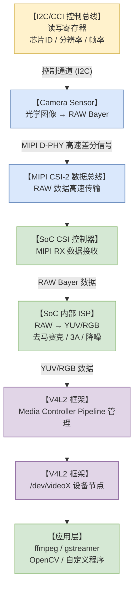
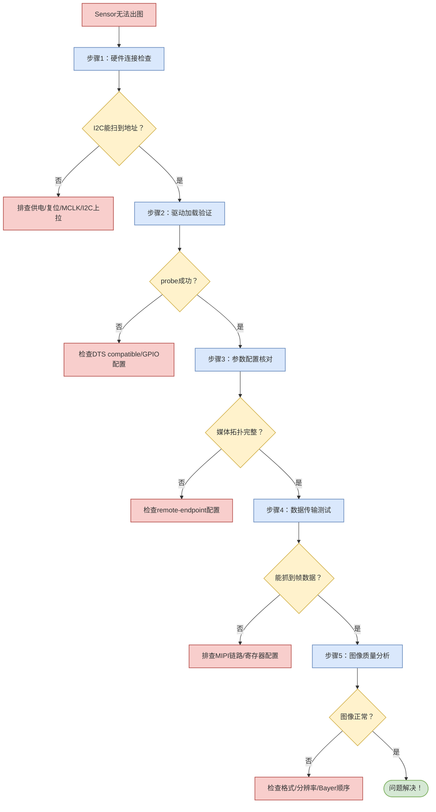
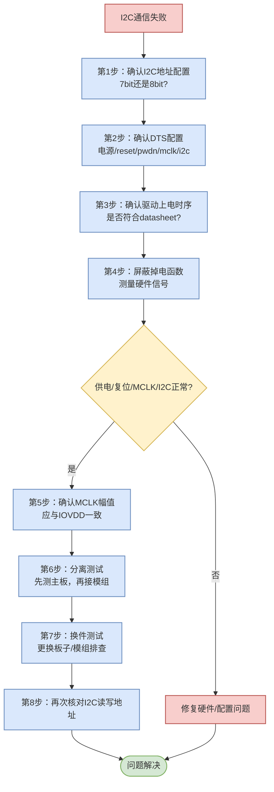
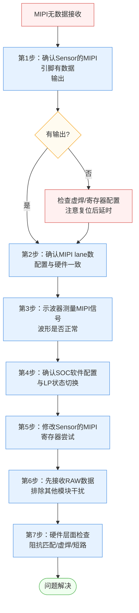
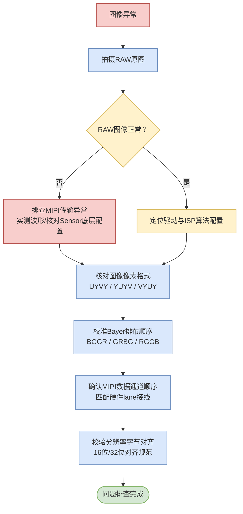

# Linux Camera驱动调试避坑指南：Sensor黑屏排查完全手册（V4L2+MIPI CSI全流程）

linux Camera无法出图，问题可能出在硬件连接、驱动加载、参数配置、数据传输、图像质量任何一个层面。本文整合多个项目中的实战资源，系统化梳理并配合关键命令和日志分析，让你遇到问题不再迷茫！

## 一、Camera系统完整数据链路

嵌入式Linux Camera系统的典型架构如下：



各层面对应的排查重点：

| 层面 | 关键组件 | 排查重点 | 调试工具 |
| :--- | :--- | :--- | :--- |
| **Sensor层** | 电源/时钟/复位 | 硬件信号是否正常 | 万用表、示波器 |
| **I2C控制面** | I2C总线/寄存器 | 能否通信、读写ID | `i2cdetect`、`i2cget` |
| **MIPI数据面** | MIPI D-PHY/CSI | 数据是否传输 | 示波器、逻辑分析仪 |
| **驱动层** | V4L2 subdev | probe、设备树 | `dmesg`、`lsmod` |
| **Pipeline层** | Media Controller | 拓扑链路完整 | `media-ctl` |
| **应用层** | `/dev/videoX` | 格式/抓帧/出图 | `v4l2-ctl` |

---

## 二、常见故障类型总览

Sensor无法出图，问题通常出在以下5个层面：

| 故障层级 | 常见表现 | 排查优先级 |
| :--- | :--- | :--- |
| **硬件连接层** | I2C扫描不到地址、完全无响应 | **最高** |
| **驱动加载层** | probe失败、无设备节点 | **高** |
| **参数配置层** | 链路不通、格式不匹配 | **中** |
| **数据传输层** | 有设备但抓不到数据、花屏 | **中** |
| **图像质量层** | 偏色、模糊、掉帧 | **低** |

### 2.1 分层排查总流程



> **💡 调试心法口诀：** 先硬件后软件，先简单后复杂，先通信后出图。

---

## 三、步骤1：硬件连接检查与I2C通信故障排查

一般的平台在开机过程，camera驱动框架都会对sensor进行探测。如果确实存在相应的硬件，将会产生`/dev/video`节点；如果探测异常，则没有相应的节点。探测过程一般是通过I2C驱动sensor的chipid，在这个过程中遇到最多的就是I2C通信失败。

### 3.1 硬件检查清单
- [ ] 电源电压正常（AVDD/DVDD/IOVDD）
- [ ] MCLK时钟有输出
- [ ] RSTN/PWDN引脚电平正确
- [ ] I2C上拉电阻焊接（4.7KΩ）
- [ ] MIPI排线连接牢固、方向正确

### 3.2 关键命令操作
```bash
# 检查I2C总线
i2cdetect -l

# 扫描I2C设备（以i2c-1为例）
i2cdetect -y 1
```
**正常输出示例：**
```text
     0  1  2  3  4  5  6  7  8  9  a  b  c  d  e  f
00:          -- -- -- -- -- -- -- -- -- -- -- -- --
10: -- -- -- -- -- -- -- -- -- -- UU -- -- -- -- --
20: -- -- -- -- -- -- -- -- -- -- -- -- -- -- -- --
```

### 3.3 I2C通信失败8步排查法
**症状：** `i2cdetect`全是"--"，找不到Sensor地址。



详细步骤说明：

| 步骤 | 检查内容 | 关键点 |
| :--- | :--- | :--- |
| **第1步** | 确认Sensor的I2C地址配置 | I2C通信地址是7bit，不同平台配置可能存在差异（7bit/8bit） |
| **第2步** | 确认DTS配置 | 电源（ldo连接/电压）、reset引脚、pwdn引脚、mclk引脚、i2c引脚 |
| **第3步** | 确认驱动上电时序 | 按照sensor datasheet的上电流程：配置电源→拉低reset/pwdn→释放复位 |
| **第4步** | 屏蔽掉电函数，测量硬件信号 | 屏蔽sensor掉电函数使其保持上电，用万用表测量供电/reset/pwdn/mclk/I2C上拉 |
| **第5步** | 确认MCLK幅值 | **特别注意**：MCLK幅值与IOVDD应一致，幅值很小需检查硬件或软件配置 |
| **第6步** | 分离测试 | 拆下模组单独测试主板信号，确认正常后再接模组测量 |
| **第7步** | 换件测试 | 以上条件都满足但仍失败，更新板子/模组进行测试 |
| **第8步** | 再次确认I2C地址 | 使用 `i2cdetect` 命令进行设备探测 |

> **调试心法：** 本来换件测试也可以放到第一步进行的，但是我习惯放到最后，先怀疑自己，再考虑其他~

**手动GPIO控制测试**
```bash
# 如果是GPIO控制问题，手动操作GPIO测试
# 以GPIO5为例，设置为输出并拉高
echo 5 > /sys/class/gpio/export
echo out > /sys/class/gpio/gpio5/direction
echo 1 > /sys/class/gpio/gpio5/value
```

### 3.4 能扫描到地址但读ID失败
**症状：** `i2cdetect`能看到地址，但`i2cget`读取失败。

**排查步骤：**
1. **检查I2C地址是否左移**：部分Sensor地址需要左移一位。
2. **确认寄存器地址**：查阅规格书，确认芯片ID寄存器地址。
3. **检查MCLK质量**：用示波器看时钟是否有抖动。
4. **验证命令**：
```bash
# 尝试不同的读取方式
i2cget -f -y 1 0x10 0x00      # 8位寄存器
i2cget -f -y 1 0x10 0x00 w    # 16位寄存器
```

---

## 四、步骤2：驱动加载验证

### 4.1 驱动检查清单
- [ ] 驱动编译成功，生成.ko文件
- [ ] 设备树配置正确
- [ ] 内核日志无报错
- [ ] 设备节点正常生成

### 4.2 关键命令操作
```bash
# 1. 加载驱动
insmod ov2640.ko

# 2. 查看内核日志
dmesg | tail -50

# 3. 检查设备节点
ls -l /dev/video*
ls -l /dev/v4l-subdev*

# 4. 查看模块是否加载
lsmod | grep ov2640
```
**正常日志示例：**
```text
[  123.456] ov2640 2-0010: Looking at sensor ID register
[  123.457] ov2640 2-0010: Detected OV2640 sensor
[  123.458] ov2640 2-0010: sensor probed
[  123.459] videodev: Linux video capture interface: v2.00
```

### 4.3 驱动probe失败排查
**症状：** `insmod`后内核日志显示probe失败。

| 错误日志 | 问题原因 | 解决方案 |
| :--- | :--- | :--- |
| `of_i2c_register_device failed` | 设备树节点错误 | 检查DTS节点语法 |
| `chip id mismatch` | 芯片ID不匹配 | 确认Sensor型号或修改驱动 |
| `gpio request failed` | GPIO被占用 | 更换GPIO或释放占用 |

**排查步骤：**
1. **检查compatible属性**：设备树中的compatible必须与驱动完全一致。
2. **检查I2C通信**：确认probe前I2C已经能正常通信。
3. **检查GPIO配置**：复位、休眠引脚是否正确配置。

### 4.4 无设备节点生成排查
**症状：** 驱动加载成功，但`/dev/video*`不存在。

```bash
# 1. 完整查看内核日志
dmesg | grep -i -A 5 -B 5 "video\|v4l"

# 2. 检查media控制器
ls -l /dev/media*

# 3. 查看媒体拓扑
media-ctl -p -d /dev/media0
```
**解决方法：**
- 确认内核已开启 `CONFIG_MEDIA_CONTROLLER`
- 确认内核已开启 `CONFIG_VIDEO_V4L2`
- 检查驱动中是否正确调用了 `video_register_device`

---

## 五、步骤3：参数配置核对

### 5.1 参数检查清单
- [ ] MIPI data-lanes配置正确
- [ ] 像素格式匹配
- [ ] 分辨率Sensor支持
- [ ] 媒体拓扑链路完整

### 5.2 关键命令操作
```bash
# 1. 查看完整媒体拓扑
media-ctl -p -d /dev/media0

# 2. 查看Sensor支持的格式
v4l2-ctl -d /dev/v4l-subdev0 --list-formats

# 3. 查看Sensor支持的分辨率
v4l2-ctl -d /dev/v4l-subdev0 --list-framesizes=UYVY

# 4. 配置链路和格式
media-ctl -v --set-v4l2 '"ov2640 2-0010":0[fmt:UYVY8_2X8/1280x720]'
media-ctl -v --links '"ov2640 2-0010":0 -> "mipi-csi2":0[1]'
```
**正常拓扑示例：**
```text
Media controller API version 5.10.0

Media device information
------------------------
driver          rkisp1
...
Device topology
- entity 1: m00_b_ov2640 2-0010 (1 pad, 1 link)
            type V4L2 subdev subtype Sensor flags 0
            device node name /dev/v4l-subdev0
    pad0: Source
        [fmt:UYVY8_2X8/1280x720 field:none colorspace:srgb]
        -> "rkisp1_mipi_mipi_rx0":0 [ENABLED,IMMUTABLE]
```

### 5.3 媒体拓扑无Sensor节点排查
**症状：** `media-ctl -p`看不到Sensor实体。

**设备树检查要点：**
```dts
// Sensor端
port {
    sensor_to_csi: endpoint {
        remote-endpoint = <&csi_to_sensor>;  // 必须指向CSI的endpoint
        data-lanes = <1 2>;
    };
};

// CSI端
port {
    csi_to_sensor: endpoint {
        remote-endpoint = <&sensor_to_csi>;  // 必须指回Sensor的endpoint
    };
};
```
**排查步骤：**
1. **检查设备树remote-endpoint**：Sensor和CSI的endpoint必须互指。
2. **检查驱动注册**：确认驱动调用了 `media_entity_pads_init`。

### 5.4 格式配置失败排查
**症状：** `media-ctl`设置格式时报错。

```bash
# 1. 先看Sensor支持哪些格式
v4l2-ctl -d /dev/v4l-subdev0 --list-formats

# 2. 再看支持哪些分辨率
v4l2-ctl -d /dev/v4l-subdev0 --list-framesizes=UYVY

# 3. 尝试设置一个肯定支持的格式
media-ctl -v --set-v4l2 '"ov2640 2-0010":0[fmt:UYVY8_2X8/640x480]'
```

---

## 六、步骤4：数据传输测试与MIPI故障排查

当I2C可以正常通信后，意味着SoC可以配置Sensor，使其输出图像数据。这个过程也会经常性地遇到接收不到图像数据的情况。

### 6.1 数据传输检查清单
- [ ] 链路配置完成
- [ ] 抓帧命令执行成功
- [ ] 抓帧文件大小正常
- [ ] 图像数据有效

### 6.2 关键命令操作
```bash
# 1. 设置视频格式
v4l2-ctl -d /dev/video0 --set-fmt-video=width=1280,height=720,pixelformat=UYVY

# 2. 查看当前格式
v4l2-ctl -d /dev/video0 --get-fmt-video

# 3. 尝试流式传输（不保存文件）
v4l2-ctl --stream-mmap --stream-count=100

# 4. 抓帧保存
v4l2-ctl --stream-mmap --stream-count=1 --stream-to=test.yuv

# 5. 检查文件大小
ls -lh test.yuv
```
**正常输出示例：**
```text
<<<<<<<<<<<<<<<<<<<<<<<< 30.00 fps
<<<<<<<<<<<<<<<<<<<<<<<< 30.00 fps
<<<<<<<<<<<<<<<<<<<<<<<< 30.00 fps
```

### 6.3 MIPI没有接收到数据7步排查法
**症状：** `v4l2-ctl`执行成功，但`test.yuv`大小为0，或流式传输没有"<<<"输出。




详细步骤说明：

| 步骤 | 检查内容 | 关键点 |
| :--- | :--- | :--- |
| **第1步** | 确认Sensor的MIPI引脚有数据输出 | 测量MIPI引脚，注意复位后的延时，复位后需等待才能配置寄存器 |
| **第2步** | 确认MIPI lane数配置与硬件一致 | Sensor寄存器配置的lane数与硬件连接必须一致 |
| **第3步** | 示波器测量MIPI信号 | 看波形是否正常，符合MIPI协议要求 |
| **第4步** | 确认SOC软件配置与LP状态切换 | SoC需要检测LP11→LP01→LP00→SoT状态切换后才进入高速模式；建议配置为非连续时钟模式 |
| **第5步** | 修改Sensor的MIPI寄存器尝试 | 按照平台的MIPI CSI调试介绍修改寄存器 |
| **第6步** | 先接收RAW数据排除干扰 | 排除CSI pipeline中其他模块的干扰 |
| **第7步** | 硬件层面检查 | 阻抗匹配、虚焊、MIPI引脚短路等 |

> **实战踩坑经验：** 和模组厂确认提供的寄存器配置是否正确、是否可以正常出图！确认自己测量没有问题之后，要敢猜疑！

**关键知识点：LP状态切换**
图像数据在SoC MIPI接收过程中需要检测到各个lane的 `LP11→LP01→LP00→SoT`（Start of Transmission）状态切换后才会切换到高速模式准备接收。

**常见配置错误：**
1. SoC先使能Sensor输出，再配置SoC MIPI。
2. SoC MIPI控制器一直在等待MIPI信号切换，而Sensor早已开始输出。

**解决方案：** 将Sensor MIPI clk lane配置为**非连续时钟模式**，每帧图像数据，MIPI clk lane都会有一个完整的LP状态切换。

### 6.4 有数据但图像花屏/彩条/分屏/错位排查
**症状：** 抓帧文件大小正常，但图像是花的、有彩条、分屏、显示不完整等。

**排查思路：**


**具体排查步骤：**
1. **检查像素格式**：确认UYVY/YUYV/VYUY顺序正确。
2. **检查Bayer顺序**：如果是RAW数据，确认BGGR/GRBG等顺序。
3. **检查MIPI lane顺序**：data-lanes = `<1 2>` vs `<2 1>`。
4. **检查分辨率对齐**：部分平台要求宽度16对齐/32对齐。

**验证方法：**
```bash
# 尝试不同的像素格式
v4l2-ctl --set-fmt-video=pixelformat=YUYV
v4l2-ctl --set-fmt-video=pixelformat=VYUY

# 尝试不同的分辨率
v4l2-ctl --set-fmt-video=width=1920,height=1080
v4l2-ctl --set-fmt-video=width=640,height=480
```

---

## 七、步骤5：日志深入分析

### 7.1 关键日志收集命令
```bash
# 1. 完整内核日志
dmesg > kernel_log.txt

# 2. 只看Camera相关
dmesg | grep -i "camera\|ov2640\|v4l\|media" > camera_log.txt

# 3. 实时监控日志
dmesg -w &

# 4. 查看系统日志
cat /var/log/syslog | grep -i camera
```

### 7.2 常见错误日志及解决方案
| 错误日志 | 问题分析 | 解决方法 |
| :--- | :--- | :--- |
| `i2c i2c-1: sendbytes: NAK` | I2C通信失败，Sensor无应答 | 检查供电、复位、I2C接线 |
| `vb2_v4l2_buffer_done: error` | 缓冲区错误 | 检查内存配置、DMA传输 |
| `mipi csi2: phy error` | MIPI PHY层错误 | 检查MIPI接线、lane配置 |
| `isp: frame start timeout` | 没有接收到帧起始信号 | 检查Sensor输出、MIPI配置 |

### 7.3 高级调试技巧
```bash
# 1. 开启驱动调试日志（修改驱动代码）
# 在驱动中添加：
#define DEBUG
#include <linux/printk.h>
dev_dbg(&client->dev, "debug message\n");

# 2. 查看寄存器值（通过I2C）
i2cdump -f -y 1 0x10

# 3. 使用ftrace追踪函数调用
echo function > /sys/kernel/debug/tracing/current_tracer
echo ov2640_* > /sys/kernel/debug/tracing/set_ftrace_filter
cat /sys/kernel/debug/tracing/trace
```

---

## 八、核心速查表

### 8.1 I2C通信8步排查法速查
| 步骤 | 检查项 | 命令/方法 |
| :--- | :--- | :--- |
| 1 | 确认I2C地址配置 | 7bit/8bit确认 |
| 2 | 确认DTS配置 | 检查电源/reset/pwdn/mclk/i2c |
| 3 | 确认驱动上电时序 | 对照datasheet |
| 4 | 屏蔽掉电函数，测量硬件信号 | 万用表测量 |
| 5 | 确认MCLK幅值 | 应与IOVDD一致 |
| 6 | 分离测试 | 先测主板，再接模组 |
| 7 | 换件测试 | 更新板子/模组 |
| 8 | 再次确认I2C地址 | `i2cdetect`探测 |

### 8.2 MIPI接收7步排查法速查
| 步骤 | 检查项 | 关键点 |
| :--- | :--- | :--- |
| 1 | 确认Sensor的MIPI引脚有数据输出 | 注意复位后延时 |
| 2 | 确认MIPI lane数配置与硬件一致 | 寄存器配置vs实际连接 |
| 3 | 示波器测量MIPI信号波形 | 符合MIPI协议要求 |
| 4 | 确认SOC软件配置与LP状态切换 | 建议非连续时钟模式 |
| 5 | 修改Sensor的MIPI寄存器尝试 | 参考平台调试文档 |
| 6 | 先接收RAW数据排除干扰 | 排除ISP/其他模块干扰 |
| 7 | 硬件层面检查 | 阻抗匹配、虚焊、短路 |

### 8.3 十大避坑要点
| 编号 | 避坑要点 | 说明 |
| :--- | :--- | :--- |
| 1 | **MIPI排线不要热插拔** | 断电后再插拔，否则容易烧坏Sensor |
| 2 | **上电顺序不能错** | 先供电，再拉低休眠，最后释放复位 |
| 3 | **I2C上拉不能少** | 4.7KΩ上拉电阻必须焊接，否则通信不稳定 |
| 4 | **设备树compatible要精确** | 区分大小写，多一个空格都不行 |
| 5 | **GPIO极性要注意** | GPIO_ACTIVE_LOW和HIGH搞反会导致Sensor不工作 |
| 6 | **data-lanes要数清楚** | Sensor有几根lane就配置几根，多了少了都不行 |
| 7 | **MCLK频率要准确** | 24MHz就是24MHz，27MHz就是27MHz |
| 8 | **MCLK幅值要检查** | 幅值应该与IOVDD一致，过小可能是引脚配置问题 |
| 9 | **像素格式要匹配** | UYVY和YUYV虽然只差两个字母，但图像完全不一样 |
| 10 | **日志一定要看** | `dmesg`是最好的调试工具，遇到问题先看日志 |

---

## 九、总结

linux Sensor调试虽然看似复杂，但只要掌握了系统化的排查方法，90%的问题都能快速解决！

**核心要点回顾：**
- **分层排查**：硬件 → 驱动 → 配置 → 传输 → 质量
- **工具善用**：`i2cdetect`、`dmesg`、`media-ctl`、`v4l2-ctl`
- **日志为王**：遇到问题先看日志，答案往往就在里面
- **耐心细致**：每一步都确认正常再往下走，不要跳步
- **先怀疑自己**：先检查自己的配置，再考虑硬件或模组问题