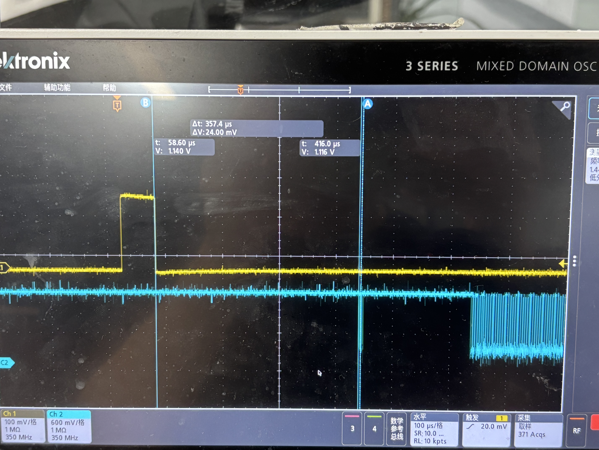
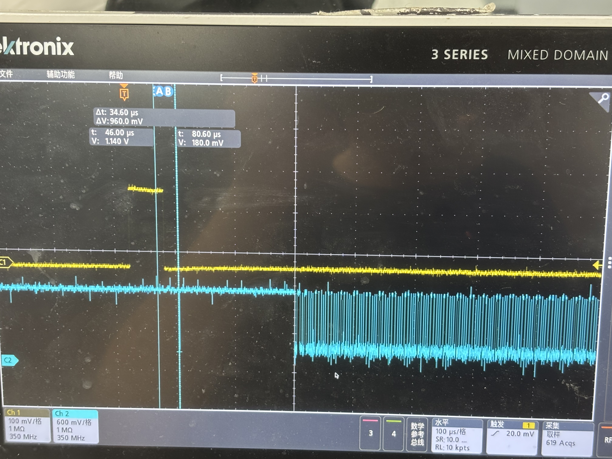
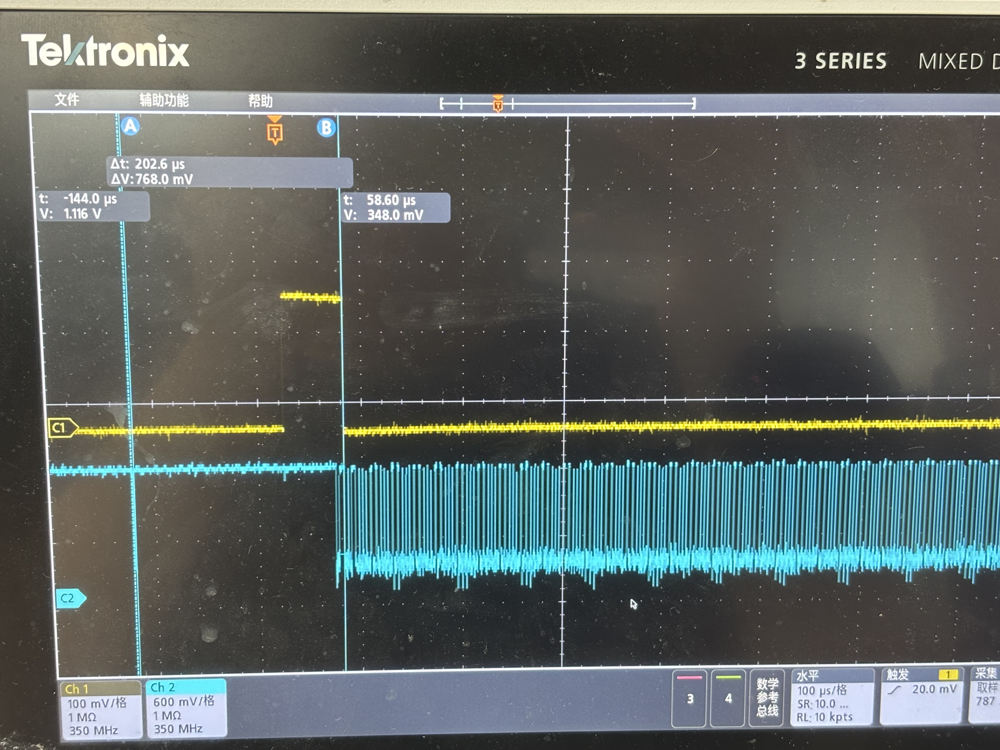
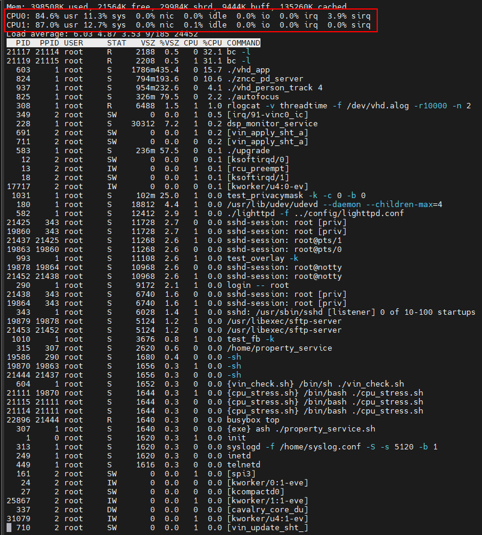

# sp50e40 帧同步、频率、相位测试

## 测试环境

- **平台**：VX720A
- **sensor**：sp50e40
- **接口**：C-PHY
- **Δt 定义**：vsync 信号下降沿到帧起始的间隔时间
- **备注**：SoC 产生的 vsync 本身存在 ±0.1 ms 的抖动

## 测试方法

以 vsync 信号为基准，测量帧起始位置的偏差（Δt）和抖动范围。VTS 模式设置为 auto（由 vsync 自动同步帧率）。

## 测试结果汇总

### 默认帧率 30 fps

| 序号 | vsync 帧率 | 实测帧率 | Δt 范围 | 帧起始抖动 | 截图 |
| ---- | ---------- | -------- | ------- | ---------- | ---- |
| 1 | 30.25 fps | 15.125 fps | — | — |  |
| 2 | 30.1 fps | 30.1 fps | +357 ~ +397 μs | 40 μs |  |
| 3 | 30 fps | 30 fps | +240 ~ +280 μs | 40 μs |  |
| 4 | 29.9 fps | 29.9 fps | +80 ~ +120 μs | 40 μs |  |
| 5 | 29.8 fps | 29.8 fps | -166 ~ -206 μs | 40 μs |  |
| 6 | 29.75 fps | 29.75 fps | -300 ~ -340 μs | 50 μs |  |
| 7 | 29.5 fps | 29.5 fps | -860 ~ -900 μs | 40 μs |  |
| 8 | 29.25 fps | 29.25 fps | -1440 ~ -1480 μs | 40 μs |  |
| 9 | 29 fps | 29 fps | -2040 ~ -2080 μs | 40 μs |  |
| 10 | 28 fps | 28 fps | -4080 ~ -4120 μs | 40 μs |  |

### 默认帧率 60 fps

| 序号 | vsync 帧率 | 实测帧率 | Δt 范围 | 帧起始抖动 | 截图 |
| ---- | ---------- | -------- | ------- | ---------- | ---- |
| 1 | 60 fps | 60 fps | +220 ~ +260 μs | 40 μs |  |
| 2 | 59 fps | 59 fps | -306 ~ -346 μs | 40 μs |  |

### VTS Mode: Reset

| vsync 帧率 | 实测帧率 | Δt 范围 | 帧起始抖动 |
| ---------- | -------- | ------- | ---------- |
| 30 fps | 30 fps | — | — |

> Reset 模式数据待补充。

## 数据分析

### 30 fps Δt 与帧率偏差的关系

帧率每变化 **0.1 fps**，Δt 变化约 **~210 μs**（即每 1 fps 约 2.1 ms）：

| vsync 帧率 | 帧率偏差 | Δt | 每 0.1 fps 增量 |
| ---------- | -------- | --- | --------------- |
| 30.1 fps | +0.1 fps | +377 μs | — |
| 30 fps | 0 | +260 μs | +117 μs |
| 29.9 fps | -0.1 fps | +100 μs | +160 μs |
| 29.8 fps | -0.2 fps | -186 μs | +286 μs |
| 29.75 fps | -0.25 fps | -320 μs | +268 μs |
| 29.5 fps | -0.5 fps | -880 μs | +224 μs |
| 29.25 fps | -0.75 fps | -1460 μs | +232 μs |
| 29 fps | -1 fps | -2060 μs | +240 μs |
| 28 fps | -2 fps | -4100 μs | +204 μs |

### 60 fps Δt 与帧率偏差的关系

帧率每降低 **1 fps**，Δt 增大 **~566 μs**：

| vsync 帧率 | 帧率偏差 | Δt | 每 1 fps 增量 |
| ---------- | -------- | --- | ------------- |
| 60 fps | 0 | +240 μs | — |
| 59 fps | -1 fps | -326 μs | +566 μs |

### vsync 抖动测试

测试环境：将 CPU 压到 85% 占用率以上

SoC 产生的 vsync 信号本身存在 ±0.1 ms 的帧间隔抖动，换算为帧率偏差：

| 默认帧率 | 标称帧间隔 | 抖动后帧间隔 | 实际帧率范围 | 帧率偏差 |
| -------- | ---------- | ------------ | ------------ | -------- |
| 30 fps | 33.333 ms | 33.233 ~ 33.433 ms | 29.91 ~ 30.09 fps | ±0.09 fps |
| 50 fps | 20.000 ms | 19.900 ~ 20.100 ms | 49.75 ~ 50.25 fps | ±0.25 fps |
| 60 fps | 16.667 ms | 16.567 ~ 16.767 ms | 59.64 ~ 60.36 fps | ±0.36 fps |

> 帧率越高，相同时间抖动带来的帧率偏差越大。60 fps 下 ±0.1 ms 抖动已相当于 ±0.36 fps 的帧率波动

根据 Δt 与帧率偏差的线性关系（30 fps: 2.07 ms/fps，60 fps: 0.57 ms/fps），推算小偏差下的 Δt：

| 帧率偏差 | 30 fps Δt | 60 fps Δt | 备注 |
| -------- | --------- | --------- | ---- |
| 0.1 fps | ≈ 207 μs | ≈ 57 μs | 60 fps 下小于 vsync 抖动（±100 μs），难以区分 |
| 0.01 fps | ≈ 20.7 μs | ≈ 5.7 μs | 均小于 vsync 抖动，会被淹没 |

### Auto 模式相位同步评估

Auto 模式实现的是**帧率同步（频率锁定）**，而非真正的**相位同步**。实测 Δt 随帧率偏差线性漂移，说明 Auto 模式只做了频率跟随，没有主动相位补偿。Sensor 按自身节拍出图，vsync 仅触发帧率调整，不约束帧的起始时刻。

| vsync 帧率 | 帧率偏差 | Δt | 相位评估 |
| ---------- | -------- | --- | -------- |
| 30 fps | 0 | +260 μs | 接近对齐，近似相位同步 |
| 29.75 fps | -0.25 fps | -320 μs | 轻微漂移 ~580 μs |
| 29.5 fps | -0.5 fps | -880 μs | 漂移 ~1.1 ms |
| 29 fps | -1 fps | -2060 μs | 明显漂移 ~2.3 ms |
| 28 fps | -2 fps | -4100 μs | 严重漂移 ~4.4 ms |

## 测试结论

1. **帧率跟随正常**：vsync 帧率 ≤ 默认帧率时，实测帧率准确跟随，帧同步功能正常
2. **Δt 与帧率偏差线性相关**：30 fps 下约 2.1 ms/fps，60 fps 下约 0.57 ms/fps
3. **帧起始抖动稳定**：所有工况下帧起始抖动保持 **40~50 μs**，不受帧率偏差影响
4. **vsync 超过默认帧率时丢帧**：30.25 fps 时实测骤降至 15.125 fps（隔帧丢帧）
5. **Auto 模式锁定频率但不锁定相位**：vsync 帧率 = 默认帧率时可近似相位同步（Δt ≈ 260 μs），存在偏差时 Δt 线性漂移，多摄相位对齐需用 **Reset 模式**或硬件触发（FSIN）

## QSC 使用场景相位分析

QSC 主要是应对温漂，通过 PTP 调整主从设备间的时钟偏差，实际帧率偏差远小于测试中的 0.25~2 fps，频率改变很小。

### 相位误差量化

以典型温漂 50 ppm 为例：

| 项目 | 30 fps | 60 fps |
| ---- | ------ | ------ |
| 帧率偏差 | ±0.0015 fps | ±0.003 fps |
| 单帧 Δt 漂移 | 3.1 μs | 0.85 μs |
| 累积 1 s（30/60 帧） | 93 μs | 51 μs |

对比各项误差源：

| 误差源 | 量级 | 说明 |
| ------ | ---- | ---- |
| 帧起始抖动 | 40~50 μs | 固定，不可消除 |
| vsync 抖动 | ±100 μs | SoC 硬件限制 |
| 温漂累积（1s） | < 100 μs | PTP 校正后清零 |

**结论**：QSC 场景下温漂导致的相位偏差（μs 级）远小于 vsync 抖动（±100 μs），综合相位误差约 **±200 μs**，主要受限于 vsync 硬件抖动，Auto 模式即可满足多摄同步需求。
