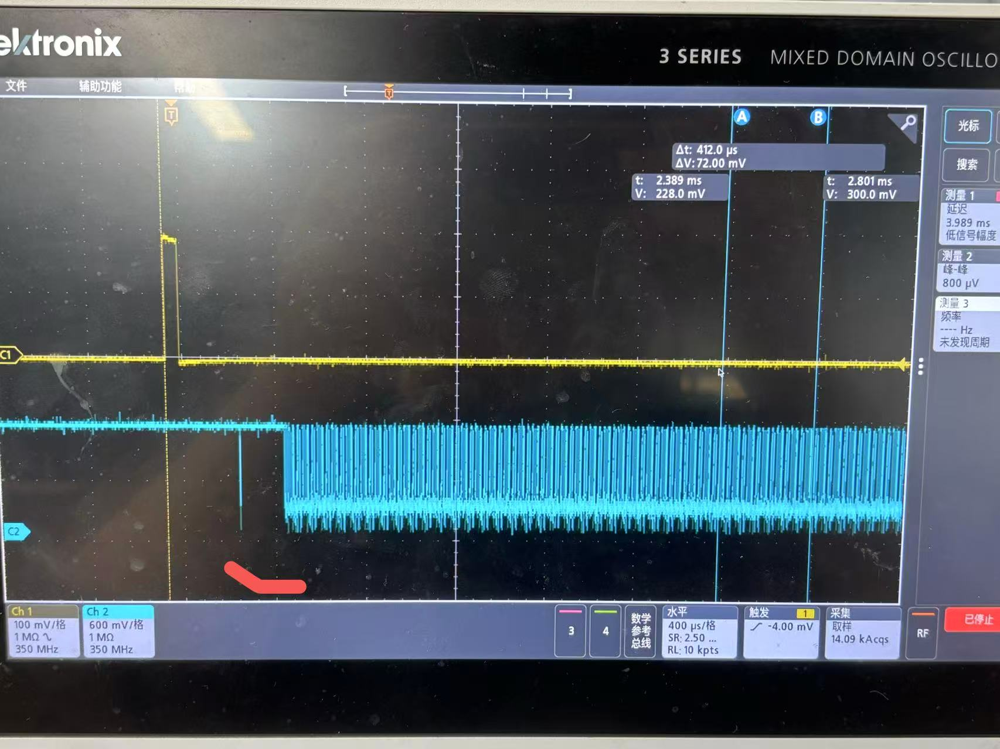
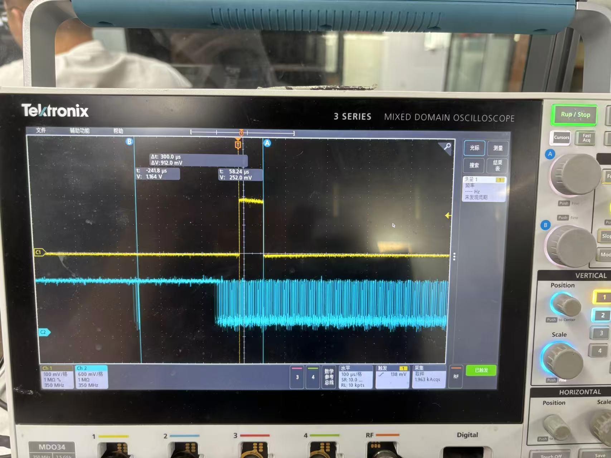
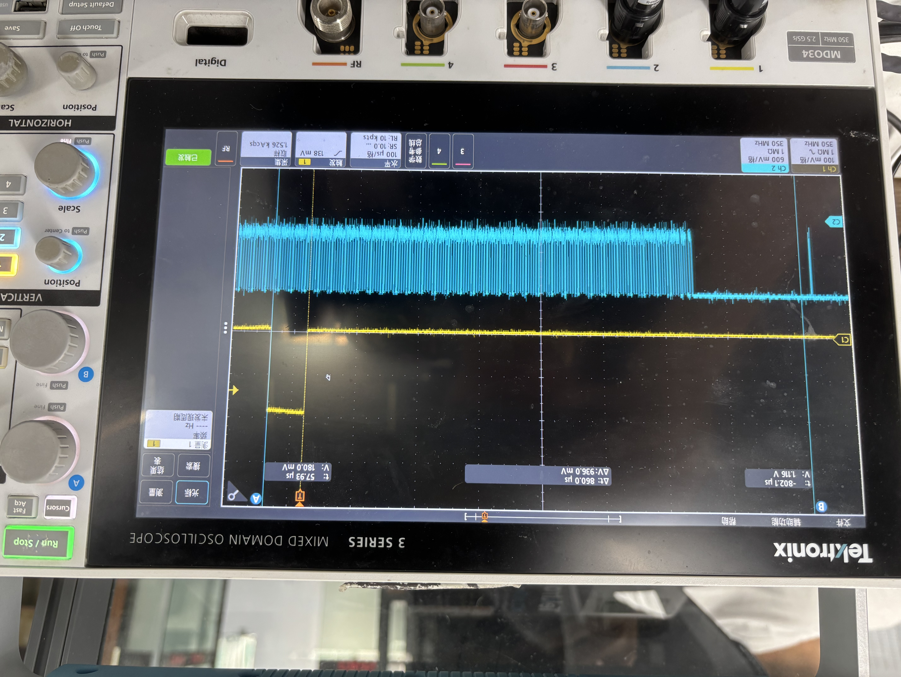
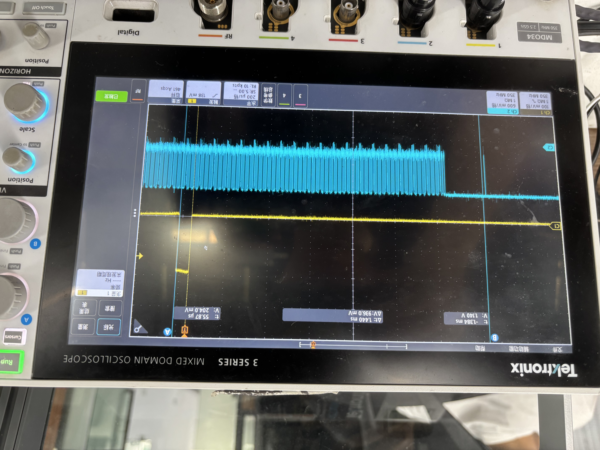
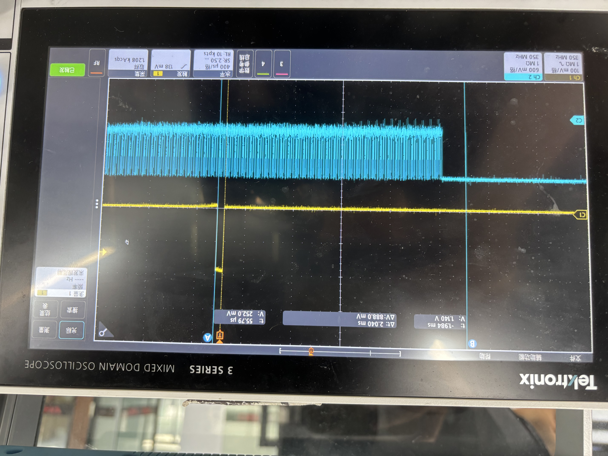
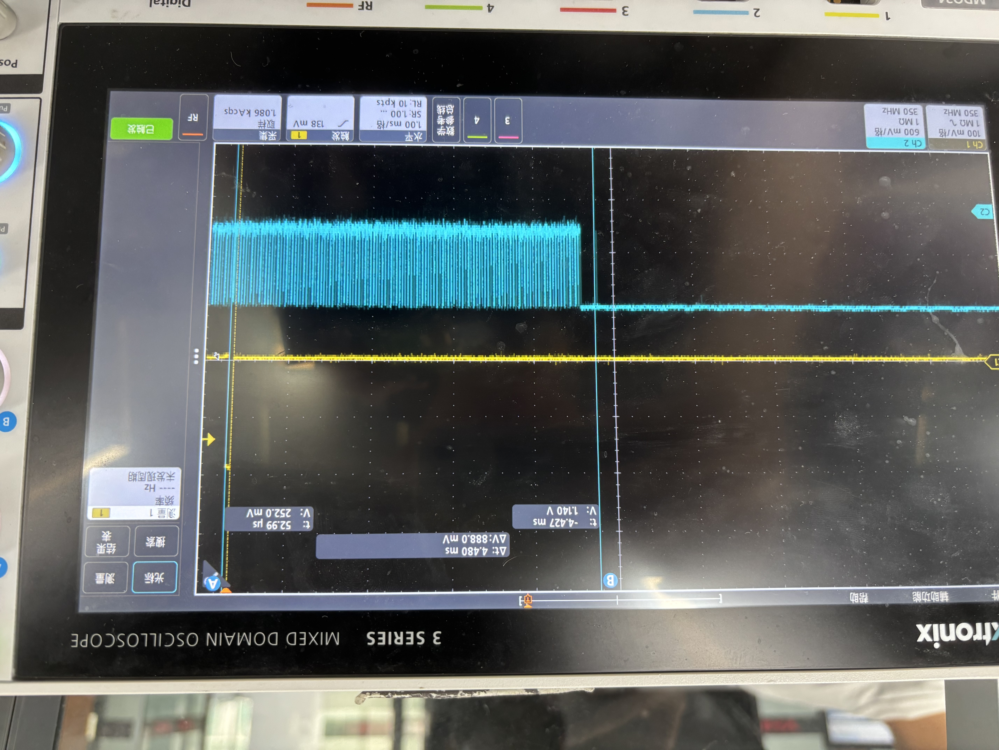
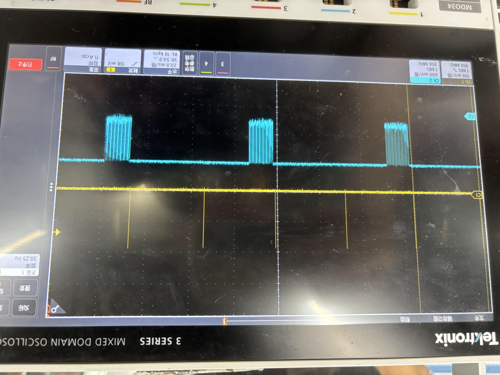
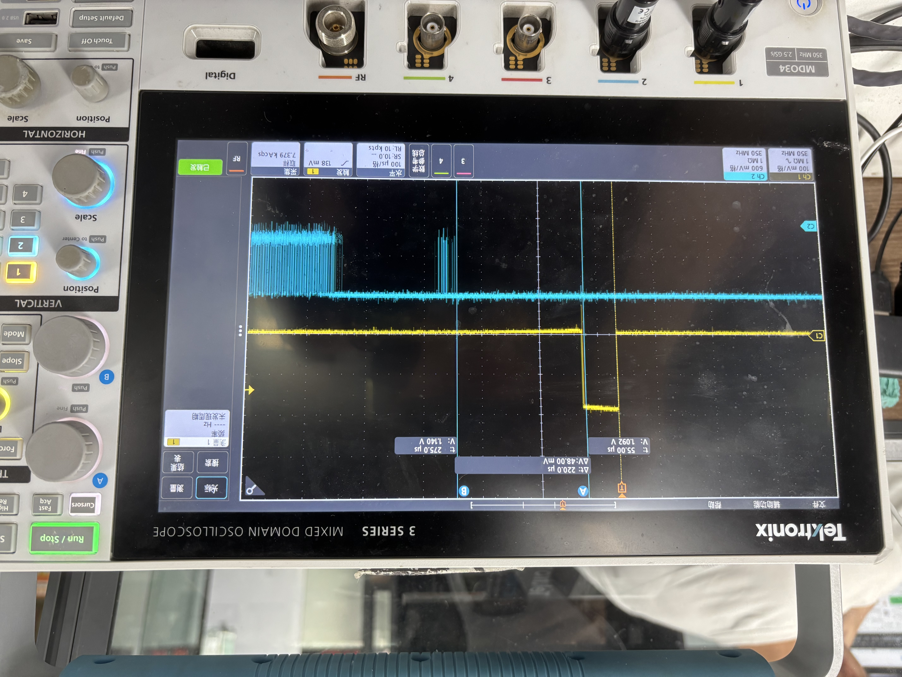
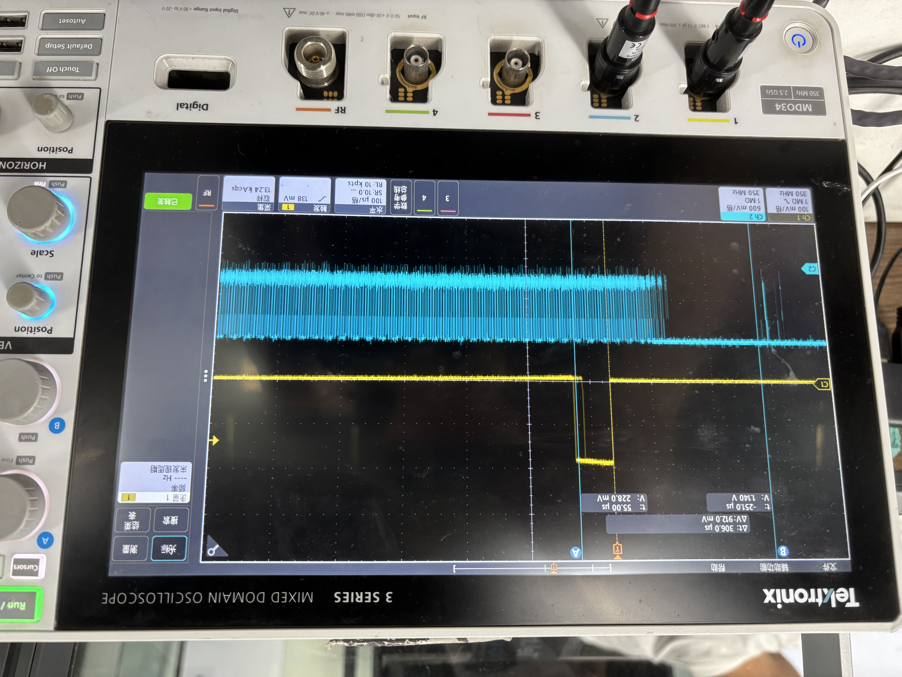

# 帧同步,频率,相位测试

## 测试环境

- **平台**：VX720A
- **sensor**：sp50e40
- **Δt 定义**：vsync 信号下降沿到帧起始的间隔时间
- **备注**：SoC 产生的 vsync 本身存在 ±0.1 ms 的抖动

## 测试方法

以 vsync 信号为基准，测量帧起始位置的偏差（Δt）和抖动范围。VTS 模式设置为 auto（由 vsync 自动同步帧率）。

## 测试结果汇总

### 默认帧率 30 fps

| 序号 | vsync 帧率 | 实测帧率 | Δt 范围 | 帧起始抖动 | 截图 |
| ---- | ---------- | -------- | ------- | ---------- | ---- |
| 1 | 30 fps | 30 fps | +240 ~ +280 μs | 40 μs |  |
| 2 | 29.75 fps | 29.75 fps | -300 ~ -340 μs | 50 μs |  |
| 3 | 29.5 fps | 29.5 fps | -860 ~ -900 μs | 40 μs |  |
| 4 | 29.25 fps | 29.25 fps | -1440 ~ -1480 μs | 40 μs |  |
| 5 | 29 fps | 29 fps | -2040 ~ -2080 μs | 40 μs |  |
| 6 | 28 fps | 28 fps | -4080 ~ -4120 μs | 40 μs |  |
| 7 | 30.25 fps | 15.125 fps | — | — |  |

### 默认帧率 60 fps

| 序号 | vsync 帧率 | 实测帧率 | Δt 范围 | 帧起始抖动 | 截图 |
| ---- | ---------- | -------- | ------- | ---------- | ---- |
| 1 | 60 fps | 60 fps | +220 ~ +260 μs | 40 μs |  |
| 2 | 59 fps | 59 fps | -306 ~ -346 μs | 40 μs |  |

### VTS Mode: Reset

| vsync 帧率 | 实测帧率 | Δt 范围 | 帧起始抖动 |
| ---------- | -------- | ------- | ---------- |
| 30 fps | 30 fps | — | — |

> Reset 模式数据待补充。

## 数据分析

### 30 fps 默认帧率

帧率每降低 **0.25 fps**，Δt 增大 **~570 μs**（即每 1 fps 增大 ~2.04 ms）：

| vsync 帧率 | 帧率偏差 | Δt | 每 0.25 fps 增量 |
| ---------- | -------- | --- | ---------------- |
| 30 fps | 0 | +260 μs | — |
| 29.75 fps | -0.25 fps | -320 μs | +580 μs |
| 29.5 fps | -0.5 fps | -880 μs | +560 μs |
| 29.25 fps | -0.75 fps | -1460 μs | +580 μs |
| 29 fps | -1 fps | -2060 μs | +600 μs |
| 28 fps | -2 fps | -4100 μs | +510 μs |

### 60 fps 默认帧率

帧率每降低 **1 fps**，Δt 增大 **~566 μs**：

| vsync 帧率 | 帧率偏差 | Δt | 每 1 fps 增量 |
| ---------- | -------- | --- | ------------- |
| 60 fps | 0 | +240 μs | — |
| 59 fps | -1 fps | -326 μs | +566 μs |

### Auto 模式相位同步评估

Auto 模式实现的是**帧率同步（频率锁定）**，而非真正的**相位同步**。实测 Δt 随帧率偏差线性漂移，说明 Auto 模式只做了频率跟随，没有主动相位补偿。Sensor 按自身节拍出图，vsync 仅触发帧率调整，不约束帧的起始时刻。

| vsync 帧率 | 帧率偏差 | Δt | 相位评估 |
| ---------- | -------- | --- | -------- |
| 30 fps | 0 | +260 μs | 接近对齐，近似相位同步 |
| 29.75 fps | -0.25 fps | -320 μs | 轻微漂移 ~580 μs |
| 29.5 fps | -0.5 fps | -880 μs | 漂移 ~1.1 ms |
| 29 fps | -1 fps | -2060 μs | 明显漂移 ~2.3 ms |
| 28 fps | -2 fps | -4100 μs | 严重漂移 ~4.4 ms |

## 测试结论

1. **帧率跟随正常**：vsync 帧率 ≤ 默认帧率时，实测帧率准确跟随，帧同步功能正常
2. **Δt 与帧率偏差线性相关**：30 fps 下约 2.07 ms/fps，60 fps 下约 0.57 ms/fps
3. **帧起始抖动稳定**：所有工况下抖动保持 **40~50 μs**，不受帧率偏差影响
4. **vsync 超过默认帧率时丢帧**：30.25 fps 时实测骤降至 15.125 fps（隔帧丢帧）
5. **Auto 模式锁定频率但不锁定相位**：vsync 帧率 = 默认帧率时可近似相位同步（Δt ≈ 260 μs），存在偏差时 Δt 线性漂移，多摄相位对齐需用 **Reset 模式**或硬件触发（FSIN）

## 使用建议

- vsync 帧率 **不得** 超过 Sensor 默认帧率
- 帧率偏差 ≤ 1 fps 时，30 fps 下 Δt < 2 ms，可满足大多数场景
- 帧率偏差 ≤ 2 fps 时，30 fps 下 Δt < 4.5 ms，需评估是否可接受
- 如需精确帧同步，可考虑使用 Reset 模式（数据待补充）
