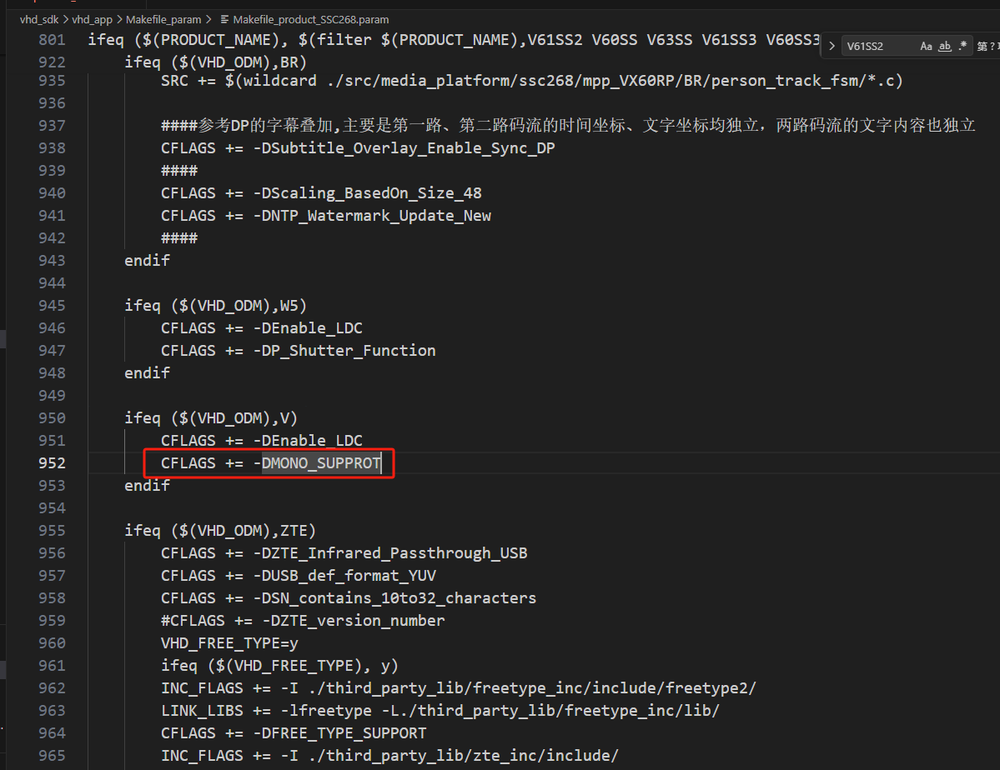
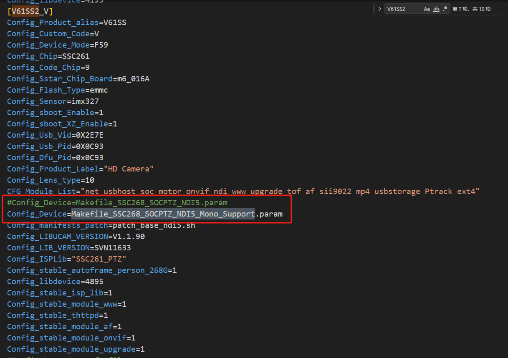
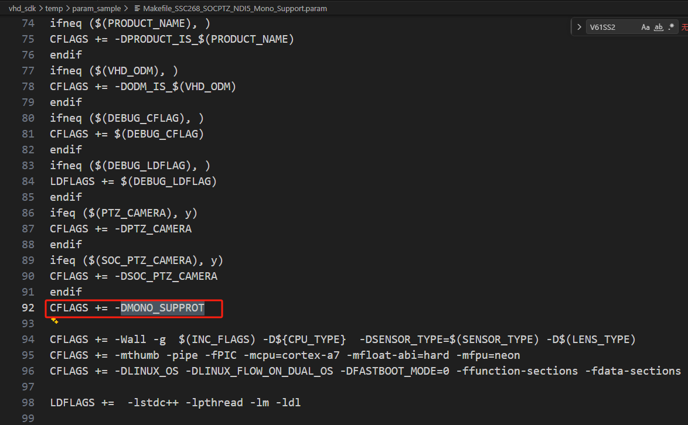

## ssc268g开发心得

## 屏蔽大编的时候拉取temp/device库

> build_all.sh脚本
> 
```c
#if [ -e ./sync_device.sh ];then
#	echo  ${Config_Device} |./sync_device.sh ${DeviceName} ${CustomerName}
#    check_result "sync_device"
#fi
```


## 编译temp/device库步骤
```c
1.进入temp/device路径下面
2.执行make
3.执行send_file.sh
4.回到应用目录，编译vhd_app
```


## 打开telnet 和 ssh
```
81 11 12 13 2 ff
81 ab 1 1 1 3 2 ff
```

## 特定机型下加宏
路径：vhd_sdk/vhd_app/Makefile_param/Makefile_prodect_SSC268G.param

例如在标版下面添加 MONO_SUPPROT



## temp库加宏


新增一个新的配置

